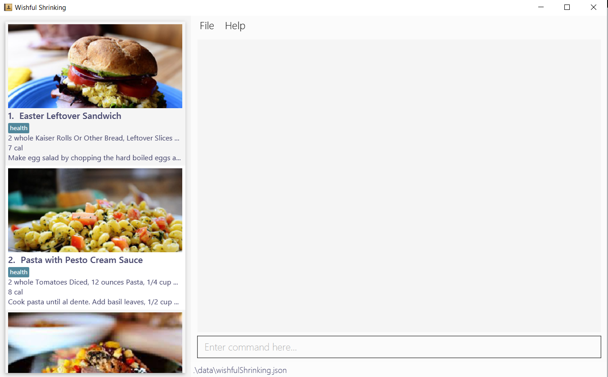

## Reeve

**Reeve** is a desktop application for **private tutors to better manage both administrative and academic details of their students**, optimised for use via a **Command Line Interface (CLI)** for receiving inputs while still having the benefits of a **Graphical User Interface (GUI)** for displaying information.

* Interested in using Reeve? Head over to the [_Quick Start_ section of the **User Guide**](https://github.com/AY2021S1-CS2103T-W15-2/tp/blob/master/docs/UserGuide.md)!
* Interested in developing Reeve? The [**Developer Guide**](https://github.com/AY2021S1-CS2103T-W15-2/tp/blob/master/docs/DeveloperGuide.md) is a good place to start!

## Acknowledgements
* Libraries used: [JavaFX](https://openjfx.io/), [Jackson](https://github.com/FasterXML/jackson), [JUnit5](https://github.com/junit-team/junit5), [Jfxtras](http://jfxtras.org/)
* This project is based on the AddressBook-Level3 project created by the [SE-EDU initiative](https://se-education.org).
