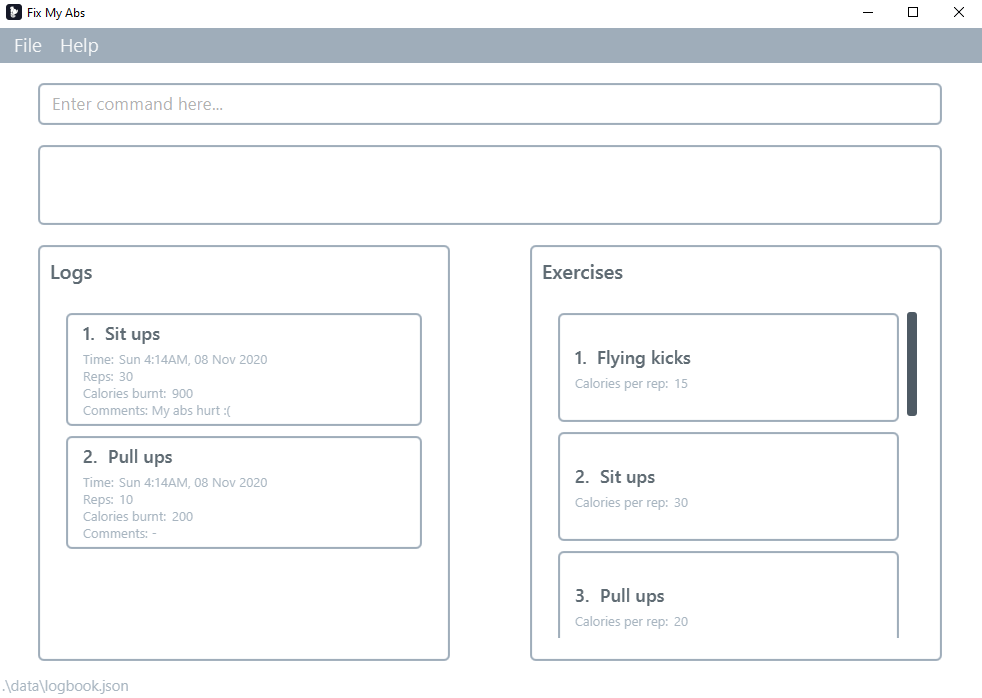

# FixMyAbs

# FixMyAbs

FixMyAbs is a workout tracker that helps lazy programmers transform their round belly into toned six packs. If you are unmotivated for a workout, FixMyAbs will be your partner in helping you to change your life. 😎

For more information, check out the [FixMyAbs Website](ay2021s1-cs2103-f10-3.github.io/tp).

### Disclaimer

* While we make outlandish promises, there is no guarantee that six packs will form after you have downloaded this application
* The formation of six packs requires hard work on your side
* We are also not liable for any injuries that you may sustain while using this application
* Please consult with your doctor before you begin any exercise program