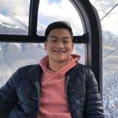
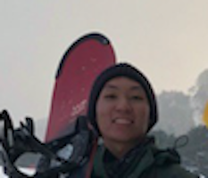
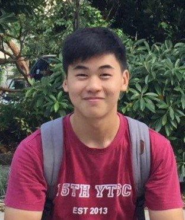
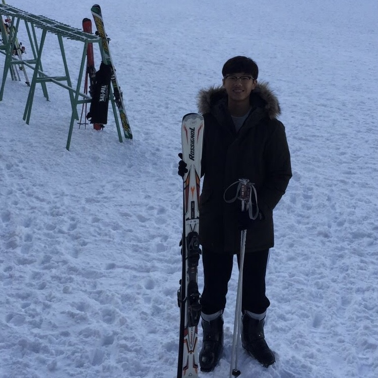

# About Us

Trackr is designed and developed by the [CS2013T-W12-2](https://github.com/AY2021S1-CS2103T-W12-2) team.

We are a team based in the [School of Computing, National University of Singapore](http://www.comp.nus.edu.sg).

## Project team

### Juan Davin Lie

[[github](https://github.com/juandavinlie)] [[portfolio](team/juandavinlie.md)]

-   Role: Programmer
-   Hobby: Swimming and eating

### Sean Tay

[[github](http://github.com/seantaysl)] [[portfolio](team/seantaysl.md)]

-   Role: Programmer

### Ethan Noah Rozario

[[github](http://github.com/ethanthegoondu)] [portfolio](team/ethanthegoondu.md)]

-   Role: Programmer

### Tan Eu Zin

[[github](http://github.com/euzintan)] [[portfolio](team/euzintan.md)]

-   Role: Programmer

### Jian Fanmin

[[github](http://github.com/fanminj)] [[portfolio](team/fanminj.md)]

-   Role: Programmer
