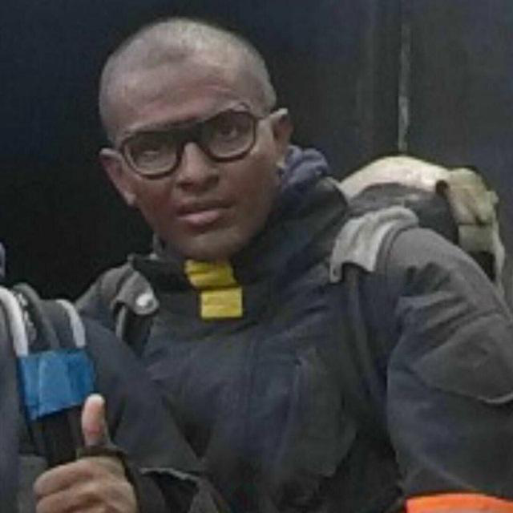
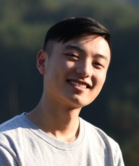
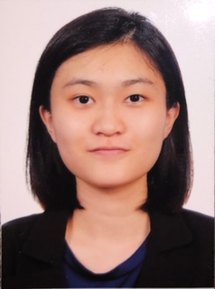
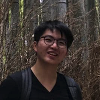

------------------------------------------------------------------------------------------------

We are a team based in the [School of Computing, National University of Singapore](http://www.comp.nus.edu.sg).

[[Visit our homepage](https://ay2021s1-cs2103t-w10-3.github.io/tp/)]

You can reach us at the repoUrl `seer[at]comp.nus.edu.sg`

## Project team

### Niaaz Wahab

[[github](https://github.com/geniaaz)]

[[portfolio](team/geniaaz.md)]

* Role: Developer
* Responsibilities: UG, Teammate related features

### Li Jiayu

[[github](http://github.com/lll-jy)]

[[portfolio](team/lll-jy.md)]

* Role: Project Member
* Responsibilities: Developer

### Tian Fang

[[github](http://github.com/T-Fang)]

[[portfolio](team/T-Fang.md)]

* Role: Project Member
* Responsibilities: Developer

### Tan Chia Qian

[[github](http://github.com/TCQian)]

[[portfolio](team/TCQian.md)]

* Role: Project Member
* Responsibilities: Developer

### Lucas Tai

[[github](http://github.com/lucastai98)]

[[portfolio](team/lucastai98.md)]

* Role: Project Member
* Responsibilities: Developer
