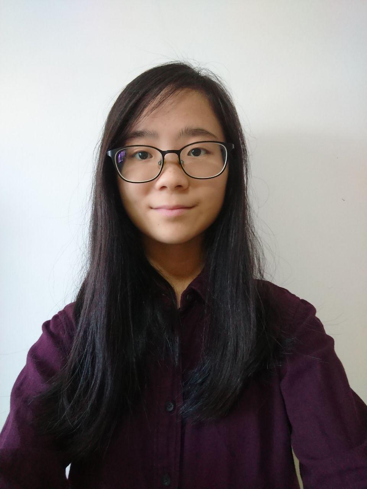
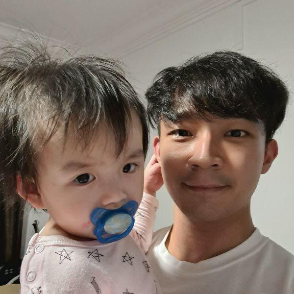
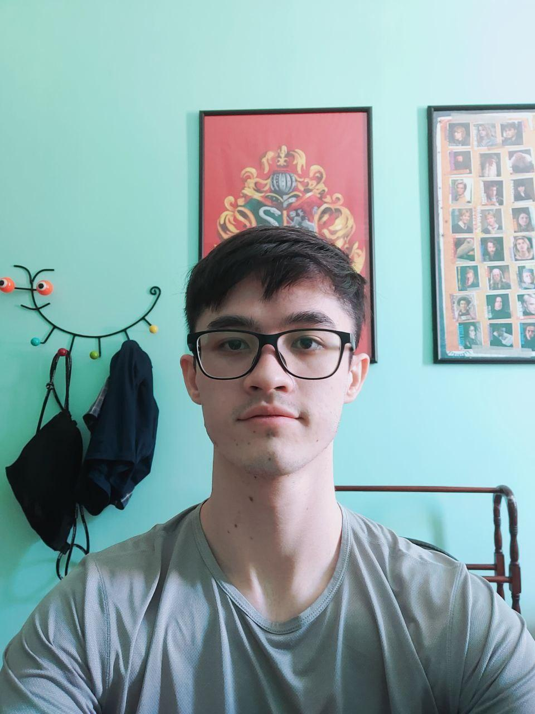
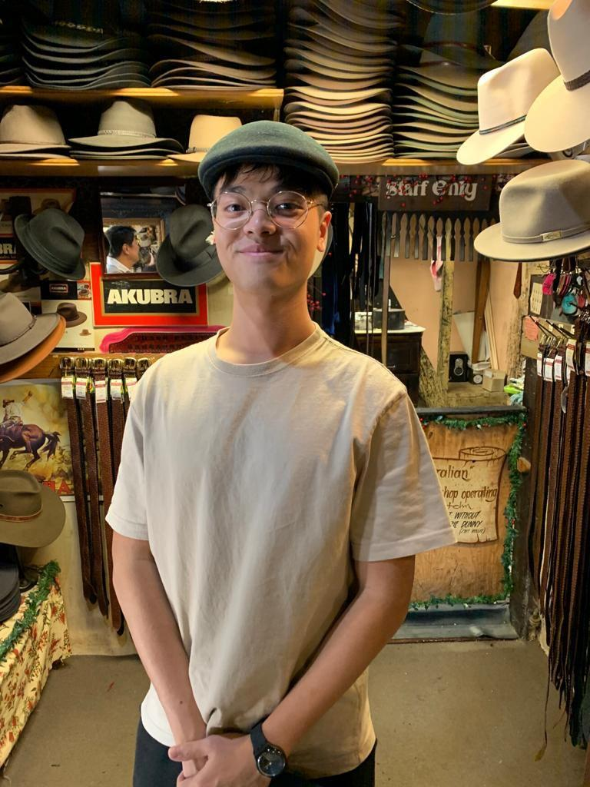

# **About Us**

PropertyFree was developed by the AY2021S1-CS2103-W14-1 team.

PropertyFree is a bookeeping system that allows Property Real Estate Agents to keep track of properties, clients and meetings related to their work.

PropertyFree is a brownfield project which references the [AddressBook level-3](https://github.com/se-edu/addressbook-level3).

We are a team based in the [School of Computing, National University of Singapore](http://www.comp.nus.edu.sg).

## Project team

***

### Dianne Loh Wen Hui

[[github](https://github.com/dianneloh9)]
[[portfolio](team/dianneloh9.md)]

* Role: Team Lead
* Responsibilities: Property Management

***

### Kor Ming Soon

[[github](https://github.com/kormingsoon)]
[[portfolio](team/kormingsoon.md)]

* Role: Deliverables and deadlines, Intellij expert
* Responsibilities: Bidder/Seller Management, UI

***

### Marcus Duigan Xing Yu

[[github](https://github.com/Marcon2509)]
[[portfolio](team/marcon2509.md)]

* Role: Documentation, Code Quality
* Responsibilities: Bid Management

***

### Munnamgi Harsha Vardhan Reddy

[[github](https://github.com/munharsha)]
[[portfolio](team/munharsha.md)]

* Role: Testing, Integration
* Responsibilities: Meetings Management

***

### Christopher Leo Mervyn

[[github](https://github.com/Christopher-LM)]
[[portfolio](team/christopher-lm.md)]

* Role: Scheduling and tracking, Integration
* Responsibilities: Meetings Management
