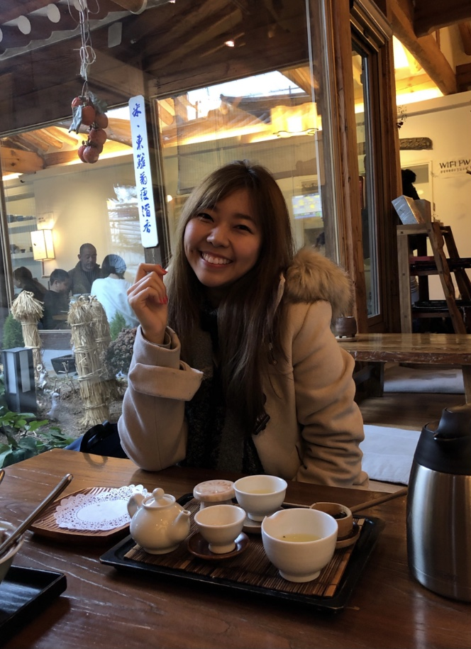
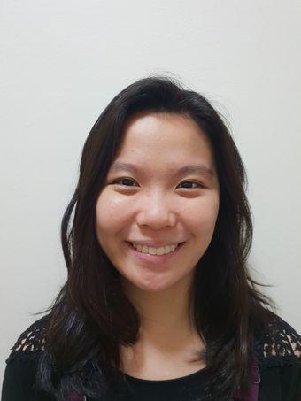
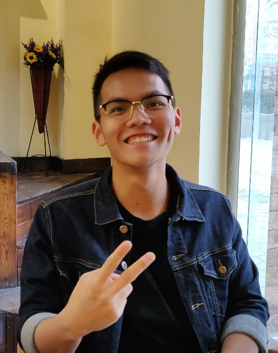

We are a team based in the [School of Computing, National University of Singapore](http://www.comp.nus.edu.sg).

[Click](https://ay2021s1-cs2103t-f11-3.github.io/tp/) to view the homepage for ProductiveNUS.

You can reach us at the email `seer[at]comp.nus.edu.sg`

## Project team

### Andrea Tan

[[github](https://github.com/andreatanky)]
[[portfolio](team/andreatanky.md)]

* Role: Team Lead
* Responsibilities: UI

### Choo Jia Xin

[[github](http://github.com/ChooJiaXin)]
[[portfolio](team/choojiaxin.md)]

* Role: Developer; Deliverables and deadlines
* Responsibilities: Code quality

### Jerry Ho

[[github](http://github.com/printinghelloworld)] [[portfolio](team/printinghelloworld.md)]

* Role: Developer; Deliverables and deadlines
* Responsibilities: Documentation

### Hwang Yong Kang

[[github](http://github.com/hyngkng)]
[[portfolio](team/hyngkng.md)]

* Role: Developer; Deliverables and deadlines
* Responsibilities: Testing

### Nguyen Hoang Hai Minh

[[github](http://github.com/minhhhnguyen2000)]
[[portfolio](team/minhhhnguyen2000.md)]

* Role: Developer; Deliverables and deadlines
* Responsibilities: Testing
