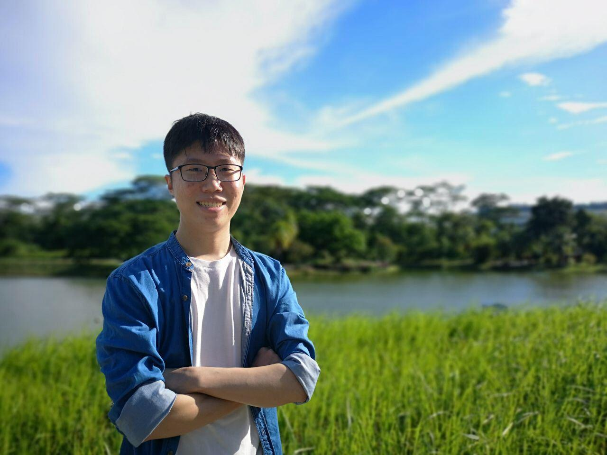

We are a team based in the [School of Computing, National University of Singapore](http://www.comp.nus.edu.sg).

You can reach us at the email `seer[at]comp.nus.edu.sg`

## Project team

### Mayank Keoliya

[[github](http://github.com/mkeoliya)]
[[portfolio](team/mkeoliya.md)]

* Role: Developer
* Responsibilities: Scheduling & Tracking, Maintaining Code Quality

### Loh Jing Yen

[[github](https://github.com/jingyenloh)]
[[portfolio](team/jingyenloh.md)]

* Role: Team Lead
* Responsibilities: UI

### Bec Kyung Huhn (Kevin)

[[github](http://github.com/lysire)]
[[portfolio](team/lysire.md)]

* Role: Developer, IntelliJ Expert
* Responsibilities: Deliverables and Deadlines

### New Jun Jie (Jet)

[[github](http://github.com/jetnew)]
[[portfolio](team/jetnew.md)]

* Role: Developer, Intellij Expert
* Responsibilities: Documentation, Allocation Feature, Piechart Feature

### Chloe Lee Ke Er

[[github](http://github.com/chloelee767)]

* Role: Developer, Git Expert
* Responsibilities: Testing
