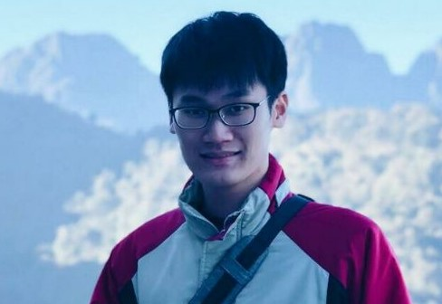
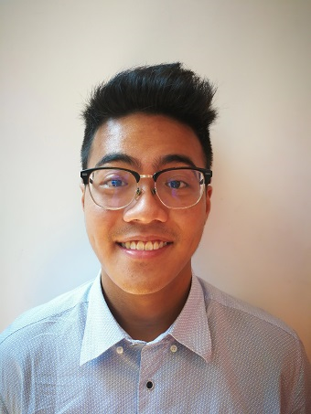

We are a team based in the [School of Computing, National University of Singapore](http://www.comp.nus.edu.sg).

## Project team

### Fong Wei Jie

[github](https://github.com/WeiJie96)
[portfolio](team/weijie96.md)

* Role: Code Quality
* Responsibilities: 
    * Looks after code quality, ensures adherence to coding standards, etc.

### Javier Lim Xin Long

[github](https://github.com/ijavierja)
[portfolio](team/ijavierja.md)

* Role: Project Manager
* Responsibilities:
    * Deliverables and deadlines: Ensure project deliverables are done on time and in the right format. 
    * Scheduling and tracking: In charge of defining, assigning, and tracking project tasks.

### Heng Jie Kai Joven

[github](http://github.com/Joven-Heng)
[portfolio](team/joven-heng.md)

* Role: Testing
* Responsibilities: 
    * Ensures the testing of the project is done properly and on time.

