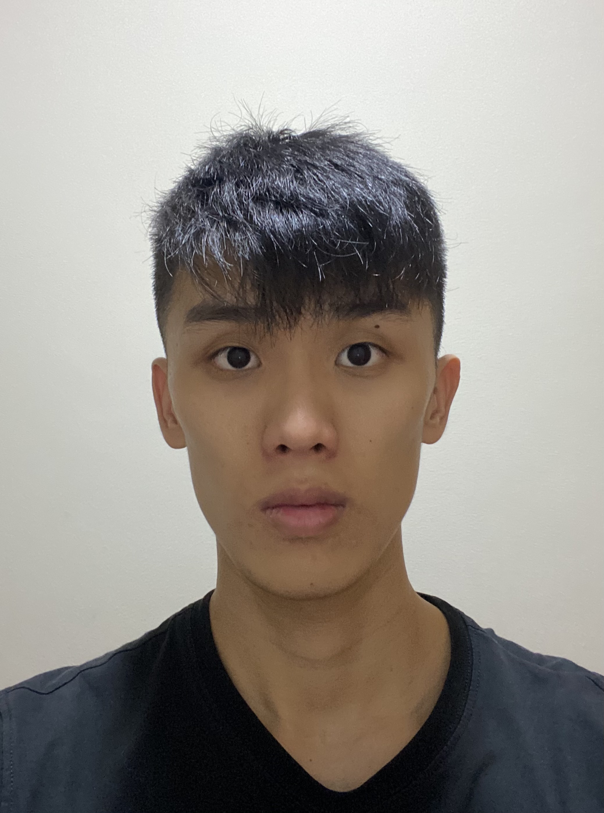
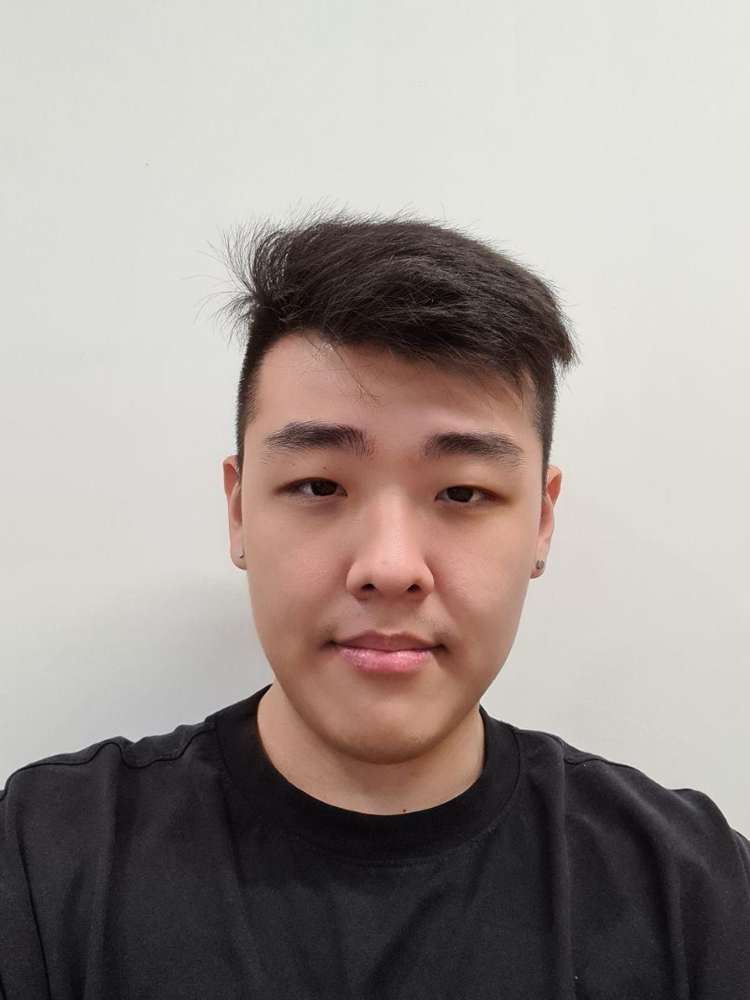
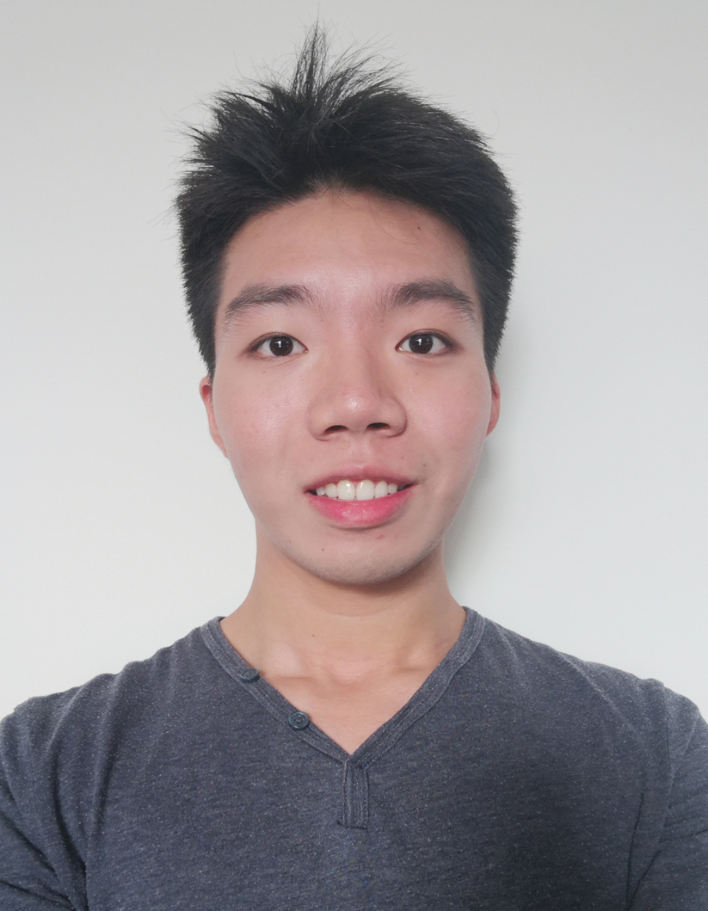
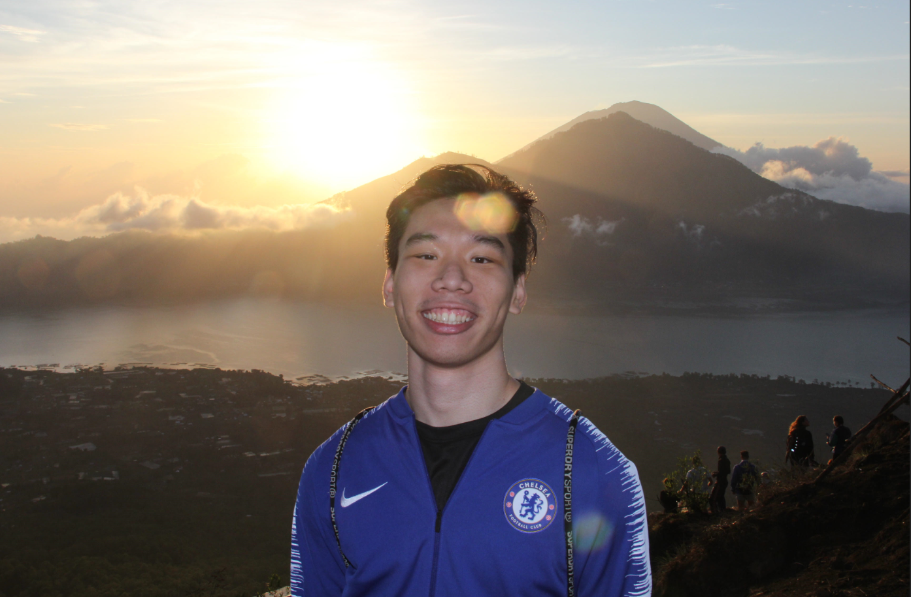

We are a team based in the [School of Computing, National University of Singapore](http://www.comp.nus.edu.sg).

You can reach us at the following emails:
* Jonas Ng: `e0415645@u.nus.edu`
* Li HuanKang:
* David Cai:
* Joshua Wong:
* Michael:

## Cap 5.0 Buddy Team

### Jonas Ng

[[github](https://github.com/jonasngs)]
[[portfolio](team/jonasng.md)]

* Role: Team lead, Integration
* Responsibilities:

### Li Huankang (Matthias)

[[github](http://github.com/MatthiasLHK)]
[[portfolio](team/matthiaslhk.md)]

* Role: Team Lead , Scheduling and tracking
* Responsibilities: Responsible for overall project coordination and in charge of defining, assigning, and tracking project tasks.

### Michael Setia Atmaja

[[github](http://github.com/michael-setia)]
[[portfolio](team/michael-setia.md)]

* Role: Developer
* Responsibilities: Data

### David Cai Qifan

[[github](http://github.com/davidcaiqifan)]
[[portfolio](team/davidcaiqifan.md)]

* Role: Developer
* Responsibilities: Dev Ops + Threading

### Joshua Wong

[[github](http://github.com/murtubak)]
[[portfolio](team/joshuawong.md)]

* Role: Developer
* Responsibilities: Code quality
