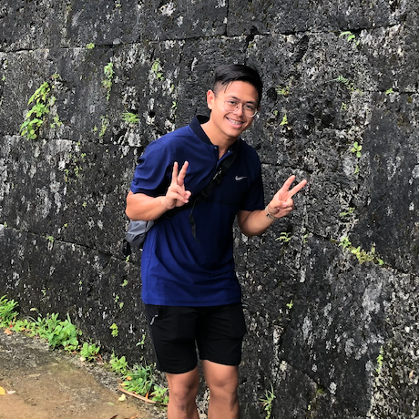
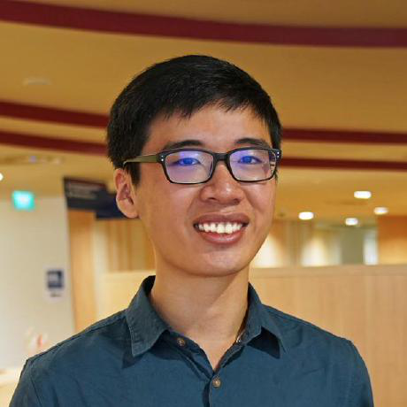
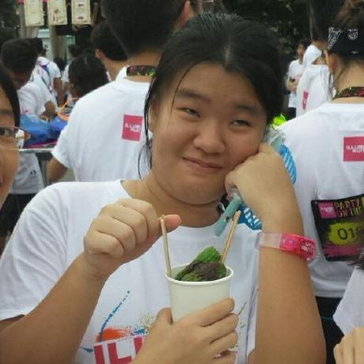
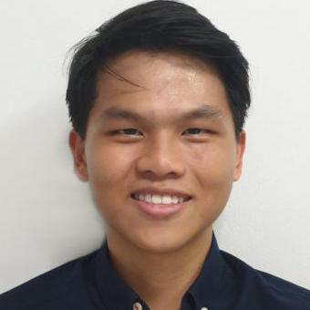
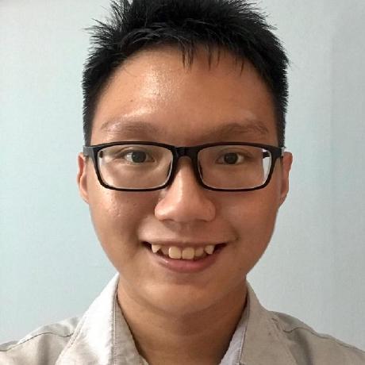

We are a team based in the [School of Computing, National University of Singapore](http://www.comp.nus.edu.sg), formed
to fulfill the team project requirements of [CS2103T](https://nusmods.com/modules/CS2103T/software-engineering)

You can reach us at the email `nustorage[at]comp.nus.edu.sg`

## Project team

### Prof. Damith

[[homepage](http://www.comp.nus.edu.sg/~damithch)]
[[github](https://github.com/damithc)]

* Role: Project Advisor

### Eugene Teu

[[github](https://github.com/EugeneTeu)]

* Role: Tutor

### Tan Pinxi

[[github](http://github.com/FizzyAgent)]
[[portfolio](team/fizzyagent.md)]

* Role: Team Lead
* Responsibilities: Finance components, Testing and Documentation

### Dora Heng

[[github](https://github.com/Door-oof)]
[[portfolio](team/door-oof.md)]

* Role: Developer
* Responsibilities: UI, Testing and Documentation

### Goh Ee Liang

[[github](https://github.com/Elgoh)]
[[portfolio](team/elgoh.md)]

* Role: Developer
* Responsibilities: Inventory components, Testing and Documentation

### Chen Xihao

[[github](https://github.com/howtoosee)]
[[portfolio](team/howtoosee.md)]

* Role: Developer
* Responsibilities: Storage components, Testing and Documentation

### Lim Yu Yang

[[github](https://github.com/IronBiscuit)]
[[portfolio](team/ironbiscuit.md)]

* Role: Developer
* Responsibilities: UI, Testing and Documentation
