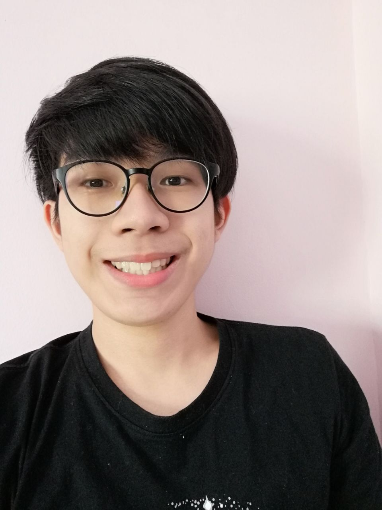
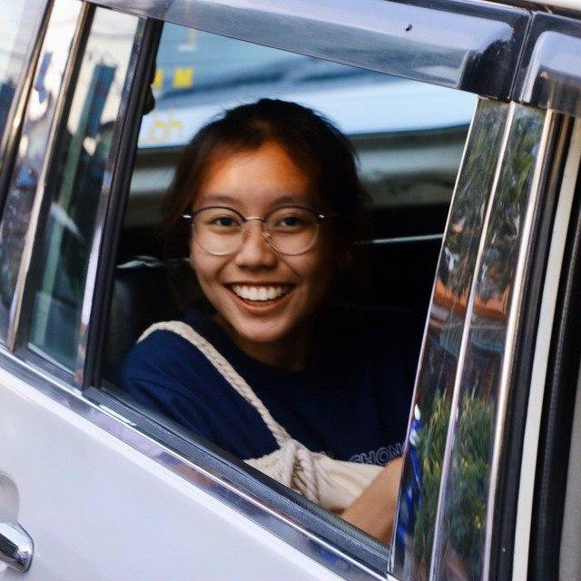
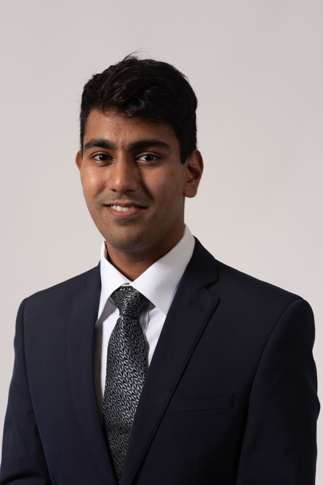
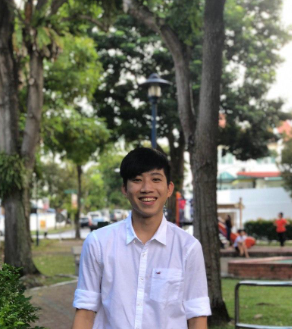

We are a team based in the [School of Computing, National University of Singapore](http://www.comp.nus.edu.sg).

You can reach us at the email `e0388997@u.nus.edu`

## Project team

### Terence Ho Wei Yang

[[github](https://github.com/vielheim)][[portfolio](team/vielheim.md)]

* Role: Team Lead
* Responsibilities: Overall project coordination. Ensures team is on schedule.

### Wong Wen Wei Esmanda

[[github](http://github.com/esmanda3w)]
[[portfolio](team/johndoe.md)]

* Role: Testing
* Responsibilities: Ensures the testing of the project is done properly and on time.

### Neil Gupta

[[github](http://github.com/jargonx)]][[portfolio](team/johndoe.md)]

* Role: Integration
* Responsibilities: Reviewing of PRs, making sure code fits

### Ng Shuo Qi, Constance

[[github](http://github.com/constancensq)]
[[portfolio](team/constancensq.md)]

* Role: Documentation
* Responsibilities: Responsible for the quality of various project documents.

### Cody Chew

[[github](http://github.com/CodyChew)]
[[portfolio](team/codychew.md)]

* Role: Code Quality
* Responsibilities: Looks after code quality,
ensures adherence to coding standards, etc.

 

#### Jon Chua (Supervisor)

#### Prof Damith (Lecturer)
