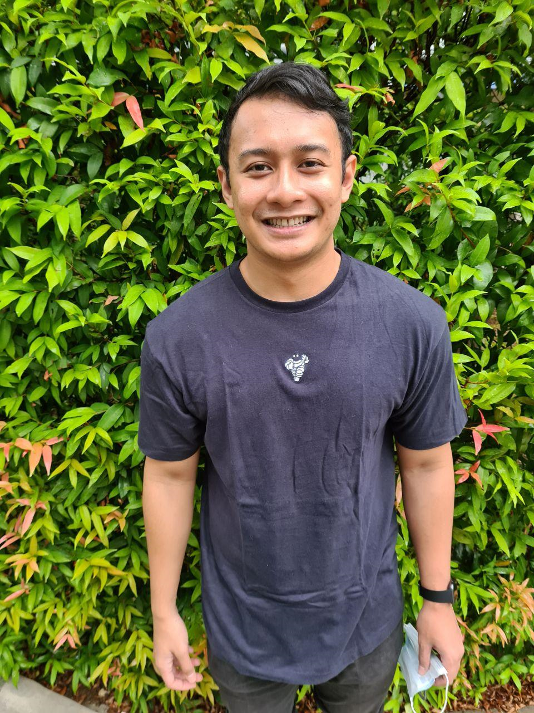
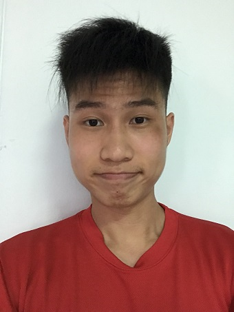
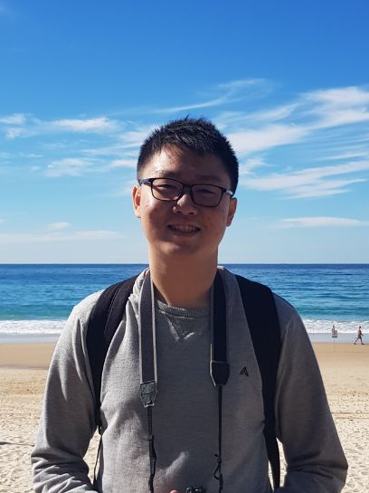

We are a team based in the [School of Computing, National University of Singapore](http://www.comp.nus.edu.sg).

You can reach us through our respective emails.

## Project team

### Maxx Chan

[[github](https://github.com/maxxyh)]
[[portfolio](team/maxxyh.md)]
[[email](mailto:maxxchan@u.nus.edu)]

* Role: Team Lead, Developer
* Responsibilities: Scheduling and Tracking, Deliverables and Deadlines

### Hakiem Rasid

[[github](http://github.com/hakiem526)]
[[portfolio](team/hakiem526.md)]
[[email](mailto:e0325825@u.nus.edu)]

* Role: Developer
* Responsibilities: Testing

### Jaylen Lee

[[github](http://github.com/Jaylenlee)]
[[portfolio](team/jaylenlee.md)]
[[email](mailto:e0424677@u.nus.edu)]

* Role: Developer
* Responsibilities: Integration

### Leben Chew

[[github](http://github.com/lebencwb)]
[[portfolio](team/lebencwb.md)]
[[email](mailto:leben.chew@u.nus.edu)]

* Role: Developer
* Responsibilities: UI/UX

### Marcus Ng

[[github](http://github.com/marcus2k)]
[[portfolio](team/marcus2k.md)]
[[email](mailto:marcus@u.nus.edu)]

* Role: Developer
* Responsibilities: Code Quality
