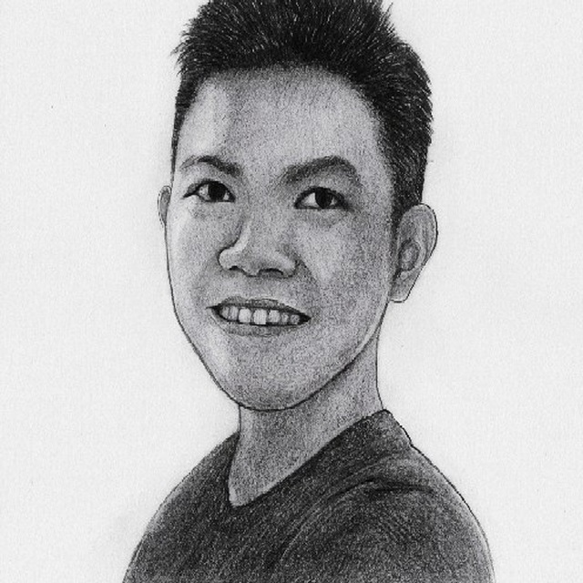
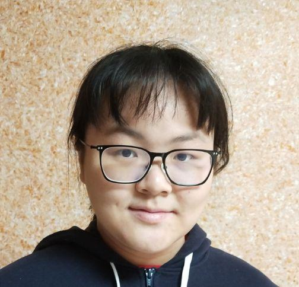
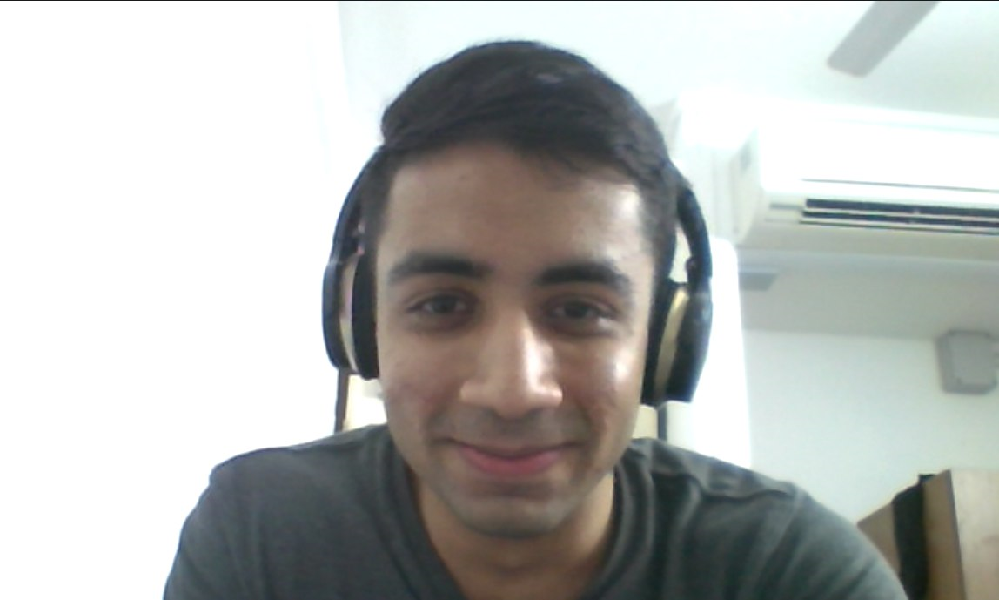
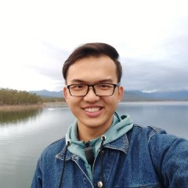
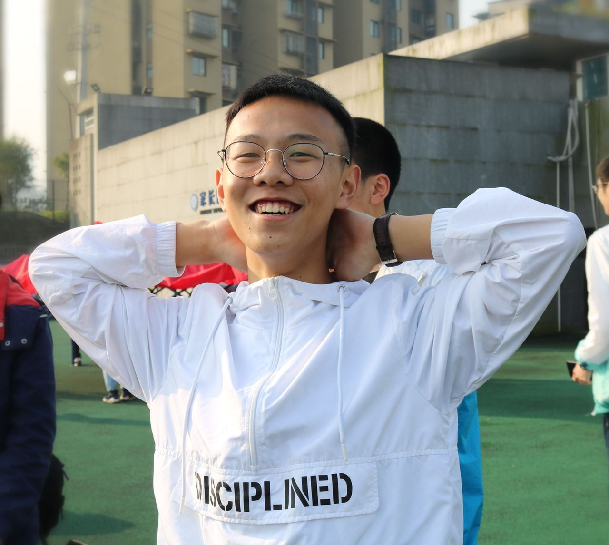

We are a group of students taking CS2103T: Software Engineering in the [School of Computing, National University of Singapore](http://www.comp.nus.edu.sg).

## Project team

|  | Name | Role | Project |
|---|---|---|---|
|| Eugene Tan| Advisor | [github](https://github.com/eugenetyc) |
||Lee Wei Min| Developer | [github](https://github.com/leeweiminsg) |
||Liu Xinyi| Developer | [github](https://github.com/Liu-2001) |
||Nauman Sajid| Developer | [github](https://github.com/Nauman-S) |
||Phyo Han| Developer | [github](https://github.com/Nahoyhp/) |
||Xu Zeng| Developer | [github](https://github.com/Royxuzeng) |
