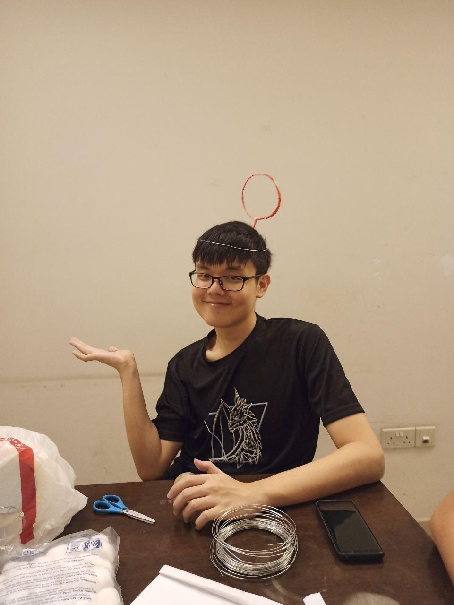

We are a team based in the [School of Computing, National University of Singapore](http://www.comp.nus.edu.sg).

You can reach us via the issues of this repository.

## Project team

### Shi Jing Lin

[[homepage](https://aqcd.github.io/)]

[[github](https://github.com/aqcd)]

[[team portfolio](https://github.com/AY2021S1-CS2103T-F13-1)]

* Role: Project Lead
* Responsibilities: Workflow Assignment

### Stephen Tan

[[github](http://github.com/blackonyyx)]

[[portfolio](team/stephentan.md)]

* Role: Developer
* Responsibilities: Documentation, BugTesting

### Liu Zhendao

[[github](https://github.com/justacasul)] 

[[portfolio](team/liuzhendao.md)]

* Role: Developer
* Responsibilities: GUI, BugTesting

### Kheng Hun

[[github](https://github.com/khenghun)]
[[portfolio](team/khenghun.md)]

* Role: Developer
* Responsibilities: Feature Developer

### Rahul

[[github](https://github.com/Rahul0506)]

[[portfolio](team/rahul.md)]

* Role: Developer
* Responsibilities: Feature Developer
