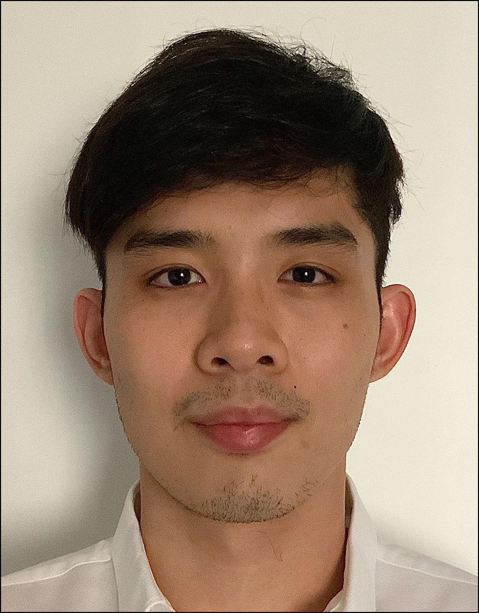
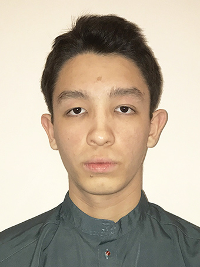
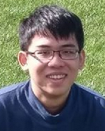
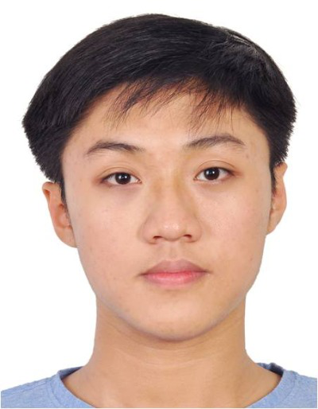
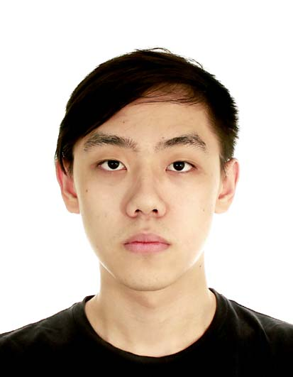

We are a team based in the [School of Computing, National University of Singapore](http://www.comp.nus.edu.sg).

## Project team

### Sean Chan Ding Chao

[[github]](https://github.com/dcchan98)
[[portfolio]](team/dcchan98)

* Role: Tech Lead, Developer
* Responsibilities: UI

### Kamil Gimik

[[github]](http://github.com/chewypiano)
[[portfolio]](team/chewypiano)

* Role: Team Lead, Developer
* Responsibilities: Testing

### Joey Chen De'en

[[github]](https://github.com/JoeyChenSmart)
[[portfolio]](team/joeychensmart)

* Role: Developer
* Responsibilities: Java Consultant, logic

### Huynh Thai Duong

[[github]](http://github.com/aidoxe-123)
[[portfolio]](team/aidoxe-123)

* Role: Developer
* Responsibilities: Logic

### Wen Junhua

[[github]](http://github.com/Jh123x)
[[portfolio]](team/jh123x)

* Role: UI Lead, Developer
* Responsibilities: UI, Packaging
