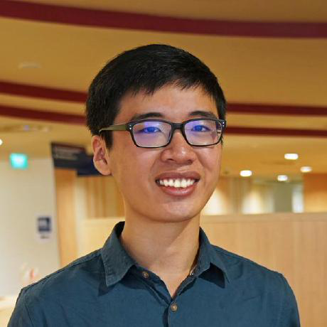
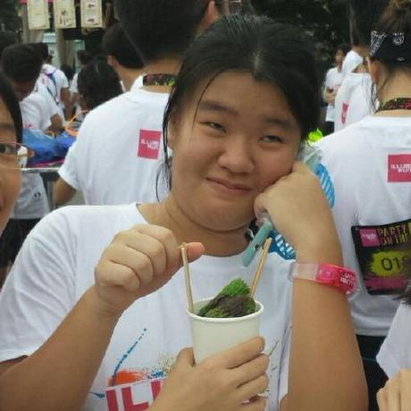
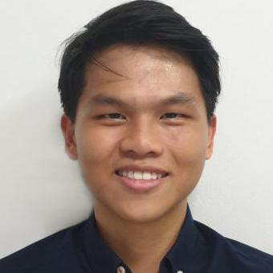
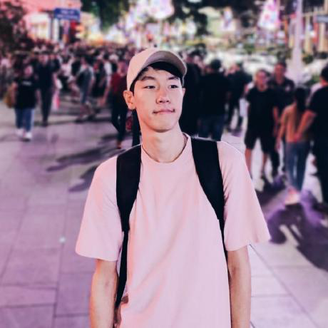
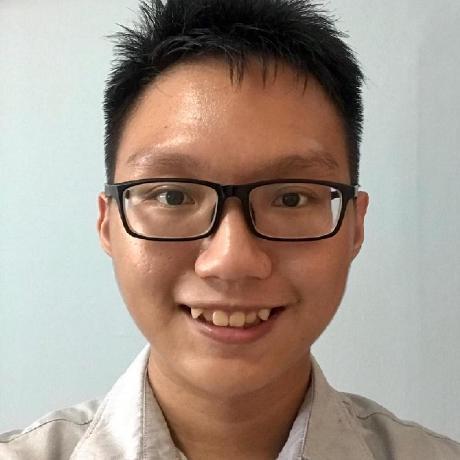

We are a team based in the [School of Computing, National University of Singapore](http://www.comp.nus.edu.sg), formed 
to fulfill the team project requirements of [CS2103T](https://nusmods.com/modules/CS2103T/software-engineering)

You can reach us at the email `seer[at]comp.nus.edu.sg`

## Project team

### Damith

[[homepage](http://www.comp.nus.edu.sg/~damithch)]
[[github](https://github.com/damithc)]
[[portfolio](team/damithc.md)]

* Role: Project Advisor

### Eugene

[[github](https://github.com/EugeneTeu)]
[[portfolio](team/eugene.md)]

* Role: Tutor

### Pin Xi

[[github](http://github.com/FizzyAgent)]
[[portfolio](team/pinxi.md)]

* Role: Team Lead
* Responsibilities: NA

### Dora

[[github](https://github.com/Door-oof)]
[[portfolio](team/dora.md)]

* Role: Developer
* Responsibilities: NA

### Ee Liang

[[github](https://github.com/Elgoh)]
[[portfolio](team/eeliang.md)]

* Role: Developer
* Responsibilities: NA

### XiHao

[[github](https://github.com/howtoosee)] 
[[portfolio](team/xihao.md)]

* Role: Developer
* Responsibilities: NA

### Yu Yang

[[github](https://github.com/IronBiscuit)]
[[portfolio](team/yuyang.md)]

* Role: Developer
* Responsibilities: NA

