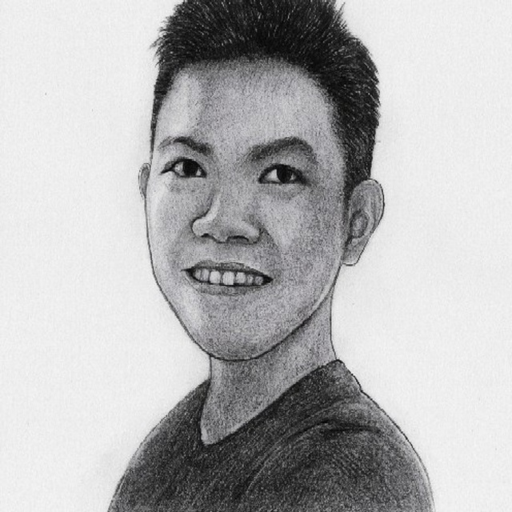

We are a group of students taking CS2103T: Software Engineering in the [School of Computing, National University of Singapore](http://www.comp.nus.edu.sg).

## Project team

|  | Name | Role | Github Repo |
|---|---|---|---|
||Lee Wei Min| Developer | [[github](https://github.com/leeweiminsg)] | 

### Lee Wei Min

[[github](https://github.com/leeweiminsg)]

* Role: Developer

### Liu Xinyi

[[github](https://github.com/Liu-2001)]

* Role: Developer

### Nauman Sajid

[[github](https://github.com/Nauman-S)]

* Role: Developer

### Phyo Han

[[github](http://github.com/johndoe)]
[[portfolio](https://github.com/Nahoyhp/)]

* Role: Developer

### Xu Zeng, Roy

[[github](https://github.com/Royxuzeng)]

* Role: Developer
