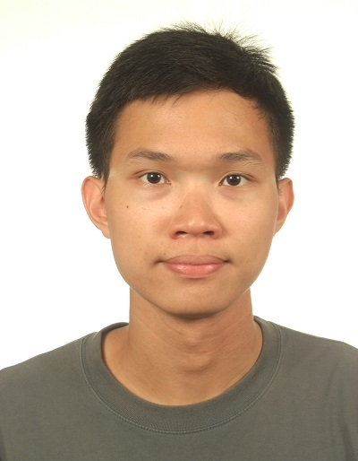
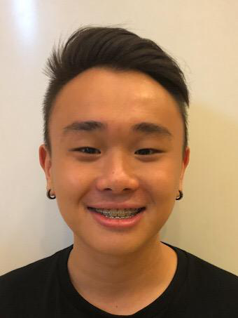
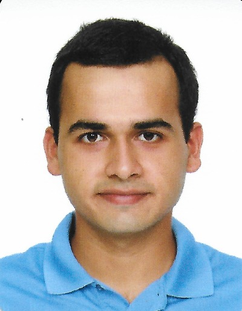
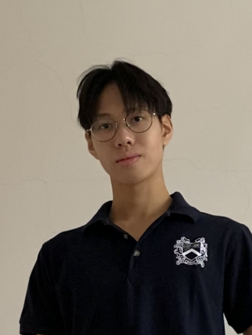

# About Us
**OneShelf** was developed by the team **CS2103T-T12-1**

We are a team based in the [School of Computing, National University of Singapore](http://www.comp.nus.edu.sg).

You can reach us at the email `e0417539@u.nus.edu`

## Project team

### Wincent Tjoi

[[github](https://github.com/wincenttjoi)]
[[portfolio](team/wincenttjoi.md)]

* Role: Developer
* Responsibilities: Scheduling and tracking, Deliverables and Deadlines

### Xing Yu

[[github](https://github.com/xnoobftw)]
[[portfolio](team/xnoobftw.md)]

* Role: Developer
* Responsibilities: Coding Quality

### Bobby Law

[[github](https://github.com/zeranium97)]
[[portfolio](team/zeranium97.md)]

* Role: Developer
* Responsibilities: Tests, Coding Quality

### Saad Haider

[[github](https://github.com/halcon-blanco)]
[[portfolio](team/halcon-blanco.md)]

* Role: Developer
* Responsibilities: Documentation

### Weng Fai

[[github](https://github.com/wengfaing)]
[[portfolio](team/wengfaing.md)]

* Role: Developer
* Responsibilities: Documentation

