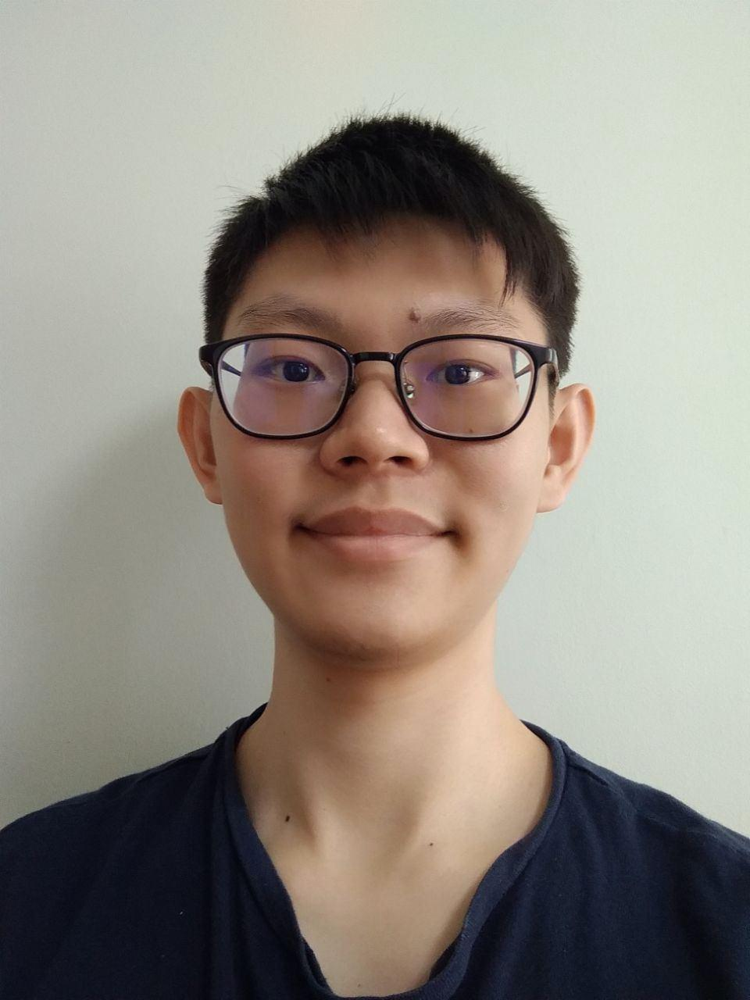
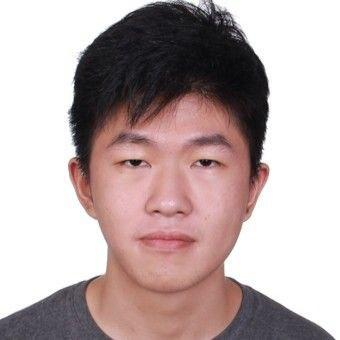
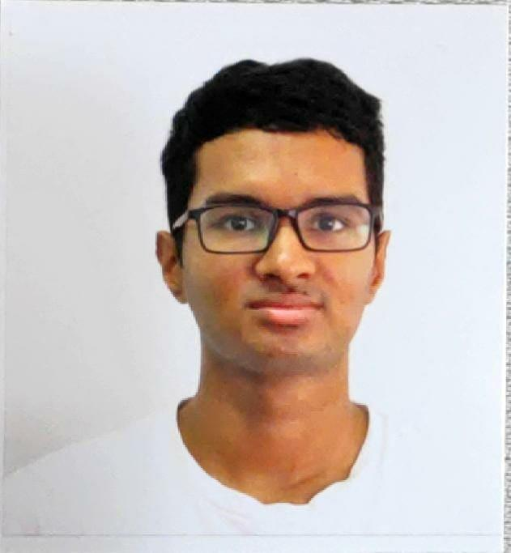
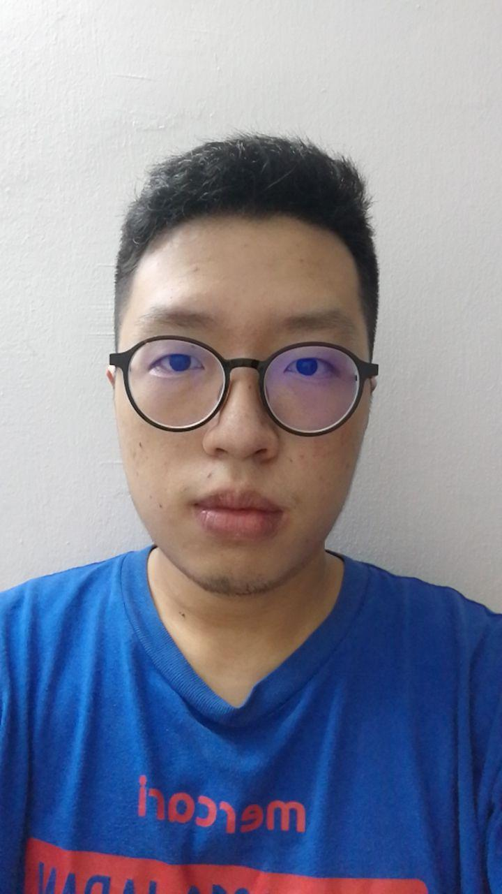
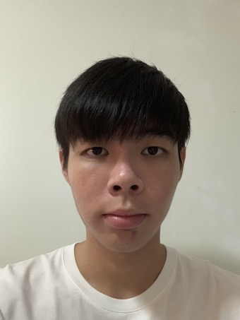

We are a team based in the [School of Computing, National University of Singapore](http://www.comp.nus.edu.sg).

You can contact us at the email `seer[at]comp.nus.edu.sg`

## Project team

### Lim Wei Quan, Ernest

[[github](https://github.com/ernestlim8)]
[[portfolio](http://ernestlim8.netlify.app/)]

* Role: Team Lead

### Ambrose Liew Cheng Yuan

[[github](https://github.com/MorningLit)]
[[portfolio](https://ambroseliew.netlify.app/)]

* Role: Developer
* Responsibilities: Checkstyle, Documentation, Intellij expert, Arts Director

### Anikesh Bhuvaneshwaram

[[github](https://github.com/Ebolaeater)]
[[portfolio](https://anikeshb.netlify.app)]

* Role: Developer
* Responsibilities: Integration, Scheduling and Tracking, Data Handler

### Tan Wei Xin

[[github](github.com/duckmoon99/)]
[[portfolio](https://www.linkedin.com/in/tanweixin/)]

* Role: Developer
* Responsibilities: Code Quality

### Chan Yong Soon, Kendrew

[[github](https://github.com/KendrewChan)] [[portfolio]([https://kendrewc.netlify.app](https://kendrewc.netlify.app/))]

* Role: Developer
* Responsibilities: Testing, Handle Code Skeletons, Deliverables and deadlines
