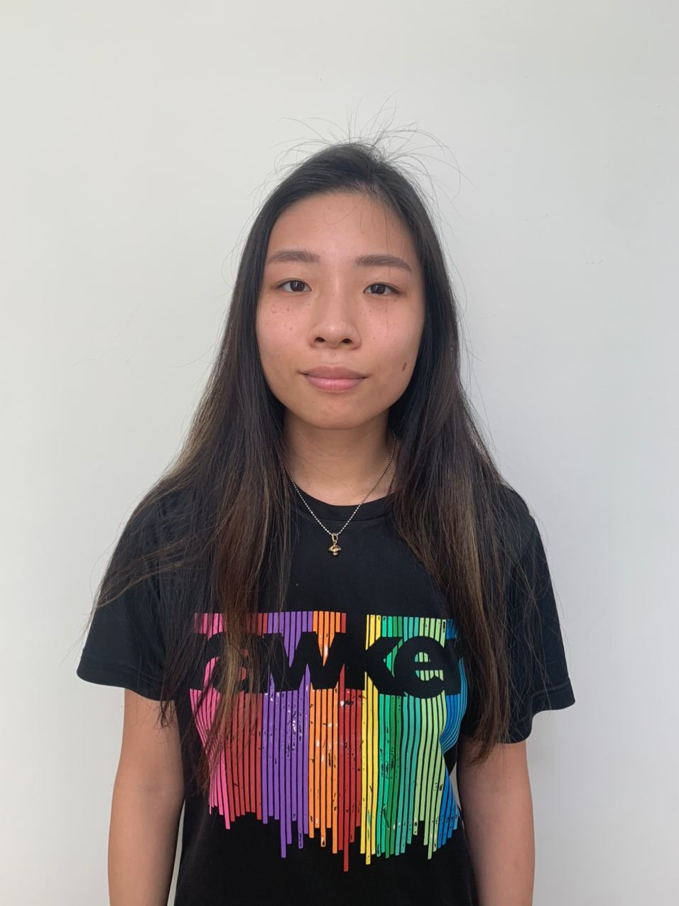
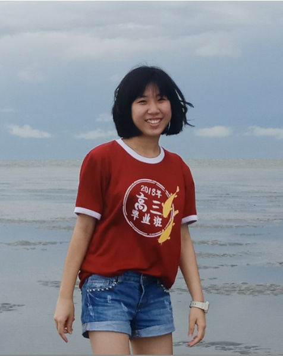
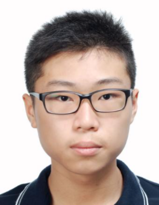

We are a team based in the [School of Computing, National University of Singapore](http://www.comp.nus.edu.sg).

You can reach us at the email `seer[at]comp.nus.edu.sg`

## Project team

### Dao Ngoc Hieu

[[homepage](./team/daongochieu2810.md)]
[[github](https://github.com/daongochieu2810)]
* Role: Team Lead

### Caitlin Jee Shen-Yi

[[homepage](./team/caitlinjee.md)]
[[github](http://github.com/caitlinjee)]

* Role: Developer
* Responsibilities: Code Quality

### Olivia Juliani Johansen

[[homepage](./team/oliviajohansen.md)]
[[github](http://github.com/oliviajohansen)]

* Role: Developer
* Responsibilities: Documentation

### Tan Jia Qi

[[homepage](./team/jiaqi20.md)]
[[github](http://github.com/jiaqi20)]

* Role: Developer
* Responsibilities: Testing + Integration

### Goh Tian Yong

[[homepage](./team/tianyong-goh.md)]
[[github](https://github.com/TianYong-Goh)]

* Role: Developer
* Responsibilities: Scheduling and tracking
