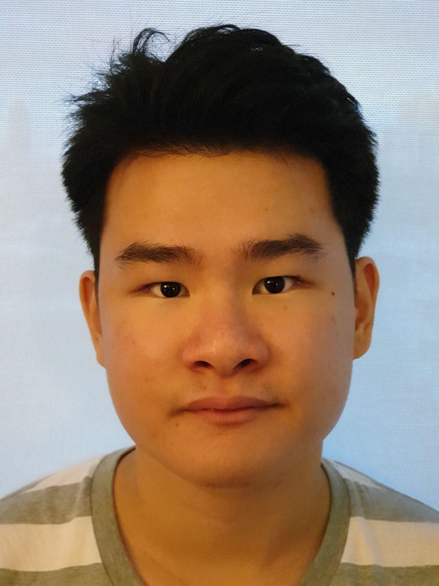

We are a team based in the [School of Computing, National University of Singapore](http://www.comp.nus.edu.sg).

## Project team

### Amy Lim Zhi Ting

[[github](https://github.com/amylzting)]
[[portfolio](team/amylzting.md)]

* Role: Developer
* Responsibilities: Documentation manager - Responsible for the quality of
project documents, Coding standards, format of deliverables

### Ang Kai Chao

[[github](https://github.com/kc-98)]
[[portfolio](team/kaichao.md)]

* Role: Developer
* Responsibilities: Team Leader, Overall code quality, Testing

### Audrey Felicio Anwar

[[github](https://github.com/AudreyFelicio)]
[[portfolio](team/audreyfelicio.md)]

* Role: Developer
* Responsibilities: Project repository manager and maintainer, main PR reviewer and merger, Update feature,
  Suggestion feature, Sort feature, and Git & GitHub expert.

### Lau Jun Hao Ashley

[[github](https://github.com/ashley-lau)]
[[portfolio](team/ashley-lau.md)]

* Role: Developer
* Responsibilities: Scheduling and tracking manager - In charge of defining, assigning, and tracking project tasks.

### Lim Ze Wei Dennis

[[github](https://github.com/LimZeWeiDennis)]
[[portfolio](team/limzeweidennis.md)]

* Role: Developer
* Responsibilities: Deadline and Deliverables manager - in charge of making sure that
members completes tasks and submit deliverables on time
