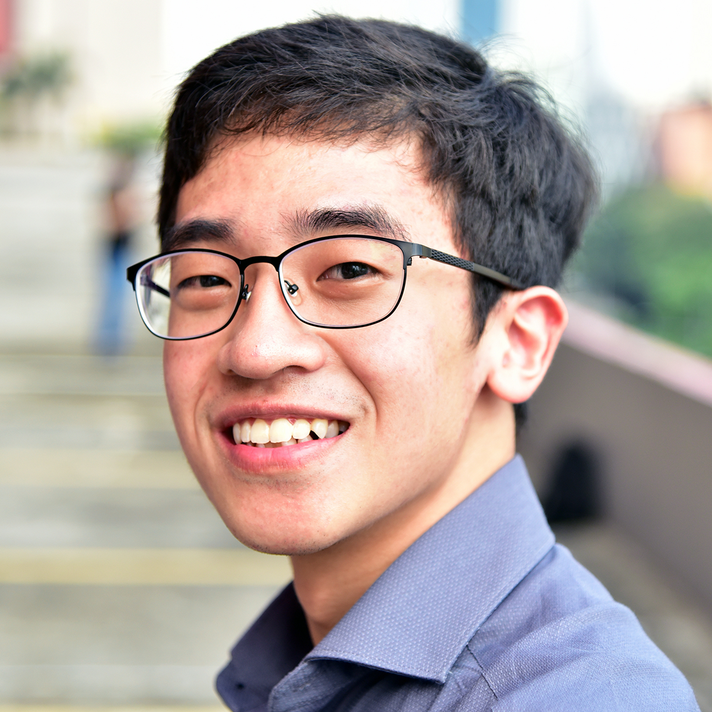
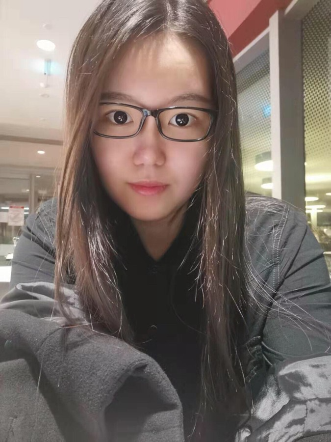

We are a team based in the [School of Computing, National University of Singapore](http://www.comp.nus.edu.sg).

You can reach us at the email `seer[at]comp.nus.edu.sg`

## Project team

### Damith C. Pahapakse

[[homepage](http://www.comp.nus.edu.sg/~damithch)]

* Role: Supervisor

### Tishya Khanna

* Role: Supervisor

### Chen Yongyan

[[github](https://github.com/Raymond0212)]
[[portfolio](team/raymond0212.md)]

* Role: Developer
* Responsibilities: Front-end, Back-end, UI/UX Design

### Daniel Adipranoto

[[github](https://github.com/danadi7)] 
[[portfolio](team/danadi7.md)]

* Role: Developer
* Responsibilities: Front-end, Back-end, UI/UX Design

### Qu Mingsi

[[github](http://github.com/e0316059)]
[[portfolio](team/e0316059.md)]

* Role: Developer
* Responsibilities: Front-end, Back-end, UI/UX Design
