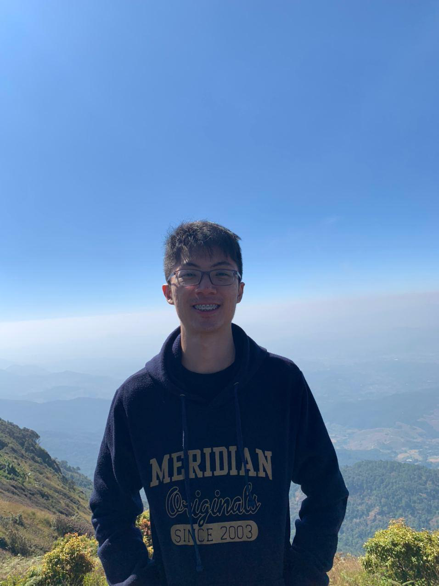

We are a team based in the [School of Computing, National University of Singapore](http://www.comp.nus.edu.sg).

You can reach us at the email `jordany@comp.nus.edu.sg`

## Project team

### Le Hue Man

[[github](https://github.com/lettuceman4)]
[[portfolio](team/man-cv.pdf)]

* Role: Developer
* Responsibilities: 

### Cheok Su Anne

[[github](https://github.com/cheoksuanne)]
[[portfolio](team/johndoe.md)]

* Role: Developer
* Responsibilities: 

### Nicholas Canete

[[github](https://github.com/nicholas-gcc)] 
[[portfolio](team/nic-cv.pdf)]

* Role: Developer
* Responsibilities:

### Lim Zi Yang

[[homepage](https://limziyang.com/)]
[[github](http://github.com/Ziyang-98)]
[[portfolio](team/johndoe.md)]

* Role: Developer
* Responsibilities: 

### Jordan Yoong

[[github](http://github.com/jordanyoong)]
[[portfolio](team/johndoe.md)]

* Role: Developer
* Responsibilities:
