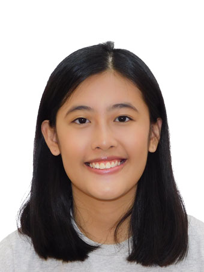
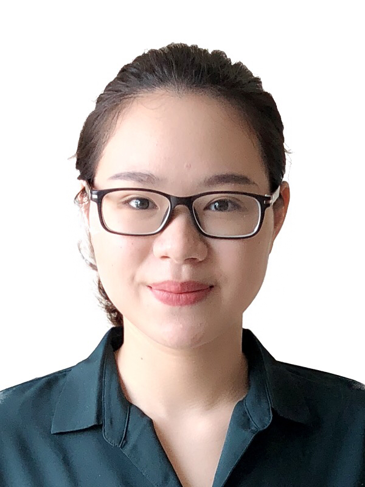
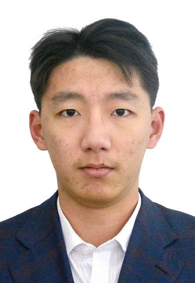

We are a team based in the [School of Computing, National University of Singapore](http://www.comp.nus.edu.sg).

You can reach us at the email `seer[at]comp.nus.edu.sg`

## Project team

### Zhou Zijian

[[homepage](http://www.zijianzhou.com/)]
[[github](https://github.com/BobbyZhouZijian)]
[[portfolio](team/bobbyzhouzijian.md)]

* Role: Tech Lead, Git Expert
* Responsibilities: Scheduling and Tracking

### Marcus Tan

[[github](http://github.com/marctzh)]
[[portfolio](team/marctzh.md)]

* Role: Developer
* Responsibilities: UI and Testing

### Gabriella Teh

[[github](http://github.com/GabriellaTeh)]
[[portfolio](team/gabriellateh.md)]

* Role: Developer
* Responsibilities: Documentation, deliverables and deadlines

### Li Beining

[[github](http://github.com/dearvae)]
[[portfolio](team/dearvae.md)]

* Role: Developer, Figma Expert
* Responsibilities: Integration

### Li Gangwei

[[github](http://github.com/nuovonatura)]
[[portfolio](team/nuovonatura.md)]

* Role: Developer, JavaFX Expert
* Responsibilities: UI and Code Quality
