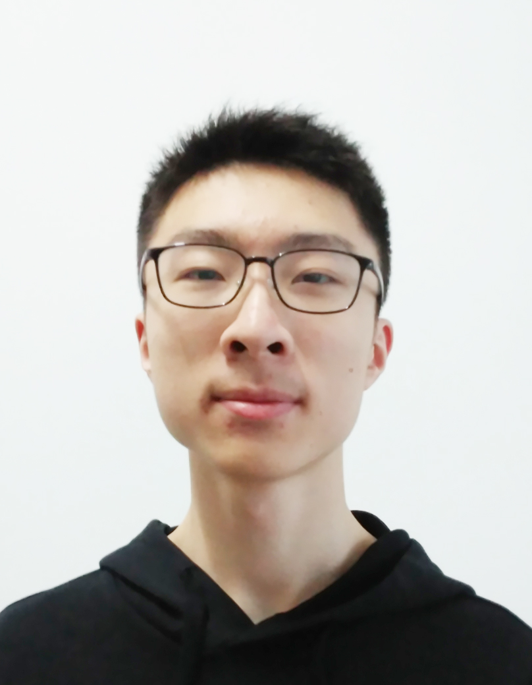
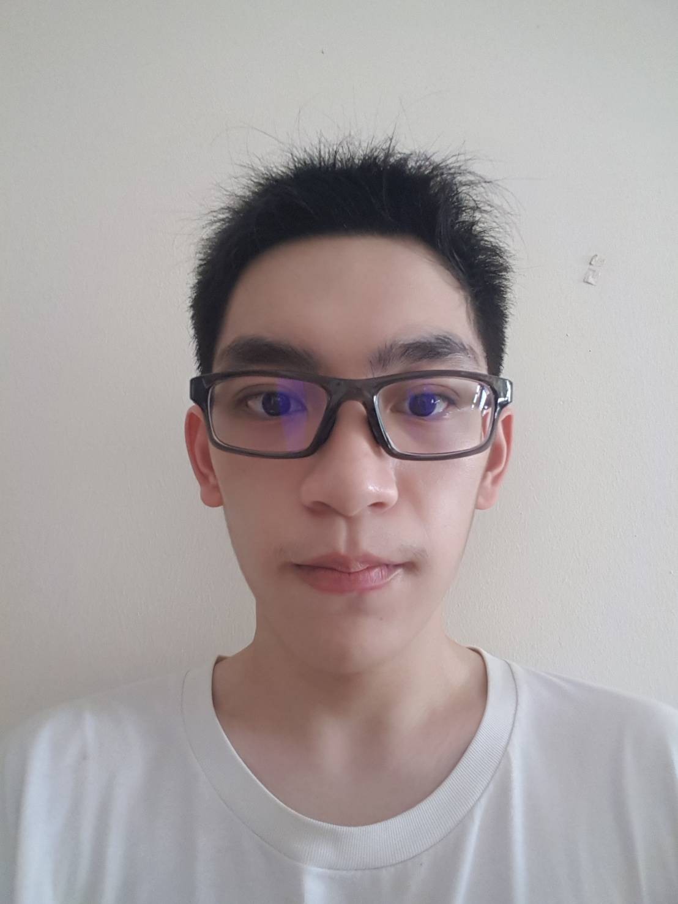
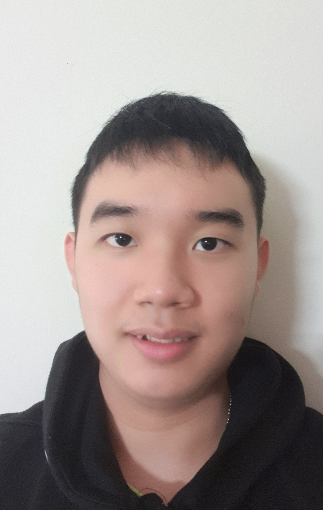

## Project team

### Li Shuo

[[github](https://github.com/li-s)][[PPP](team/li-s.md)]

* Role: Documentation
* Responsibility: Logic

### Lu Luoyi

[[github](https://github.com/luo-git)][[PPP](team/luo-git.md)]

* Role: Testing
* Responsibility: Logic

### Ma Yueran

[[github](https://github.com/Ma-Yueran)][[PPP](team/ma-yueran.md)]

* Role: Code quality
* Responsibility: Ui

### Anthony Lie

[[github](https://github.com/Anthony6401)][[PPP](team/anthony6401.md)]

* Role: Testing
* Responsibility: Storage

### Heinrich

[[github](https://github.com/HynRidge)][[PPP](team/hynridge.md)]

* Role: Scheduling and tracking
* Responsibility: Model
