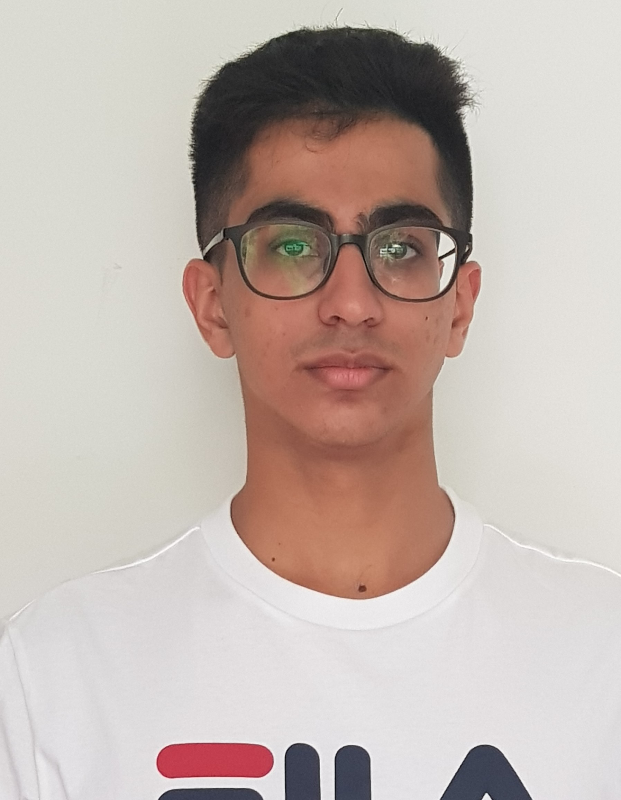
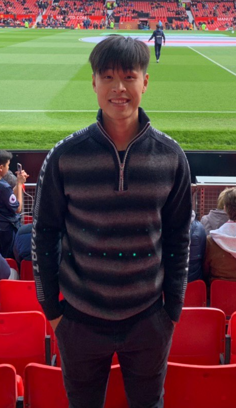
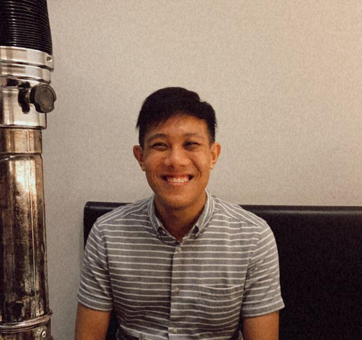
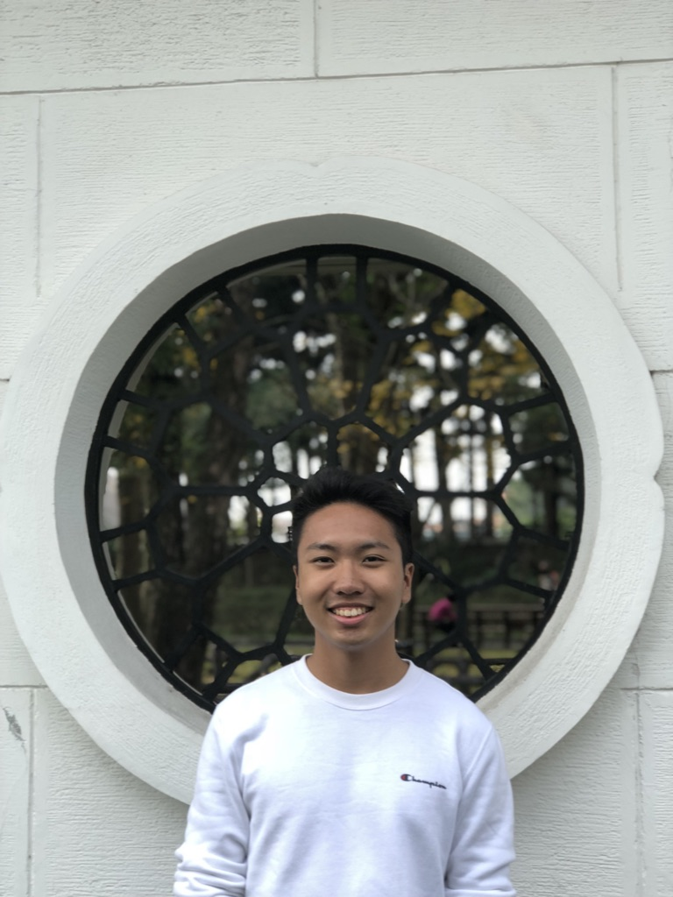

We are a team based in the [School of Computing, National University of Singapore](http://www.comp.nus.edu.sg).

You can reach us at the email `seer[at]comp.nus.edu.sg`

## Project team

### Ekam Singh

[[github](https://github.com/EkamSinghPandher)]
[[portfolio](team/ekamsinghpandher.md)]

* Role: Developer + Integration
* Responsibilities:

### Jay Chua

[[github](http://github.com/nopenotj)]
[[portfolio](team/nopenotj.md)]

* Role: Testing + Developer
* Responsibilities: Ensures the testing of the project is done properly and on time.

### Jerryl Chong

[[github](http://github.com/jerrylchong)] [[portfolio](team/jerrylchong.md)]

* Role: Deliverables and deadlines + Developer
* Responsibilities: Ensure project deliverables are done on time and in the right format.

### Roy Chan

[[github](http://github.com/royleochan)]
[[portfolio](team/royleochan.md)]

* Role: Team Lead + Developer
* Responsibilities: Overall project coordination

### Goh Yee Loon

[[github](http://github.com/gloon99)]
[[portfolio](team/gloon99.md)]

* Role: Developer
* Responsibilities: Documentation
