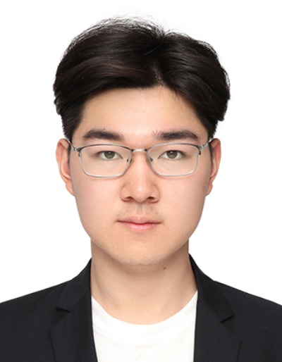
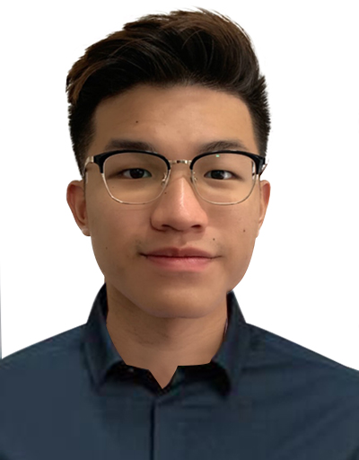

We are a team based in the [School of Computing, National University of Singapore](http://www.comp.nus.edu.sg).

You can reach us at the email `seer[at]comp.nus.edu.sg`

## Project team

### Zhou Zijian

[[homepage](http://www.zijianzhou.com/)]
[[github](https://github.com/BobbyZhouZijian)]
[[portfolio](team/bobbyzhouzijian.md)]

* Role: Tech Lead, Git expert
* Responsibilities: Scheduling and Tracking

### Marcus Tan

[[github](http://github.com/marctzh)]
[[portfolio](team/marctzh.md)]

* Role: Developer
* Responsibilities: UI and Testing

### Gabriella Teh

[[github](http://github.com/GabriellaTeh)] [[portfolio](team/GabriellaTeh.md)]

* Role: Developer
* Responsibilities: Documentation, deliverables and deadlines

### Jean Doe

[[github](http://github.com/johndoe)]
[[portfolio](team/johndoe.md)]

* Role: Developer
* Responsibilities: Dev Ops + Threading

### James Doe

[[github](http://github.com/johndoe)]
[[portfolio](team/johndoe.md)]

* Role: Developer
* Responsibilities: UI
