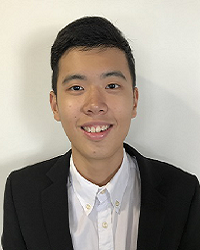

We are a team based in the [School of Computing, National University of Singapore](http://www.comp.nus.edu.sg).

## Project team

### Lam Zhi Yuan

[[github](https://github.com/lamlaaaam)]
[[portfolio](team/lamlaaaam.md)]

* Role: Developer
* Responsibilities: Deliverables and deadlines, scheduling and tracking

### Lim Jun Cheng

[[github](http://github.com/JunCheng98)]
[[portfolio](team/juncheng98.md)]

* Role: Developer
* Responsibilities: Code quality

### Aizat Azhar

[[github](http://github.com/aizatazhar)]
[[portfolio](team/aizatazhar.md)]

* Role: Developer
* Responsibilities: Documentation

### Jeremy Tan

[[github](http://github.com/koonweee)]
[[portfolio](team/koonweee.md)]

* Role: Developer
* Responsibilities: Dev Ops + Threading

### Malcolm Ong

[[github](http://github.com/m0nggh)]
[[portfolio](team/m0nggh.md)]

* Role: Developer
* Responsibilities: Code testing and quality
