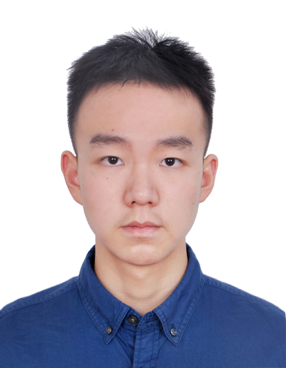
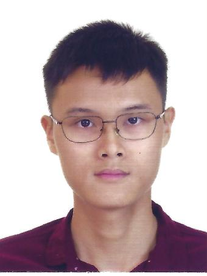

We are a team based in the [School of Computing, National University of Singapore](http://www.comp.nus.edu.sg).

## Project team

### Cao Qin

[[github](http://github.com/Ringo1225)] [[portfolio](team/ringo1225.md)]

* Role: Team Lead
* Responsibilities: UI

### Peh Jun Siang

[[github](https://github.com/todoge)] [[portfolio](team/todoge.md)]

* Role: Developer
* Responsibilities: Data

### Gabriel Teo Yu Xiang

[[github](https://github.com/GabrielTeo)] [[portfolio](team/gabrielteo.md)]

* Role: Developer
* Responsibilities: Documentation + Deliverables and deadlines + UI

### Cedric Lim Jun Wei

[[github](https://github.com/Cedo8)] [[portfolio](team/cedo8.md)]

* Role: Developer
* Responsibilities: Code quality + Scheduling & tracking

### Chong Jia Le

[[github](https://github.com/chiabs)] [[portfolio](team/chiabs.md)]

* Role: Developer
* Responsibilities: Storage
