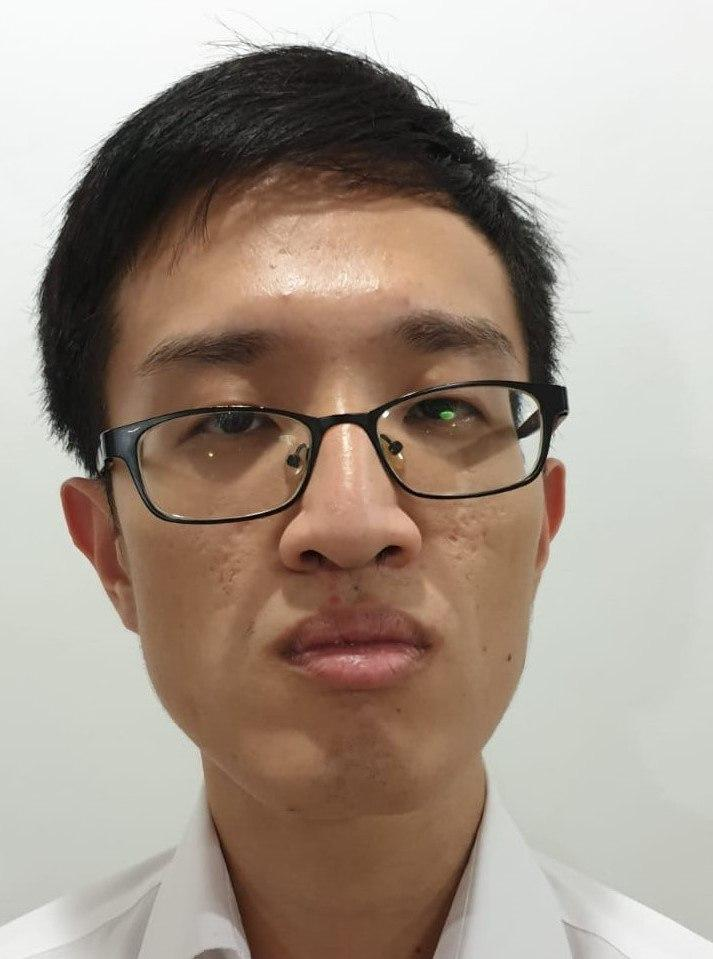

* Table of Contents
{:toc}

We are a team based in the [School of Computing, National University of Singapore](http://www.comp.nus.edu.sg).

You can reach us via the issues tracker of this [repository](https://github.com/AY2021S1-CS2103T-F13-1/tp/issues).

## Project team

[[team portfolio](https://github.com/AY2021S1-CS2103T-F13-1)]

### Shi Jing Lin

[[github](https://github.com/aqcd)]

[[portfolio](team/aqcd.md)]

* Role: Project Manager
* Responsibilities:
    * Workflow Assignment
    * Team Lead
    * Git Expert
    * Whitespace Expert
    
### Stephen Tan

[[github](http://github.com/blackonyyx)]

[[portfolio](team/blackonyyx.md)]

* Role: Developer
* Responsibilities:
    * Documentation
    * Javadoc Standards
    * Light Mode Advocate
    * Internal Bug Tester

### Liu Zhengdao

[[github](https://github.com/justacasul)] 

[[portfolio](team/justacasul.md)]

* Role: Developer
* Responsibilities:
    * GUI Expert
    * UI Designer
    * Code Quality
    * Full-Stack Developer

### Kheng Hun

[[github](https://github.com/khenghun)]

[[portfolio](team/khenghun.md)]

* Role: Developer
* Responsibilities:
    * Scheduling and Tracking
    * Deliverables and Deadlines
    * Testing
    * Main Feature Developer
    
### Rahul

[[github](https://github.com/Rahul0506)]

[[portfolio](team/rahul.md)]

* Role: Developer
* Responsibilities:
    * Continuous Integration
    * IntelliJ Expert
    * Gaming Expert
