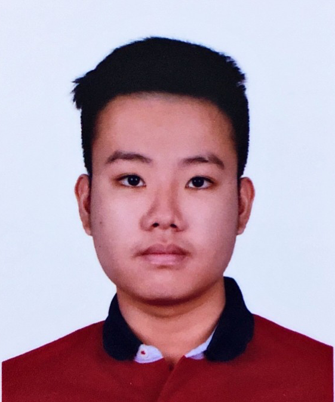

We are a team based in the [School of Computing, National University of Singapore](http://www.comp.nus.edu.sg).

You can reach us at the email `seer[at]comp.nus.edu.sg`

## Project team

### Josiah

[[github](https://github.com/josiahkhoo)]
[[portfolio](team/josiah.md)]

* Role: Team Lead

### Francis Hodianto

[[github](https://github.com/FH-30)]
[[portfolio](team/francis.md)]

* Role: Developer
* Responsibilities: Testing

### Joshua Tan

[[github](http://github.com/joshtyf)]
[[portfolio](team/joshua.md)]

* Role: Developer
* Responsibilities: Documentation

### Gilbert Tan

[[github](https://github.com/GilbertTan19)]
[[portfolio](team/gilberttan19.md)]

* Role: Developer
* Responsibilities: Code Quality

### Xingjian Chen

[[github](https://github.com/ChenXJ98)]
[[portfolio](team/chenxj98.md)]

* Role: Developer
* Responsibilities: GitHub Integration
