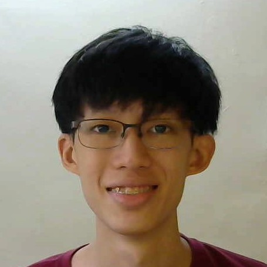

We are a team based in the [School of Computing, National University of Singapore](http://www.comp.nus.edu.sg).

You can reach us at the email `seer[at]comp.nus.edu.sg`

## Project team

### Ng Zhia Yang

[[github](http://github.com/zhiayang)]
[[portfolio](team/zhiayang.md)]

* Role: Technical Lead
* Responsibilities: Command Parser, code integration

### Seow Alex

[[github](http://github.com/seowalex)]
[[portfolio](team/seowalex.md)]

* Role: Code quality/Integration

### Travis Toh

[[github](http://github.com/trav1st)]
[[portfolio](team/trav1st.md)]

* Role: Testing / Deliverables and Deadlines
* Responsibilities: Statistics and Storage

### Teh Xue Yong

[[github](http://github.com/fall9x)]
[[portfolio](team/fall9x.md)]

* Role: Testing / Documentation

### He Jialei

[[github](http://github.com/hjl99)]
[[portfolio](team/hjl99.md)]

* Role: Deliverables and Deadlines / Scheduling and Tracking
