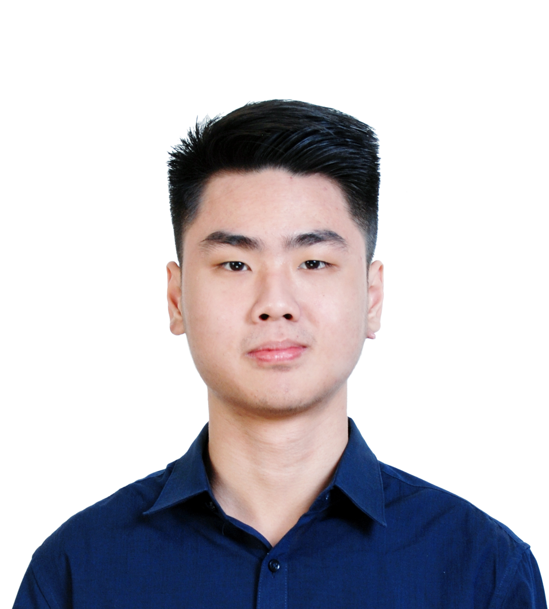

We are a team based in the [School of Computing, National University of Singapore](http://www.comp.nus.edu.sg).

## Project team

### Audrey Felicio Anwar

[[github](https://github.com/AudreyFelicio)]
[[portfolio](team/audrey.md)]

* Role: Developer
* Responsibilities: Team repository manager, main PR reviewer, Overall program structure.

### Ang Kai Chao

[[github](https://github.com/kc-98)]
[[portfolio](team/kaichao.md)]

* Role: Developer
* Responsibilities: Team Leader, Overall code quality, Testing

### Lau Jun Hao Ashley

[[github](https://github.com/ashley-lau)]
[[portfolio](team/ashley.md)]

* Role: Developer
* Responsibilities: Scheduling and tracking manager - In charge of defining, assigning, and tracking project tasks.

### Amy Lim Zhi Ting

[[github](https://github.com/amylzting)]
[[portfolio](team/amy.md)]

* Role: Developer
* Responsibilities: Documentation manager - Responsible for the quality of
project documents, Coding standards, format of deliverables
