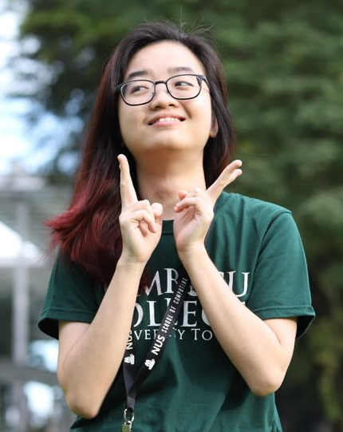

We are a team based in the [School of Computing, National University of Singapore](http://www.comp.nus.edu.sg) mentored
by Professor Damith.

You can reach us at the email `jordany@comp.nus.edu.sg` or our supervisor at `damithc@gmail.comp.nus.edu.sg`

## Project team

### Lim Zi Yang

[[homepage](https://limziyang.com/)]
[[github](http://github.com/Ziyang-98)]
[[portfolio](team/ziyang98.md)]

* Role: Team Lead
* Responsibilities: Responsible for overall project coordination

### Le Hue Man

[[github](https://github.com/lettuceman4)]
[[portfolio](team/man-cv.pdf)]

* Role: Scheduling and Tracking/Deliverables and Deadlines
* Responsibilities: In charge of defining, assigning, and tracking project tasks and
ensure project deliverables are done on time and in the right format

### Cheok Su Anne

[[github](https://github.com/cheoksuanne)]
[[portfolio](team/johndoe.md)]

* Role: Testing
* Responsibilities: Ensures the testing of the project is done properly and on time

### Nicholas Canete

[[github](https://github.com/nicholas-gcc)]
[[portfolio](team/nic-cv.pdf)]

* Role: Code Quality
* Responsibilities: Looks after code quality, ensures adherence to coding standards, etc.

### Jordan Yoong

[[github](http://github.com/jordanyoong)]
[[portfolio](https://jordanyoong.github.io/cv/experience.html)]

* Role: Documentation
* Responsibilities: Responsible for the quality of various project documents
