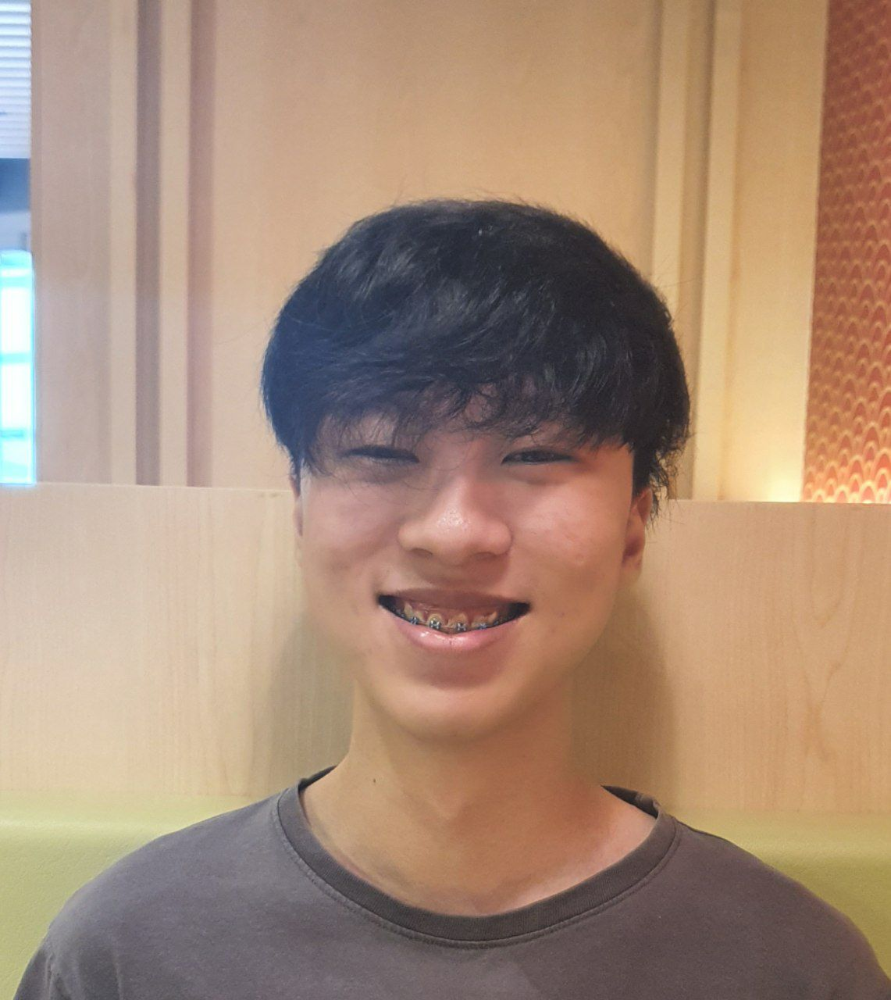

We are a team based in the [School of Computing, National University of Singapore](http://www.comp.nus.edu.sg).

This project is part of the NUS module CS2103 Software Engineering.
Our lecturer is Professor Damith Chatura Rajapakse.
You can reach him at the email `damithch@comp.nus.edu.sg`.

## Project team

### Damith Chatura Rajapakse

[[homepage](http://www.comp.nus.edu.sg/~damithch)]
[[github](https://github.com/damithc)]

* Role: Project Advisor

### Jaya Rengam

[[github](http://github.com/jayarengam)]
[[portfolio](team/jayarengam.md)]

* Role: Team Lead
* Responsibilities: Deliverables and deadlines

### Goh Siau Chiak

[[github](http://github.com/sc-arecrow)]
[[portfolio](team/sc-arecrow.md)]

* Role: Developer
* Responsibilities:
    * Implementing `StudentRecordList`, `StudentRecord`, `MarkCommand`
    * Overall bug fixing and testing
    * Project management: Issues and PR reviews

### Lim Jin Feng

[[github](http://github.com/jflim98)]
[[portfolio](team/jflim98.md)]

* Role: Developer
* Responsibilities: UI

### Joshua Chew Jian Xiang

[[github](http://github.com/josuaaah)]
[[portfolio](team/josuaaah.md)]

* Role: Developer
* Responsibilities: 
  - Implement sessions
  - Implement session lists
  - Implement commands to add and delete sessions
  - Implement commands to change current session

### Theodore Leebrant

[[github](http://github.com/theodoreleebrant)]
[[portfolio](team/theodoreleebrant.md)]

* Role: Developer, Tester
* Responsibilities: 
    * Implementing participation score in the class
    * Implementing command related to scoring
    * Overall testing for code and documentation
    * Repository management: codecov, gradle, etc.
