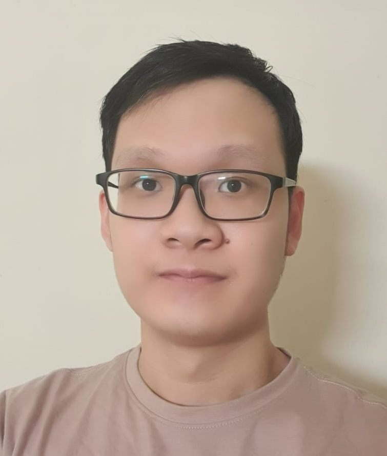

We are a team based in the [School of Computing, National University of Singapore](http://www.comp.nus.edu.sg).

You can reach us at the email `seer[at]comp.nus.edu.sg`

## Cap 5.0 Buddy

### Jonas Ng

[[github](https://github.com/jonasngs)]
[[portfolio](team/jonasng.md)]

* Role: Team lead, Integration 
* Responsibilities:

### Jane Doe

[[github](http://github.com/johndoe)]
[[portfolio](team/johndoe.md)]

* Role: Team Lead
* Responsibilities: UI

### Michael Setia Atmaja

[[github](http://github.com/michael-setia)] 
[[portfolio](team/michael-setia.md)]

* Role: Developer
* Responsibilities: Data

### David Cai Qifan

[[github](http://github.com/davidcaiqifan)]
[[portfolio](team/davidcaiqifan.md)]

* Role: Developer
* Responsibilities: Dev Ops + Threading

### James Doe

[[github](http://github.com/johndoe)]
[[portfolio](team/johndoe.md)]

* Role: Developer
* Responsibilities: UI
