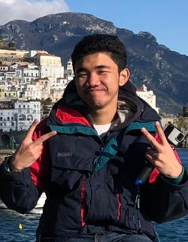

We are a team based in the [School of Computing, National University of Singapore](http://www.comp.nus.edu.sg).

You can reach us at the email: `seer[at]comp.nus.edu.sg`

## Project team

### Juan Davin Lie

[[homepage](http://www.comp.nus.edu.sg/~damithch)]
[[github](https://github.com/juandavinlie)]

-   Role: Programmer

### Sean Tay

[[github](http://github.com/seantaysl)]

-   Role: Programmer

### Ethan Noah Rozario

[[github](http://github.com/ethanthegoondu)]

-   Role: Programmer

### Tan Eu Zin

[[github](http://github.com/euzintan)]

-   Role: Programmer

### James Doe

[[github](http://github.com/johndoe)]
[[portfolio](team/johndoe.md)]

-   Role: Developer
-   Responsibilities: UI
