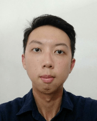
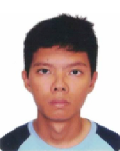

We are a team based in the [School of Computing, National University of Singapore](http://www.comp.nus.edu.sg).

## Project team

### Lam Zhi Yuan

[[github](https://github.com/lamlaaaam)]

* Role: Developer
* Responsibilities: Deliverables and deadlines, scheduling and tracking

### Lim Jun Cheng

[[github](http://github.com/JunCheng98)]

* Role: Developer
* Responsibilities: Code quality

### Aizat Azhar

[[github](http://github.com/aizatazhar)][portfolio](team/aizatazhar.md)]

* Role: Developer
* Responsibilities: Documentation

### Jean Doe

[[github](http://github.com/johndoe)]
[[portfolio](team/johndoe.md)]

* Role: Developer
* Responsibilities: Dev Ops + Threading

### James Doe

[[github](http://github.com/johndoe)]
[[portfolio](team/johndoe.md)]

* Role: Developer
* Responsibilities: UI
