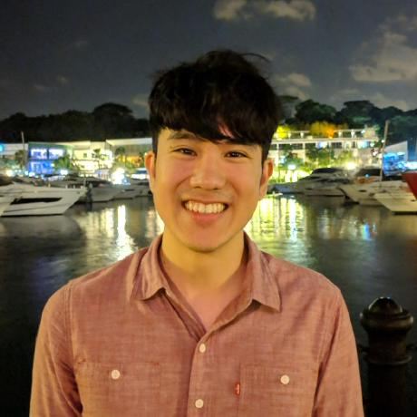

We are a team based in the [School of Computing, National University of Singapore](http://www.comp.nus.edu.sg).

## Project team

### Wang Ri Zhao 

[[github](http://github.com/therizhao)]

* Role: Team Lead
* Responsibilities: UI

### Lionel Lim Wen Hao

[[github](http://github.com/whitelio)]

* Role: Developer
* Responsibilities: Data

### Le Quang Tuan

[[github](http://github.com/youaremysky99)]

* Role: Developer
* Responsibilities: Data

### Sieow Je Min

[[github](http://github.com/jeminsieow)]

* Role: Developer
* Responsibilities: Dev Ops + Threading

### Zeng Yu Ting

[[github](http://github.com/jillzyt)]

[[portfolio](/team/yutingzeng.md)]
* Role: Developer
* Responsibilities: UI