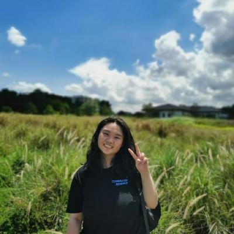

We are a team based in the [School of Computing, National University of Singapore](http://www.comp.nus.edu.sg).

You can reach us at the email `ktaekwon000 [at] gmail dot com`.

## Project team

### Michaelia Tan Tong

[[github](https://github.com/michaeliaaa)]
[[portfolio](team/michaeliaaa.md)]

* Role: Team Lead
* Responsibilities: Scheduling and tracking

### Eugene Chua

[[github](https://github.com/eugene3231)]
[[portfolio](team/eugene3231.md)]

* Role: Developer
* Responsibilities: UI

### Tae Kwon Kim

[[github](https://github.com/ktaekwon000)]
[[portfolio](team/ktaekwon000.md)]

* Role: Developer
* Responsibilities: Deliverables and Deadlines

### Geon Sik Moon

[[github](https://github.com/gsmoon97)]
[[portfolio](team/gsmoon97.md)]

* Role: Developer
* Responsibilities: Documentation

### Kenneth Ng

[[github](https://github.com/afroneth)]
[[portfolio](team/afroneth.md)]

* Role: Developer
* Responsibilities: Dev Ops
