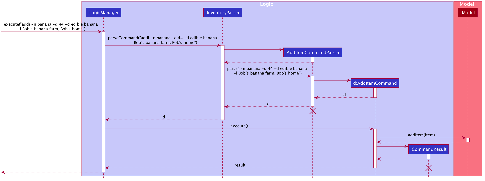
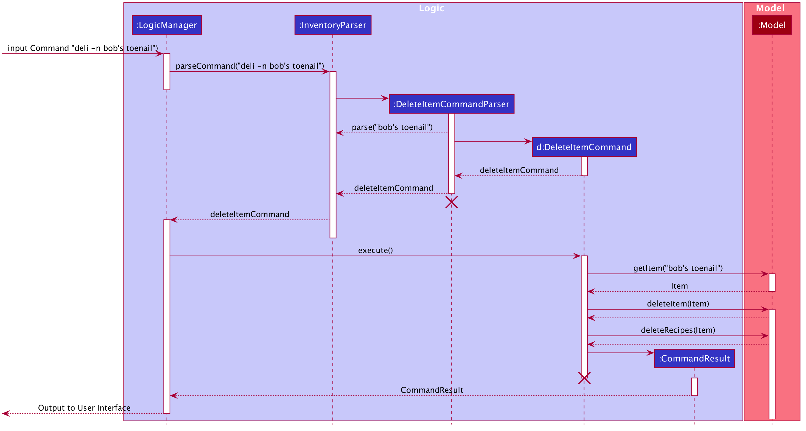
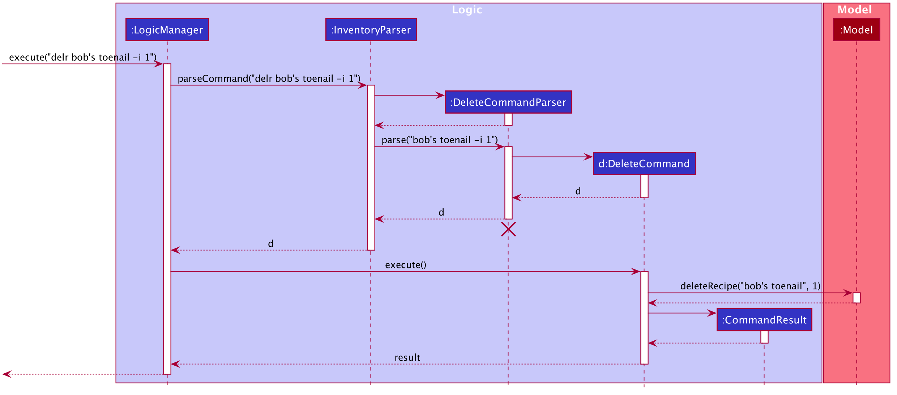
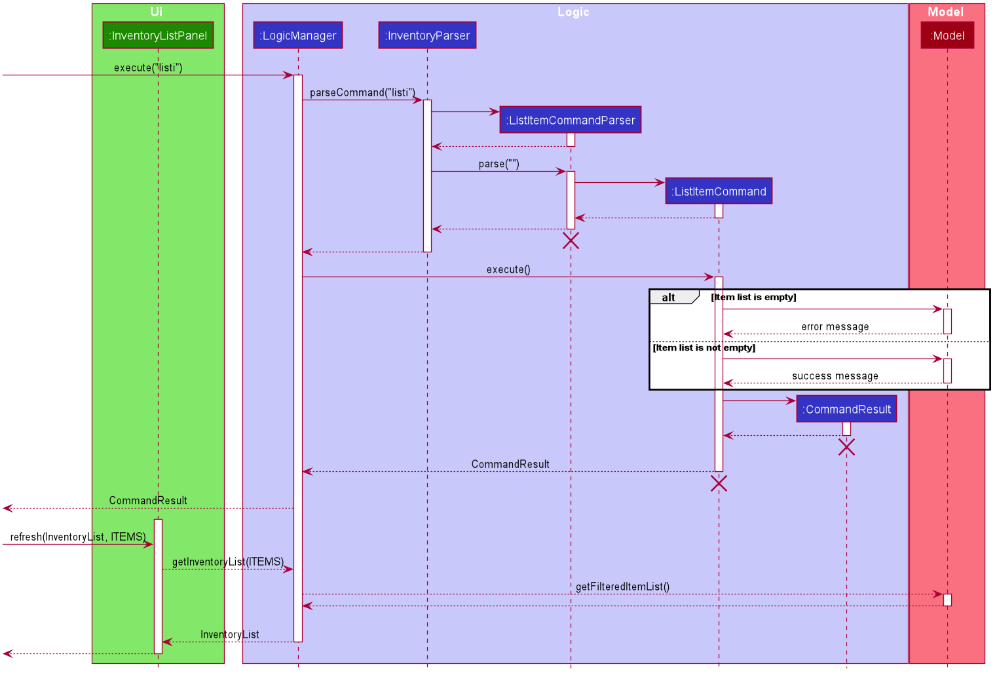

* Table of Contents
{:toc}

# Command Implementation Details
This will detail the planned sequence flow for commands, and help the developer
understand what is going on under the hood.

## Commands

### Add Item Command

### Add Quantity Command

### Delete Item Command

### Delete Recipe Command

### View Detailed Item Command

### List Item Command

### List Recipe Command

### Find Item Command

