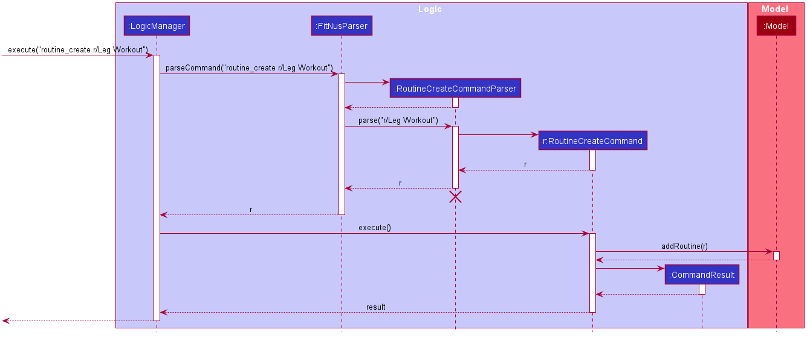
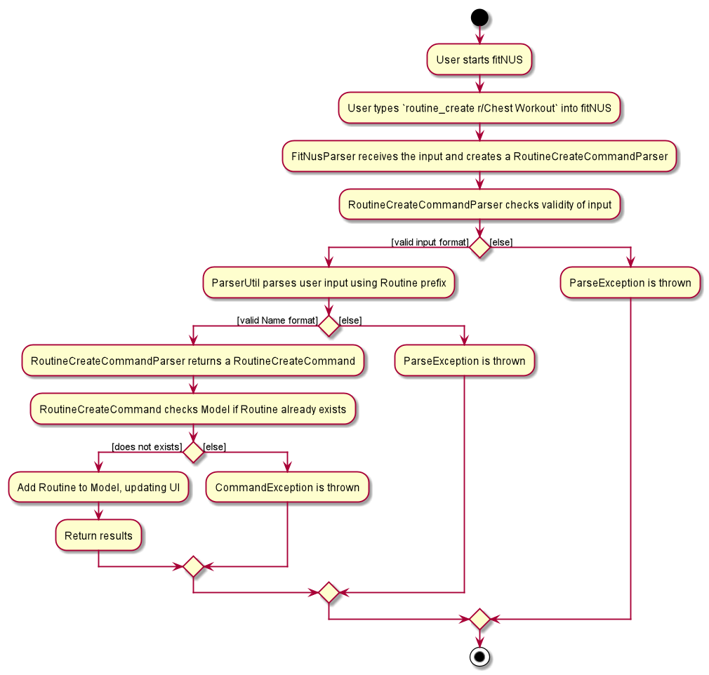
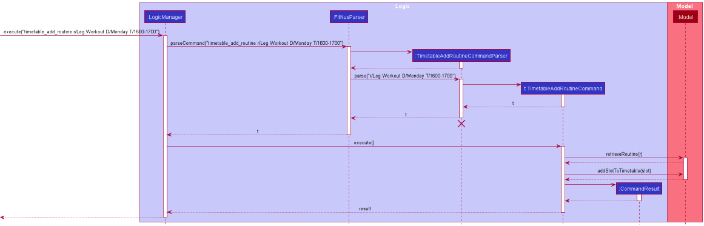
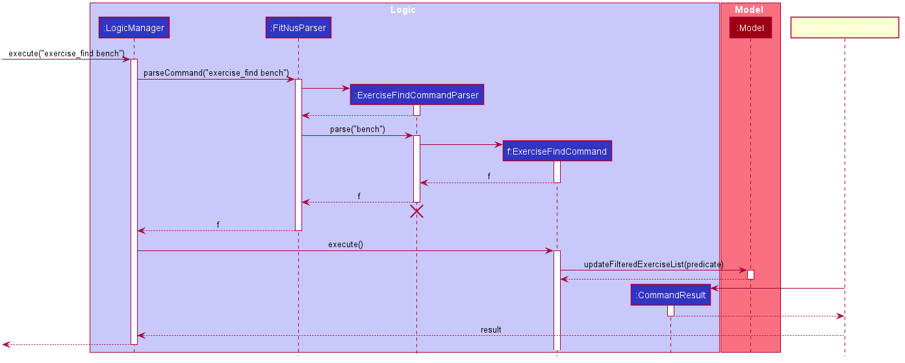

* Table of Contents
{:toc}

--------------------------------------------------------------------------------------------------------------------
## **Introduction**

fitNUS is tailored for **NUS students** that are interested in staying healthy and keeping fit. It is suitable for **all
fitness levels** and is equipped with a **customisable timetable** for you to manage your time wisely and slot in your
workout routines with ease.

This developer guide is for users who are interested in our design philosophy and for future developers of fitNUS.

--------------------------------------------------------------------------------------------------------------------
## **Setting up, getting started**

Refer to the guide [_Setting up and getting started_](SettingUp.md).

--------------------------------------------------------------------------------------------------------------------

## **Design**

### Architecture

The ***Architecture Diagram*** given above explains the high-level design of the App. Given below is a quick overview of each component.

:bulb: **Tip:** The `.puml` files used to create diagrams in this document can be found in the [diagrams](https://github.com/AY2021S1-CS2103T-T09-2/tp/tree/master/docs/diagrams) folder. Refer to the [_PlantUML Tutorial_ at se-edu/guides](https://se-education.org/guides/tutorials/plantUml.html) to learn how to create and edit diagrams.

**`Main`** has two classes called [`Main`](https://github.com/AY2021S1-CS2103T-T09-2/tp/tree/master/src/main/java/seedu/address/Main.java) and [`MainApp`](https://github.com/AY2021S1-CS2103T-T09-2/tp/tree/master/src/main/java/seedu/address/MainApp.java). It is responsible for,
* At app launch: Initializes the components in the correct sequence, and connects them up with each other.
* At shut down: Shuts down the components and invokes cleanup methods where necessary.

[**`Commons`**](#common-classes) represents a collection of classes used by multiple other components.

The rest of the App consists of four components.

* [**`UI`**](#ui-component): The UI of the App.
* [**`Logic`**](#logic-component): The command executor.
* [**`Model`**](#model-component): Holds the data of the App in memory.
* [**`Storage`**](#storage-component): Reads data from, and writes data to, the hard disk.

Each of the four components,

* defines its *API* in an `interface` with the same name as the Component.
* exposes its functionality using a concrete `{Component Name}Manager` class (which implements the corresponding API `interface` mentioned in the previous point.

For example, the `Logic` component (see the class diagram given below) defines its API in the `Logic.java` interface and exposes its functionality using the `LogicManager.java` class which implements the `Logic` interface.

**How the architecture components interact with each other**

The *Sequence Diagram* below shows how the components interact with each other for the scenario where the user issues the command `delete 1`.

The sections below give more details of each component.

### UI component

**API** :
[`Ui.java`](https://github.com/AY2021S1-CS2103T-T09-2/tp/tree/master/src/main/java/seedu/address/ui/Ui.java)

The UI consists of a `MainWindow` that is made up of parts e.g.`CommandBox`, `ResultDisplay`, `PersonListPanel`, `StatusBarFooter` etc. All these, including the `MainWindow`, inherit from the abstract `UiPart` class.

The `UI` component uses JavaFx UI framework. The layout of these UI parts are defined in matching `.fxml` files that are in the `src/main/resources/view` folder. For example, the layout of the [`MainWindow`](https://github.com/AY2021S1-CS2103T-T09-2/tp/tree/master/src/main/java/seedu/address/ui/MainWindow.java) is specified in [`MainWindow.fxml`](https://github.com/AY2021S1-CS2103T-T09-2/tp/tree/master/src/main/resources/view/MainWindow.fxml)

User inputs will influence how fitNUS UI will look like. For example, adding calories by `calorie_add c/1500` will cause the CalorieGraph UI component to update in real time.

The `UI` component,

* Executes user commands using the `Logic` component.
* Listens for changes to `Model` data so that the UI can be updated with the modified data.

### Logic component

**API** :
[`Logic.java`](https://github.com/AY2021S1-CS2103T-T09-2/tp/tree/master/src/main/java/seedu/address/logic/Logic.java)

1. `Logic` uses the `FitNusBookParser` class to parse the user command.
1. This results in a `Command` object which is executed by the `LogicManager`.
1. The command execution can affect the `Model` (e.g. adding a new Exercise into fitNUS).
1. The result of the command execution is encapsulated as a `CommandResult` object which is passed back to the `Ui`.
1. In addition, the `CommandResult` object can also instruct the `Ui` to perform certain actions, such as displaying help to the user.

Given below is the Sequence Diagram for interactions within the `Logic` component for the `execute("exercise_delete 1")` API call.

:information_source: **Note:** The lifeline for `ExerciseDeleteCommandParser` should end at the destroy marker (X) but due to a limitation of PlantUML, the lifeline reaches the end of diagram.

### Model component

**API** : [`Model.java`](https://github.com/AY2021S1-CS2103T-T09-2/tp/tree/master/src/main/java/seedu/address/model/Model.java)

The `Model`,

* stores a `UserPref` object that represents the user’s preferences.
* stores fitNUS data.
* exposes an unmodifiable
    * `ObservableList<Exercise>`
    * `ObservableList<Routine>`
    * `ObservableList<Lesson>`
    * `ObservableList<Body>`
    * `ObservableList<DailyCalorie>`

    that can be 'observed' e.g. the UI can be bound to this list so that the UI automatically updates when the data in the list change.
* does not depend on any of the other three components.

:information_source: **Note:** An alternative (arguably, a more OOP) model is given below. It has a `Tag` list in the `FitNus`, which `Person` references. This allows `FitNus` to only require one `Tag` object per unique `Tag`, instead of each `Lesson` or `Exercise` needing their own `Tag` object. 

### Storage component

**API** : [`Storage.java`](https://github.com/AY2021S1-CS2103T-T09-2/tp/tree/master/src/main/java/seedu/address/storage/Storage.java)

The `Storage` component,
* can save `UserPref` objects in json format and read it back.
* can save the fitNUS data in json format and read it back.

### Common classes

Classes used by multiple components are in the `seedu.addressbook.commons` package.

--------------------------------------------------------------------------------------------------------------------

## **Implementation**

This section describes some noteworthy details on how certain features are implemented.

### Create routine

The feature to create a routine in fitNUS is implemented using `RoutineCreateCommand` class, which inherits from
`Command` class. The argument is supplied after parsing the user input by the `RoutineCreateCommandParser` class.

It is important to note that the Routine object in question must not already exist within fitNUS.

Given below is an example usage scenario and how the routine-creating mechanism behaves at each step.

**Step 1:**

The user types into fitNUS `routine_create r/Leg Workout`.

**Step 2:**

This input is passed to `LogicManager` as a String and from there, the input is parsed by the `parseCommand`
method of `FitNusParser`.

**Step 3:**

`parseCommand` identifies that this is a command to create a Routine, so it calls the `parse` method of
`RoutineCreateCommandParser` on the input.

**Step 4:**

Within `parse`, the name of the routine is produced by `ParserUtil` parsing the given argument. This method then creates
the Routine object and returns it as an argument in the `RoutineCreateCommand`.

**Step 5:**

`LogicManager` then calls the `execute` method of this returned `RoutineCreateCommand` to add the Routine into fitNUS.

**Step 6:**

`LogicManager` then saves the updated fitNUS data to the storage.

Given below is the sequence diagram showing how the routine creation command is executed:

Given below is the activity diagram a user will go through when creating a routine in fitNUS. It shows clearly the input checks at every step and the different errors that will be thrown. 

#### Design Considerations

##### Aspect: Whether to create a Routine and add exercises simultaneously in the same command

* **Alternative 1 (Current implementation)**: No, there should be a seperate command to add Exercise into Routine

    * Pros: Better abstraction by seperating the logic of creating a Routine, and storing Exercise in Routine.
    * Cons: User has to input another command.

* **Alternative 2**: Yes, have a single command to create a Routine and add multiple Exercise to it at the same time.

    * Pros: Saves time for user, typing one long chain.
    * Cons: Increases coupling between Routine and Exercise.

Alternative 1 was chosen for the command to add an Exercise to a Routine to be seperate. This is due to the fact that
 we wanted to adhere to the Seperation of Concerns Principle. Even though, it comes at the cost of user's time, we
  believe that the trade-off to gain lower coupling and prevent ripple effects across fitNUS.

##### Aspect: Whether to implement Tag for Routine

* **Alternative 1 (Current implementation)**: No, there is no Tag function for Routine.

    * Pros: UI is a lot more concise and condensed..
    * Cons: User might not understand everything about a Routine.

* **Alternative 2**: Yes, we should implement a Tag feature for Routine.

    * Pros: Allow users to understand more about the Routine at a glance.
    * Cons: Cluttering of the UI.

Alternative 1 was chosen to not support Tag for Routine. The UI has a lot of information at the moment, and adding Tag
 to Routine would only serve to confuse the user. Furthermore, users are able to glean which Exercise is in the Routine
  from the UI as of now, and adding Tag would only clutter up the RoutineListCard. A Routine can store many Exercise and
  this is the more important information to display, over Tag.

### Add Routine to Timetable

The `TimetableAddRoutineCommandParser` and `TimetableAddRoutineCommand` classes parse and execute the user input
to add a routine to the timetable in fitNUS.

The `TimetableAddRoutineCommandParser` class takes in the user input and parses them to return a
`TimetableAddRoutineCommand` object that contains the routine, day and duration. The `TimetableAddRoutineCommand` class
then executes the command by storing the slot in the timetable.

Note that for the command to be successful, the routine to be added has to exist in fitNUS.

Given below is an example usage scenario and how the mechanism behaves at each step.

**Step 1:**

The user types into fitNUS `timetable_add_routine r/Leg workout D/Monday T/1600-1800`.

**Step 2:**

`LogicManager` takes in this input as a String and calls the `parseCommand` method of `FitNusParser` to parse this string.

**Step 3:**

`parseCommand` identifies that this is a command add a Routine to Timetable, so it calls the `parse` method of
`TimetableAddRoutineCommandParser` on the input.

**Step 4:**

The `parse` method calls the necessary methods of `ParserUtil` to parse the given argument and produce the name, day,
and duration. It uses the name to create the Routine object and returns this object, the day, and the duration as an
argument in `TimetableAddRoutineCommand`. 
Note that this Routine object is a placeholder, the actual Routine object in fitNUS is yet to be found.

**Step 5:**

`LogicManager` calls the `execute` method of this returned `TimetableAddRoutineCommand` to add the Routine into the timetable. 
Note that the `execute` method retrieves the actual Routine object in fitNUS before adding it to the timetable.

**Step 6:**

`LogicManager` then saves the updated fitNUS data to the storage.

Given below is the Sequence Diagram for interactions within the Logic component for the
execute("timetable_add_routine r/Leg Workout D/Monday T/1600-1700") API call.

### Find exercises

The find exercises feature is implemented using `FindExercisesCommandParser`, as well as the following command:
* `FindExercisesCommand`, to be executed when the user inputs the command into fitNUS.

`FindExercisesCommandParser` takes in the user input and parses them to return a FindExercisesCommand containing the
corresponding predicate for finding the exercises. When executed, `FindExercisesCommand` will set the predicate of
the respective `FilteredList` for exercises in `ModelManager` such that only exercises matching the predicate will be
displayed in the list.

Given below is an example usage scenario and how the find exercise mechanism behaves at each step.

**Step 1:**

The user types into fitNUS `find_exercises bench`.

**Step 2:**

This input is passed to `LogicManager` as a String and from there, the input is parsed by the `parseCommand`
method of `FitNusParser`.

**Step 3:**

`parseCommand` identifies that this is a command to find exercises, so it calls the `parse` method of
`FindExercisesCommandParser` on the input.

**Step 4:**

Within `parse`, the keywords to match are added to a `List`, and an `ExerciseNameContainsKeywordsPredicate` object
is created based on this list. A `FindExercisesCommand` object is created using this
`ExerciseNameContainsKeywordsPredicate` object.

**Step 5:**

`LogicManager` then calls the `execute` method of this returned `FindExercisesCommand`.
Within `execute`, `ModelManager`'s `updateFilteredExerciseList` method is called with the
`ExerciseNameContainsKeywordsPredicate` object as its argument. This filters out the relevant exercises.

**Step 6:**

The GUI then lists the filtered exercises.

Given below is the Sequence Diagram for interactions within the Logic component for the execute("find_exercises bench")
API call.

### Delete lesson

The delete lesson feature is implemented using `LessonDeleteCommandParser`, as well as the following command:
* `LessonDeleteCommand`, to be executed when the user inputs the command into fitNUS.

`LessonDeleteCommandParser` takes in the user input and parses them to return a `LessonDeleteCommand` object. The
`LessonDeleteCommand` class then executes the command by deleting the lesson from the respective `FilteredList` for
lessons in `ModelManager`.

Given below is an example usage scenario and how the delete lesson mechanism behaves at each step.

**Step 1:**

The user types into fitNUS `lesson_delete 1`.

**Step 2:**

This input is passed to `LogicManager` as a String and from there, the input is parsed by the `parseCommand`
method of `FitNusParser`.

**Step 3:**

`parseCommand` identifies that this is a command to delete lesson, so it calls the `parse` method of
`LessonDeleteCommandParser` on the input.

**Step 4:**

Within `parse`, the name of the lesson is produced by `ParserUtil` parsing the given argument. This method then creates
the Lesson object.

**Step 5:**

`LogicManager` then calls the `execute` method of this returned `LessonDeleteCommand`.
Within `execute`, `ModelManager`'s `updateFilteredLessonList` method is called. This removes the unwanted lesson.

**Step 6:**

The GUI then lists the deleted lesson.

--------------------------------------------------------------------------------------------------------------------

## **Documentation, logging, testing, configuration, dev-ops**

* [Documentation guide](Documentation.md)
* [Testing guide](Testing.md)
* [Logging guide](Logging.md)
* [Configuration guide](Configuration.md)
* [DevOps guide](DevOps.md)

--------------------------------------------------------------------------------------------------------------------

## **Appendix: Requirements**

### Product scope

**Target user profile**:

* has a need to manage their busy schedule
* prefer desktop apps over other types
* can type fast
* prefers typing to mouse interactions
* is reasonably comfortable using CLI apps
* interested in fitness, or aspiring to start
* is an NUS student

**Value proposition**: provide a platform for NUS students of any fitness experience to conveniently plan their workout
around their classes.

### User stories

Priorities: High (must have) - `* * *`, Medium (nice to have) - `* *`, Low (unlikely to have) - `*`

| Priority | As a …​                                    | I want to …​                     | So that I can…​                                                        |
| -------- | ------------------------------------------ | ------------------------------ | ---------------------------------------------------------------------- |
| `* * *`  | student who has no knowledge of working out|view what exercise routines the application has|choose the right one for me
| `* * *`  | busy student                               | add workout routines into my schedule | have the time to exercise
| `* * *`  | student                                    | delete a workout routine       | keep my schedule up-to-date
| `* * *`  | varsity NUS athlete                        | customise my routine               | better target specific muscle groups
| `* * *`  | health-conscious individual                 | log my BMI              | keep better track of my health./
| `* * *`  | student looking to lose weight                       | keep track of my weekly calorie intake               | visualise my weight loss journey
| `* * *`  | seasoned gym-goer                       | save my routines somewhere              | change my weekly routines with ease if programmes get boring
| `* * *`  | varsity NUS athlete                        | search for keywords in my exercises              | quickly get inspiration for new routines
| `* * *`  | varsity NUS athlete                        | search for keywords in my routines             | get similar inspirations from existing routines that I know of.
| `* * *`  | varsity NUS athlete                        | search for keywords in my exercises              | quickly get inspiration for new routines
| `* * `  | health-conscious NUS student                        | know how many calories I burned from my workout               | better keep track of my health
| `* * `  | student just getting into fitness                        | be recommended workouts that are beginner-friendly               | better manage my expectations
| `* * `  | professional NUS bodybuilder                       | keep notes on my workout such as my personal records               | track my progression and plan for future sessions
| `*`  | time conscious student                      | have a timer when I work out             | better plan my time
| `*`  | NUS student                       | check calories of popular food on fitNUS               | keep better records of my macros
| `*`  | NUS student                        | know which bus I can take to the nearest gym               | -

### Use cases

(For all use cases below, the **System** is the `fitNUS` and the **Actor** is the `user`, unless specified otherwise)

**Use case 1 (C1): Create a new routine**

**MSS**

1.  User requests for the current list of routines
2.  fitNUS shows the list of routines
3.  User requests to create a new routine
4.  fitNUS adds that routine to its list of routines

    Use case ends.

**Extensions**

* 3a. The given routine name already exists.

    * 3a1. fitNUS shows an error message.

      Use case resumes at step 2.

**Use case 2 (C2): Delete a routine**

**MSS**

1.  User requests to list routines
2.  fitNUS shows a list of routines
3.  User requests to delete a specific routine in the list
4.  fitNUS deletes the routine

    Use case ends.

**Extensions**

* 2a. The list is empty.

  Use case ends.

* 3a. The given index is invalid.

    * 3a1. fitNUS shows an error message.

      Use case resumes at step 2.

**Use case 3 (C3): Add exercise to routine**

**MSS**

1.  User requests to list routines
2.  fitNUS shows a list of routines
3.  User adds the exercise to a routine

    Use case ends.

**Extensions**

* 2a. The list is empty.

  Use case ends.

* 3a. The given exercise name does not exist.

    * 3a1. fitNUS shows an error message.

      Use case resumes at step 2.

* 3b. The given routine name does not exist.

    * 3b1. fitNUS shows an error message.

      Use case resumes at step 2.

**Use case 4 (C4): Delete exercise from routine**

**MSS**

1.  User requests to list routines
2.  fitNUS shows a list of routines
3.  fitNUS deletes the exercise

    Use case ends.

**Extensions**

* 2a. The list is empty.

  Use case ends.

* 3a. The given exercise to delete is invalid.

    * 3a1. fitNUS shows an error message.

      Use case resumes at step 2.

* 3b. The given routine is invalid.

    * 3a1. fitNUS shows an error message.

      Use case resumes at step 2.

**Use case 5 (C5): List all routines in fitNUS**

**MSS**

1.  User requests for all the routines available.
2.  fitNUS displays all the routines that are available, if there are any.

**Use case: View details of a certain routine**

**MSS**

1.  User requests to view a certain routine.
2.  fitNUS displays all information of the specified routine.

**Extensions**

* 1a.   Index given by user is invalid.
    * 1a1.  fitNUS shows an error message.

      Use case ends.

**Use case 6 (C6): Add completed routine to schedule**

**MSS**

1.  User requests to view current schedule.
2.  fitNUS shows the user's schedule for the day.
3.  User requests to add a specific routine to a specific slot in schedule.
4.  fitNUS adds the routine to schedule.

    Use case ends.

**Extensions**

* 3a. Routine requested by user does not exist.
    * 3a1. fitNUS shows an error message.

    Use case ends.

* 3b. The slot to add the routine is invalid.
    * 3b1. fitNUS shows an error message.

    Use case ends.

* 3c. The slot to add the routine is already in use.
    * 3c1. fitNUS informs the user to input another slot.

    Use case resumes at step 3.

**Use case 7 (C7): Delete routine from schedule**

**MSS**

1.  User requests to view current schedule.
2.  fitNUS shows the user's schedule for the day.
3.  User requests to delete a routine from a specific slot in schedule.
4.  fitNUS deletes the routine from schedule.

    Use case ends.

**Extensions**

* 3a. The slot requested is not assigned to any routine.
    * 3a1. fitNUS informs the user that the slot is empty.

    Use case resumes at step 3.

* 3b. The slot requested is invalid.
    * 3b1. fitNUS shows an error message.

    Use case ends.

**Use case 8 (C8): View timetable**

**MSS**

1.  User requests to view their timetable.
2.  fitNUS displays their timetable.

**Extensions**

* 1a.   No timetable exists within fitNUS.
    * 1a1.  fitNUS informs the user that there is no timetable to view yet.

      Use case ends.

**Use case 9 (C10): Add Calories**

**MSS**

1.  User inputs calories increment into fitNUS.

**Extensions**

* 1a.   User inputs too large of a number.
    * 1a1.  fitNUS informs the user that the input is too large.

      Use case ends.

* 1b.   User inputs 0.
    * 1b1.  fitNUS informs the user that the input is incorrect.

      Use case ends.

**Use case 8 (C10): Minus calories**

**MSS**

1.  User inputs calories decrement into fitNUS.

**Extensions**

* 1a.   User inputs a number larger than the current count.
    * 1a1.  fitNUS informs the user that the input will cause the count to be negative.

      Use case ends.

* 1b.   User inputs 0.
    * 1b1.  fitNUS informs the user that the input is incorrect.

      Use case ends.

**Use case 8 (C11): Set height**

**MSS**

1.  User inputs his/her height into fitNUS.

**Extensions**

* 1a.   User inputs an impossibly large number or small number.
    * 1a1.  fitNUS informs the user that the input is too large.

      Use case ends.

* 1b.   User inputs a negative number.
    * 1b1.  fitNUS informs the user that the input is incorrect.

      Use case ends.

**Use case 8 (C112): Set weight**

**MSS**

1.  User inputs his/her weight into fitNUS.

**Extensions**

* 1a.   User inputs an impossibly large number or small number.
    * 1a1.  fitNUS informs the user that the input is too large.

      Use case ends.

* 1b.   User inputs a negative number.
    * 1b1.  fitNUS informs the user that the input is incorrect.

      Use case ends.
### Non-Functional Requirements

1.  Should work on any _mainstream OS_ as long as it has Java `11` or above installed.
2.  Should be able to hold up to 1000 persons without a noticeable sluggishness in performance for typical usage.
3.  A user with above average typing speed for regular English text (i.e. not code, not system admin commands) should be able to accomplish most of the tasks faster using commands than using the mouse.
4.  The system should respond under a second.
5.  The system should be able to be used by a fitness novice, in the sense that the fitness terms used in fitNUS should not
confuse anyone.
6. The system should remember the details entered by the user during the session, and be carried forward to the next time.
7. Schedule should be clear and easy to read for the user, and not display too much information at once.
8. Calorie graph must be easy to read and understand for all users.
9. fitNUS GUI must be able to fit any screensize or proportions meaningfully.

*{More to be added}*

### Glossary

* **Mainstream OS**: Windows, Linux, Unix, OS-X
* **Private contact detail**: A contact detail that is not meant to be shared with others

--------------------------------------------------------------------------------------------------------------------

## **Appendix: Instructions for manual testing**

Given below are instructions to test the app manually.

:information_source: **Note:** These instructions only provide a starting point for testers to work on;
testers are expected to do more *exploratory* testing.

### Launch and shutdown

1. Initial launch

   1. Download the jar file and copy into an empty folder

   1. Double-click the jar file Expected: Shows the GUI with no entries. The window size may not be optimum.

1. Saving window preferences

   1. Resize the window to an optimum size. Move the window to a different location. Close the window.

   1. Re-launch the app by double-clicking the jar file. .
       Expected: The most recent window size and location is retained.

1. Exiting fitNUS

    1. Enter `exit` in order to save fitNUS data and close the GUI.
    1. ` exit ` is still an acceptable command, with whitespace before and after.

### Features

1. Adding an Exercise
   1. Prerequisites: Exercise named "Squats" must not already exist in fitNUS.
   1. Test case: `exercise_add e/Squats t/Leg` 
      Expected: Creates an Exercise called "Squats" that is tagged with "Leg" tag. Success message will be shown.
   1. Test case: `exercise_add e/Bicep` 
      Expected: Creates an Exercise called "Bicep" with no tags. Success message will be shown.
   1. Test case: `exercise_add e/GRE@T EXERCISE` 
      Expected: Error is thrown due to input not following alphanumeric format. 
   1. Other incorrect commands to try: `exercise_add`, `exercise_add e/Bicep e/Curls`, `...` 
      Expected: Similar to previous.
1. Deleting an Exercise
   1. Prerequisites: Exercise indicated must already exist in fitNUS. In this case, there exist 1 Exercise.

   1. Test case: `exercise_delete 1` 
      Expected: First Exercise is deleted from the list. Successful message will be shown.

   1. Test case: `routine_delete 0` 
      Expected: No Exercise is deleted. Error details shown in the status message. Status bar remains the same.

   1. Other incorrect delete commands to try: `exercise_delete`, `exercise_delete x`, `...` (where x is larger than the list size) 
      Expected: Similar to previous. 
      
1. Finding an Exercise using keywords

    1.Prerequisites: There must be Exercise existing in fitNUS to search for. In this case, we assume there are 2 named
    "Squats" and "Bench Press".
    1. Test case: `exercise_find bench` Expected: Exercise "Bench Press" will be the only Exercise listed in fitNUS.
    Success message will inform user how many exercises were successfully found.
    1. Test case: `exercise_find benc` Expected: Exercise "Bench Press" will be the only Exercise listed in fitNUS.
    Success message will inform user how many exercises were successfully found.
    1.Test case: `exercise_find benc` 
1. Editing an existing Exercise

1. Listing all Exercise

1. 

1. Adding a Routine

   1. Test case: `routine_create r/Leg Workout` 
      Expected: Creates a Routine called "Leg Workout"

   1. Other incorrect delete commands to try: `routine_create`, `routine_create r/EXISTING_ROUTINE`, `...` 
      Expected: Similar to previous.

1. Deleting a Routine

   1. Prerequisites: Routine must already exist in fitNUS. In this case, the first Routine is the one to be deleted.

   1. Test case: `routine_delete 1` 
      Expected: First Routine is deleted from the list. Successful message will be shown.

   1. Test case: `routine_delete 0` 
      Expected: No person is deleted. Error details shown in the status message. Status bar remains the same.

   1. Other incorrect delete commands to try: `routine_delete`, `routine_delete x`, `...` (where x is larger than the list size) 
      Expected: Similar to previous.

1. Setting user weight

   1. Test case: `weight w/70` 
      Expected: Updates user's weight to 70kg. GUI will reflect this change as well. BMI on GUI will recalculate.

   1. Test case: `weight w/300` 
      Expected: Weight does not update or change on GUI. Error will be shown for an unrealistic weight for a user.

   1. Other incorrect delete commands to try: `weight w/0`, `weight w/-1`, `...` 
      Expected: Similar to previous.

1. Setting user height

   1. Test case: `weight h/170` 
      Expected: Updates user's height to 170cm. GUI will reflect this change as well. BMI on GUI will recalculate.

   1. Test case: `weight w/370` 
      Expected: Height does not update or change on GUI. Error will be shown for an unrealistic height for a user.

   1. Other incorrect delete commands to try: `height w/10`, `height w/-1`, `...` 
      Expected: Similar to previous.

1. Setting user height

   1. Test case: `weight h/170` 
      Expected: Updates user's height to 170cm. GUI will reflect this change as well. BMI on GUI will recalculate.

   1. Test case: `weight w/370` 
      Expected: Height does not update or change on GUI. Error will be shown for an unrealistic height for a user.

   1. Other incorrect delete commands to try: `height w/10`, `height w/-1`, `...` 
      Expected: Similar to previous.

1. Setting user height

   1. Test case: `height h/170` 
      Expected: Updates user's height to 170cm. GUI will reflect this change as well. BMI on GUI will recalculate.

   1. Test case: `height w/370` 
      Expected: Height does not update or change on GUI. Error will be shown for an unrealistic height for a user.

   1. Other incorrect delete commands to try: `height w/10`, `height w/-1`, `...` 
      Expected: Similar to previous.

1. Adding calorie count

   1. Test case: `calorie_add c/1500` 
      Expected: Increases calorie count for today by 1500. GUI will reflect this change as well in Calorie Graph.

   1. Test case: `calorie_add c/2147483648` 
      Expected: Error will be thrown because this value is bigger than what Java can handle. Calorie Graph and today's calorie count will not update.

   1. Other incorrect delete commands to try: `calorie_add c/-1`, `calorie_add c/0`, `...` 
      Expected: Similar to previous.

1. Deducting calorie count

   1. Test case: `calorie_minus c/1500` 
      Expected: Decreases calorie count for today by 1500. GUI will reflect this change as well in Calorie Graph.

   1. Test case: `calorie_minus c/2147483648` 
      Expected: Error will be thrown because this value is bigger than what Java can handle. Calorie Graph and today's calorie count will not update.

   1. Other incorrect delete commands to try: `calorie_add c/-1`, `calorie_add c/0`, `...` 
      Expected: Similar to previous.

1. _{ more test cases …​ }_

### Saving data

1. Dealing with missing data files

    1. To simulate a missing data file, delete the save file named `fitnus.json` under `./data/`.
    1. Open fitNUS jar file by either command line or double-clicking jar file. Expected: fitNUS with no data inside.
   
1. Dealing with corrupted data files

    1. To simulate a corrupted data file, there are several ways to do this. The easiest method would be to change the
    count to negative for any day or changing the value of the pre-configured height/weight.
    1. If you ran fitNUS by command line, you will receive a warning that there has been a corruption and fitNUS will
    now clear the data and restart, deleting all previous data.
    
## Appendix: Effort

### 1. Overall efforts

Adapting AB3 to fit our vision for fitNUS was no small task. This was everyone's first introduction to a brown-field
software engineering project and the scope and depth of AB3 took everyone by surprise. We faced a lot of difficulties
juggling both understanding and dissecting the code, as well as adhering to the proper workflow arrangement. On top of
refactoring Person into Exercise, we had to find an elegant solution to the other classes of fitNUS, while ensuring low
coupling and abstraction.

### 2. Exercises and Routines

We knew that we wanted to center fitNUS around Exercise. Intertwining of Exercise with Routine, Timetable and the other
classes proved to be extremely challenging. Whenever an Exercise was edited or removed, relevant Routines will have to
changed and similarly edited. We went through several iterations of refactoring these classes due to
design issues as we learnt more about design principles in the course and defensive programming. 

### 3. User Interface

We envisioned fitNUS to be more of a "visual" product, where users will feel that the product is intuitive to use and
the interface is lean. We are proud and sure that we have achieved this goal, despite not knowing any JavaFX before
CS2103T.  We are especially proud of the calorie graph that is on the homepage that dynamically updates as the user
enters calories as well as the timetable tab that is able to concisely display the user's routines and lessons.

### 4. Conclusion

No matter how much you plan for a project, things will always hiccup. 
We had a lot of unique ideas and features that we wish we could have implemented, but due to the unforeseen workload and the already
large scale of fitNUS, we had to shed some really good ideas. Nevertheless, we are extremely proud of what we have
accomplished with fitNUS. We can say without a doubt, that this was definitely the most challenging and the most
rewarding module yet.
