* Table of Contents
{:toc}
--------------------------------------------------------------------------------------------------------------------
## 1. Introduction

### 1.2 Audience 

The Developer Guide is designed for those who are interested in understanding the architecture and other aspects of software design
of tCheck. In particular, this guide has been written with the current and future tCheck developers in mind because it details
the knowledge necessary to know to be able to modify the codebase and customize tCheck for specific operational needs or extend current functionalities.

## **Introduction**

tCheck is a desktop application that offers an integrated system to efficiently manage a bubble tea shop, of 
the (imaginary) brand T-sugar, by providing sales tracking, ingredient tracking and manpower management. It is 
optimized for CLI users to update and retrieve the information more efficiently.

### Purpose of Document
This document specifies the architecture and software design for the application, tCheck.

--------------------------------------------------------------------------------------------------------------------

## **Setting up, getting started**

Refer to the guide [_Setting up and getting started_](SettingUp.md).

--------------------------------------------------------------------------------------------------------------------

## **Design**

### Architecture

The ***Architecture Diagram*** given above explains the high-level design of the App. Given below is a quick overview of each component.

:bulb: **Tip:** The `.puml` files used to create diagrams in this document can be found in the [diagrams](https://github.com/AY2021S1-CS2103T-T12-2/tp/tree/master/docs/diagrams) folder.

**`Main`** has two classes called [`Main`](https://github.com/AY2021S1-CS2103T-T12-2/tp/blob/master/src/main/java/seedu/address/Main.java) and [`MainApp`](https://github.com/AY2021S1-CS2103T-T12-2/tp/blob/master/src/main/java/seedu/address/MainApp.java). It is responsible for,
* At app launch: Initializes the components in the correct sequence, and connects them up with each other.
* At shut down: Shuts down the components and invokes cleanup methods where necessary.

[**`Commons`**](#common-classes) represents a collection of classes used by multiple other components.

The rest of the App consists of four components.

* [**`UI`**](#ui-component): The UI of the App.
* [**`Logic`**](#logic-component): The command executor.
* [**`Model`**](#model-component): Holds the data of the App in memory.
* [**`Storage`**](#storage-component): Reads data from, and writes data to, the hard disk.

Each of the four components,

* defines its *API* in an `interface` with the same name as the Component.
* exposes its functionality using a concrete `{Component Name}Manager` class (which implements the corresponding API `interface` mentioned in the previous point.

For example, the `Logic` component (see the class diagram given below) defines its API in the `Logic.java` interface and exposes its functionality using the `LogicManager.java` class which implements the `Logic` interface.

**How the architecture components interact with each other**

The *Sequence Diagram* below shows how the components interact with each other for the scenario where the user issues the command `delete 1`.

The sections below give more details of each component.

### UI component

**API** :
[`Ui.java`](https://github.com/se-edu/addressbook-level3/tree/master/src/main/java/seedu/address/ui/Ui.java)

The UI consists of a `MainWindow` that is made up of parts e.g.`CommandBox`, `ResultDisplay`, `PersonListPanel`, `StatusBarFooter` etc. All these, including the `MainWindow`, inherit from the abstract `UiPart` class.

The `UI` component uses JavaFx UI framework. The layout of these UI parts are defined in matching `.fxml` files that are in the `src/main/resources/view` folder. For example, the layout of the [`MainWindow`](https://github.com/se-edu/addressbook-level3/tree/master/src/main/java/seedu/address/ui/MainWindow.java) is specified in [`MainWindow.fxml`](https://github.com/se-edu/addressbook-level3/tree/master/src/main/resources/view/MainWindow.fxml)

The `UI` component,

* Executes user commands using the `Logic` component.
* Listens for changes to `Model` data so that the UI can be updated with the modified data.

### Logic component

**API** :
[`Logic.java`](https://github.com/se-edu/addressbook-level3/tree/master/src/main/java/seedu/address/logic/Logic.java)

1. `Logic` uses the `AddressBookParser` class to parse the user command.
1. This results in a `Command` object which is executed by the `LogicManager`.
1. The command execution can affect the `Model` (e.g. adding a person).
1. The result of the command execution is encapsulated as a `CommandResult` object which is passed back to the `Ui`.
1. In addition, the `CommandResult` object can also instruct the `Ui` to perform certain actions, such as displaying help to the user.

Given below is the Sequence Diagram for interactions within the `Logic` component for the `execute("delete 1")` API call.

:information_source: **Note:** The lifeline for `DeleteCommandParser` should end at the destroy marker (X) but due to a limitation of PlantUML, the lifeline reaches the end of diagram.

### Model component

**API** : [`Model.java`](https://github.com/AY2021S1-CS2103T-T12-2/tp/blob/master/src/main/java/seedu/address/model/Model.java)

The `Model`,

* stores a `UserPref` object that represents the user’s preferences.
* stores the address book data.
* exposes an unmodifiable `ObservableList<Person>` that can be 'observed' e.g. the UI can be bound to this list so that the UI automatically updates when the data in the list change.
* does not depend on any of the other three components.

Given below is the class diagram showing the details of the `SalesRecordEntry` model:

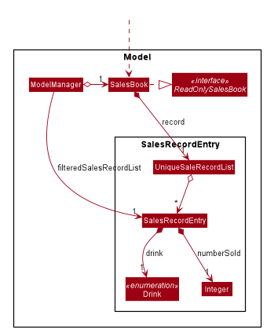

The `SalesRecordEntry` sub-component,
* stores the sales book data
* exposes an unmodifiable `ObservableList<SalesRecordEntry>` that can be 'observed'. e.The UI can be bound to this
 list so that the UI automatically updates when the data in the list change.

Given below is the class diagram showing details of the ingredient model:

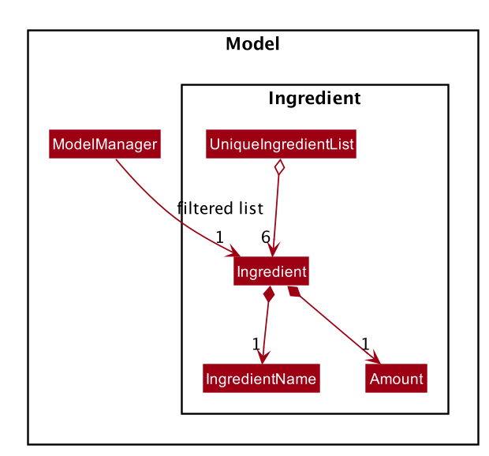

:information_source: **Note:** The text in the middle of the
 association arrows represents the role of the class at the arrow head. However, due to a limitation of
 PlantUML, where there cannot be two textboxes at the arrow head, the role has been placed in the middle of the arrow.

:information_source: **Note:** An alternative (arguably, a more OOP) model is given below. It has a `Tag` list in the `AddressBook`, which `Person` references. This allows `AddressBook` to only require one `Tag` object per unique `Tag`, instead of each `Person` needing their own `Tag` object. 

### Storage component

**API** : [`Storage.java`](https://github.com/se-edu/addressbook-level3/tree/master/src/main/java/seedu/address/storage/Storage.java)

The `Storage` component,
* can save `UserPref` objects in json format and read it back.
* can save the address book data in json format and read it back.
* can save the ingredient book data in json format and read it back.

### Common classes

Classes used by multiple components are in the `seedu.addressbook.commons` package.

--------------------------------------------------------------------------------------------------------------------

## **Implementation**

This section describes some noteworthy details on how certain features are implemented.

### \[Completed\] Recording/ Updating Sales Data

tCheck allows users to record and update the sales information on the drink sold. The command to use this feature is:
`s-update DRINK [MORE_DRINKS]` where:
* `DRINK` is formatted as `A/NUM`.
    * `A` refers to the drink's abbreviation.
    * `NUM` refers to the number of drinks sold. It should be a **non-negative unsigned integer** that is 
less than or equal to 99999999.

The user may use this command for a single `Drink`, or multiple `Drink`s.

Currently, tCheck supports the tracking of 6 types of `Drink`s.
* `BSBM`  : Brown Sugar Boba Milk
* `BSBBT` : Brown Sugar Boba Black Tea
* `BSBGT` : Brown Sugar Boba Green Tea
* `BSPM`  : Brown Sugar Pearl Milk
* `BSPBT` : Brown Sugar Pearl Black Tea
* `BSPGT` : Brown Sugar Pearl Green Tea

#### Implementation

The completed mechanism to record the sales data is facilitated by the `SalesBook`. It implements the
`ReadOnlySalesBook` interface, which will allow the sales data to be displayed graphically in the user interface.
The sales data is stored in a `UniqueSalesRecordList`, which is a list of `SalesRecordEntry`. A `SalesRecordEntry`
contains the `numberSold` for a type of `Drink`. The `SalesBook` implements the following operations:

 * `SalesBook#overwriteSales(Map<Drink, Integer> sales)`  —  Overwrites the sales record with the given sales data
 * `SalesBook#isEmptySalesRecord()`  —  Returns true if the sales record is empty

If the `SalesBook` has not been initialised with the user's sales input, which means that the `SalesBook` is empty, then
the first sales record will set the sales record with the user input. Drink items that were not provided in the user
input will be set to a default value of 0.

Subsequent sales update will overwrite existing sales record for the particular `Drink`.

These operations are exposed in the `Model` interface as `Model#overwrite(Map<Drink, Integer> salesInput)` and
`Model#isEmptySalesBook()`.

Given below is an example usage scenario and how the recording sales data mechanism behaves at each step.

Step 1: The user launches the application for the first time. The `SalesBook` will be initialized with an empty
`SalesBook` as no sales information has been recorded yet. The `UniqueSalesRecordList` is currently empty.

Step 2: The user executes the `s-update BSBM/100 BSBGT/120` command to record that 100 Brown Sugar Boba Milk (BSBM) and
120 Brown Sugar Boba Green Tea (BSBGT) were sold. The `s-update` command will initialise the sales record in `SalesBook`
when it is executed. This is because the current `SalesBook` is empty. It calls
`Model#overwrite(Map<Drink, Integer> salesInput)`, which will save the sales data into the `UniqueSalesRecordList` in
the `SalesBook`. The other `Drink` types whose sales numbers were not given will be initialised to 0.

Step 3: The user realises that he left out some sales data. He executes the `s-update BSBBT/180 BSPM/64` command to
record that 180 Brown Sugar Boba Black Tea (BSBBT) and 64 Brown Sugar Pearl Milk (BSPM) were sold. Since the
`SalesBook` has  already been initialised, when the `s-update` command executes, it calls 

`Model#overwrite(Map<Drink, Integer> salesInput)` which will only overwrite the sales data for the `Drink` items that
were given in the user input will be overwritten.

Step 4: The user then realises that he had made an error in recording the number of Brown Sugar Boba Milk (BSBM) sold.
He then executes the `s-update BSBM/110` to correct this error. The `s-update` command will call
`Model#overwrite(Map<Drink, Integer> salesInput)` to overwrite the sales data for Brown Sugar Boba Milk (BSBM) only.

The following sequence diagram shows how the sales update operation works:

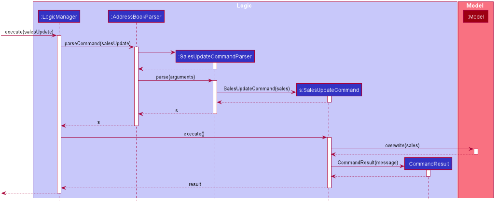

:information_source: **Note:** The lifeline for `SalesUpdateCommand`
 and the `SalesUpdateCommandParser` should end at the destroy marker (X) but due to a limitation of PlantUML, the
  lifeline reaches the end of diagram.

The following activity diagram summarises what happens when a user executes the `s-update` command.

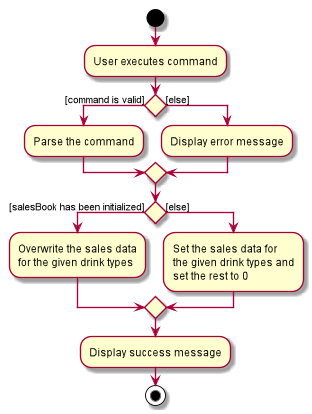

#### Design consideration:

##### Aspect: How the sales record updates
* **Alternative 1 (current choice)**: Overwrite the sales data only for the drink items specified by the
user in the `s-update` command
    *  Pros: More intuitive and convenient for the user. If the user made any error or miss out any details, he can
     correct the sales data with a shorter command.
    *  Cons: Less easy to implement.

* **Alternative 2**: Replace the sales record based on what has been given by the user, for every
  `s-update` command
    * Pros: Easy to implement.
    * Cons: May not be intuitive and convenient for the user, as the user would have to ensure that his command has
     no error and contains all information. If he made an error or left something out, he would have to retype the
      entire command again.

##### Aspect: How to implement `Drink` types
* **Alternative 1 (current choice)**: Implement `Drink` type as an Enumeration class
    * Pros: Simple to implement. Since there is only a fixed set of drink items to represent, we can use an enumeration
     class to represent the types of `Drink`s. It is also easier to add more types of drinks in the future.
    * Cons: If more functionalities are required from `Drink` in the future, then it may not be feasible to use an
     Enumeration class.
* **Alternative 2**: Implement `Drink` type as a normal class, where the fields could include a String to identify
 the type of Drink. The various Drink type would then inherit from this class.
    * Pros: It can can be extended more easily if there is a greater variety of drinks to store in the future.
    * Cons: There are not many operations to do with `Drink`s. It is only used to represent a constant set of
     drink types.

## \[Completed\] Finding sales data of some drinks

Finds specific drinks' sales data feature allows the user to get the sales data of a drink quickly. The command is:

* `s-find KEYWORD [MORE_KEYWORDS]` - Views sales data of drinks with the specified keywords.

#### Completed Implementation

The completed finds sales data of some drinks mechanism is facilitated by `InputContainsKeywordsPredicate`. It implements
Predicate<SalesRecordEntry>.

It exposes to `#Model updateFilteredSalesList(Predicate<SalesRecordEntry> predicate)`.

Given below is an example usage scenario and how the find drinks' sales data mechanism behaves at each step.

Step 1. The user launches the application. If the storage file for the sales book is empty, `SalesBook` will
be initialized with the six pre-defined drinks, namely `BSBM`, `BSBBT`, `BSBGT`, `BSPM`, `BSPBT` and `BSPGT`
with the sales data of 0 for all. If the storage file for the sales book is not empty, `SalesBook` will read the
data from the storage file.

Step 2. The user executes `s-find BSBBT` to view BSBBT's current sales data. The `s-find BSBBT` command is
parsed by `SalesFindCommandParser` which parses the input to get the matched drink's name and
returns an  `SalesFindCommand`,  which returns the drinks their sales data.

The following activity diagram shows how the find drink's sales data operation works:
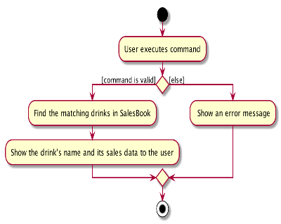

#### Design consideration:

##### Aspect: How to find drink's sales data

  * **Current Choice**: Obtain the drink's name entered by the user, and use the
  drink's name to find the sales data by looping through the salesbook.
    * Pros: Code is more readable and consistent with the logic of finding employees.
    * Cons: Every execution of the command will require one to access the sales record list loop through 
    the list once, which may increase the time required for the operation. 

### \[Completed\] Set ingredients' levels feature

The completed set ingredients' levels feature consists of three commands with slightly different command words and take in different numbers of parameters. The three commands complement one another, to provide a set of useful commands for enhanced user experiences in setting ingredients' levels. The three commands (including command word, prefix(es) if any and parameters taken in) are :

* `i-set i/INGREDIENT_NAME m/AMOUNT` — Sets the level of one specific ingredient to the specified amount.
* `i-set-default` — Sets the levels of all ingredients defined in the ingredient book to pre-determined amounts.
* `i-set-all M/AMOUNT_FOR_MILK P/AMOUNT_FOR_PEARL B/AMOUNT_FOR_BOBA L/AMOUNT_FOR_BLACK_TEA G/AMOUNT_FOR_GREEN_TEA S/AMOUNT_FOR_BROWN_SUGAR` — Sets the levels of all ingredients defined in the ingredient book to different specified amounts for each ingredient.

Note that because tCheck is designed for an imaginary bubble tea brand, T-Sugar, which produces all its drinks using six ingredients,
namely Milk, Pearl, Boba, Black Tea, Green Tea and Brown Sugar. All the six ingredients are pre-defined in tCheck's ingredient book. Only these six available ingredients' levels can be set using tCheck.

#### Implementation

The completed set ingredients' levels mechanism is facilitated by `IngredientBook`. It implements `ReadOnlyIngredientBook` interface and offers methods to set tCheck's `ingredientBook`. Particularly, it implements the following three operations:

* `IngredientBook#setIngredient(Ingredient target, Ingredient newAmount)` — Sets the amount the `target` ingredient in the ingredient book to the specified new amount.
* `IngredientBook#setIngredients(List<Ingredient> ingredients)` — Sets the amounts of all ingredients defined in the ingredient book according to the specified amounts in `ingredients` list.
* `IngredientBook#setIngredientsData(ReadOnlyIngredientBook newAmount)` — Sets the amounts of all ingredients defined in the ingredient book according to the `newAmount` ingredient book.

These operations are exposed in the `Model` interface as `Model#setIngredient(Ingredient target, Ingredient newAMount)` and `Model#setIngredientBook(ReadOnlyIngredientBook ingredientBook)` respectively.

:information_source: **Note:** The `IngredientBook#setIngredients(List<Ingredient> ingredients)` is not exposed in model because it is only used as a shortcut to change the internal states of `ReadOnlyIngredientBook ingredientBook` quickly.

Given below is an example usage scenario for the aforementioned three commands and how the mechanism behaves at each step for the commands.

Step 1. The user, a T-Sugar store manager, launches tCheck for the very first time. The `IngredientBook` will be initialized with a `UniqueIngredientList` containing the six pre-defined ingredients, namely `Milk`, `Pearl`, `Boba`, `Black Tea` , `Green Tea` and `Brown Sugar`, with an amount of 0 set for all.

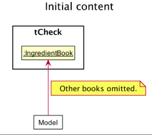
Figure Set Ingredients' levels - 1 shows the relationship between Model and Ingredient Book after tCheck is launched.

Step 2. The user executes `i-set-default` to set the amounts of all ingredients to the default levels of the store, which are 50 L for liquids and 20 KG for solids. The `i-set-default` command calls `Model#setIngredientBook(ReadOnlyIngredientBook ingredientBook)`, causing the initial ingredient book to be replaced by the `ingredientBook` with the amounts of ingredients to be equal to the ingredients' default levels.

:information_source: **Note:** If the command fails its execution, it will not call `Model#setIngredientBook(ReadOnlyIngredientBook ingredientBook)`, so the ingredient book will not be changed in tCheck.

Step 3. The user finds that the real amounts for one particular ingredient in his/her store, milk for example, is different from the default level stored in tCheck and decides to set the amount for milk by executing the `i-set i/INGREDIENT_NAME m/AMOUNT` command. In this case, the exact command entered is : `i-set i/Milk m/100`.
The command calls `Model#setIngredient(Ingredient target, Ingredient newAmount)`, causing the `target`, which is `Milk`, in the current ingredient book to be replaced by `newAmount` with the same ingredient name `Milk` and updated amount, in this case `100` L.

:information_source: **Note:** If the command fails its execution, it will not call `Model#setIngredient(Ingredient target, Ingredient newAmount)`, so the ingredient book will not be modified in tCheck.

Step 4. After some time of operation, the user decides to update the ingredient book in tCheck with current amounts of ingredients in his/her T-Sugar store by executing the `i-set-all M/AMOUNT_FOR_MILK P/AMOUNT_FOR_PEARL B/AMOUNT_FOR_BOBA L/AMOUNT_FOR_BLACK_TEA G/AMOUNT_FOR_GREEN_TEA S/AMOUNT_FOR_BROWN_SUGAR` command.
In this case, the exact command entered is :  `i-set-all M/10 P/15 B/20 L/5 G/5 S/15`. The command calls `Model#setIngredient(ReadOnlyIngredientBook ingredientBook)`, causing the current ingredient book to be replaced by the `ingredientBook` with new different specified amounts for each ingredient.
Furthermore, 

The following sequence diagram shows how the set ingredients' levels operation works, using `i-set i/Milk m/100` as an example:

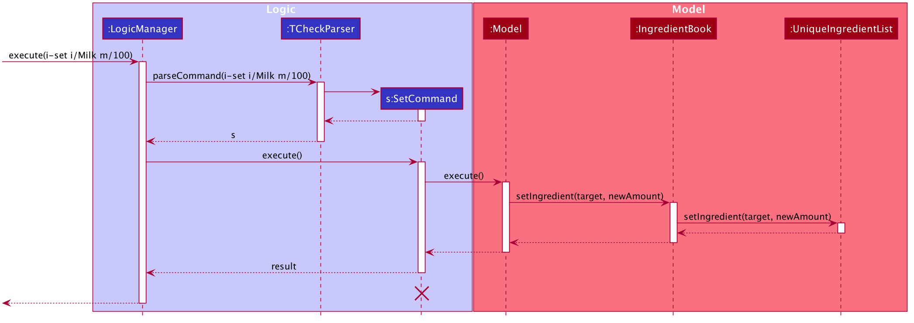
Figure Set Ingredients' levels - 2.

The following activity diagram summarizes what happens when a user executes a new command which is one of the three commands for setting ingredients' levels
Please note that only the command words of the respective commands are shown to represent the commands in this diagram:

Figure Set Ingredients' levels - 3.

#### Design consideration:

##### Aspect: How set ingredients' levels executes

* **Alternative 1 (current choice):** Differentiates into three commands to be able to set one single ingredient's amount, set all ingredients' amounts to default levels and set all ingredients' amounts to different levels.
  * Pros: Different commands can suit the needs of the user at different times. In the first few times of usage, the user is still not very familiar with the application and thus may only use `i-set-default` together with `i-set i/INGREDIENT m/AMOUNT` to make adjustments.
  When the user becomes an expert user, he/she can utilize the `i-set-all` command to complete the task of setting ingredients' levels with greater efficiency.
  * Cons: More implementation and testing work required to ensure all commands are working as expected.

* **Alternative 2:** Has only one command :  `i-set i/INGREDIENT_NAME m/AMOUNT`.

  * Pros: Easier to implement and test and thus less error-prone. Theoretically speaking, this one command can achieve the same effect as `i-set-default` and `i-set-all`  by entering it multiple times.
  * Cons: Does not really suit the user's needs because it can be tedious to set each ingredient individually.

## \[Completed\] Reset all ingredients' levels feature

tCheck allows the user to reset the ingredient's levels of all ingredient types to zero. It helps the user to
remove some data that are no longer needed. The command is:
  
* `i-reset-all` - Resets the ingredients' levels of all ingredient types to zero.
  
#### Implementation
  
The completed reset all ingredients' levels mechanism is facilitated by `IngredientBook`. It implements 
`ReadOnlyIngredientBook` interface, which will allow the ingredients to be displayed graphically in the user interface.
Particularly, it implements the following operations:
  
  * `IngredientBook#setIngredient(Ingredient target, Ingredient newAmount)` — Replaces the `target` ingredient 
  by the ingredient `newAmount`.
  * `IngredientBook#getIngredientList()` - Returns the list of ingredients recorded by the `IngredientBook`.
  
These operations are exposed in the `Model` interface as `Model#setIngredient(Ingredient target, Ingredient newAmount)`
and `Model#getFilteredIngredientList()` respectively.

Given below is an example usage scenario that shows how the reset all ingredients' levels mechanism behaves at each step.
  
Step 1. The user, a store manager of the imaginary bubble tea brand, T-Sugar, launches tCheck for the very first time. 
The `IngredientBook` will be initialized with a `UniqueIngredientList` containing the six pre-defined ingredients, 
namely `Milk`, `Pearl`, `Boba`, `Black Tea` , `Green Tea` and `Brown Sugar`, with an amount of 0 for all ingredients.
  
Step 2. The user executes `i-reset-all` to reset all ingredients' levels to zero. The `i-reset-all` command calls
`Model#getFilteredIngredientList()`, which returns the list of ingredients recorded by `IngredientBook`. 
The `i-reset-all` command checks the list of ingredients to see whether all ingredients' levels are already at zero. 
Since all ingredients' levels are at zero as the user is using tCheck for the first time and the `IngredientBook`
is just initialized in step 1, the user will be informed through a message that states all ingredients' levels are 
already at zero before the command is entered.

Step 3. The user executes `i-set-default` to set the amounts of all ingredients to the default levels of the store, 
which are 50 L for liquids and 20 KG for solids.  The `i-set-default` command calls 
`Model#setIngredientBook(ReadOnlyIngredientBook ingredientBook)`, causing the initial `IngredientBook` to be replaced 
by the `ingredientBook` with the amounts of ingredients equal to the ingredients' default levels.

Step 4. The user now decides that he or she wants to reset all ingredients' levels to zero again, since actually the 
ingredients' levels are at zero rather than at default levels, and it was a mistake to set the amounts of all 
ingredients to their default levels. Thus, the user executes `i-reset-all` to reset all ingredients' levels to zero.
The `i-reset-all` command calls `Model#getFilteredIngredientList()`, which returns the list of ingredients recorded 
by the `IngredientBook`. The `i-reset-all` command checks the list of ingredients to see whether all ingredients' levels 
are already at zero. Since all ingredients' levels are not at zero as they are set to default levels, the `i-reset-all` 
command calls `Model#setIngredient(Ingredient target, Ingredient newAmount)` each time the command finds an ingredient 
with a non-zero ingredient's level, causing the ingredient, `target`, to be replaced by the ingredient `newAmount` with 
the same ingredient name and a zero ingredient's level. In this case, 
`Model#setIngredient(Ingredient target, Ingredient newAmount)` is called six times since all six ingredients have
non-zero ingredient's levels.
  
The following sequence diagram shows how the reset all ingredients' levels operation works, assuming that the 
`i-reset-all` command calls `Model#setIngredient(Ingredient target, Ingredient newAmount)` only once. This happens when 
only one ingredient's level is not at zero before `i-reset-all` is executed.
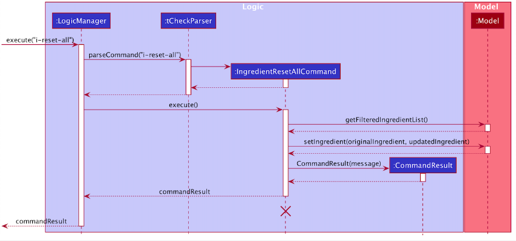

:information_source: **Notes:** The lifeline for `IngredientResetAllCommand` should 
end at the destroy marker (X) but due to a limitation of PlantUML, the lifeline reaches the end of diagram.

The following activity diagram summarises what happens when a user executes the reset all ingredients' levels command.

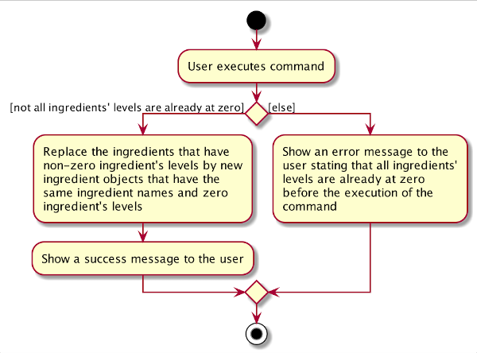

#### Design consideration:

##### Aspect: How reset the ingredients' levels executes
  
  * **Alternative 1 (current choice):** Loop through the ingredient list twice, the first time to check if all 
  ingredients' levels are at zero, the second time to replace the original ingredient that has a non-zero ingredient's 
  level with a new ingredient which have the same ingredient name and a zero ingredient's level.
    * Pros: Easier to implement.
    * Cons: Execution of the command may require one to create one or more new ingredients, which may increase the time 
    required for the operation.
    
  * **Alternative 2:** Loop through the ingredient list twice, the first time to check if all ingredients' levels are 
  already at zero, the second time to update the ingredient's level to zero without creating new ingredients.
    * Pros: Clear implementation. Do not lead to creation of new ingredient objects.
    * Cons: Editing the ingredient's levels of the ingredients may be more error-prone.

### \[Completed\] Archive person's contact information feature

When employees are no longer working in the store, their contact information would usually be deleted, or kept in
the archive. tCheck simulates this archive, storing these contact information in the app so that the user can still
retrieve them back when needed. For example, when an employee is rehired by the manager, the manager(user) can move
this specific employee's contact information back to the currently active contact information list from the
archived record.

The completed archive person's contact information feature consists of four commands with slightly different
formats, which complement one another, to provide a set of useful commands for enhanced user experiences. The four
commands are :

* `c-archive INDEX` — Archives the person identified by the index number used in the displayed person list.
* `c-unarchive INDEX` — Unarchives the person identified by the index number used in the displayed person list.
* `c-archive-all` — Archives all persons in the displayed person list.
* `c-archive-list` — Shows a list of all archived persons' contact details.

#### Completed Implementation

The archiving of persons is facilitated by the `ArchiveStatus` attribute of a person. The following methods in the
 `Person` class and the `Model` interface facilitate this feature:

* `Person#archive()` — A method that sets the person's `ArchiveStatus` to `true`. It's equivalent to archive the person.
* `Person#unarchive()` — A method that sets the person's `ArchiveStatus` to `false`. It's equivalent to unarchive the
 person.
* `Model#PREDICATE_SHOW_ALL_ACTIVE_PERSONS` — A `Predicate` function that filters our archived persons from a given
 `PersonList`.
* `Model#PREDICATE_SHOW_ALL_ARCHIVED_PERSONS` — A `Predicate` function that filters our active(not archived
	) persons from a given `PersonList`.

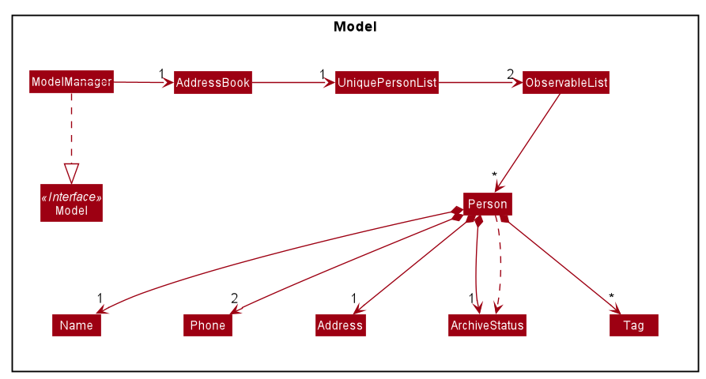

*Figure Archive-1. Overview class diagram representation of the person archiving/unarchiving implementation*

Given below shows how the `c-archive`, `c-unarchive`, and `c-archive-all` mechanism works in steps based on different scenarios. Two activity diagrams are provided before each detailed explanation to describe how tCheck handles an archiving/unarchiving commands. Three sequence diagrams are attached after the description

##### 1. Archiving a person

*Figure Archive-2. Activity diagram representation of the general flow of archiving of a peron in tCheck*

User can archive a specific person by entering the `c-archive INDEX` command. The following steps describe how this behavior is implemented:

Step 1: The user archives a `Person` in the current observable `PersonList` with command `c-archive 1`. `ArchiveCommand` is created with the parsed arguments, and executed.

Step 2: The `Person` will then be checked if the `ArchiveStatus` is `true`. An error message will be displayed if the user tries to archive a person from the archived person list.

Step 3: The `Person` will have a new `ArchivedStatus` value, which will be set to `true` by using the `Person#archive()` method.

Step 4: The current `FilteredList` will be updated to only show active `Persons`, facilitated by the predicate `Model#PREDICATE_SHOW_ALL_ACTIVE_PERSONS`

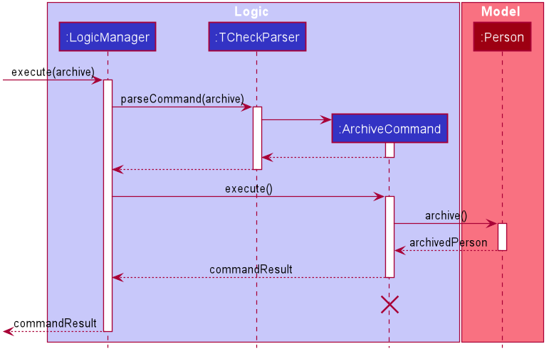

*Figure Archive-3. Sequence diagram representation of archiving a person*

##### 2. Unarchiving a person

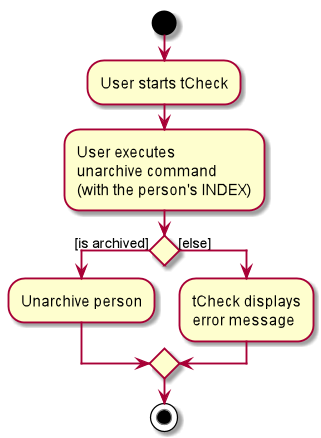

*Figure Archive-4. Activity diagram representation of the general flow of unarchiving of a peron in tCheck*

User can unarchive an already-archived person's contact information by entering the `c-unarchive INDEX` command. The following steps describe how this behavior is implemented:

Step 1: The user unarchives a `Person` in the current observable `PersonList` with command `c-unarchive 1`. `UnarchiveCommand` is created with the parsed arguments, and executed.

Step 2: The `Person` will then be checked if the `ArchiveStatus` is `false`. An error message will be displayed if the user tries to unarchive a person from the active person list.

Step 3: The `Person` will have a new `ArchivedStatus` value, which will be set to `false` by using the `Person#unarchive()` method.

Step 4: The current `FilteredList` will be updated to only show active `Persons`, facilitated by the predicate `Model#PREDICATE_SHOW_ALL_ACTIVE_PERSONS`

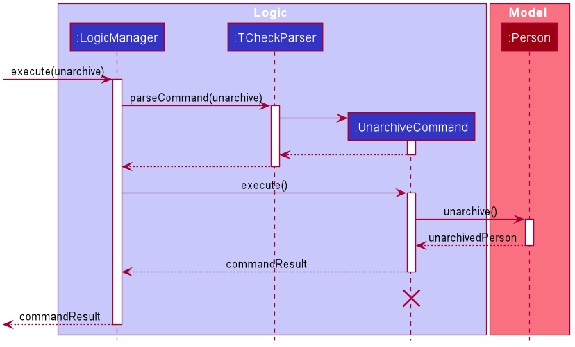

*Figure Archive-5. Sequence diagram representation of unarchiving a person*

##### 3. Archiving all persons
User can archive all persons' contact information by entering the `c-archive-all` command. The following steps describe how this behavior is implemented:

Step 1: The user archives all `Person`s in the current observable `PersonList` with command `c-archive-all`. `ArchiveAllCommand` is created with the parsed arguments, and executed.

Step 2: For each `Person` in the observable 'PersonList', `ArchiveAllCommand` will create a `Person` object, and then set this `Person`'s `ArchiveStatus` to `true` by using the `Person#archive()` method.

Step 3: The current `FilteredList` will be updated to only show the empty active `Persons`, facilitated by the predicate `Model#PREDICATE_SHOW_ALL_ACTIVE_PERSONS`

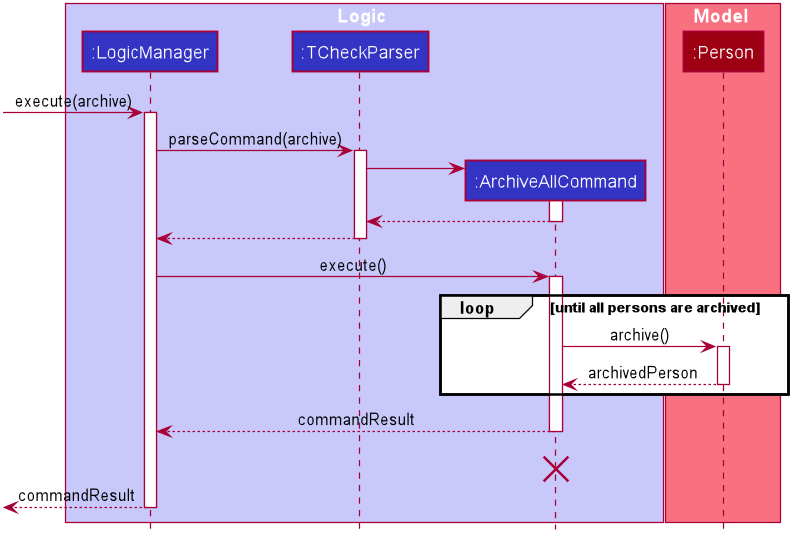

*Figure Archive-6. Sequence diagram representation of archiving all persons*

#### Design consideration:

##### Aspect: The implementation to store archived persons

* **Alternative 1 (current choice):** `Person` contains an `ArchiveStatus` field.

    * Pros: Easy to implement
    * Cons: If the `PersonList` contains a huge number of `Person`s, the processing speech will be slow for certain
      command (eg: c-archive-list), because it needs to go into each `Person` to check if the `ArchiveStatus` is `true`.

* **Alternative 2:** Storing archived persons in a separate json file.

  * Pros:  Execute `c-archive-list` very fast, even for huge amount of data, because it can just display all the data
   inside this file.
  * Cons: Hard to implement and maintain.

Alternative 1 was chosen, because for a bubble tea shop, normally the total number of employees will be less than 100.
And the software doesn't need to handle huge amount of data. On the other hand, if alternative 2 were
used, `Logic` and `Model` have to deal another set of data. Consequently, application's overall complexity will be
increased.

### \[Completed\] Edit employees's contact information feature

Compared with the original implementation, this feature adds emergency contact information of the employee. It can help
the user to contact some staff when emergency situation happens. The command is:

- `edit INDEX [n/NAME] [p/PHONE] [e/EMERGENCY_CONTACT] [t/TAG] …​​`

#### Completed Implementation

The completed edit employee's contact information is facilitated by `AddressBook`. It implements `ReadOnlyAddressBook`
interface and offers method to edit the application's `AddressBook`. Particularly, it changes Person's constructor and
function declarations to add emergency there.

Given below is an example usage scenario and how the edit mechanism behaves at each step.

Step 1: The user launches the application for the first time. Because now there isn't any information in addressbook.
The user can't edit now.

Step 2: The user executes `add n/Betsy Crowe e/81234567 p/1234567 t/morning shift t/part-time`. The `add` command calls
`Model#addPerson()` to add Besty's information in the `AddressBook`. The updated `AddressBook` is stored in
`addressbook.json`.

Step 3: The user executes `edit 1 n/Besty Crowe e/54749110 p/1234567 t/morning shift t/part-time` to change Besty Crowe's
phone number. This`edit` command calls `Model#setPerson()` to replace the original Besty Crowe's information in the
`Addressbook`, causing the updated `Addressbook` to be stored in `addressbook.json`, overwriting the former one.

#### Design Consideration

##### Aspect: How to display the emergency contact

* **Alternative 1 (current choice):** Displays the emergency contact of the similar format
with phone number, using a prefix to identify them.
  * Pros: Easy to implement.
  * Cons: May seem a little redundancy.
* **Alternative 2:** Use different icons to represent phone and emergency contact
  * Pros: Will be easy to tell from.
  * Cons: Need more work.

--------------------------------------------------------------------------------------------------------------------

## **Documentation, logging, testing, configuration, dev-ops**

* [Documentation guide](Documentation.md)
* [Testing guide](Testing.md)
* [Logging guide](Logging.md)
* [Configuration guide](Configuration.md)
* [DevOps guide](DevOps.md)

--------------------------------------------------------------------------------------------------------------------

## **Appendix: Requirements**

### Product scope

**Target user profile**:

* is the store manager of a milk tea shop of the (imaginary) brand T-sugar
* is very busy with daily operations and has little time for manual writing or recording
* is a fast typist
* has many part-time and full-time employees to manage
* needs to save all the employees’ contact numbers
* cares about the daily sales
* does an inventory check daily to ensure that ingredients are sufficient
  for the shop to operate smoothly
* needs to keep track of the daily sales
* prefers desktop apps over other types
* prefers typing to mouse interactions
* is reasonably comfortable using CLI apps

**Value proposition**:
The product provides an integrated system for the purpose of sales tracking, ingredient track and manpower management.

* To digitalise sales tracking and provide simple sales data analytics
    * Current Implementation at v1.4:
        * The product can keep a record of the number of each type of bubble tea sold.
        * The sales data can be analysed to give the user an insight of how the store is performing. This would allow 
          the user to see which kind of bubble tea sells better and consider adopting similar ideas when creating 
          new drinks.
            * This is currently done through the sorting function when listing sales.
    * Proposed added value for future implementations:
        * Given the number of each type of bubble tea sold, the product can provide the user with the revenue for each day.
        * The product can also help the user track the daily revenue changes, and the revenue for each
          type of bubble tea. This can also be analysed to give a better insight of the store's performance. 
        * The product integrates sales tracking and ingredient inventory tracking to provide the user with greater
          time saving. Given the number of each type of bubble tea sold, the user need not manually update the
          ingredient inventory as frequently, as the product can perform calculations to update them for the user.
* To digitalise ingredient inventory keeping
    * Current Implementation at v1.4:
        * The product can keep a record of the amount of ingredient remaining.
        * The product can remind the user when he needs to restock soon.
    * Proposed added value for future implementations:
        * The product will help to digitise inventory keeping, and thus help to save the user’s time and prevent 
          human error in calculation. It does not ensure that the employees use the same amount of ingredients in making 
          the drinks. The user only needs to enter the number of each type of bubble tea sold on the day. 
        * The product could also help the user calculate the total cost for restocking.
* To assist in manpower management
    * Current implementation at v1.4:
        * The product will provide a platform to allow the user to manage employees’ contact 
          information (e.g. contact number, emergency contact, address etc).
        * The product allows the user to find available manpower for specific days.

### User stories

Priorities: 1 (must have), 2 (nice to have), 3 (unlikely to have)

| As a/an                           | I can/I want to (features that are going to be implemented)                                                                  | So that (benefit gained)                                                                                 | Priority |
| --------------------------------- | ---------------------------------------------------------------------------------------------------------------------------- | -------------------------------------------------------------------------------------------------------- | ------------------------------------------------------------- |
| Store manager                     | have a centralised system that helps me keep track of my employees’ contact numbers                                          | I don't need to organize working contacts on my personal phone                                           | 1                                                             |
| Store manager                     | have a software that helps me on daily inventory checking                                                                    | I can reduce the amount of human errors that may be involved and track the shop's inventory conveniently | 1                                                             |
| Busy store manager                | receive reminders to restock                                                                                                 | I won't lose revenue because of unexpected ingredient shortage during operation                          | 1                                                             |
| First-time user                   | be able to download the app                                                                                                  | I can play around and check out what it can do before actual usage                                       | 1                                                             |
| First-time user                   | use the help feature                                                                                                         | I can get more familiar with the app features                                                            | 1                                                             |
| First-time user                   | find out if the app is running smoothly and bug-free                                                                         | I can decide if using this app will indeed help me run a store                                           | 1                                                             |
| Concerned manager                 | check the employees's contact number if they are absent without stating any reasons                                          | I can easily contact them in a short time                                                                | 1                                                             |
| Second-time user                  | initialize the ingredients level in the app                                                                                  | I need not remember the amount of inventories, and only need to update when I do a restock               | 1                                                             |
| Second-time user                  | find the emergency contacts of my employees quickly if they are injured                                                      | I can find the person to contact and know what action to take in the shortest time possible              | 1                                                             |
| Intermediate user                 | input the number of each type of drinks sold into tCheck at the end of the day, and know the amount of remaining ingredients | I can document the amount of ingredients left                                                            | 1                                                             |
| Expert user                       | to delete some of the employees' data who are no longer working at the shop                                                  | they are no longer tracked by the app.                                                                   | 1                                                             |
| Second-time user                  | view the revenue from the last day                                                                                           | I can predict how much demand it would likely to be for today                                            | 1                                                             |
| Store manager                     | have a software to help me calculate my daily revenue                                                                        | I don't need to manually calculate them and it will become less troublesome to do so                     | 2                                                             |
| Busy and concenrned store manager | have a software to remind me on check my employees' health condition for each shift                                          | I won't forget to check, espcially when I'm busy                                                         | 2                                                             |
| First-time user                   | read the "About" page in the app                                                                                             | I know how to use this software to help my business                                                      | 2                                                             |
| First-time user                   | register for a password-protected account                                                                                    | I can be sure that my user data will not be viewed by non-users                                          | 2                                                             |
| First-time user                   | be able to navigate the app easily                                                                                           | I only need basic intuition to use the navigation bar (For GUI)                                          | 2                                                             |
| Impatient first-time user         | have a fast-response inventory keeping application                                                                           | I don't waste time waiting for the app to load                                                           | 2                                                             |
| Second-time user                  | only use the software and access my data if I enter the correct login information                                            | it prevents unauthorised users from viewing the shop's information                                       | 2                                                             |
| Second-time user                  | be reminded of the task of checking the employee's health condition                                                          | I would not forget to check the employees' health status each day before the shop opens                  | 2                                                             |
| Concerned manager                 | check and record the health conditions of my employees                                                                       | I can do my best to ensure the safety of food is guanranteed                                             | 2                                                             |
| Second-time user                  | view the inventory from the last day                                                                                         | I can restock before the ingredients ran out of stock and affect my business                             | 2                                                             |
| Intermediate user                 | input the number of each type of drinks sold into tCheck at the end of the day,and find out the total revenue of the day     | I can document the daily revenue                                                                         | 2                                                             |
| Intermediate user                 | do closing duties according to a check list shown on the app                                                                 | I will not forget important things                                                                       | 2                                                             |
| Intermediate user                 | use the ingredient data                                                                                                      | I can prepare for next day's ingredients                                                                 | 2                                                             |
| Busy store manager                | use shortcut commands                                                                                                        | it makes my input process into tCheck faster and more convenient.                                        | 2                                                             |
| Expert user                       | my data to be saved reliably                                                                                                 | my data won't be lost even if my computer crashes                                                        | 2                                                             |
| Expert user                       | have fast responses after a long usage period                                                                                | I will not waste time waiting for the app even after extensive usage                                     | 2                                                             |
| Expert user                       | export my data from the application                                                                                          | the performace of the store can be analyzed easily by using other third-party softwares                  | 2                                                             |
| Intermediate user                 | to look through my employees' health condition data of the last 10 days                                                      | I can roughly gauge the conditions of my employees                                                       | 3                                                             |                                              |

*{More to be added}*

### Use cases

(For all use cases below, the **System** is the `tCheck` and the **Actor** is the `user`, unless specified otherwise)

**Use Case: UC01 - Archive a contact detail of an employee**

**MSS**

1. User chooses to archive one employee’s contact details.
2. tCheck requests for details of the employee to archive.
3. User enters the archive details.
4. tCheck will move this corresponding contact detail into the archive and displays a success message.

     Use case ends.

**Extensions**

* 3a. tCheck detects an incorrect input format or is unable to find the entered data.

        * 3a1. tCheck requests for the correct data.

    	* 3a2. User enters new data.

    	Steps 3a1-3a2 are repeated until the data entered are correct.

    	Use case resumes from step 4.

**Use Case: UC02 - Archive all contact details**

**MSS**

1. User chooses to archive all employee’s contact details.
2. User enters the request to archive all employees’ contact details.
3. tCheck will move all contact details into the archive and displays a success message.

     Use case ends.

**Extensions**

* 2a. tCheck detects an incorrect input format.

        * 2a1. tCheck requests for the input to be in the correct format.

      	* 2a2. User enters new data.

      	Steps 2a1-2a2 are repeated until the data entered are correct.

      	Use case resumes from step 3.

* 2b. tCheck detects an empty contact list.

   	    * 2b1. tCheck shows a warning message.

   	    Use case ends.

**UC03 - Set ingredient level for a single ingredient**

**MSS**

1. User chooses to set the ingredient level for an ingredient.
2. User enters the name of the ingredient and the amount he/she wants to set to.
3. tCheck will set the ingredient level of this ingredient and display a success message.

        Use case ends.

**Extensions**

* 2a. tCheck is unable to find the entered ingredient name.

  * 2a1. tCheck displays an error message informing the user that the ingredient name entered is not found in the pre-defined ingredient book.

  Use case ends.

* 2b. tCheck detects an invalid amount value entered.

  * 2b1. tCheck displays an error message informing the user that the amount entered is invalid with corresponding reasons (e.g. negative number, contains decimal part etc).

  Use case ends.

* 2c. tCheck detects missing field(s) in the command entered.

  * 2c1. tCheck displays an error message informing the user that there are missing field(s) which caused the command to fail and shows an example of a correct command.

  Use case ends.

**UC04 - Set the sales volume for all types of drinks**

**MSS**

1. User chooses to set the sales volume for a type of drink.
2. tCheck requests for the drink name.
3. User enters the name of the drink.
4. tCheck requests for the number of that type of drink sold.
5. User enters the number of that type of drink sold.
6. tCheck sets the sales for this drink to the given number and displays a success message.
   Steps 1-6 are repeated until the sales of all types of drinks have been updated.

**Extensions**

* 3a. tCheck is unable to find the entered name.

    * 3a1. tCheck requests for the correct data.
    * 3a2. User enters new data. 
  	
  	Steps 3a1-3a2 are repeated until the data entered are correct.
    
    Use case resumes from step 4.
      	
* 5a. tCheck detects an invalid sales number.

 	* 5a1. tCheck requests for the correct data.
 	* 5a2. User enters new data.
 	
 	Steps 5a1-5a2 are repeated until the data entered are correct.
    
    Use case resumes from step 6.

### Non-Functional Requirements

1.  Should work on any _mainstream OS_ as long as it has Java `11` or above installed.
2.  Should be able to hold up to 1000 persons without a noticeable sluggishness in performance for typical usage.
3.  Should be able to respond within 1 second for each operation.
4.  Should be able to function fully without connecting to internet.
5.  Should be for a single user.
6.  Should not handle the printing of the report (i.e. sales report).
7.  A user with above average typing speed for regular English text (i.e. not code, not system admin commands) should
 be able to accomplish most of the tasks faster using commands than using the mouse.
8.  A user without prior experience on inventory management system should be able to accomplish most of the tasks
 using commands.

*{More to be added}*

### Glossary

* **Mainstream OS**: Windows, Linux, Unix, OS-X
* **Private contact detail**: A contact detail that is not meant to be shared with others

--------------------------------------------------------------------------------------------------------------------

## **Appendix: Instructions for manual testing**

Given below are instructions to test the app manually.

:information_source: **Note:** These instructions only provide a starting point for testers to work on;
testers are expected to do more *exploratory* testing.

### Launch and shutdown

1. Initial launch

   1. Download the jar file and copy into an empty folder

   1. Double-click the jar file Expected: Shows the GUI with a set of sample contacts. The window size may not be optimum.

1. Saving window preferences

   1. Resize the window to an optimum size. Move the window to a different location. Close the window.

   1. Re-launch the app by double-clicking the jar file. 
       Expected: The most recent window size and location is retained.

1. _{ more test cases …​ }_

### Deleting a person

1. Deleting a person while all persons are being shown

   1. Prerequisites: List all persons using the `list` command. Multiple persons in the list.

   1. Test case: `delete 1` 
      Expected: First contact is deleted from the list. Details of the deleted contact shown in the status message. Timestamp in the status bar is updated.

   1. Test case: `delete 0` 
      Expected: No person is deleted. Error details shown in the status message. Status bar remains the same.

   1. Other incorrect delete commands to try: `delete`, `delete x`, `...` (where x is larger than the list size) 
      Expected: Similar to previous.

1. _{ more test cases …​ }_

### Updating sales of drinks

1. Update the sales of one and several drink item while all sales are being shown.

    1. Prerequisites: List all sales using the `s-list` command. The full list of drinks sales will be shown.
    
    1. Test case: `s-update BSBM/123`  
       Expected: The sales number for `BSBM` changes to 123. There is no order in this updated list of drink sales.
       
    1. Test case: `s-update BSBM/321 BSBBT/40 BSPM/988`  
       Expected: The sales number for `BSBM`, `BSBBT` and `BSPM` changes to 321, 40, and 988 respectively. There is no 
       order in this updated list of drink sales.
       
    1. Test case: `s-update BSBM/999999999999999`  
       Expected: No sales update is performed. An error message is shown in the Result Display. User is able to edit the
       input.
       
    1. Other incorrect `s-update` commands to try: `s-update`, `s-update AAAA/32`  
       Expected: Similar to previous.
       
### Listing sales of drinks in descending order

1. List the sales of a drink item after an update is performed.

    1. Prerequisite: Perform a sales update using the `s-update` command. The updated list of drink sales is not
     ordered.
     
    1. Test case: `s-list`  
       Expected: The list of drinks sales is now ordered from most to least number of sales.
       
### Resetting all ingredients' levels to zero

1. Resetting all ingredients' levels to zero when not all ingredients' levels are at zero

   1. Test case: `i-reset-all` 
      Expected: All ingredients' levels are at zero. A success message is shown in the _Result Display_.

1. Resetting all ingredients' levels to zero when all ingredients' levels are already at zero 

   1. Test case: `i-reset-all` 
      Expected: All ingredients'levels are still at zero. A message is shown in the _Result Display_ explaining that 
      all ingredients' levels are already at zero, before resetting all ingredients' levels to zero.

### Setting an ingredient's level to a specified amount

1. Setting an ingredient which is pre-defined in the ingredient book

   1. Prerequisites: The ingredient must be found from the displayed Ingredient Tracker section of the GUI. i.e. The ingredient is pre-defined in the ingredient book.

   1. Test case: `i-set i/Milk m/99` 
      Expected: (Given that the original amount for Milk is not 99 L) The amount for Milk is set to 99 L. Details of the new amount are shown in the success message in _Result Display_.

   1. Test case: `i-set i/milk m/99` 
      Expected: The amount of Milk is unchanged. Error message of ingredient not found is shown in _Result Display_.

   1. Test case: `i-set i/Milk m/-99` 
      Expected: The amount of Milk is unchanged. Error message of invalid amount is shown in _Result Display_.

   1. Other incorrect set commands to try: `i-set i/Milk m/1.2`, `i-set i/Milk m/1000`, `i-set i/Milk` 
      Expected: The amount of milk is unchanged. Corresponding error messages are shown in _Result Display_.

### Saving data

1. Dealing with missing/corrupted data files

   1. _{explain how to simulate a missing/corrupted file, and the expected behavior}_

1. _{ more test cases …​ }_
