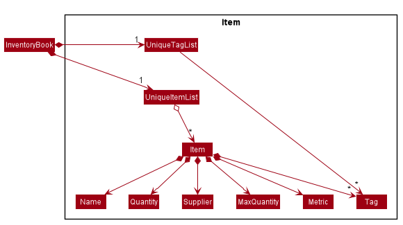
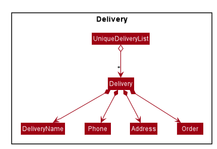
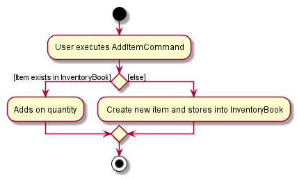
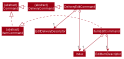
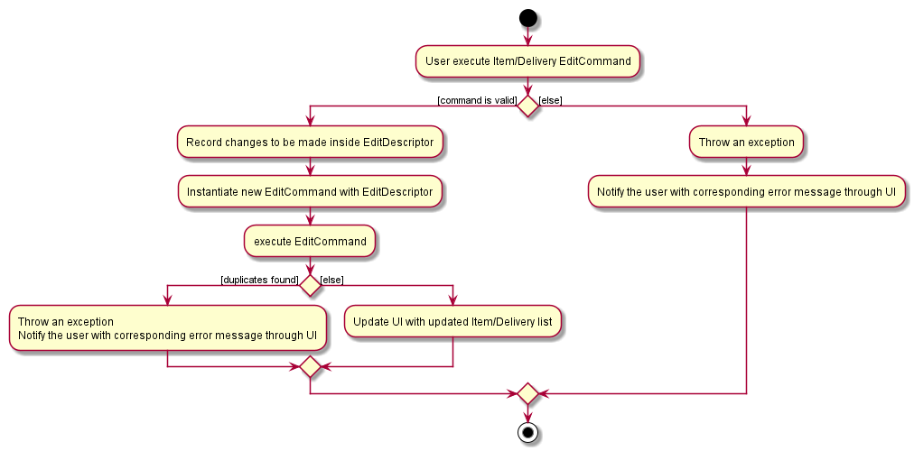
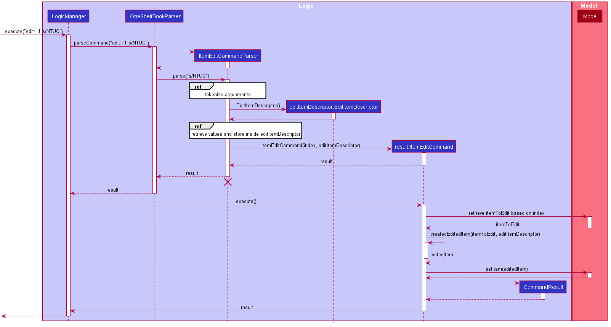
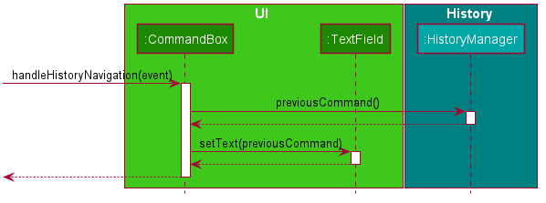
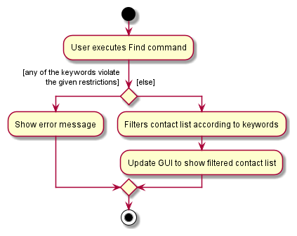
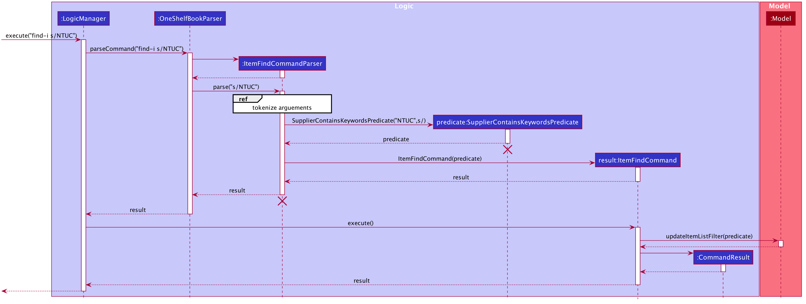
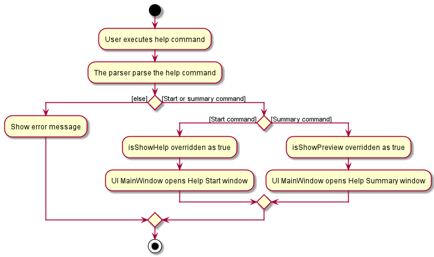

* Table of Contents
{:toc}

--------------------------------------------------------------------------------------------------------------------
## **Introduction**
Welcome to OneShelf. This developer guide aims to introduce potential developers to the structure and implementation of
OneShelf, so that you can contribute too! <br>

This guide uses a top-down approach design which covers from higher-level design to lower-level design, and
discusses the implementation of key features as well as the rationale behind certain design decisions with
possible alternatives in code design. Next, there are also links to guides for the tools used in Documentation, Logging,
Testing, Configuration and DevOps. Lastly, appendices are provided to specify the product scope, requirements, glossary and
instructions for manual testing.

--------------------------------------------------------------------------------------------------------------------

## **Setting up, getting started**

Refer to the guide [_Setting up and getting started_](SettingUp.md).

--------------------------------------------------------------------------------------------------------------------

## **Design**
This section shows the design of **OneShelf**.

### Architecture


Figure 1. Architecture Diagram

The ***Architecture Diagram*** given above explains the high-level design of the App. Given below is a quick overview of each component.

<div markdown="span" class="alert alert-primary">

:bulb: **Tip:** The `.puml` files used to create diagrams in this document can be found in the [diagrams](https://github.com/AY2021S1-CS2103T-T12-1/tp/tree/master/docs/diagrams) folder. Refer to the [_PlantUML Tutorial_ at se-edu/guides](https://se-education.org/guides/tutorials/plantUml.html) to learn how to create and edit diagrams.

</div>

**`Main`** has two classes called [`Main`](https://github.com/AY2021S1-CS2103T-T12-1/tp/blob/master/src/main/java/seedu/address/Main.java) and [`MainApp`](https://github.com/AY2021S1-CS2103T-T12-1/tp/blob/master/src/main/java/seedu/address/MainApp.java). It is responsible for,
* At app launch: Initializes the components in the correct sequence, and connects them up with each other.
* At shut down: Shuts down the components and invokes cleanup methods where necessary.

[**`Commons`**](#common-classes) represents a collection of classes used by multiple other components.

The rest of the App consists of four components.

* [**`UI`**](#ui-component): The UI of the App.
* [**`Logic`**](#logic-component): The command executor.
* [**`Model`**](#model-component): Holds the data of the App in memory.
* [**`Storage`**](#storage-component): Reads data from, and writes data to, the hard disk in a `json` file.
* [**`History`**](#command-history-traversal): Records user's command history and allows for traversal.

Each of the four components,

* defines its *API* in an `interface` with the same name as the Component.
* exposes its functionality using a concrete `{Component Name}Manager` class (which implements the corresponding API `interface` mentioned in the previous point.

For example, the `Logic` component (see the class diagram given below) defines its API in the `Logic.java` interface and exposes its functionality using the `LogicManager.java` class which implements the `Logic` interface.
<br>
 <br>
Figure 2. Class Diagram of Logic Component

**How the architecture components interact with each other**

The *Sequence Diagram* below shows how the components interact with each other for the scenario where the user issues the command `delete-i 1`.
<br>

<br>
Figure 3. Sequence Diagram of delete-i 1 command

The sections below give more details of each component.

### UI component

The UI consists of a `MainWindow` that is made up of parts e.g.`CommandBox`, `ResultDisplay`, `ItemListPanel`, `DeliveryListPanel`, `StatusBarFooter` etc. All these, including the `MainWindow`, inherit from the abstract `UiPart` class.

The `UI` component uses JavaFx UI framework. The layout of these UI parts are defined in matching `.fxml` files that are in the `src/main/resources/view` folder. For example, the layout of the [`MainWindow`](https://github.com/AY2021S1-CS2103T-T12-1/tp/blob/master/src/main/java/seedu/address/ui/MainWindow.java) is specified in [`MainWindow.fxml`](https://github.com/AY2021S1-CS2103T-T12-1/tp/blob/master/src/main/resources/view/MainWindow.fxml)

The `UI` component,

* Executes user commands using the `Logic` component.
* Listens for changes to `Model` data so that the UI can be updated with the modified data.

The following diagram illustrates the structure of the `UI` component:
<br>
 <br>
Figure 4: Structure of the `UI` Component

**API** :
[`Ui.java`](https://github.com/AY2021S1-CS2103T-T12-1/tp/blob/master/src/main/java/seedu/address/ui/Ui.java)


### Logic component
The logic component is responsible for all the necessary parsing logic of command, displaying command result
by instructing `Ui`, and modifies `Model` and/or `Storage` component depending on the command by user.

The following class diagram illustrated the structure of `Logic` component:
<br>  <br>
Figure 5: Structure of the `Logic` Component

**API** :
[`Logic.java`](https://github.com/AY2021S1-CS2103T-T12-1/tp/blob/master/src/main/java/seedu/address/logic/Logic.java)

The `Logic` component does the following:
1. `Logic` uses the `Parser` API to parse the user command.
2. This results in a `Command` object which is executed by the `LogicManager`.
3. The command execution can affect the `Model` (e.g. adding an item).
4. The result of the command execution is encapsulated as a `CommandResult` object which is passed back to the `Ui`.
5. In addition, the `CommandResult` object can also instruct the `Ui` to perform certain actions, such as displaying help to the user.

Given below is the Sequence Diagram for interactions within the `Logic` component for the `execute("delete-i 1")` API call.
<br>

<br>
Figure 6: Sequence Diagram of `delete-i 1`

<div markdown="span" class="alert alert-info">:information_source: **Note:** The lifeline for `ItemDeleteCommandParser` should end at the destroy marker (X) but due to a limitation of PlantUML, the lifeline reaches the end of diagram.
</div>

### Model component
The Model component corresponds to all the data-related logic that the user works with.

The following class diagram illustrates the structure of the `Model` component:
<br>
 <br>
Figure 7: Structure of the `Model` Component

**API** : [`Model.java`](https://github.com/AY2021S1-CS2103T-T12-1/tp/blob/master/src/main/java/seedu/address/model/Model.java)

`Models`,

* stores a map of Models(eg. InventoryModel and DeliveryModel)
* Each model stores the current state of the Book(eg. InventoryModel stores the current state of the InventoryBook)
* used for undo/redo feature

`Model`

* stores a `UserPref` object that represents the users preference

`InventoryModelManager`

* stores a comparator used to sort the filtered list
* stores the inventory book data
* stores a list of InventoryBook for redo/undo command
* exposes an unmodifiable `ObservableList<Item>` that can be 'observed' e.g. the UI can be bound to this list so that the UI automatically updates when the data in the list change.

`DeliveryModelManager`

* stores the delivery book data
* stores a list of DeliveryBook for redo/undo command
* exposes an unmodifiable `ObservableList<Delivery>` that can be 'observed' e.g. the UI can be bound to this list so that the UI automatically updates when the data in the list change.

We organised the different data classes into packages (eg.Items) which we will list out the collection of class of that data object

An `Item` consists of `Name`, `Quantity`, `Supplier`, `MaxQuantity`, `Metric` and `Tag`. Once an `item` is deleted,
its corresponding objects within its composition will also get deleted. An `Item` must have 1 `Name` and `Quantity`,
0 or 1 `Supplier`, `MaxQuantity`, `Metric` and 0 or more `Tag` objects.

You may also refer to Figure 8 as shown below:
<br>  <br>
Figure 8: Structure of the `Item`


A `Delivery` consists of one `DeliveryName`, `Phone`, `Address`, `Order`.

You may also refer to Figure 9 as shown below:
<br>  <br>
Figure 9: Structure of the `Delivery`

### Storage component
Storage component is responsible to save the data of inventory and delivery book into the hard disk.

The following diagram illustrated the structure of `Storage` component:
<br>  <br>
Figure 10: Class Diagram of `Storage` Component

**API** : [`Storage.java`](https://github.com/AY2021S1-CS2103T-T12-1/tp/blob/master/src/main/java/seedu/address/storage/Storage.java)

The `Storage` component,
* can save `UserPref` objects in json format and read it back.
* can save the inventoryBook/deliveryBook data in json format and read it back.

### Common classes

Classes used by multiple components are in the `seedu.address.commons` package.

--------------------------------------------------------------------------------------------------------------------

## **Implementation**

This section describes some noteworthy details on how certain features are implemented.

### Adding Items and Delivery
OneShelf is capable of adding items and deliveries.
Adding Items and Delivery both are done similarly which will be illustrated with an AddItemActivityDiagram below.

 <br>
Figure 11: AddItemActivityDiagram

Apart from adding a new Item, should there be an existing item in the Inventory Book, `Add` will be able to increase the quantity of that particular Item.
In this case 2 items are considered the same if they have the same `Name` and `Supplier`.
The other variables such as:

a) `Metric` `MaxQuantity`
- Are not allowed to be defined if there exists the same item inside InventoryBook.

b) `Tags`
- Will be combined together if there exist the same item inside InventoryBook.

Note: Deliveries are all considered unique. Reason being the same person can make multiple delivery orders.

<div markdown="span" class="alert alert-info">:information_source: **For example:**`John` with the address `Choa Chu Kang Block 259` is able to make multiple orders before his previous deliveries are fulfilled.
</div>

### Editing Items and Delivery
OneShelf is capable of editing the current items and deliveries in the list.
Editing Items and Deliveries both are done similarly which will be illustrated below.

<div markdown="span" class="alert alert-info">:information_source: **For this purpose:**
`ItemEditCommand` and `DeliveryEditCommand` will be referred as `EditCommand`, similarly to `EditDescriptor` and `EditCommandParser`
</div>

The following is a class diagram for the `EditCommand`. It takes in an `Index` and a `EditDescriptor` class respectively, which contains of the changes to be made.

 <br>
Figure 12: Class Diagram of EditCommand

The following is an activity diagram for the `EditCommand`.
Once the user enters a valid `EditCommand`, `EditCommandParser` will utilise `ArguementMultiMap` to capture the data of the field to be edited.
It will then create an `EditDescriptor`, which stores the new data to its respective field, and passed it back to `EditCommand` together with the `Index` that the user has specified.
`EditCommand` will retrieve the Item/Delivery using the `Index` based on the current list and updates the relevant field.

 <br>
Figure 13: EditCommand Activity Diagram

Below is a usage example of editing an Item:

Step 1: User executes `edit-i 1 s/Cold Storage`  to edit the supplier from `Index` 1 of the current list. <br>
Step 2: `ItemEditCommandParser` is called and `ArguementMultiMap` maps "Cold Storage" to `Prefix` "/s". `EditItemDescriptor` will also be created, storing the "Cold Storage" under `Supplier` field. `EditItemDescriptor` and `Index` will then be passed to `ItemEditCommand`.
<br>
Step 3: `ItemEditCommand` retrieve the `Item` to be edited from current list. `ItemEditCommand#createEditedItem` will be called to create the new `Item` with the replaced field. <br>
Step 4: `ItemEditCommand` replaces the existing `Item` to the new `Item` created. <br>

Below is a sequence diagram of the above usage.


Figure 14: ItemEditCommand Sequence Diagram

### Command History Traversal
Much like Window's Command Prompt, OneShelf supports traversal of command history with the arrow up and down key.
There is a `History` interface that is implemented by `HistoryManager` class which stores `commandHistory` up to its `lengthLimit`

In order to replicate Window's Command Prompt's History traversal behaviour, a `hasReturnedCurrentCommandBefore` boolean is required to prevent the first `previousCommand()`
method call to return `commandHistory`'s 2nd last command instead of the last command.
`hasReturnedCurrentCommandBefore` will be set to true after the initial call of `previousCommand()` and will be reset to false if new commands are added or `nextCommand()` results in a `Optional.empty()`

With `addToHistory(String command)`, `previousCommand()`, `nextCommand()` and `currentCommand()` implemented, a simple `setOnKeyPressed` under `CommandBox` class which checks
for user's input of arrow up (which calls previousCommand()) and arrow down (which calls nextCommand()) would suffice for GUI implementation.

Below is the sequence diagram when user pressing the arrow up button with `CommandBox` selected on GUI.



When the user, while having the `CommandBox` selected, pressing the arrow up key, it'll prompt the GUI to call `CommandBox`'s `handleHistoryNavigation(Event)` which will call `HistoryManager`'s `previousCommand()` method.
`previousCommand()` will attempt to return the previous command entered by user, if any. Then `CommandBox` will call `TextField`'s `setText(String)` on the return value of `previousCommand()` which will set the text for the User
in the GUI.

### Finding Items and Delivery

OneShelf is capable of storing many items and pending deliveries.
Therefore, it is of utmost importance to have the ability to find items
and deliveries based on different fields. There could also be many similar items and
this will definitely aid the user in finding them quickly. <br>

We have modified the `find` command to be able to search for `NAME`, `SUPPLIER`
and `TAGS` for items using `find-i`. Similarly, for deliveries, it is also possible
to search using the `DELIVERYNAME`, `PHONE`, `ADDRESS` or `ORDER` using `find-d`.
Note that the implementation of `find-i` and `find-d` are relatively similar and in this example, we will only show
`find-i`.

The following activity diagram summarizes what happens when a user executes a `find` command:



By using `ArgumentMultimap`, we are able to record the searching criteria together with the prefixes. We will then pass this criteria along with the prefix to create a Predicate that matches the specified field object which implements `Predicate<Item>`.
The predicate is then combined and passed to the `InventoryModel#UpdateItemListFilter` which will then be used to set the predicate on the existing filteredlist.

Below is a usage example:

Step 1: User executes `find-i s/NTUC` command to search the list of items by Supplier <br>
Step 2: `ItemFindCommandParser` is called and `ArguementMultiMap` maps each prefix to their values and checks which prefix has a
value <br>
Step 3: The value and prefix is then used to create the predicate and passed to `ItemFindCommand` <br>
Step 4: `ItemFindCommand` executes the command and update the filteredList <br>


<div markdown="block" class="alert alert-info">:information_source: **Note:**
There is a slight difference in `ADDRESS`, `PHONE`, `ORDER` predicate. The original implementation of predicates will only return true if there is an exact match.
The issue comes with that these field might be too long and logically do not make sense to search the whole content of the field.
Hence, we have modified it to allow the predicate to match the substrings of the whole content.
</div>

You can refer to the sequence diagram as shown below:


### Undo/Redo Command

Each `Model` internally stores its undo and redo history as a (for `DeliveryModel`) `deliveryBookStateList` and `deliveryBookStatePointer`. There are corresponding analogs for `InventoryModel`.
Additionally, the following commands are implemented by `ModelsManager`.

* `ModelsManager#commit()` — Saves the current book states of all the `Model`s it contains in their history.
* `ModelsManager#undo()` — Restores the previous book states from each `Model` from their history.
* `ModelsManager#redo()` — Restores all previously undone book states from every `Model`'s history.

These operations are exposed in the `Models` interface as `Models#commit()`, `Models#undo()` and `Models#redo()` respectively.

The `ModelsManager` class calls `Model#commit()`, `Model#undo()`, and `Model#redo` on each of the models it contains, which then handle the respective tasks.

Given below is an example usage scenario and how the undo/redo mechanism behaves at each step.

Step 1. The user launches the application for the first time. Each `Model` will be initialized with its initial state, and the pointer pointing to their respective book's state.


Step 2. The user executes `delete-i 5` command to delete the 5th item in the inventory book. The `delete-i` command calls `Models#commit()`, causing the modified state of the inventory and delivery books after the `delete-i 5` command executes to be saved in the `inventoryBookStateList`, `deliveryBookStateList`,
and the `inventoryBookStatePointer`, `deliveryBookStatePointer` are shifted to the newly inserted books state.


Step 3. The user executes `add-d n/David p/12345678 …​` to add a new Delivery. The `add-d` command also calls `Models#commit()`, causing another set of modified book states to be saved into the `inventoryBookStateList` and `deliveryBookStateList`.


<div markdown="span" class="alert alert-info">:information_source: **Note:** If a command fails its execution, it will not call `Models#commit()`, so the states will not be saved into the `inventoryBookStateList` and `deliveryBookStateList`.

</div>

Step 4. The user now decides that adding the delivery was a mistake, and decides to undo that action by executing the `undo` command. The `undo` command will call `Models#undo()`, which will shift the `deliveryBookStatePointer` and `inventoryBookStatePointer` once to the left, pointing it to the previous states, and restores the inventoryBook/deliveryBook to those states.


<div markdown="span" class="alert alert-info">:information_source: **Note:** If the current state pointers are at index 0, pointing to the initial state, then there are no previous books states to restore. The `undo` command uses `InventoryModel#canUndo()` and `DeliveryModel#canUndo()` to check if this is the case. If so, it will return an error to the user rather
than attempting to perform the undo.

</div>

The following sequence diagram shows how the undo operation works:


<div markdown="span" class="alert alert-info">:information_source: **Note:** The lifeline for `UndoCommand` should end at the destroy marker (X) but due to a limitation of PlantUML, the lifeline reaches the end of diagram.

</div>

The `redo` command does the opposite — it calls `Models#redo()`, which shifts the `inventoryBookStatePointer` and `deliveryBookStatePointer` once to the right, pointing to the previously undone state, and restores the inventoryBook and deliveryBook to that state.

<div markdown="span" class="alert alert-info">:information_source: **Note:** If the current pointers are pointing to the latest state, then there are no undone InventoryBook/DeliveryBook states to restore. The `redo` command uses `InventoryModel#canRedo()` and `DeliveryModel#canRedo()` to check if this is the case. If so, it will return an error to the user rather than attempting to perform the redo.

</div>

Step 5. The user then decides to execute the command `list-i`. Commands that do not modify the inventoryBook and deliveryBook, such as `list-d` and `find-i`, will usually not call `Models#commit()`, `Models#undo()` or `Models#redo()`. Thus, the `inventoryBookStateList` and `deliveryBookStateList` remain unchanged.


Step 6. The user executes `clear-d`, which calls `Models#commit()`. Since the state pointers are not pointing at the end of the respective state lists, all states after the current state will be purged. Reason: It no longer makes sense to redo the `add-d n/David p/12345678 …​` command. This is the behavior that most modern desktop applications follow.


The following activity diagram summarizes what happens when a user executes a new command:


#### Design consideration:

##### Aspect: How undo & redo executes

* **Alternative 1 (current choice):** Saves the entire state.
  * Pros: Easy to implement.
  * Cons: May have performance issues in terms of memory usage.

* **Alternative 2:** Individual command knows how to undo/redo by
  itself.
  * Pros: Will use less memory (e.g. for `delete`, just save the item being deleted).
  * Cons: We must ensure that the implementation of each individual command are correct.

### Help Window
There are 2 types of help window: `help summary` and `help start`.
The `logic` behind help command is similar to other commands in terms of `parsing`.
In this section, we will only discuss the main difference of `Help Window` as compared to
other features' implementation.

Refer to the code snippet shown below which is related to `help summary` command:
```
    // HelpSummaryCommand class
    public CommandResult execute(Models models) {
        return new HelpCommandResult(SHOWING_HELP_MESSAGE, false, true, false, "", HELP_SUMMARY);
    }

    // Constructor of HelpCommandResult
    public HelpCommandResult(String feedbackToUser, boolean showHelp,
                             boolean showPreview, boolean exit, String dataToUser,
                             String popUpContent) {
        super(feedbackToUser, showHelp, showPreview, exit);
        this.dataToUser = requireNonNull(dataToUser);
        this.popUpContent = requireNonNull(popUpContent);
    }
```
After parsing of help command has been done *(Refer to Figure 6 for similar sequence diagram)*,
`HelpSummaryCommand#execute(Model)` will override `isShowPreview`
field from `CommandResult` to be true.
This method returns `HelpCommandResult` which will interact with `Ui` component to display
the result in the user interface. Similar to this, the only difference for `help start` is that isShowHelp is
the field to be overridden as true. <br>
Also notice that `HelpSummaryCommand#execute(Models)` takes in `HELP_SUMMARY` as the `popUpContent`,
which is the message that will be shown to users in the new window.
If there is a need for any changes in the help message, `HELP_SUMMARY` can be found in `Message` class inside
`commons/core` package.
<br>
You may refer to the Help Activity Diagram shown below:



--------------------------------------------------------------------------------------------------------------------

## **Documentation, logging, testing, configuration, dev-ops**

* [Documentation guide](Documentation.md)
* [Testing guide](Testing.md)
* [Logging guide](Logging.md)
* [Configuration guide](Configuration.md)
* [DevOps guide](DevOps.md)

--------------------------------------------------------------------------------------------------------------------

## **Appendix: Requirements**

### Product scope

**Target user profile**: Restaurant owners
* needs to keep track of pending deliveries
* needs to manage purchasing appropriate amounts of raw materials based on usage
* wants to be updated on raw materials stock level on a daily basis
* prefer desktop apps over other types
* can type fast
* prefers typing to mouse interactions
* is reasonably comfortable using CLI commands

**Value proposition**: manage inventory and pending delivery faster than a typical mouse/GUI driven app


### User stories

Priorities: High (must have) - `* * *`, Medium (nice to have) - `* *`, Low (unlikely to have) - `*`

| Priority | As a …​                                 | I want to …​                                                                   | So that I can…​                                                     |
| -------- | ------------------------------------------ | --------------------------------------------------------------------------------- | ---------------------------------------------------------------------- |
| `* * *`  | Restaurant owner                           | be able to list all the items out                                                 | save in terms of man-hours                                             |
| `* * *`  | Restaurant owner                           | have an accurate stock level reflected in a system                                | know when to restock and know how much is left to sell                 |
| `* * *`  | Inventory Manager                          | remove stock                                                                      | update them in the event of usage/stock going bad                      |
| `* * *`  | Supplier                                   | be able to be up to date with the restaurant's stock level                        | have a heads up on how much to restock                                 |
| `* *`    | Restaurant owner                           | be able to order appropriate amount of raw materials for work cycle ahead         | minimize waste                                                         |
| `* *`    | Restaurant owner                           | store all the supplier's information                                              | contact them easily                                                    |
| `* *`    | Restaurant owner                           | be able to view schedules                                                         | plan deliveries from wholesalers                                       |
| `* *`    | Restaurant owner                           | be able to add notes                                                              | input more details                                                     |
| `* *`    | Restaurant owner                           | use the app in an easier way                                                      | teach new users quicker                                                |
| `* *`    | Inventory Manager                          | be able to categorise the items                                                   | better manage them                                                     |
| `* *`    | Inventory Manager                          | sort my items                                                                     | visualize the inventory better                                         |
| `* *`    | Inventory Manager                          | be able to print monthly report                                                   | keep track of the restaurant's status                                  |
| `* *`    | Inventory Manager                          | receive a notification if stock goes below a threshold                            | restock promptly                                                       |
| `* *`    | Inventory Manager                          | see the prices of my items                                                        | better manage budget                                                   |
| `* *`    | Inventory Manager                          | see statistics of stocks                                                          | optimize future restocking                                             |
| `* *`    | Inventory Manager                          | be able to upload images of stock                                                 | identify them easily                                                   |
| `* *`    | First time user                            | be able to pick up commands easily                                                | start using the application asap                                       |
| `* *`    | Fast typist                                | be able to undo my command                                                        | correct myself in case of a typo                                       |
| `*`      | Inventory Manager                          | be able to convert data into csv/excel                                            | view it in a more readable format                                      |


*{More to be added}*

### Use cases

(For all use cases below, the **System** is the `OneShelf` and the **Actor** is the `user`, unless specified otherwise)

**Use case: UC01 - Delete an item**

**Actor**: User

**MSS**

1.  User requests to list items
2.  InventoryBook shows a list of items
3.  User requests to delete a specific item in the list
4.  InventoryBook deletes the item

    Use case ends.

**Extensions**

* 2a. The list is empty.

  Use case ends.

* 3a. The given index is invalid.

    * 3a1. OneShelf shows an error message.

      Use case resumes at step 2.

**Use case: UC02 - Adding existing item's quantity or tags**

**Actor**: User

**MSS**

1. User request to update item.
2. OneShelf adds the item accordingly.

   Use case ends.

**Extensions**

* 1a. OneShelf detect invalid data input.

  * 1a1. OneShelf shows an error message.

  Use case ends.

* 1b. OneShelf unable to detect existing item name and supplier.

  * 1b1. OneShelf adds a new item into the inventory.

  Use case ends.

 * 1c. InventoryBook detects existing item name and supplier.
    * 1c1. InventoryBook adds on existing item name and supplier's with input quantity.

**Use case: UC03 - Editing an item**

**Actor**: User

**MSS**

1. User requests to list all items or a specific item using the find-command
2. InventoryBook shows the list of corresponding items.
3. User requests to edit a specific item in the list.
4. InventoryBook edits the item.

   Use case ends.

**Extensions**

* 2a. The list is empty.

  Use case ends.

* 3a. The given index is invalid.

  * 3a1. OneShelf shows an error message.

        Use case resumes at step 2.

* 3b. The given data to edit is invalid.

  * 3b1. OneShelf shows an error message.

        Use case resumes at step 2.

* 3c. OneShelf detects a duplicate after editing.

  * 3c1. OneShelf shows an error message.

        Use case resumes at step 2.

**Use case: UC04 - User opens help window**

**Actor**: User

**MSS**

1. User requests to open up help start window.
2. OneShelf opens up new Help Start window.
3. User requests to open up help Summary window.
4. OneShelf opens up new Help Summary window.

    Use Case ends.

**Extensions**

* 3a. User requests to open up Help Start window.

  * 3a1. OneShelf does **not** open a new Help Start Window.

  Use case ends.
   
**Use case: UC05 - Undoing a command**

**Actor**: User

**MSS**

1. User executes a command (e.g. <u>deletes an item (UC01)</u>).
2. User realises executing the command was a mistake and requests to undo it.
3. OneShelf reverts the data and UI to the state it was in before the command executed (e.g. puts the deleted item back into the inventory).

    Use Case ends.

**Extensions**

* 3a. There are no more commands to undo

  * 3a1. OneShelf gives an appropriate message informing the user that there are no more previous states to revert to.
  
  Use case ends.
  
**Use case: UC06 - Redoing an undone command**

**Actor**: User

**MSS**

1. User <u>undoes a command (UC05)<u>.
2. User requests OneShelf to redo the command
3. OneShelf brings the data and UI to the state it was in after the undone command was executed.

    Use Case ends.

**Extensions**

* 4a. There are no more commands to redo

  * 4a1. OneShelf gives an appropriate message informing the user that there are no more redoable states to go to.
  
  Use case ends.

### Non-Functional Requirements

1.  Should work on any _mainstream OS_ as long as it has Java `11` or above installed.
2.  Should be able to hold up to 1000 items without a noticeable sluggishness in performance for typical usage.
3.  A user with above average typing speed for regular English text (i.e. not code, not system admin commands) should be able to accomplish most of the tasks faster using commands than using the mouse.
4.  Should work on 32-bit and 64-bit environments.
5.  Should not take up more than 50 MB of disk space.
6.  Should not take up more than 250 MB of RAM.
7.  Add, Delete, List, Undo, Redo, Edit, and Remove Commands should receive a response within 1 second regardless of data size.
8.  All other commands should receive a response withing 5 seconds regardless of data size.
9.  The data should be secured using a password.
10. Users should be able to get fluent with the syntax by their 10th usage.
11. The system should still be able to function without connection to a network.
12. The system should only be used by one user.
13. Storing 100 states of the models for the Undo and Redo Commands should not take more than 100 KB.
14. Storing 100 states of history of commands the user has entered should not take more than 10 KB.

### Glossary

* **Mainstream OS**: Windows, Linux, Unix, OS-X
* **Item**: Restaurant's inventory item which can be restaurant materials *(i.e fork, spoon, chair)* or ingredients
*(i.e milk, cheese)*
* **Delivery**: Delivery order that has yet to be delivered out from the restaurant
* **Book**: There are 2 types of book, namely: Inventory Book and Delivery Book which stores the data of your
inventory items and pending deliveries respectively


--------------------------------------------------------------------------------------------------------------------

## **Appendix: Instructions for manual testing**

Given below are instructions to test the app manually.

<div markdown="span" class="alert alert-info">:information_source: **Note:** These instructions only provide a starting point for testers to work on;
testers are expected to do more *exploratory* testing.

</div>

### Launch and shutdown

1. Initial launch

   1. Download the jar file and copy into an empty folder

   1. Double-click the jar file Expected: Shows the GUI with a set of sample contacts. The window size may not be optimum.


if there is no existing same item. If there is an existing same item, 

### Adding an item

1. Adding an item
    1. Test Case: `add-i n/Chicken q/123 s/NTUC`
       Expected: Item with `Name` of Chicken, `Quantity` of 123 and `Supplier` of NTUC added

    1. Test Case: `add-i n/Chicken q/123 s/giant max/500 metric/kg`
       Expected: Item with `Name` of Chicken, `Quantity` of 123, `Supplier` of NTUC, `MaxQuantity` of 500 and `Metric` of kg added when there is no existing same item.

### Adding to an existing item

1. Adding to an existing item
    1. Test Case: `add-i n/Chicken q/123 s/NTUC`
       Expected: Item with `Name` of Chicken and `Supplier` of NTUC will have it's `Quantity` combine with input item's `Quantity`. `MaxQuantity` `Tags` `Metric` will be adopted from the existing item.

    1. Test Case: `add-i n/Chicken q/123 s/giant max/500 metric/kg`
       Expected: User will receive an error message as `MaxQuantity` or `Metric` should not be defined when adding to existing item.

### Editing Command

1. Editing an item or delivery

    1. Prerequisites: List all item or delivery using `list-i` and `list-d` respectively.

    1. Test Case: `edit-i 1 metric/KG` <br>
       Expected: Metric of the `Item` located at Index 1 of the current list will be changed to "KG".

    1. Test Case: `edit-i 2 t/` <br>
       Expected: Tag of the `Item` located at Index 2 of the current list will be empty.

    1. Test Case: `edit-d 3 p/85734829` <br>
       Expected: Phone number of the `Delivery` located at Index 3 of the current list will be changed to 85734829.

    1. Test Case: `edit-i 1` or `edit-d 3` <br>
       Expected: No item or delivery is edited. Error details shown in status message.

    1. other incorrect edit commands to try: `edit`, edit x n/TUNA`, ... (where x is larger than the list size, x is a negative number or x is not an integer) <br>
       Expected: Similar to previous.

### Deleting an item

1. Deleting an item while all items are being shown

   1. Prerequisites: List all items using the `list-i` command. Multiple items in the list.

   1. Test case: `delete-i 1`<br>
      Expected: First contact is deleted from the list. Details of the deleted contact shown in the status message. Timestamp in the status bar is updated.

   1. Test case: `delete-i 0`<br>
      Expected: No item is deleted. Error details shown in the status message. Status bar remains the same.

   1. Other incorrect delete commands to try: `delete-i`, `delete-i x`, `...` (where x is larger than the list size or
   x is a negative number)<br>
      Expected: Similar to previous.
      
### Undoing a command

1. Undoing a command before any commands have been entered.
    
    1. Prerequisites: No commands have been entered yet.
    
    1. Test case: `undo` <br>
        Expected: Error message is shown, stating that undo cannot be performed.
        
1. Undoing after a command has executed

    1. Prerequisites: The last command entered was `clear-i`, which cleared all of 5 items in the inventory book.
    
    1. Test case: `undo` <br>
        Expected: The inventory book is restored to the state where it had 5 items. Success message is displayed.
      
### Redoing an undone command

1. Redoing a command before any commands have been undone.
    
    1. Prerequisites: No commands have been undone yet.
    
    1. Test case: `redo` <br>
        Expected: Error message is shown, stating that redo cannot be performed.
        
    <div markdown="span" class="alert alert-primary">:bulb: **Note:** you can restart the application if you have entered commands previously
    </div>
1. Redoing after a command that changes the `InventoryBook` or `DeliveryBook` has executed

    1. Prerequisites: The last command entered changed the Inventory/Delivery book.
    
    1. Test case: `redo` <br>
        Expected: Error message is shown, stating that redo cannot be performed.
        
1. Undoing after a command has been undone

    1. Prerequisites: A `clear-i` command was entered, which cleared all of 5 items in the inventory book. It was followed by an `undo` command.
    
    1. Test case: `redo` <br>
        Expected: The inventory book is restored to the state where all its items were cleared. Success message is displayed. 

### Saving data

1. Dealing with missing data files

   1. Test case: First time user running OneShelf <br>
   Expected: OneShelf will load a sample data file.

1. Dealing with corrupted data files

   1. Prerequisite: There is an existing json file (inventorybook.json or deliverybook.json)

   1. Test case: Delete some mandatory field in the json file and launch OneShelf <br>
      Expected: OneShelf will load a new empty json file respectively


