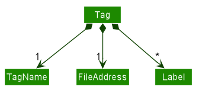
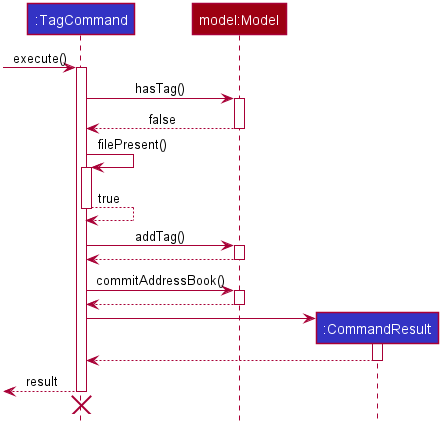
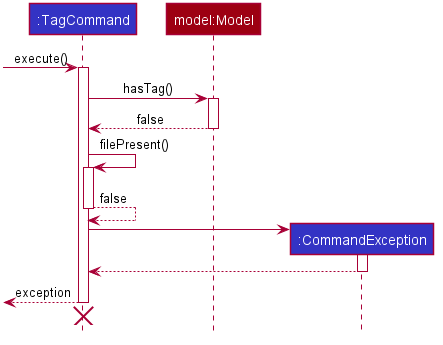
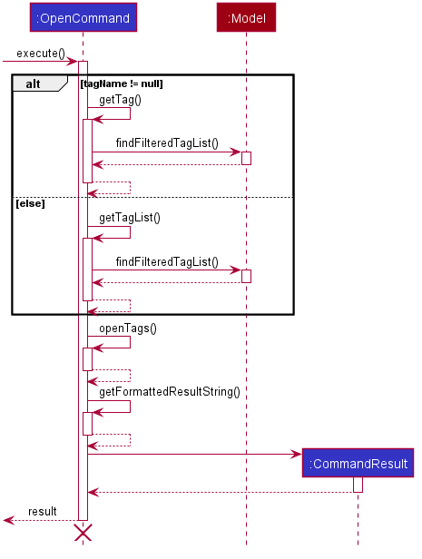
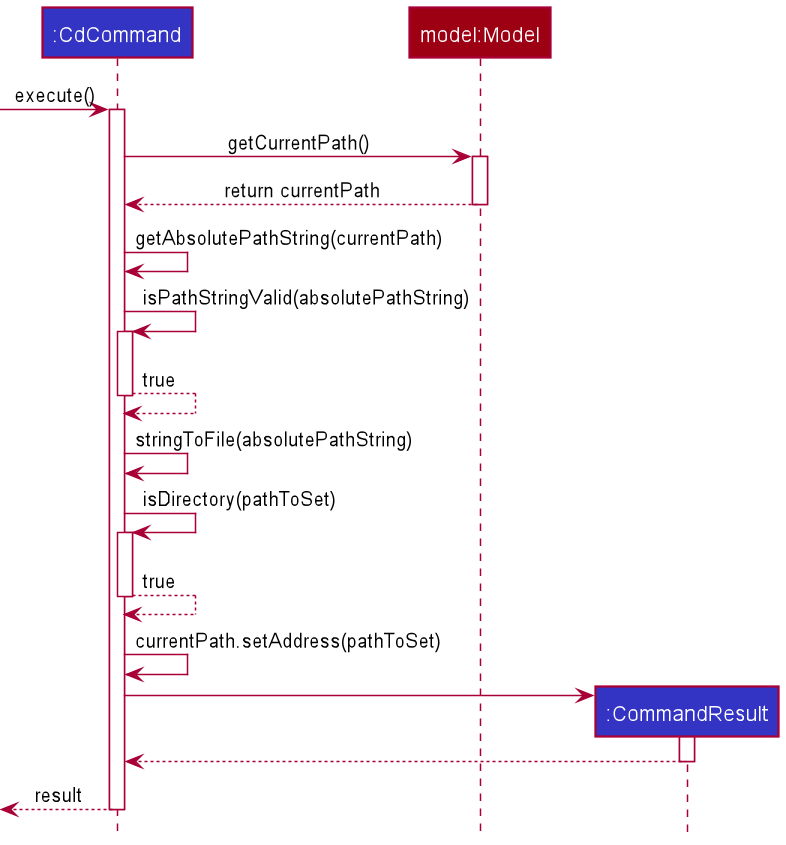
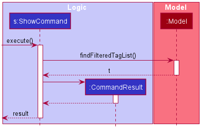
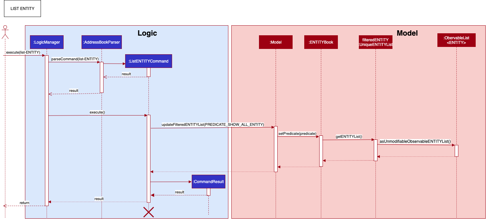
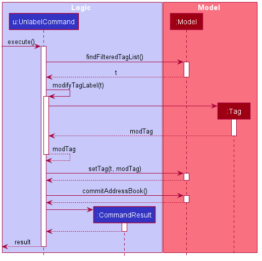

* Table of Contents
{:toc}

--------------------------------------------------------------------------------------------------------------------

## **Setting up, getting started**

Refer to the guide [_Setting up and getting started_](SettingUp.md).

--------------------------------------------------------------------------------------------------------------------

## **Design**

### Architecture

The ***Architecture Diagram*** given above explains the high-level design of HelloFile. Given below is a quick overview of each component.

**`Main`** has two classes called [`Main`](https://github.com/AY2021S1-CS2103T-F12-1/tp/blob/master/src/main/java/seedu/address/Main.java) and [`MainApp`](https://github.com/AY2021S1-CS2103T-F12-1/tp/blob/master/src/main/java/seedu/address/MainApp.java). It is responsible for,
* At app launch: Initializes the components in the correct sequence, and connects them up with each other.
* At shut down: Shuts down the components and invokes cleanup methods where necessary.

[**`Commons`**](#common-classes) represents a collection of classes used by multiple other components.

The rest of the App consists of four components.

* [**`UI`**](#ui-component): The UI of the App.
* [**`Logic`**](#logic-component): The command executor.
* [**`Model`**](#model-component): Holds the data of the App in memory.
* [**`Storage`**](#storage-component): Reads data from, and writes data to, the hard disk.

Each of the four components,

* defines its *API* in an `interface` with the same name as the Component.
* exposes its functionality using a concrete `{Component Name}Manager` class (which implements the corresponding API `interface` mentioned in the previous point.

For example, the `Logic` component (see the class diagram given below) defines its API in the `Logic.java` interface and exposes its functionality using the `LogicManager.java` class which implements the `Logic` interface.

**How the architecture components interact with each other**

The *Sequence Diagram* below shows how the components interact with each other for the scenario where the user issues the command `untag t>tag123`.

The sections below give more details of each component.

### UI component

**API** :
[`Ui.java`](https://github.com/AY2021S1-CS2103T-F12-1/tp/blob/master/src/main/java/seedu/address/ui/Ui.java)

The UI consists of a `MainWindow` that is made up of parts e.g.`CommandBox`, `ResultDisplay`, `TagListPanel`, `ThemeWindow` etc. All these, including the `MainWindow`, inherit from the abstract `UiPart` class.

The `UI` component uses JavaFx UI framework. The layout of these UI parts are defined in matching `.fxml` files that are in the `src/main/resources/view` folder. For example, the layout of the [`MainWindow`](https://github.com/AY2021S1-CS2103T-F12-1/tp/blob/master/src/main/java/seedu/address/ui/MainWindow.java) is specified in [`MainWindow.fxml`](https://github.com/AY2021S1-CS2103T-F12-1/tp/blob/master/src/main/resources/view/MainWindow.fxml)

The `UI` component,

* Executes user commands using the `Logic` component.
* Listens for changes to `Model` data so that the UI can be updated with the modified data.

### Logic component

**API** :
[`Logic.java`](https://github.com/AY2021S1-CS2103T-F12-1/tp/blob/master/src/main/java/seedu/address/logic/Logic.java)

1. `Logic` uses the `AddressBookParser` class to parse the user command.
1. This results in a `Command` object which is executed by the `LogicManager`.
1. The command execution can affect the `Model` (e.g. adding a tag).
1. The result of the command execution is encapsulated as a `CommandResult` object which is passed back to the `Ui`.
1. In addition, the `CommandResult` object can also instruct the `Ui` to perform certain actions, such as displaying help to the user.

Given below is the Sequence Diagram for interactions within the `Logic` component for the `execute("untag t>tag123")` API call.

:information_source: **Note:** The lifeline for `DeleteCommandParser` should end at the destroy marker (X) but due to a limitation of PlantUML, the lifeline reaches the end of diagram.

### Model component

**API** : [`Model.java`](https://github.com/AY2021S1-CS2103T-F12-1/tp/blob/master/src/main/java/seedu/address/model/Model.java)

The `Model`,

* stores a `UserPref` object that represents the user’s preferences.
* stores the address book data.
* stores a versioned address book which contains a list of past address books.
* stores the current path of the inbuilt file explorer.
* exposes an unmodifiable `ObservableList<Tag>` that can be 'observed' e.g. the UI can be bound to this list so that the UI automatically updates when the data in the list change.
* does not depend on any of the other three components.

### Storage component

**API** : [`Storage.java`](https://github.com/AY2021S1-CS2103T-F12-1/tp/blob/master/src/main/java/seedu/address/storage/Storage.java)

The `Storage` component,
* can save `UserPref` objects in json format and read it back.
* can save the address book data in json format and read it back.

:information_source: **Note:** The storage creates the UserPref and data with default value when the json files are missing/changed. During execution, The storage will update the address book data everytime the user executes a command. However, UserPref is only updated when the app is closed.

### Common classes

Classes used by multiple components are in the `seedu.addressbook.commons` package.

--------------------------------------------------------------------------------------------------------------------

## **Implementation**

This section describes some noteworthy details on how we implement certain features.

### Data Structure: Tag
[Tag](https://github.com/AY2021S1-CS2103T-F12-1/tp/blob/master/src/main/java/seedu/address/model/tag/Tag.java)
is a class that stores tags. It contains a compulsory `TagName`, a `FileAddress` and an optional `Label`. `TagName` must 
contain at least 1 alphanumeric word, and must be unique. `FileAddress` must contain a valid file path
(i.e passing a file path like `C:\Windows\..` is valid for Windows and `./home/...` is valid for Linux).`FileAddress` 
can take in a relative path or absolute path. 
This is the class diagram for Tag  

### Data Structure: Label
[Label](https://github.com/AY2021S1-CS2103T-F12-1/tp/blob/master/src/main/java/seedu/address/model/label/Label.java)
stores a `Label`, which is an optional field in `Tag`. A `Label` must only contain alphanumeric characters, and up to 
one word. `Label` allows the user to label their tagged file. The purpose is to keep label short and concise, as it only 
serves as extra information of a tagged file.

### Adding of Tags: TagCommand

[TagCommand](https://github.com/AY2021S1-CS2103T-F12-1/tp/blob/master/src/main/java/seedu/address/logic/commands/TagCommand.java) 
adds a new `Tag` to `AddressBook` if the tag's `TagName` is not a duplicate and the tag's `FileAddress`
is pointing to a valid file. 
Moreover, TagCommand checks if the file is present before adding the tag to `Model`.

This diagram shows a successful execution of `TagCommand`, resulting in a new tag added to `Model`.

This diagram shows an unsuccessful execution of `TagCommand`, resulting in `CommandException` thrown.
In this case, the file was not present.

`TagCommand` checks if the file address given is absolute or relative file path.
If the address is relative, it converts the relative path to absolute address by concatenating the relative
path to the current path stored in `Model`.
We designed `TagCommand` this way so that the users can use our File Explorer interface to navigate to
a folder, then tag files using relative file addresses.

### Opening of Tags: OpenCommand

[OpenCommand](https://github.com/AY2021S1-CS2103T-F12-1/tp/blob/master/src/main/java/seedu/address/logic/commands/OpenCommand.java)
accepts either a `Tag` or a `Label`.
It filters the list of `Tags` stored in `AddressBook` by the `Tag` or `Label` supplied, and generate a list of `Tag`
to be opened.
After that, it opens the files located at the `Tag`'s `FileAddress` if the file is present and user has read permission.
`CommandException` is thrown if tag is not present, the file cannot be found or no read permission.

This sequence diagram shows a successful execution of `OpenCommand`.

We implemented OpenCommand using `java.awt.Desktop`,
which supports various desktop capabilities such as `open()`. `Desktop` ensures that our application can operation across
most java-supported platforms, hence fulfilling our product's requirement to be platform independent.

However, there are some significant drawback of using `java.awt.Desktop`. The platform that HelloFile operates on must
support `Desktop`. This means that our application will never work on a headless environment. 
As a developer, you can check whether the environment supports `Desktop`
using the library method `java.awt.Desktop.isDesktopSupported()`.

Another drawback is that `java.awt.Desktop.open()` blocks the JavaFX thread and causes the UI to freeze in non-Windows
environment. We believe this is due to concurrency issue related to JavaFX.
Regretfully, we have yet to find an elegant solution for this problem after consulting our professor.
The current solution is running `Desktop.open()` on a separate thread, which solves the problem.
We have tested this command under Windows and Ubuntu Linux.

### Deleting Tags: UntagCommand

[UntagCommand](https://github.com/AY2021S1-CS2103T-F12-1/tp/blob/master/src/main/java/seedu/address/logic/commands/UntagCommand.java)
removes the `Tag` specified by the unique tag name from the `AddressBook`.

This command checks the existence of the `Tag` with `model.findFilteredTagList()`, and calls method `model.deleteTag()` to delete it.

### Renaming of Tags: RetagCommand

[RetagCommand](https://github.com/AY2021S1-CS2103T-F12-1/tp/blob/master/src/main/java/seedu/address/logic/commands/RetagCommand.java)
rename the `Tag` specified by the unique tag name with a different tag name.

This command checks the presence of the `Tag` using `java.io.File.exists()`, and that the new tag name is unique, i.e. not present in the `AddressBook`.
It then gets the filepath of the `Tag` before safely deleting it. Then, a new `Tag` is created with the filepath, and the new tag name.

### Changing of Directory: CdCommand

[CdCommand](https://github.com/AY2021S1-CS2103T-F12-1/tp/blob/master/src/main/java/seedu/address/logic/commands/CdCommand.java)
changes the current directory of the HelloFile internal File Explorer. `CommandException` is thrown if the given directory 
is invalid, cannot be found, or cannot be set as the current directory (*e.g. the given directory is not a folder*).

This sequence diagram shows a successful execution of `CdCommand`.

CdCommand gets the `CurrentPath` from `Model`, then it gets the new path to set using the current `CurrentPath`. 
After that, `CdCommand` calls `setAddress` method in `CurrentPath` to set the current directory to the new address.
Lastly, `CdCommand` returns a `CommandResult` which will be used as the feedback to the user.
If `CdCommand` fails to get a valid new path, `CommandException` will be thrown to inform the user why the command failed.

The UI components of Internal File Explorer will update themselves after a success execution of `CdCommand`.

### Find a specific tag: FindCommand

[FindCommand](https://github.com/AY2021S1-CS2103T-F12-1/tp/blob/master/src/main/java/seedu/address/logic/commands/FindCommand.java)
applies a `TagContainsCharPredicate` to the list of `FilteredTags` in `Model`. This effectively searches for tags.
`TagContainsCharPredicate` matches any tag with `TagName` or any `Label` that contains the keyword given.

This is the sequence diagram of the FindCommand.   

### Showing a tag's file path: ShowCommand

[ShowCommand](https://github.com/AY2021S1-CS2103T-F12-1/tp/blob/master/src/main/java/seedu/address/logic/commands/ShowCommand.java)
searches the list of Tags stored in `AddressBook` and shows the tag's file path in the `ResultDisplay`.
`CommandException` is thrown if tag is not present.

This diagram shows a successful execution of `ShowCommand` to show the information of the specified tag.

ShowCommand gets the specified tag by applying `TagNameEqualsKeywordPredicate` that extends from `java.util.function.predicate` to `ObservableList<Tag>` using `model.findFilteredTagList()`.

### Listing out all the tags: ListCommand

[ListCommand](https://github.com/AY2021S1-CS2103T-F12-1/tp/blob/master/src/main/java/seedu/address/logic/commands/ListCommand.java)
lists the Tags stored in `AddressBook` and shows them as `TagCard` which is contained in `TagListPanel`.
ListCommand shouldn't take in any argument. A `CommandException` will be thrown if the user's input contains an argument.

This diagram shows a successful execution of `ListCommand`.

ListCommand updates the `ObservableList<Tag>` by using `java.util.function.predicate`.

### Deleting a tag's label: UnlabelCommand

[UnlabelCommand](https://github.com/AY2021S1-CS2103T-F12-1/tp/blob/master/src/main/java/seedu/address/logic/commands/UnlabelCommand.java)
searches the list of Tags stored in `AddressBook` and deletes the specified labels. 
The user can provide 1 or more labels to be deleted simultaneously. 
If any of the input is invalid, this command will delete all the valid input from the specified `Tag` and show all the invalid input back to the user.

This diagram shows a successful execution of `UnlabelCommand` using 1 label as the argument.

UnlabelCommand checks the existence of the specified `Tag` using `model.findFilteredTagList()`. 
It takes the `Set<Label>` of the `Tag` and deletes all the labels that matches with user's input with the help of `java.util.stream`. 
Then, a new `Tag` is created using the modified `Set<Label>` and added back to the `AddressBook` using `model.setTag()`.

### Internal File Explorer

Internal File Explorer is a simple file explorer that supports viewing files on your computer. It contains a `CurrentPath` that 
represents the directory the explorer is viewing, as well as a `FileList` of the children files under that directory. The 
user can use `CdCommand` to change the current directory of the explorer, so he or she can view files under different directories.

The purpose of implementing Internal File Explorer is to make tagging files easier by supporting tagging files using their 
relative paths (*e.g. the file name*). This can make tagging files easier especially when the user wants to tag multiple files 
under the same directory.

Implementation of Internal File Explorer:

Model

The model class `CurrentPath` saves the current directory of the explorer, and keeps a `FileList` of the children files under 
that directory.

UI

`FileExplorerPanel` is the UI component for displaying Internal File Explorer. It contains a `javafx.scene.control.Label` 
to display the current directory and a `javafx.scene.control.ListView` for the list of children files. 
`FileCard` is a UI component for displaying the information of a file, and it is used to show the children files in the ListView in `FileExplorerPanel`.

Storage

We keep the current directory of the File Explorer in `SavedFilePath`. HelloFile saves the directory in json format upon exiting the app,
and loads the current path saved last time when the app starts. By doing so, the state of the File Explorer will
persist across every use of our app.

--------------------------------------------------------------------------------------------------------------------

## **Documentation, logging, testing, configuration, dev-ops**

* [Documentation guide](Documentation.md)
* [Testing guide](Testing.md)
* [Logging guide](Logging.md)
* [Configuration guide](Configuration.md)
* [DevOps guide](DevOps.md)

--------------------------------------------------------------------------------------------------------------------

## **Appendix: Requirements**

### Product scope

**Target user profile**:

* Tech savvy NUS Computer Science Student
* Has a need to manage a significant number of files
* Prefers desktop apps over other types
* Can type fast
* Prefers typing to mouse interactions
* Reasonably comfortable with CLI apps

**Value proposition**: CS students can manage/access their files by typing
                       and using a simple GUI. Help CS students to see file relations easily.

### User stories

Priorities: High (must have) - `* * *`, Medium (nice to have) - `* *`, Low (unlikely to have) - `*`

| Priority | As a …​                                                     | I want to …​                                       | So that I can…​                                            |
| -------- | ---------------------------------------------------------------| ------------------------------------------------------| --------------------------------------------------------------|
| `* * *`  | Student with lots of file                                      | tag my files with a easy to remember tag              | get file path                                                 |
| `* * *`  | First time user                                                | use a help command                                    | start to remember how to use the command                      |
| `* * *`  | Student who prefers to type                                    | use typing to interact with my file system            | use keyboard as much as possible                              |
| `* * *`  | Student who is familiar with command line applications         | tag my files                                          | access the file easily next time                              |
| `* * *`  | CS student with many categories of files                       | categorise my files and folders                       | easily manage my files and search files based on categories   |
| `* * *`  | Software engineer                                              | group my files together                               | open all files in the same group at once                      |
| `* * *`  | Student with lots of files                                     | see a list of my tags                                 | find the tag that I created easily                            |
| `* * *`  | Developer                                                      | open files with a quick command                       | focus on coding and not look to find my files                 |
| `* *`    | CS student with a lot of project                               | hide private contact details                          | minimize chance of someone else seeing them by accident       |
| `* *`    | Command line user                                              | use commands similar to Linux                         | use the similar Linux command without having to relearn       |
| `* *`    | Careless CS student                                            | be able to undo my mistake                            | fix my mistake                                                |
| `*`      | Forgetful user who always forget where his files are located   | tag frequently used files with a easy to remember tag | locate my files easily                                        |
| `*`      | Intermediate user                                              | delete tagged files                                   | not be distracted by it.                                      |

### Use cases

(For all use cases below, the **System** is the `HelloFile` and the **Actor** is the `user`, unless specified otherwise)

 

**Use case ID: UC01**

**Use case: Tag a file**

**MSS**

1. User requests to tag a file with a tag name, the file path and a label.
2. HelloFile creates the tag and informs the user.

    Use case ends.

**Extensions**

* 2a. HelloFile detects that the tag name entered is invalid.

    * 2a1. HelloFile prompts the user that the tag name entered is invalid.

        Use case resumes from step 1.

* 2b. HelloFile detects that the file path entered is invalid.

    * 2b1. HelloFile prompts the user that the file path entered is invalid.

        Use case resumes from step 1.
        
* 2c. HelloFile detects that the label entered is invalid.

    * 2c1. HelloFile prompts the user that the label entered is invalid.

        Use case resumes from step 1.

* 2d. HelloFile detects that the tag name already exists in HelloFile.

    * 2d1. HelloFile prompts the user that the tag name already exists.

        Use case resumes from step 1.

 

**User case ID: UC02**

**Use Case: Open a tagged file**

**MSS**

1. User requests to open a tagged file.
2. HelloFile opens the file using the default application.

    Use case ends.

**Extension**

* 2a. HelloFile cannot find the tag entered.

	* 2a1. HelloFile prompts the user that the tag cannot be found.

        Use case resumes from step 1.

* 2b. HelloFile detects that the file path is invalid.

	* 2b1. HelloFile prompts the user that the target file does not exist.

        Use case resumes from step 1.

* 2c. HelloFile detects that there is no permission to open the file.

	* 2c1. HelloFile prompts the user that the app does not have the permission to open the file.

	    Use case resumes form step 1.

 

**UseCase ID: UC03**

**Use Case: Rename a tag**

**MSS**

1. User requests to change the tag name of a tag.
2. HelloFile overrides the tag name of the tag with the new tag name.

    Use case ends.

**Extensions**

* 2a. HelloFile cannot find the tag to be renamed.

	* 2a1. HelloFile prompts to the user that the tag cannot be found.

    	Use case resumes from step 1

* 2b. HelloFile detects that the new tag name entered is invalid.

    * 2b1. HelloFile prompts that the new tag name entered is invalid.

        Use case resumes from step 1. 

* 2c. HelloFile detects that the new tag name entered already exists.

	* 2c1. HelloFile prompts the user that the new tag name already exists. 

        Use case resumes from step 1.

 

**UseCase ID: UC04**

**Use Case: Remove a tag**

**MSS**

1. User requests to remove a tag.
2. HelloFile removes the tag from the tag list.

    Use case ends.

**Extensions**

* 2a. HelloFile cannot find the tag entered.

	* 2a1. HelloFile prompts the user that the tag cannot be found.

	    Use case resumes from step 1.
        
 

**UseCase ID: UC05**

**Use Case: Show information of a tagged file**

**MSS**

1. User requests the check the information of a tagged file.
2. HelloFile shows the information of the file to the user.

    Use case ends.

**Extensions**

* 2a. HelloFile cannot find the tag entered.

	* 2a1. HelloFile prompts the user that the tag cannot be found.

        Use case resumes from step 1.

 

**UseCase ID: UC06**

**Use Case: Check help for all commands**

**MSS**

1. User requests to see the user help for all commands.
2. HelloFile shows the user help of all command to the user.

    Use case ends.
    
 

**UseCase ID: UC07**

**Use Case: Check help for one command**

**MSS**

1. User requests to see the user help for a specific command.
2. HelloFile shows the user help of the command to the user.

    Use case ends.
    
**Extensions**

* 2a. HelloFile does not have the command.

	* 2a1. HelloFile prompts the user that the command is not supported.

        Use case resumes from step 1.

 

**UseCase ID: UC08**

**Use Case: Add a label to a tag**

**MSS**

1. User requests to add a label to a tag.
2. HelloFile adds the label to the tag.

    Use case ends.

**Extensions**

* 2a. HelloFile cannot find the tag entered.

    * 2a1. HelloFile prompts the user that the tag cannot be found.
    
        Use case resumes from step 1.
    
* 2b. HelloFile detects that the label entered is invalid.

    * 2b1. HelloFile prompts the user that the label entered is invalid.
    
        Use case resumes from step 1.

 

**UseCase ID: UC09**

**Use Case: Remove a label of a tag**

**MSS**

1. User requests to remove a specific label of a tag.
2. HelloFile removes the label from the tag.

    Use case ends.

**Extensions**

* 2a. HelloFile cannot find the tag entered.

    * 2a1. HelloFile prompts the user that the tag cannot be found.
    
        Use case resumes from step 1.
    
* 2b. HelloFile detects that the tag does not have the label.

    * 2b1. HelloFile prompts the user that the label cannot be found on the tag.
    
        Use case resumes from step 1.

 

**UseCase ID: UC10**

**Use Case: Undo an executed command**

**MSS**

1. User requests to undo the last command executed.
2. HelloFile resets the state of the app to the state before the execution of the last command.

    Use case ends.
    
**Extensions**

* 2a. HelloFile detects that there is no past command to be undo.

    * 2a1. HelloFile prompts the user that there is no command to be undo.
    
        Use case resumes from step 1.

 

**UseCase ID: UC11**

**Use Case: Redo an undo command**

**MSS**

1. User requests to redo an undo command executed.
2. HelloFile resets the state of the app to the state before the execution of the last undo command.

    Use case ends.

**Extensions**

* 2a. HelloFile detects that there is no undo command to be redo.

    * 2a1. HelloFile prompts the user that there is no undo commands to be redo.
    
        Use case resumes from step 1.

 

**Common Extensions for All UseCases**

* *a. User enters an invalid command.

	* *a1. HelloFile prompts the user the command entered is invalid.

	    Use case ends.

* *b. The format of the command entered is incorrect.

    * *b1. HelloFile informs the user that the format is incorrect.
    * *b2. HelloFile displays the user help of the command used wrongly to the user.
    
        Use case ends.
        
 

### Non-Functional Requirements

1. The app should work on any mainstream OS as long as it has Java 11 or above installed.
2. The app should be able to hold up to 1000 tags without sluggishness longer than 5 seconds.
3. A user with above average typing speed for regular English text (i.e. not code, not system admin commands) should be able to accomplish most of the tasks faster using commands than using the mouse.
4. The source code should be open source.
5. The application should be usable by a tech-savvy NUS CS student who has never used a similar file management system before.
6. The user interface should be simple and optimized for CLI power users.
7. The product is offered as a free application.
8. 99% of the functions are bug free.
9. The code base should be well documented and populated with ample assertions.

*{More to be added}*

### Glossary

* **Mainstream OS**: Windows, Linux, Unix, OS-X
* **Tag**: A string that will be mapped to a file path
* **UI**: User interface
* **CLI**: Command line interface
* **GUI**: Graphical user interface
* **Relative File Path**: A path that is relative to a current directory, it is combined with another file path to access a file.
* **Absolute File Path**: The complete details required to locate the file or folder, starting with the root element.
