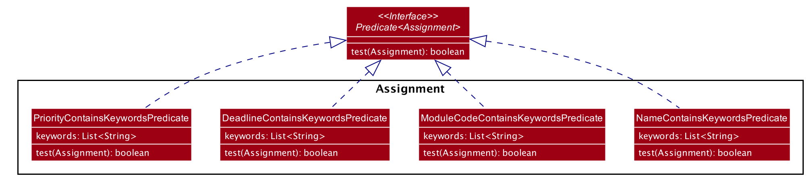

* Table of Contents
{:toc}

--------------------------------------------------------------------------------------------------------------------

## **Introduction**

### **Purpose**
This document specified architecture, software design decisions and features for the application, ProductiveNUS. It will provide you with the essential information on its development process.

### **Scope**
The intended audience of this document are developers, designers, and software testers.

#### **About ProductiveNUS**
ProductiveNUS is a desktop application targeted at Computing students of National University of Singapore (NUS) to help them manage and schedule their academic tasks efficiently.

--------------------------------------------------------------------------------------------------------------------

## **Setting up, getting started**

Refer to the guide [_Setting up and getting started_](SettingUp.md).

--------------------------------------------------------------------------------------------------------------------

## **Design**

### Architecture

The ***Architecture Diagram*** given above explains the high-level design of the App. Given below is a quick overview of each component.

:bulb: **Tip:** The `.puml` files used to create diagrams in this document can be found in the [diagrams](https://github.com/se-edu/addressbook-level3/tree/master/docs/diagrams/) folder. Refer to the [_PlantUML Tutorial_ at se-edu/guides](https://se-education.org/guides/tutorials/plantUml.html) to learn how to create and edit diagrams.

**`Main`** has two classes called [`Main`](https://github.com/se-edu/addressbook-level3/tree/master/src/main/java/seedu/address/Main.java) and [`MainApp`](https://github.com/se-edu/addressbook-level3/tree/master/src/main/java/seedu/address/MainApp.java). It is responsible for,
* At app launch: Initializes the components in the correct sequence, and connects them up with each other.
* At shut down: Shuts down the components and invokes cleanup methods where necessary.

[**`Commons`**](#common-classes) represents a collection of classes used by multiple other components.

The rest of the App consists of four components.

* [**`UI`**](#ui-component): The UI of the App.
* [**`Logic`**](#logic-component): The command executor.
* [**`Model`**](#model-component): Holds the data of the App in memory.
* [**`Storage`**](#storage-component): Reads data from, and writes data to, the hard disk.

Each of the four components,

* defines its *API* in an `interface` with the same name as the Component.
* exposes its functionality using a concrete `{Component Name}Manager` class (which implements the corresponding API `interface` mentioned in the previous point.

For example, the `Logic` component (see the class diagram given below) defines its API in the `Logic.java` interface and exposes its functionality using the `LogicManager.java` class which implements the `Logic` interface.

**How the architecture components interact with each other**

The *Sequence Diagram* below shows how the components interact with each other for the scenario where the user issues the command `delete 1`.

The sections below give more details of each component.

### UI component

**API** :
[`Ui.java`](https://github.com/se-edu/addressbook-level3/tree/master/src/main/java/seedu/address/ui/Ui.java)

The UI consists of a `MainWindow` that is made up of parts e.g.`CommandBox`, `ResultDisplay`, `PersonListPanel`, `StatusBarFooter` etc. All these, including the `MainWindow`, inherit from the abstract `UiPart` class.

The `UI` component uses JavaFx UI framework. The layout of these UI parts are defined in matching `.fxml` files that are in the `src/main/resources/view` folder. For example, the layout of the [`MainWindow`](https://github.com/se-edu/addressbook-level3/tree/master/src/main/java/seedu/address/ui/MainWindow.java) is specified in [`MainWindow.fxml`](https://github.com/se-edu/addressbook-level3/tree/master/src/main/resources/view/MainWindow.fxml)

The `UI` component,

* Executes user commands using the `Logic` component.
* Listens for changes to `Model` data so that the UI can be updated with the modified data.

### Logic component

**API** :
[`Logic.java`](https://github.com/se-edu/addressbook-level3/tree/master/src/main/java/seedu/address/logic/Logic.java)

1. `Logic` uses the `AddressBookParser` class to parse the user command.
1. This results in a `Command` object which is executed by the `LogicManager`.
1. The command execution can affect the `Model` (e.g. adding an assignment).
1. The result of the command execution is encapsulated as a `CommandResult` object which is passed back to the `UI`.
1. In addition, the `CommandResult` object can also instruct the `UI` to perform certain actions, such as displaying help to the user.

Given below is the Sequence Diagram for interactions within the `Logic` component for the `execute("delete 1")` API call.

:information_source: **Note:** The lifeline for `DeleteCommandParser` should end at the destroy marker (X) but due to a limitation of PlantUML, the lifeline reaches the end of diagram.

### Model component

**API** : [`Model.java`](https://github.com/se-edu/addressbook-level3/tree/master/src/main/java/seedu/address/model/Model.java)

The `Model`,

* stores a `UserPref` object that represents the user’s preferences.
* stores the data in ProductiveNUS.
* exposes an unmodifiable `ObservableList<Assignment>` and an unmodifiable `ObservableList<Task>` that can be 'observed' e.g. the UI can be bound to this list so that the UI automatically updates when the data in the list change.

### Storage component

**API** : [`Storage.java`](https://github.com/se-edu/addressbook-level3/tree/master/src/main/java/seedu/address/storage/Storage.java)

The `Storage` component,
* can save `UserPref` objects in json format and read it back.
* can save assignment and lesson data in json format and read it back.

### Common classes

Classes used by multiple components are in the `seedu.addressbook.commons` package.

--------------------------------------------------------------------------------------------------------------------

## **Implementation**

This section describes some noteworthy details on how certain features are implemented.

### \[Implemented\] Import timetable feature
The user can import information about their lessons into ProductiveNUS using their NUSMods timetable URL.

#### Reasons for implementation:
Users may find it inconvenient to constantly refer to their NUSMods timetable whenever they want to check if they are
available on a specific date and time. By giving users the option to add their lesson information into ProductiveNUS,
it will help increase the user's convenience as all their academic related schedule can be found in one place.

ProdutiveNUS can also better schedule the user's work with their timetable information available, avoiding any clashes
in schedule.

#### Current implementation:
- The import command is a typical command used in ProductiveNUS. It extends `Command` and overrides the method `execute`
in `CommandResult`. `ImportCommandParser` implements `Parser<ImportCommand>` and it parses the user's input to return an
`ImportCommand` object. The constructor of `ImportCommand` takes in the prefix url/ and the user's NUSMods timetable
url.

- A call to `TimetableRetriever` will be made. `TimetableRetriever` takes the user's timetable data which was parsed by
`ImportCommandParser` and makes a HTTP GET request to NUSMods API. NUSMods sends `TimetableRetriever` the relevant JSON
data. The data is parsed and returns as a list of `Lessons`.

The following sequence diagram shows the sequence when LogicManager executes `import` command.

1. The `execute` method of `LogicManager` is called when a user keys in an input into the application and `execute`
takes in the input.
2. The `parseCommand` method of `ProductiveNusParser` parses the user input and returns an initialized
`ImportCommandParser` object and further calls the `parse` method of this object to identify the URL in the user input.
3. It calls the `TimetableUrlParser` with the URL and it returns a `TimetableData` object.
4. `ImportCommandParser` returns an `ImportCommand` object.
5. There is return call to `LogicManager` which then calls the overridden `execute` method of `ImportCommand`.
6. The `execute` method of `ImportCommand` will call the `retrieveLessons` method from `TimetableRetriever`, which
 returns a list of lessons to be added.
7. The `execute` method returns a `CommandResult` object.

### \[Implemented\] Schedule an assignment

The user can input a deadline and expected time for an assignment to get a suggested start time and end time to work on the assignment.
The suggested time will be within working hours from 6am to 11pm local time.
The expected hours for an assignment ranges from 1 to 5 hours.
The suggested time will not class with any of the suggested time for other assignments and lessons.

#### Reasons for Implementation

User may find it convenient to be suggested a time slot where they can do their assignment before a specific date and at a
specific time which he is free from all lessons and other assignment.

#### Current Implementation
- The schedule command is a typical command used in ProductiveNUS. It extends `Command` and overrides the method `execute` in `CommandResult`.

- `ScheduleCommandParser` implements `Parser<ScheduleCommand>` and it parses the user's input to return a `ScheduleCommand` object.

- The constructor of `ScheduleCommand` takes in (`Index`, `ExpectedHours`, `DoBefore`) where `Index` is a zero-based index
with the prefix (expected/, dobefore/) in the user's input. 
 
- The suggested schedule will be display in the assignment card shown in list.
 
It implements the following operations:
* `schedule 3 expected/2 dobefore/01-01-2001 0101` - Suggest schedule for the 3rd assignment in the displayed assignment list
with expected hours of 2 and need to be done before 01:01 01-01-2001.
* `schedule 2 expected/5 dobefore/02-02-2002 0202` - Suggest schedule for the 2nd assignment in the displayed assignment 
with expected hours of 5 and need to be done before 02:02 02-02-2002.

#### Usage Scenario

A usage scenario would be when a user wants to schedule an assignment.

1. The `execute` method of `LogicManager` is called when a user keys in an input into the application and `execute` takes in the input.
2. The `parseCommand` method of `ProductiveNusParser` parses the user input and returns an initialized `ScheduleCommandParser` object and further calls the `parse` method of this object to identify keywords and prefixes in the user input.
3. If user input is valid, it returns a `ScheduleCommand` object, which takes in a predicate. (`ExpectedHours` in this example user input)
4. There is return call to `LogicManager` which then calls the overridden `execute` method of `ScheduleCommand`.
6. The `execute` method returns a `ScheduleResult` object.

### Find by specific fields feature

The user can find assignments by providing keywords of the following fields:
- Name of assignment
- Module code of assignment
- Due date or time of assignment
- Priority of assignment

The user can find assignments with single or multiple keywords of the same type of field.

It implements the following operations:
* `find n/Lab` - Finds assignments with names that has "Lab".
* `find mod/CS2100 CS2103T` - Finds assignments from the modules CS2100 and CS2103T.
* `find d/1200 24-10-2020` - Finds assignments with due time 1200 (regardless of date), and with due date 24-10-2020 (regardless of time).
* `find p/HIGH` - Finds assignments of high priority.

#### Reasons for Implementation

If the user can search by only one field, it would restrict the user's process of viewing assignments.
As a student user, the following scenarios are likely:
- The user wants to search for assignments with the highest priority, so that he knows what assignments to complete first.
- The user wants to search for assignments due on a particular date or time, so that he can complete it and submit his assignment on time.
- The user wants to view the details of one particular assignment with a specific name.
- The user wants to complete all assignments under a certain module first, before moving on with his next task.

We thus concluded that finding by specific fields would be beneficial for users, and it would make it easier and more convenient for them to view assignments based on their needs.

#### Current Implementation

##### Prefixes used in identifying keywords
The use of prefixes before keywords allows for validation of keywords in the user's input.

The following prefixes are used to identify the type of keywords:
- `/n` for Name keywords
- `/mod` for Module code keywords
- `/d` for Due date or time keywords
- `/p` for Priority keywords

##### Predicate classes 

*Figure X: Class diagram for Predicate classes*

The following Predicate classes implements `Predicate<Assignment>` and specific ones are passed into the constructor of `FindCommand` when the user inputs keywords of its assigned field:

- NameContainsKeywordsPredicate for name keywords
- ModuleCodeContainsKeywordsPredicate for module code keywords
- DeadlineContainsKeywordsPredicate for date or time keywords
- PriorityContainsKeywordsPredicate for priority keywords

The keywords are stored in a `List<String>` that is passed into the constructor of the predicate so that the overridden `test` method from `Predicate<Assignment>` class can evaluate the keywords with the specific attribute of an assignment, being name, module code, deadline or priority, to return a boolean value.

##### FindCommandParser Class
The `FindCommandParser` class implements `Parser<FindCommand>` and it is responsible for parsing input arguments with the `parse` method to create a new `FindCommand` object. It contains private methods which checks for the presence of multiple prefixes and invalid keywords, which will throw a `ParseException` if detected.

Its `parse` method takes in a string of user input. If there are no multiple prefixes found and user input is not empty, it would then check for the type of prefix present as well as whether there is a preamble before the prefix and after the `find` input command. This ensures that there are no invalid command formats used by the user. 

If no invalid command format is detected, each keyword in the string of keywords are parsed in a for loop. For name, module code and priority keywords, parsing is done via its parse method in `ParserUtil` to ensure that each keyword is valid. These parse methods are `parseName`, `parseModuleCode` and `parsePriority` respectively and they throw `ParseExceptions` in the event of invalid input. For date or time keywords, Regular expressions are used to identify its format, with date format being identified with `^\\d{2}-\\d{2}-\\d{4}$` and time format being identified with `^\\d{4}$`. Once the date and time keywords inputted by the user are identified, date keywords are parsed into `LocalDate` and time keywords are parsed into `LocalTime`. A `ParseException` will be thrown if a `DateTimeException` is caught in the event of failed parsing of date with `DateTimeFormatter` pattern `dd_MM-uuuu` or time with the `DateTimeFormatter` pattern `HHmm`.

##### FindCommand Class
The `FindCommand` class extends abstract class `Command` and it is responsible for finding assignments based on the user's input keywords. It contains static `String` attributes of error messages to be displayed in the event of invalid user input, and a `Predicate<Assignment>` attribute, `predicate`. The constructor of `FindCommand` takes in a `Predicate<Assignment>` depending on the prefix or keywords in the user's input and its attribute `predicate` is initialized to this value.
 
 It overrides the method `execute` to return a `CommandResult` object, which provides the result of command execution. In the `execute` method, it calls the `updatedFilteredAssignmentList` method of a `Model` object, `model`, it takes in, so that the filter of the filtered assignment list will be updated by the given predicate and a list of filtered assignments will be displayed to the user, along with an indication message on the number of assignments listed.

Upon successful parsing, a `FindCommand` object is returned.

#### Usage Scenario

The following is a usage scenario of when a user wants to find assignments with the name 'Lab'.

1. The `execute` method of `LogicManager` is called when a user keys in an input into the application and `execute` takes in the input.
2. The `parseCommand` method of `ProductiveNusParser` parses the user input and returns an initialized `FindCommandParser` object and further calls the `parse` method of this object to identify keywords and prefixes in the user input.
3. If user input is valid, it returns a `FindCommand` object, which takes in `NameContainsKeywordsPredicate` with the list of keywords.
4. There is return call to `LogicManager` which then calls the overridden `execute` method of `FindCommand`.
5. The `execute` method of `FindCommand` will call the `updateFilteredAssignmentList` method and then the `getFilteredAssignmentListMethod` of the `Model` object.
6. The `execute` method returns a `CommandResult` object.

Given below is the sequence diagram for the interactions within `LogicManager` for the `execute(find n/Lab)` API call.

### \[Implemented\] Remind assignments feature
The user can set reminders for a single assignment or multiple assignments at a time.
Reminded assignments will be displayed in the `Your Reminders` section in ProductiveNUS for easy referral.

#### Reasons for Implementation
It is likely that the user will want to receive reminders for assignments with deadlines that are far away, so that he will not forget to complete those assignments. It is also likely that the user will want to receive reminders for assignments that require more attention, so that he will know which assignments to focus on and plan his time accordingly.

Displaying reminded assignments in a list separate from the main assignment list allows for easy referral and is hence more convenient for the user.

#### Current Implementation
- The remind command extends abstract class `Command` and overrides the method `execute` in `CommandResult`.
- `RemindCommandParser` implements `Parser<RemindCommand>` and it parses the user's input to return a `RemindCommand` object.
- The constructor of `RemindCommand` takes in `List<Index>`, and each `Index` in `List<Index>` is parsed from the zero based index of the user's input.

It implements the following operations:
* `remind 3` - Sets reminders for the 3rd assignment in the displayed assignment list.
* `remind 1 4` - Sets reminders for the 1st and 4th assignment in the displayed assignment list.

#### Usage Scenario
The following is a usage scenario of when the user wants to set reminders for the 2nd and 3rd assignment in their displayed assignment list.

Given below is the Sequence Diagram for interactions within the `Logic` component for the `execute("remind 2 3")` API call.

1. `execute("remind 2 3")` of `LogicManager` calls the `parseCommand` method of `ProductiveNusParser`.
1. `parseCommand("remind 2 3")` parses the String `"remind 2 3"` and returns an initialized `RemindCommandParser` object. 
1. `parseCommand("remind 2 3")` calls the `parse` method in `RemindCommandParser` and checks if indexes inputted are valid.
1. If the indexes are valid, it returns a `RemindCommand` object, which takes in `List<Index>` containing `Index` `2` and `3`.
1. There is return call to `LogicManager` which then calls the overridden `execute` method of `RemindCommand`.
1. The `execute` method of `RemindCommand` will call the `checkForDuplicatedIndexes` method of `CommandLogic` to check for duplicated indexes 
1. The `checkForInvalidIndexes` method of the `CommandLogic` is then called to check for any indexes not found in the displayed assignment list.
1. The `setAssignment` method of `Model` is repeatedly called, once for each `Index` in `List<Index>`. In this case, the loop terminates after 2 times.
1. A `CommandResult` object is returned from `execute()`.

### List by days feature

The user can list all his assignments with `list` without a subsequent argument index, or list assignments with 
deadlines within a 1 to 50 days from the current date and time, with the number of days being an argument index after `list`.

It implements the following operations:
* `list` - Lists all assignments
* `list 2` - List all assignments with deadline within 2 days (48 hours) from the current date (and time).
For example, if the current date and time is 22/10/2020 1200, assignments with deadlines from this date and time to
24/10/2020 1200 will be displayed.

#### Reasons for Implementation
- As a student user, he will want to view assignments that are due within days from the current date, so that he will know which assignments to complete first in order to meet the deadlines.
- It is different from the `find` command as users can list all assignments with deadlines within a time period (from the current date to a number of days later),
whereas finding assignments by date or time will only display assignments due on this particular day or time.

#### Current Implementation

##### ListCommandParser Class
The `ListCommandParser` class implements `Parser<ListCommand>` and it is responsible for parsing input arguments with the `parse` method to create a new `ListCommand` object. Regular Expressions are used to identify the presence of an input argument in `args`, which takes into account all characters and even special characters. If no argument index is found in `args`, a `ListCommand` object which takes in an `Index` of zero base 0 is returned and this 0 value will identify the command as listing all assignments.

If input argument is found, it is then checked with Regular Expressions whether the argument is in the range 1 to 50 inclusive. If so, the string `args` is parsed into an `Index` which is then passed in as the argument to `ListCommand` that is returned.

##### ListCommand Class
The `ListCommand` class extends abstract class `Command` and it is responsible for listing assignments based on the user's input command. It contains static `String` attributes of error messages to be displayed in the event of invalid user input, and an `Index` attribute, `numberOfDays`. The constructor of ListCommand takes in an `Index` and its attribute `numberOfDays` is initialized to this value.

It overrides the method `execute` to return a `CommandResult` object, which provides the result of command execution. In the `execute` method, if the zero base value of `numberOfDays` is 0, a predicate `PREDICATE_SHOW_ALL_ASSIGNMENT` is passed into 
the `updatedFilteredAssignmentList` method of a `Model` object, `model`. If the zero base value is not 0, `showLimitedAssignments` method with return type `Predicate<Assignment>` is passed into the `updatedFilteredAssignmentList` method. This method uses lambda expressions to filter assignments with deadlines that fall within the number of days window inputted by the user.

##### Design Considerations

#### Usage scenario
The following is a usage scenario of when the user wants to list assignments that are due within the next 3 days from now.

1. `execute("list 3")` of `LogicManager` calls the `parseCommand` method of `ProductiveNusParser`.
 1. `parseCommand("list 3")` parses the String `"list 3"` and returns an initialized `ListCommandParser` object. 
 1. `parseCommand("List 3")` calls the `parse` method in `ListCommandParser` to return a `ListCommand` object.
 1. There is return call to `LogicManager` which then calls the overridden `execute` method of `ListCommand`.
 1. The `execute` method of `ListCommand` will call the `updateFilteredAssignmentList` method of the object `model`, which takes in `showLimitedAssignments` predicate.
 1. If `getZeroBased` value of `Index` attribute `numberOfDays` is 0, it would take in `PREDICATE_SHOW_ALL_ASSIGNMENT`. Else, it would take in `showLimitedAssignments` to return assignments that passes this predicate.
 1. The `execute()` method returns a `CommandResult` object.
 
 Given below is the sequence diagram for the interactions within `LogicManager` for the `execute(list 3)` API call.

DIAGRAM

### Delete multiple assignments feature
The user can delete one or multiple assignments at a time.

It implements the following operations:
* `delete 1` - Deletes the 1st assignment in the displayed assignment list.
* `delete 1 2 3` - Deletes the 1st, 2nd and 3rd assignments in the displayed assignment list.

#### Reasons for Implementation
It will provide convenience to users who want to delete more than one assignment at a time, and it makes the process of removing completed assignments faster.

#### Current Implementation

##### DeleteCommand class 
The `DeleteCommand` class extends abstract class `Command` and it is responsible for deleting assignments based on the user's input indexes. It contains static `String` attributes of messages to be displayed to the user, and a `List<Index>` attribute, `targetIndexes`. The constructor of `DeleteCommand` takes in a `List<Index>` argument and `targetIndexes` is initialized to this value.

 It overrides the method `execute` to return a `CommandResult` object, which provides the result of command execution. In the `execute` method, `targetIndexes` is sorted in descending order with `INDEX_COMPARATOR` in `CommandLogic` class and then it calls `checkForDuplicationIndexes` and `checkForInvalidIndexes` methods in `CommandLogic`. The zero base value of each `Index` in `targetIndexes` is stored in a `List<Integer>` and the number of distinct values and size of the list is found so that duplicated indexes can be found by comparing the number of distinct values and number of elements in the list. Invalid indexes includes numbers that are not in the range from 1 to the number of assignments in the list. If no `CommandException` is thrown when duplicated or invalid indexes are found, the assignments are deleted by calling `deleteAssignments` method on `model` repeatedly until all indexes in the `targetedIndexes` are accounted for.

##### DeleteCommandParser Class
The `DeleteCommandParser` class implements `Parser<DeleteCommand>` and it is responsible for parsing input arguments with the `parse` method to create a new `DeleteCommand` object. It calls `parseIndexes` method from `ParserUtil` class to parse the string user input into multiple `Index` which is then stored in a `List<Index>`. A `ParseException` is caught if parsing is unsuccessful.

##### Design Considerations
To delete an assignment, it calls the `deleteAssignment` method of `model`.

When deleting multiple assignments, it calls this method repeatedly with a for loop as shown in the following sequence diagram under "Usage Scenario".
Since the index of assignments in the list will update after each delete in the loop, we sorted the list from the largest index to the smallest, and implemented deleting of assignments from the largest index in the list to maintain order.

#### Usage Scenario
The following is a usage scenario of when the user wants to delete the first and second assignment in his displayed assignment list.
1. `execute("delete 1 2")` of `LogicManager` calls the `parseCommand` method of `ProductiveNusParser`.
 1. `parseCommand("delete 1 2")` parses the String `"delete 1 2"` and returns an initialized `DeleteCommandParser` object. 
 1. `parseCommand("delete 1 2")` calls the `parse` method in `DeleteCommandParser` which parses the user input into `List<Index>`. This is by calling the static method `parseIndexes()` of `ParserUtil`.
 1. If the indexes are valid, it returns a `DeleteCommand` object, which takes in `parsedIndexes`, of type `List<Index>` containing `Index` `1` and `2`.
 1. There is return call to `LogicManager` which then calls the overridden `execute` method of `DeleteCommand`.
 1. The `execute` method of `DeleteCommand` will call the `checkForDuplicatedIndexes` method of `CommandLogic` to check for duplicated indexes. 
 1. The `execute()` method then calls `checkForInvalidIndexes` method of the `CommandLogic` to check for any indexes not found in the displayed assignment list.
 1. The `deleteAssignment` method of `Model` is repeatedly called, once for each `Index` in `List<Index>`. In this case, the loop terminates after 2 times.
 1. The `execute()` method returns a `CommandResult` object.
 
 Given below is the sequence diagram for the interactions within `LogicManager` for the `execute(delete 1 2)` API call.
 
 

 
 

### \[Coming up\] Help feature

### \[Implemented\] Undo

The user can undo the most recent command that changes the data of the assignments or lessons.

#### Reasons for Implementation
It is likely that the user might type in command mistakenly will want to go the previous state.
Instead of using a combination of adding, deleting, editting, ..., a single undo command will 
help solving the problem easily.

#### Current Implementation
- The undo command is a typical command used in ProductiveNUS. 
- It extends `Command` and overrides the method `execute` in `CommandResult`.

It implements the following operations:
* `Undo` — Undo the most recent command that changes the data of the assignments or lessons.

#### Usage Scenario

A usage scenario would be when a user wants to undo the most recent command that changes the data of the assignments

1. The `execute` method of `LogicManager` is called when a user keys in an input into the application and `execute` takes in the input.
2. The `execute` calls the `UndoCommand`.
4. There is return call to `LogicManager` which then calls the overridden `execute` method of `UndoCommand`.
5. The `execute` method of `UndoCommand` will call the `getPreviousModel` of the `Model` object and reassign `Model`.
6. The `execute` method returns a `CommandResult` object.

### \[Implemented\] Updating of Upcoming tasks in real time

The displayed task list under `Upcoming tasks` updates in real time when the deadline of an assignment or the end time of a lesson has passed.

#### Reasons for Implementation
It is likely that the user will refer to the `Upcoming tasks` to quickly view what is up next on their academic schedule. It is hence important that the `Upcoming tasks` accurately reflect what is next on their academic schedule.

#### Current Implementation
- The updating of `Upcoming tasks` in real time is implemented with **multithreading**.
- The GUI of ProductiveNUS is implemented using JavaFX. Hence, Thread safety using synchronised thread actions cannot be achieved as JavaFx is modelled to execute on a **single JavaFX-Launcher thread.**
- Therefore, this feature makes use of `javafx.concurrent.Task<V>` for multithreading operations, which is designed to handle multithreading operations in JavaFX applications in a **thread-safe manner**.
- A `Timer` object is used alongside `javafx.concurrent.Task` to periodically check `Upcoming tasks` every second. The `Timer` object has `isDaemon` set to true.
- If the deadline of the upcoming assignment or the end time of the upcoming lesson has passed, the `updateTasks()` method in `AddressBook` is called.

Below is an Activity Diagram illustrating the flow of activities when the application starts up.

                               ------------------------------Activity diagram illustrating multithreading (will add later)--------------------------------

--------------------------------------------------------------------------------------------------------------------

## **Documentation, logging, testing, configuration, dev-ops**

* [Documentation guide](Documentation.md)
* [Testing guide](Testing.md)
* [Logging guide](Logging.md)
* [Configuration guide](Configuration.md)
* [DevOps guide](DevOps.md)

--------------------------------------------------------------------------------------------------------------------

## **Appendix: Requirements**

### Product scope

**Target user profile**:
* NUS Computing Students with poor time management skills who have difficulties managing their weekly academic schedule
* prefer desktop apps over other types
* can type fast and prefer typing to mouse interactions
* is reasonably comfortable using CLI apps

**Value proposition**:
* More convenient than typical apps as lessons and assignments are managed in just one app so there is no need to switch between different ones.
* Faster than typical mouse/GUI driven apps as most features are accomplished by typing simple commands.
* Easier to manage schedule than typical scheduling apps as assignments are automatically scheduled.

### User stories

Priorities: High (must have) - `* * *`, Medium (nice to have) - `* *`, Low (unlikely to have) - `*`

| Priority | As a … | I want to … | So that I can… |
|-|-|-|-|
| `* * *` | student | import my timetable | better schedule my assignments with my lesson timings taken into account |
| `* * *` | forgetful student | view reminders for my lessons and assignments | avoid forgetting to attend lessons or do my work |
| `* * *` | poor time manager | add and schedule assignments | keep track of what needs to be done |
| `* * *` | poor time manager | delete assignments | remove assignments that i have completed or added wrongly |
| `* * *` | student | view lessons and assignments together | view all assignments i have to complete amidst my lessons |
| `* * *` | particular student | use a scheduler with a user-friendly interface | use the application easily and enjoyably |
| `* * *` | new user | navigate the UI easily | use the application efficiently |
| `* * *` | slow/confused student | i can access and view my academic duties easily | quickly find out what i need to do for the week |
| `* * ` | beginner user | view a summary of the features | quickly learn about the features available |
| `* * ` | experienced user | use shortcuts in my commands | manage my academic schedule quicker |

### Use cases

(For all use cases below, the **System** is the `Academic Schedule Manager` and the **Actor** is the `user`, unless specified otherwise)

**Use case: UC01 - Add an assignment**

**MSS**

1.  User requests to add an assignment.
2.  Academic Schedule Manager adds the assignment.
3.  Academic Schedule Manager shows a success message with details of the assignment added.

    Use case ends.

**Extensions**

* 1a. The user did not supply all required parameters.

    * 1a1. Academic Schedule Manager shows an error message.

      Use case ends.

* 1b. The given DEADLINE_OF_ASSIGNMENT parameter is in the wrong format.

    * 1b1. Academic Schedule Manager shows an error message.

      Use case ends.

**Use case: UC02 - Delete an assignment**

**MSS**

1.  User <ins>requests to list assignments and lessons (UC05)</ins>.
2.  User requests to delete a specific assignment in the list.
3.  Academic Schedule Manager shows a success message with details of the assignment deleted.

    Use case ends.

**Extensions**

* 2a. The given index is invalid (index is referring to a lesson or index is out of range).

    * 2a1. Academic Schedule Manager shows an error message.

      Use case resumes at step 2.

**Use case: UC03 - Import timetable**

**MSS**

1.  User retrieves NUSMods timetable URL from the NUSMods website.
2.  User requests to import NUSMods timetable using their NUSMods timetable URL.
3.  Academic Schedule Manager adds all the lessons according to the data retrieved.
4.  Academic Schedule Manager shows a success message with details of the lessons added.

    Use case ends.

**Extensions**

* 2a. The given URL is invalid (not a valid NUSMods timetable URL).

    * 2a1. Academic Schedule Manager shows an error message.

      Use case resumes at step 2.

* 2b. User already has a timetable imported before.

    * 2b1. Academic Schedule Manager informs user that previously imported lesson will be deleted.
    
      Use case resumes at step 3.

**Use case: UC04 - Remind**

**MSS**

1.  User <ins>requests to list assignments and lessons (UC05)</ins>.
2.  User requests to set reminder for a specific assignment in the list.
3.  Academic Schedule Manager adds the assignment to the remind list.
4.  Academic Schedule Manager shows a success message with details of the assignment set as reminder.

    Use case ends.

**Extensions**

* 2a. The given index is invalid (index is referring to a lesson or index is out of range).

    * 2a1. Academic Schedule Manager shows an error message.

      Use case resumes at step 2.

**Use case: UC05 - List assignments and lessons**

**MSS**

1.  User requests to list assignments and lessons.
2.  Academic Schedule Manager shows a list of all assignments and lessons.

    Use case ends.

**Extensions**

* 1a. User requests to list XX day(s) of assignments and lessons.

    * 1a1. Academic Schedule Manager shows a filtered list of assignments and lessons.

        Use case ends.
      
* 2a. The list is empty.

        Use case ends.
    
### Non-Functional Requirements

1.  Should work on any _mainstream OS_ as long as it has Java `11` or above installed.
2.  Should be able to hold up to `1000 lessons and assignments` without a noticeable sluggishness in performance for typical usage.
3.  A user with above average typing speed for regular English text (i.e. not code, not system admin commands) should be able to accomplish most of the tasks faster using commands than using the mouse.
4.  The system should respond within two seconds.
5.  The system should save a user's data `after every user command`.
6.  The system should be usable by a novice who has never used the app before.

*{More to be added}*

### Glossary

* **Mainstream OS**: Windows, Linux, Unix, OS-X
* **User**: NUS Computing student

--------------------------------------------------------------------------------------------------------------------

## **Appendix: Instructions for manual testing**

Given below are instructions to test the app manually.

:information_source: **Note:** These instructions only provide a starting point for testers to work on;
testers are expected to do more *exploratory* testing.

### Launch and shutdown

1. Initial launch

   1. Download the jar file and copy into an empty folder

   1. Double-click the jar file Expected: Shows the GUI with a set of sample contacts. The window size may not be optimum.

1. Saving window preferences

   1. Resize the window to an optimum size. Move the window to a different location. Close the window.

   1. Re-launch the app by double-clicking the jar file. 
       Expected: The most recent window size and location is retained.

1. _{ more test cases …​ }_

### Deleting a person

1. Deleting a person while all persons are being shown

   1. Prerequisites: List all persons using the `list` command. Multiple persons in the list.

   1. Test case: `delete 1` 
      Expected: First contact is deleted from the list. Details of the deleted contact shown in the status message. Timestamp in the status bar is updated.

   1. Test case: `delete 0` 
      Expected: No person is deleted. Error details shown in the status message. Status bar remains the same.

   1. Other incorrect delete commands to try: `delete`, `delete x`, `...` (where x is larger than the list size) 
      Expected: Similar to previous.

1. _{ more test cases …​ }_

### Saving data

1. Dealing with missing/corrupted data files

   1. _{explain how to simulate a missing/corrupted file, and the expected behavior}_

1. _{ more test cases …​ }_
