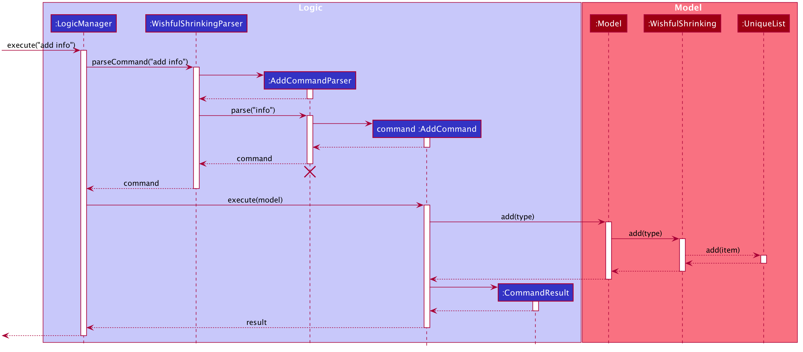
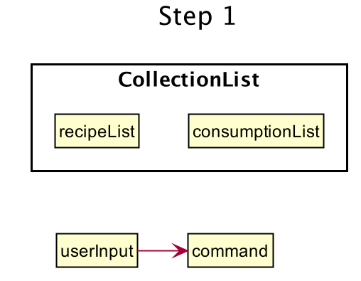
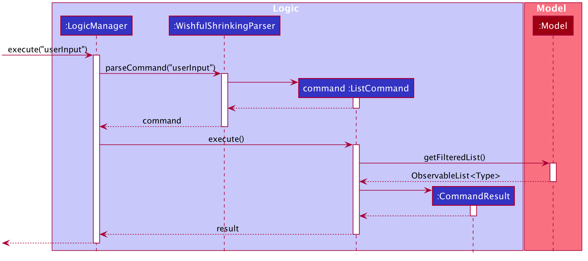
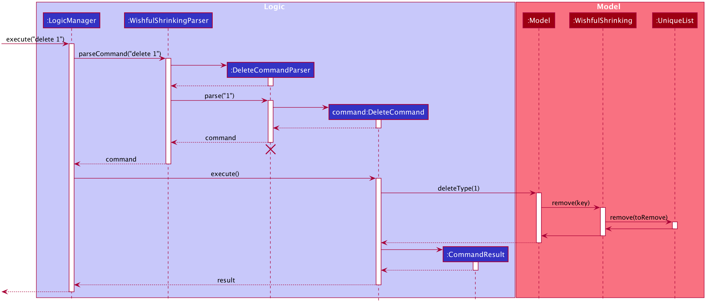
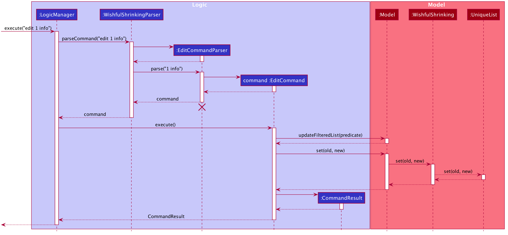
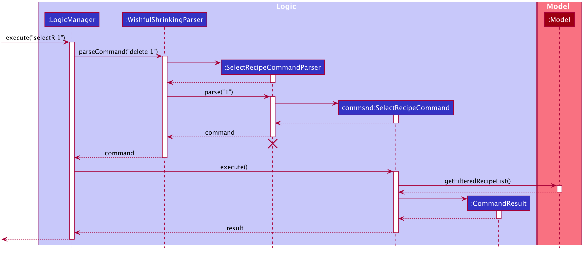
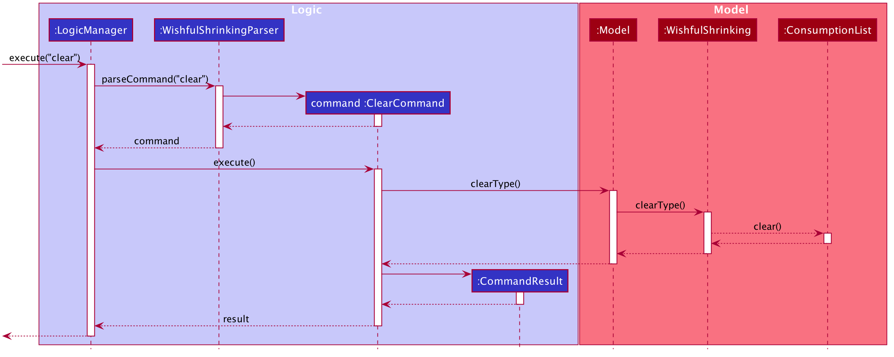

## Table of Contents 
1. [Overview](#1-overview)
    - [1.1. Introduction](#11-introduction)
    - [1.2. Purpose](#12-Purpose)
    - [1.3 Setting Up, Getting Started](#13-setting-up-getting-started)
2. [Design](#2-design)
    - [2.1. Architectre](#21-architecture)
    - [2.2. UI Component](#22-ui-component)
    - [2.3. Logic Component](#23-logic-component)
    - [2.4. Model Component](#24-model-component)
    - [2.5. Storage Component](#25-storage-component)
    - [2.6. Common classes](#26-common-classes)
3. [Implementation](#3-implementation)
    - [3.1. Add Features](#31-add-features)
        * [3.1.1 Implementation](#311-implementation)
        * [3.1.2 Design Consideration (**Add Recipe**)](#312-design-consideration-add-recipe)
            * [Aspect 1: Concern while adding the first feature](#3121-aspect-1)
            * [Aspect 2: Should we allow adding duplicated recipes](#3122-aspect-2)
        * [3.1.3 Design Consideration (**Add Ingredient**)](#313-design-consideration-add-ingredient)
            * [Aspect 1: Concern while adding the first feature](#3131-aspect-1)
            * [Aspect 2: How do we successfully parse the ingredients the user has added with the optional ingredient quantity](#3132-aspect-2)
    - [3.2. Eat Recipe Feature](#32-eat-recipe-feature)
        * [3.2.1 Implementation](#321-implementation)
        * [3.2.2 Design Consideration](#322-design-consideration)
            * [Aspect: What are the informations to extract from a recipe and save in consumptionList](#3221-aspect)
    - [3.3. List Features](#33-list-features)
        * [3.3.1 Implementation](#331-implementation)
        * [3.3.2 Design Consideration (**List Recipe**)](#332-design-consideration-list-recipe)
            * [Aspect: Concern while adding the first feature](#3321-aspect)
        * [3.3.3 Design Consideration (**List Ingredient**)](#333-design-consideration-list-ingredient)
             * [Aspect: Concern while adding a new feature](#3331-aspect)
        * [3.3.4 Design Consideration (**List Consumption**)](#334-design-consideration-list-consumption)
             * [Aspect 1: Concern while adding a new feature](#3341-aspect-1)
             * [Aspect 2: What are the informations to list from a recipe in consumption list](#3342-aspect-2)
    - [3.4. Delete Features](#34-delete-features)
        * [3.4.1 Implementation](#341-implementation)
        * [3.4.2 Design Consideration (**Delete Recipe**)](#342-design-consideration-delete-recipe)
            * [Aspect: Concern while adding the first feature](#3421-aspect)
        * [3.4.3 Design Consideration (**Delete Ingredient**)](#343-design-consideration-delete-ingredient)
            * [Aspect: Concern while adding a new feature](#3431-aspect)
        * [3.4.4 Design Consideration (**Delete Consumption**)](#344-design-consideration-delete-consumption)
            * [Aspect: Concern while adding a new feature](#3441-aspect)
    - [3.5. Edit Features](#35-edit-features)
        * [3.5.1 Implementation](#351-implementation)
        * [3.5.2 Design Consideration (**Edit Recipe**)](#352-design-consideration-edit-recipe)
            * [Aspect: Concern while adding a new feature](#3521-aspect)
        * [3.5.3 Design Consideration (**Edit Ingredient**)](#353-design-consideration-edit-ingredient)
            * [Aspect: Concern while adding a new feature](#3531-aspect)
        * [3.5.4 Common Design Consideration](#354-common-design-consideration)
            * [Aspect: How do we provide users with ease in editing an ingredient](#3541-aspect)
    - [3.6. Get Edit Features](#36-get-edit-features)
        * [3.6.1 Implementation](#361-implementation)
        * [3.6.2 Design Consideration (**Get Edit Recipe**)](#362-design-consideration-get-edit-recipe)
            * [Aspect: Concern while adding a new feature](#3621-aspect)
        * [3.6.3 Design Consideration (**Get Edit Ingredient**)](#363-design-consideration-get-edit-ingredient)
            * [Aspect: Concern while adding a new feature](#3631-aspect)
    - [3.7. Select Features](#37-select-recipe-features)
        * [3.7.1 Implementation](#371-implementation)
        * [3.7.2 Design Consideration](#372-design-consideration)
            * [Aspect: Concern while adding a new feature](#3721-aspect)
    - [3.8. Search Features](#38-search-features)
        * [3.8.1 Implementation](#381-implementation)
        * [3.8.2 Design Consideration (**Search Recipe**)](#382-design-consideration-search-recipe)
            * [Aspect 1: Concern while adding a new feature](#3821-aspect-1)
            * [Aspect 2: How do we successfully search and filter the recipes based on the user’ search](#3822-aspect-2)
        * [3.8.3 Design Consideration (**Sreach Ingredient**)](#383-design-consideration-search-ingredient)
            * [Aspect: Concern while adding a new feature](#3831-aspect)
    - [3.9. Recommend Feature](#39-recommend-feature)
        * [3.9.1 Implementation](#391-implementation)
        * [3.9.2 Design Consideration](#392-design-consideration)
            * [Aspect: How do we quickly and accurately compare ingredients in each recipe and the user’s fridge](#3921-aspect)
    - [3.10. Clear Features](#310-clear-features)
        * [3.10.1 Implementation](#3101-implementation)
        * [3.10.2 Design Consideration (**Clear Recipes**)](#3102-design-consideration-clear-recipes)
            * [Aspect: Concern while adding a new feature](#31021-aspect)
        * [3.10.3 Design Consideration (**Clear Ingredients**)](#3103-design-consideration-clear-ingredients)
            * [Aspect: Concern while adding a new feature](#31031-aspect)
        * [3.10.4 Design Consideration (**Clear Consumption**)](#3104-design-consideration-clear-consumption)
            * [Aspect: Concern while adding a new feature](#31041-aspect)
4. [Documentation, Logging, Testing, Configuration, Dev-ops](#4-documentation-logging-testing-configuration-dev-ops)
5. [Appendix: Requirements](#5-appendix-requirements)
    - [5.1 Product Scope](#51-product-scope)
    - [5.2 User Stories](#52-user-stories)
    - [5.3 Use Cases](#53-use-cases)
        * [5.3.1 Recipe Related Use Cases](#531-recipe-related-use-cases)
        * [5.3.2 Fridge's Ingedient Related Use Cases](#532-fridges-ingredient-related-use-cases)
        * [5.3.3 Consumption Related Use Cases](#533-consumption-related-use-cases)
        * [5.3.4 Other Use Cases](#534-other-use-cases) 
    - [5.4 Non-Function Requirements](#54-non-function-requirements)
    - [5.5 Glossary](#55-glossary)
6. [Appendix: Instructions for Manual Testing](#6-appendix-instructions-for-manual-testing)
    - [6.1 Launch and Shutdown](#61-launch-and-shutdown)
    - [6.2 Deleting a Recipe](#62-deleting-a-recipe)
    - [6.3 Saving Data](#63-saving-data)

--------------------------------------------------------------------------------------------------------------------

## 1. **Overview** 
Welcome to the Wishful Shrinking Developer Guide! In this section, you will be given an overview of what Wishful
 Shrinking is about and what you can get out of reading this document.
 
## 1.1 Introduction 
Wishful Shrinking is a desktop diet manager. It is an app that helps users **manage their on-hand ingredients
, organise personal recipes and track their diet**. Wishful Shrinking facilitates a **healthier diet** in three
 main ways: 
1. Provide a **source of healthy, customizable recipes** 
2. **Recommend recipes** to improve ease of home cooking 
3. **Track daily food and calorie** intake  

Wishful Shrinking targets **office workers** who tend to discount healthy eating. Office workers are also more
 familiar with desktop applications and typing and correspondingly, Wishful Shrinking is optimized for fast and efficient typers as it uses a Command Line Interface (CLI) with the added beauty of a Graphical User Interface (GUI).
 Wishful Shrinking is available for the Linux, Unix, Windows and Mac OS operating systems.
 
## 1.2 Purpose 
This developer guide provides in-depth documentation on Wishful Shrinking is designed and implemented. This
 document contains detailed specifications on **program source code**, **design decisions**, and **architecture
  descriptions**. It will show how every part of the software work independently and as a whole to provide the
   best experience for the user.

## 1.3 **Setting Up, Getting Started** 

Refer to the guide [_Setting up and getting started_](SettingUp.md).

--------------------------------------------------------------------------------------------------------------------

## 2. **Design** 

### 2.1 Architecture 

The ***Architecture Diagram*** given above explains the high-level design of the App. Given below is a quick overview of each component.

:bulb: **Tip:** The `.puml` files used to create diagrams in this document can be found in the [diagrams](https://github.com/AY2021S1-CS2103T-W10-2/tp/tree/master/docs/diagrams) folder. Refer to the [_PlantUML Tutorial_ at se-edu/guides](https://se-education.org/guides/tutorials/plantUml.html) to learn how to create and edit diagrams.

**`Main`** has two classes called [`Main`](https://github.com/AY2021S1-CS2103T-W10-2/tp/tree/master/src/main/java/seedu/address/Main.java) and [`MainApp`](https://github.com/AY2021S1-CS2103T-W10-2/tp/blob/master/src/main/java/seedu/address/MainApp.java). It is responsible for,
* At app launch: Initializes the components in the correct sequence, and connects them up with each other.
* At shut down: Shuts down the components and invokes cleanup methods where necessary.

[**`Commons`**](#common-classes) represents a collection of classes used by multiple other components.

The rest of the App consists of four components.

* [**`UI`**](#ui-component): The UI of the App.
* [**`Logic`**](#logic-component): The command executor.
* [**`Model`**](#model-component): Holds the data of the App in memory.
* [**`Storage`**](#storage-component): Reads data from, and writes data to, the hard disk.

Each of the four components,

* defines its *API* in an `interface` with the same name as the Component.
* exposes its functionality using a concrete `{Component Name}Manager` class (which implements the corresponding API `interface` mentioned in the previous point.

For example, the `Logic` component (see the class diagram given below) defines its API in the `Logic.java` interface and exposes its functionality using the `LogicManager.java` class which implements the `Logic` interface.

**How the architecture components interact with each other**

The *Sequence Diagram* below shows how the components interact with each other for the scenario where the user issues the command `deleteR 1`.

  
The sections below give more details of each component.

### 2.2 UI Component 

**API** :
[`Ui.java`](https://github.com/AY2021S1-CS2103T-W10-2/tp/tree/master/src/main/java/seedu/address/ui/Ui.java)

The UI consists of a `MainWindow` that is made up of parts e.g.`CommandBox`, `ResultDisplay`, `RecipeListPanel`, `IngredientListPanel`, `ConsumptionListPanel`, `StatusBarFooter` etc. All these, including the `MainWindow`, inherit from the abstract `UiPart` class.

The `UI` component uses JavaFx UI framework and JFoenix components. The layout of these UI parts are defined in matching `.fxml` files that are in the `src/main/resources/view` folder. For example, the layout of the [`MainWindow`](https://github.com/AY2021S1-CS2103T-W10-2/tp/tree/master/src/main/java/seedu/address/ui/MainWindow.java) is specified in [`MainWindow.fxml`](https://github.com/AY2021S1-CS2103T-W10-2/tp/tree/master/src/main/resources/view/MainWindow.fxml)

The `UI` component,

* Executes user commands using the `Logic` component.
* Listens for changes to `Model` data so that the UI can be updated with the modified data.

### 2.3 Logic Component 

**API** :
[`Logic.java`](https://github.com/AY2021S1-CS2103T-W10-2/tp/tree/master/src/main/java/seedu/address/logic/Logic.java)

1. `Logic` uses the `WishfulShrinkingParser` class to parse the user command.
1. This results in a `Command` object which is executed by the `LogicManager`.
1. The command execution can affect the `Model` (e.g. adding a recipe).
1. The result of the command execution is encapsulated as a `CommandResult` object which is passed back to the `Ui`.
1. In addition, the `CommandResult` object can also instruct the `Ui` to perform certain actions, such as displaying help to the user.

### 2.4 Model Component 

**API** : [`Model.java`](https://github.com/AY2021S1-CS2103T-W10-2/tp/tree/master/src/main/java/seedu/address/model/Model.java)

The `Model`,

* stores a `UserPref` object that represents the user’s preferences.
* stores the wishful shrinking data.
* exposes an unmodifiable `ObservableList<Recipe>` that can be 'observed' e.g. the UI can be bound to this list so that the UI automatically updates when the data in the list change.
* does not depend on any of the other three components.

:information_source: **Note:** An alternative (arguably, a more OOP) model is given below. It has a `Tag` list in the `WishfulShrinking`, which `Recipe` references. This allows `WishfulShrinking` to only require one `Tag` object per unique `Tag`, instead of each `Recipe` needing their own `Tag` object. 

### 2.5 Storage Component 

**API** : [`Storage.java`](https://github.com/AY2021S1-CS2103T-W10-2/tp/tree/master/src/main/java/seedu/address/storage/Storage.java)

The `Storage` component,
* can save `UserPref` objects in json format and read it back.
* can save the wishful shrinking data in json format and read it back.

### 2.6 Common Classes 

Classes used by multiple components are in the `seedu.address.commons` package.

--------------------------------------------------------------------------------------------------------------------

## 3. **Implementation** 

This section describes some noteworthy details on the implementation of certain features.

:information_source: 
**Note:** 
All the lifeline with the destroy marker (x) should be end with the mark (x) but due to a limitation of 
PlantUML, the lifeline reaches the end of diagram.

### 3.1 Add Features 
Add features (`Add Recipe` and `Add Ingredient`) allows users to add the recipes and ingredients into their respective collection list.

#### 3.1.1 Implementation 
Command and Parser make use of Substitutability:
* `AddRecipeCommand` and  `AddIngredientCommand` extends `Command`
* `AddRecipeCommandParser` implements `Parser<AddRecipeCommand>`
* `AddIngredientCommandParser` implements `Parser<AddIngredientCommand>`

The following sequence diagram shows how add operation works when 
`execute(addR n/Salad i/Veggies - 100g img/images/healthy3.jpg instr/Eat tag/healthy)` 
or 
`execute("addF i/tomato")`
API call:

:information_source: **Note** 

Some term in the sequence diagram above has changed to a common substitutable term: 

* AddCommandParser : `AddRecipeCommandParser` or `AddIngredientCommandParser`

* info: `n/Salad i/Veggies - 100g img/images/healthy3.jpg instr/Eat tag/healthy` or `i/tomato`

* add(type): `addRecipe(type)` or `addIngredient(type)`

* type: `recipe` or `ingredient`
 

Given below is an example usage scenario and how the mechanism behaves:

1. User inputs add recipe/ingredients command to add recipe/ingredients into the recipe list/fridge.

1. After successful parsing of user input, the `AddRecipeCommand#execute(Model model)` or `AddIngredientCommand#execute(Model model)` method is called.

1. The recipe/ingredients that the user has input will be saved into Wishful Shrinking.

1. After the successful adding of the ingredient, a `CommandResult` object is instantiated and returned to `LogicManager`.

#### 3.1.2 Design Consideration (**Add Recipe**): 
##### Aspect 1: Concern while adding the first feature 
* Workflow must be consistent with other commands.

##### Aspect 2: Should we allow adding duplicated recipes 
* **Alternative 1 (*current choice*):** Restricts to unique recipes.
  * Pros: Storage will contain unique items.
  * Cons: A uniqueness check must be done when adding recipe is performed, which could make the app run slower.

* **Alternative 2:** Allows duplicated items.
  * Pros: Users will not be restricted to adding unique recipes.
  * Cons: Storage will contain unnecessarily duplicated items.

#### 3.1.3 Design Considerations (**Add Ingredient**): 
##### Aspect 1: Concern while adding the first feature 
* Workflow must be consistent with add recipe command.

##### Aspect 2: How do we successfully parse the ingredients the user has added with the optional ingredient quantity 
* **Alternative 1 (*current choice*):** Add a quantity field in the Ingredient class as well as a IngredientParser class that parses the user ingredients that the user has input into an arraylist of Ingredient objects
  * Pros: Easy to implement.
  * Cons: The parser may confuse ingredients that have prefixes that Wishful Shrinking uses to identify fields in the names, eg "-" or ","

### 3.2 Eat Recipe Feature 

Eat Recipe feature allows user to record their daily consumption. This feature will work with list consumption 
feature to output the total calories that user ate . 

#### 3.2.1 Implementation 
Command and Parser make use of Substitutability:
* `EatRecipeCommand` extends `Command`
* `EatRecipeCommandParser` implements `Parser<EatRecipeCommand>`

Given bellow is the simplified step on how eat recipe is done:

Step 1: User input is changed into command object.

Step 2: Execute the command (make a copy of recipe from recipeList).

Step 3: Add the copy recipe into consumptionList.

The following sequence diagram shows how eat recipe operation works when `execute(eatR 1)` API call:

Given below is an example usage scenario and how the mechanism behaves:

1. User inputs eat recipe command to add a recipe to consumption list.

1. After successful parsing the user inputs, `EatRecipeCommand#method` method is called.

1. After successfully added recipe into consumption list, a `CommandResult` object is instantiated and returned to `LogicManager`.

#### 3.2.2 Design Consideration: 
##### Aspect: What are the informations to extract from a recipe and save in consumptionList 
* **Alternative 1 (*current choice*):** Saves all the informations in recipe.
  * Pros: Easy to implement.
  * Cons: May have performance issues in terms of memory usage.

* **Alternative 2:** Saves the recipe's data that going to use while listing consumption.
  * Pros: Will use less memory (Consumption list only save related information).
  * Cons: Not future proof (need to restructure the whole command if wanted to show more information from the recipe)

### 3.3 List Features 
List features (`List Recipes`, `List Ingredients` and `List Consumption`) allows user to list out all the item that was saved in the respective list.
List Consumption feature will also calculate and show the total calories consume. 

#### 3.3.1 Implementation 
Command and Parser make use of Substitutability:
* `ListRecipeCommand`, `ListIngredientCommand` and `ListConsumptionCommand` extends `Command`

The following sequence diagram shows how list operation works when `execute(recipes)`, `execute(fridge)` or `execute(calories)` API call:

:information_source: **Note**
 
Some term in the sequence diagram above has changed to a common substitutable term:

* userInput: `recipes`, `fridge` or `calories`

* ListCommand: `ListRecipeCommand`, `ListIngredientCommand` or `ListConusmptionCommand`

* getFilteredList(): `getFilteredRecipeList()`, `getFilteredIngredientList()` or `getFilteredConsumptionList()`

* Type: `Recipe`, `Ingredient` or `Consumption`

Given below is an example usage scenario and how the mechanism behaves:

1. User inputs the list command.

1. After successful parsing the user inputs, `ListRecipeCommand#execute(Model model)`, `ListIngredientCommand#execute(Model model)` or `ListConsumptionCommand#execute(Model model)` method is called.

1. After successfully fetch the consumption list, a `CommandResult` object is instantiated and returned to `LogicManager`.

#### 3.3.2 Design Consideration(**List Recipes**): 
##### Aspect: Concern while adding the first feature 
* Workflow must be consistent with other commands.

#### 3.3.3 Design Consideration(**List Ingredients**): 
##### Aspect: Concern while adding a new feature 
* Workflow must be consistent with list ingredient command and list consumption command.

#### 3.3.4 Design Consideration (**List Consumption**): 
##### Aspect 1: Concern while adding a new feature 
* Workflow must be consistent with other list recipe command and list ingredient command.
##### Aspect 2: What are the informations to list from a recipe in consumption list 
* **Alternative 1 (*current choice*):** Listing recipe with images, name and calories.
  * Pros: Cleaner UI.
  * Cons: Other details that is not used become an extra data in memory.

* **Alternative 2:** Listing the whole recipe's information.
  * Pros: All the data saved are being used. 
  * Cons: Showing too much unimportant information.

### 3.4 Delete Features 
Delete features (`Delete Recipe`, `Delete Ingredient` and `Delete Consumption`) allows users to delete the saved item from the respective list.

#### 3.4.1 Implementation 
Command and Parser make use of Substitutability:
* `DeleteRecipeCommand`, `DeleteIngredientCommand` and `DeleteConsumptionCommand` extends `Command`
* `DeleteRecipeCommandParser` implements `Parser<DeleteRecipeCommand>`
* `DeleteIngredientCommandParser` implements `Parser<DeleteIngredientCommand>`
* `DeleteConsumptionCommandParser` implements `Parser<DeleteConsumptionCommand>`

The following sequence diagram shows how delete operation works when `execute(deleteR 1)`, `execute(deleteF 1)` or `execute(deleteC 1)` API call:

:information_source: **Note** 

Some term in the sequence diagram above has changed to a common substitutable term:

* delete: `deleteR`, `deleteF` or `deleteC`

* DeleteCommand: `DeleteRecipeCommand`, `DeleteIngredientCommand` or `DeleteConusmptionCommand`

* DeleteCommandParser: `DeleteRecipeCommandParser`, `DeleteIngredientCommandParser` or `DeleteConusmptionCommandParser`

* deleteType(1): `deleteRecipe(1)`, `deleteIngredient(1)` or `deleteConsumption(1)`

* remove(key): `removeRecipe(key)`, `removeIngredient(key)`, `removeConsumption(key)`

Given below is an example usage scenario and how the mechanism behaves:
1. User inputs delete command to delete a specific item from the list.

1. After successful parsing of user input, the `DeleteRecipeCommand#execute(Model model)`, `DeleteIngredientCommand#execute(Model model)` or `DeleteConsumptionCommand#execute(Model model)` method is called.

1. The item that user has specified by using index will be deleted from the respective list.

1. After the successful deleting of an `Consumption`, a `CommandResult` object is instantiated and returned to `LogicManager`.

#### 3.4.2 Design Consideration Recipe (**Delete Recipe**): 
##### Aspect: Concern while adding the first feature 
* Workflow must be consistent with other commands.

#### 3.4.3 Design Consideration (**Delete Ingredient**): 
##### Aspect: Concern while adding a new feature 
* Workflow must be consistent with other deleting commands

### 3.4.4 Design Consideration (**Delete Consumption**): 
##### Aspect: Concern while adding a new feature 
* Workflow must be consistent with other deleting commands

### 3.5 Edit Features 
This edit feature (`Edit Recipe` and `Edit Ingredient`) allows users to edit an existing recipe/ingredient in the recipe list/firdge.

#### 3.5.1 Implementation 
Command and Parser make use of Substitutability:
* `EditRecipeCommand` and `EditIngredientCommand` extends `Command`
* `EditRecipeCommandParser` implements `Parser<EditRecipeCommand>`
* `EditIngredientCommandParser` implements `Parser<EditIngredientCommand>`

The following sequence diagram shows how edit operation works when `execute("editR 1 n/Pea soup")` or `execute("editF 1 i/tomato")` API call:

:information_source: **Note** 

Some term in the sequence diagram above has changed to a common substitutable term:

* edit: `editR`or `editF`

* EditCommand: `EditRecipeCommand` or `EditIngredientCommand`

* EditCommandParser: `EditRecipeCommandParser` or `EditIngredientCommandParser`

* updateFilteredList(predicate): `updateFilteredRecipeList(predicate)` or `updateFilteredIngredientList(predicate)`

* set(old, new): `setRecipe(oldRecipe, new Recipe)` or `setIngredient(oldIngredient, newIngredient)`

Given below is an example usage scenario and how the mechanism behaves:
1. User inputs the edit command followed by an index specifying the recipe/ingredient to edit, then the values of fields to be modified.

1. After successful parsing of user input, the `EditRecipeCommand#execute(Model model)`  or `EditIngredientCommand#execute(Model model)` method is called.

1. The recipe/ingredient that the user has input will be saved into Wishful Shrinking's recipe list/fridge.

1. After the successful editing of the recipe, a `CommandResult` object is instantiated and returned to `LogicManager`.

#### 3.5.2 Design Considerations(**Edit Recipe**) 
##### Aspect 1: Concern while adding a new feature 
* Workflow must be consistent with other edit commands e.g edit ingredient command.

##### Aspect 2: How do we provide users with ease in editing an ingredient 
* **Alternative 1 (current choice):** User can directly edit the command that added the existing recipe
  * Pros: Easy for users to edit a recipe.
  * Cons: Involves another command to set the command box to the command of the recipe to edit.

* **Alternative 2:** User need to retype the existing recipe's field if they want to modify using the existing
 recipe
  * Pros: Easy to implement.
  * Cons: Not user friendly.

#### 3.5.3 Design Considerations（**Edit Ingredient**) 
##### Aspect: Concern while adding a new feature 
* Workflow must be consistent with edit recipe command.
##### Aspect 1: Concern while adding a new feature
* Workflow must be consistent with other edit commands e.g edit recipe command.

##### Aspect 2: How do we provide users with ease in editing an ingredient 
* **Alternative 1 (current choice):** User can directly edit the command that added the existing ingredient
  * Pros: Easy for users to edit an ingredient.
  * Cons: Involves another command to set the command box to the command of the ingredient to edit.

* **Alternative 2:** User need to retype the existing ingredient's field if they want to modify from the
 existing ingredient
  * Pros: Easy to implement.
  * Cons: Not user friendly.

#### 3.5.4 Common Design Consideration 
##### Aspect: How do we provide users with ease in editing an ingredient  
* **Alternative 1 (*current choice*):** User can directly edit the command that added the existing recipe/ingredient
  * Pros: Easy for users to edit recipe/ingredient.
  * Cons: Involves another command to set the command box to the command of the recipe/ingredient to edit.

* **Alternative 2:** User need to retype the existing ingredient's field if they want to modify from the
 existing ingredient
  * Pros: Easy to implement.
  * Cons: Not user friendly.

### 3.6 Get edit features 
Get edit features (Get Edit Recipe and Get Edit Ingredient) allows users to get the command of an existing recipe/ingredients to edit.

#### 3.6.1 Implementation 
Command and Parser make use of Substitutability:
* `GetEditRecipeCommand` and `GetEditIngredientCommand` extends `Command`
* `GetEditRecipeCommandParser` implements `Parser<GetEditRecipeCommand>`
* `GetEditIngredientCommandParser` implements `Parser<GetEditIngredientCommand>`

The following sequence diagram shows how get edit operation works when `execute(editR 1)` or `execute(editF 1)` API call:

:information_source: **Note** 

Some terms in the sequence diagram above has changed to a common substitutable term:

* delete: `editR` or `editF`

* GetEditCommand: `GetEditRecipeCommand` or `GetEditIngredientCommand`

* GetEditCommandParser: `GetEditRecipeCommandParser` or `GetEditIngredientCommandParser`

* commandType: `recipeCommand` or `ingredientCommand`

Given below is an example usage scenario and how the mechanism behaves:
1. User inputs the get edit command followed by an index specifying the recipe/ ingrdient to edit.

1. After successful parsing of user input, the `GetEditRecipeCommand#execute(Model model)`  or `GetEditIngredientCommand#execute(Model model)` method is called.

1. The edited recipe/ingredient that the user has input will be saved into Wishful Shrinking's recipe list/ fridge.

1. After the successful editing of the recipe, a `CommandResult` object is instantiated and returned to
 `LogicManager`.

#### 3.6.2 Design Considerations (**Get Edit Recipe**) 
##### Aspect: Concern while adding a new feature 
* Workflow must be consistent with other get edit commands.

#### 3.6.3 Design Considerations (**Get Edit Ingredient**) 
##### Aspect: Concern while adding a new feature 
* Workflow must be consistent with other get edit commands.

### 3.7 Select Recipe Feature 
Select Recipe features allows users to get the existing recipe from the recipe list.

#### 3.7.1 Implementation 
Command and Parser make use of Substitutability:
* `SelectRecipeCommand` extends `Command`
* `SelectRecipeCommandParser` implements `Parser<SelectRecipeCommand>`

The following sequence diagram shows how select recipe operation works when `execute(selectR 1)` API call:

Given below is an example usage scenario and how the mechanism behaves:
1. User inputs the select recipe command followed by an index specifying the recipe.

1. After successful parsing of user input, the `SelectRecipeCommand#execute(Model model)` method is called.

1. After successfully getting the recipe from the filtered recipe list, a `CommandResult` object is instantiated and returned to
 `LogicManager`.

#### 3.7.2 Design Considerations 
##### Aspect: Concern while adding a new feature 
* Workflow must be consistent with other commands

### 3.8 Search Features 
Search features (Search Recipe and Search Ingredient) allow user to search for recipe/ingrdient in the recipe list/fridge based on the name.

:information_source: 
**Note:** Search Recipe would able to search based on tag or ingredient.

#### 3.8.1 Implementation 
Command and Parser make use of Substitutability:
* `SearchRecipeCommand` and `SearchIngredientCommand` extends `Command`
* `SearchRecipeCommandParser` implements `Parser<SearchRecipeCommand>`
* `SearchIngredientCommandParser` implements `Parser<SearchIngredientCommand>`

The following sequence diagram shows how search operation works when `execute("searchR n/burger")` or `execute("searchF avocado")`API call:

:information_source: **Note** 

Some term in the sequence diagram above has changed to a common substitutable term:

* search: `searchR` or `searchF`

* info: `n/burger` or `avocado`

* updateFilteredList(predicate): `updateFilteredRecipeList(predicate)` or `updateFilteredIngredientList(predicate)`

Given below is an example usage scenario and how the mechanism behaves:
1. User inputs the search recipe command to search for the recipes they want.

1. After successful parsing of user input, the `SearchRecipeCommand#execute(Model model)` or `SearchIngredientCommand#execute(Model model)` method is called.

1. The list of recipes that fit the user's search will be returned to the user.

1. After the successful searching of the recipes, a `CommandResult` object is instantiated and returned to `LogicManager`.

#### 3.8.2 Design Considerations (**Search Recipe**) 
##### Aspect 1: Concern while adding a new feature 
* Workflow must be consistent with other commands

##### Aspect 2: How do we successfully search and filter the recipes based on the user' search  
* **Alternative 1 (*current choice*):** User can only search for recipes based on one fields at a time
  * Pros: Easy to implement.
  * Cons: User's cannot filter the recipes by two or three fields at once

* **Alternative 2:** User can search for recipes by all fields at once
  * Pros: Harder to implement.
  * Cons: User's can filter the recipes by two or three fields at once, making filtering more efficient

#### 3.8.3 Design Considerations (**Search Ingredient**) 
##### Aspect: Concern while adding a new feature 
* Workflow must be consistent with other searching commands e.g. search recipe.

### 3.9 Recommend feature 

#### 3.9.1 Implementation 
This feature allows users to get recommended recipes that they are able to make with the ingredients in their fridge.

Substitutability is used in Command:
* `RecommendCommand` extends `Command`

Given below is an example usage scenario and how the mechanism behaves at each step.

The following sequence diagram shows how recommend operation works when `execute("recommend")` API call:

1. User inputs the recommend command to get the recommended recipes.

1. After successful parsing of user input, the `RecommendCommand#execute(Model model)` method is called.

1. The list of recommended recipes will be returned to the user.

1. After the successful recommending of recipes, a `CommandResult` object is instantiated and returned to `LogicManager`.

#### 3.9.2 Design Considerations 
##### Aspect: How do we quickly and accurately compare ingredients in each recipe and the user's fridge 
* **Alternative 1 (*current choice*):** Compare the exact ingredients in each recipe to the users ingredients in the fridge
  * Pros: Easy to implement
  * Cons: Slow to compare, the ingredients might not match if the spellings are different, or if the ingredient has similar names, eg mozarella and cheese. Other than that, if users do not input basic ingredients into their fridge, eg salt and pepper, the recipe might not get recommended to them.

### 3.10 Clear Features 
Clear features (`Clear Recipes`, `Clear Ingredients` and `Clear Consumption`) allows user to clear all the item that was saved in the respective list. 

#### 3.10.1 Implementation 
Command and Parser make use of Substitutability:
* `ClearRecipeCommand`, `ClearIngredientCommand` and `ClearConsumptionCommand` extends `Command`

The following sequence diagram shows how clear operation works when `execute(clearR)`, `execute(clearF)` or `execute(clearC)` API call:

:information_source: **Note** 

Some term in the sequence diagram above has changed to a common substitutable term:

* clear: `clearR`, `clearF` or `clearC`

* ClearCommand: `ClearRecipeCommand`, `ClearIngredientCommand` or `ClearConusmptionCommand`

* clearType(): `clearRecipe()`, `clearIngredient()` or `clearConsumption()`

Given below is an example usage scenario and how the mechanism behaves:

1. User inputs the clear command.

1. After successful parsing the user inputs, `ClearRecipeCommand#execute(Model model)`, `ClearIngredientCommand#execute(Model model)` or `ClearConsumptionCommand#execute(Model model)` method is called.

1. After successfully fetch the consumption list, a `CommandResult` object is instantiated and returned to `LogicManager`.

#### 3.10.2 Design Consideration(**Clear Recipes**): 
##### Aspect: Concern while adding a feature 
* Workflow must be consistent with other commands.

#### 3.10.3 Design Consideration(**CLear Ingredients**): 
##### Aspect: Concern while adding a new feature 
* Workflow must be consistent with clear ingredient command and clear consumption command.

#### 3.10.4 Design Consideration (**Clear Consumption**): 
##### Aspect: Concern while adding a new feature 
* Workflow must be consistent with other clear recipe command and clear ingredient command.

--------------------------------------------------------------------------------------------------------------------

## 4. **Documentation, Logging, Testing, Configuration, Dev-ops** 

* [Documentation guide](Documentation.md)
* [Testing guide](Testing.md)
* [Logging guide](Logging.md)
* [Configuration guide](Configuration.md)
* [DevOps guide](DevOps.md)

--------------------------------------------------------------------------------------------------------------------

## 5. **Appendix: *Requirements*** 

### 5.1 Product Scope 

**Target user profile**:

* has a need to better manage diet
* has personal recipes
* prefer desktop apps over other types
* can type fast
* prefers typing to mouse interactions
* is reasonably comfortable using CLI apps

**Value proposition**: manage diet faster than a typical mouse/GUI driven app

### 5.2 User Stories 

Priorities: High (must have) - `* * *`, Medium (nice to have) - `* *`, Low (unlikely to have) - `*`

| Priority | As a...           | Who...                                                        | I want to...                                                           | So that I can...                                                                      |
|----------|-------------------|---------------------------------------------------------------|------------------------------------------------------------------------|---------------------------------------------------------------------------------------|
|          | Potential user    | wants to work towards being healthier                         | be able to find out and read about the product before using it         | gauge if it is suitable before spending time to install it                            |
|          | Potential user    | busy and wants convenience                                    | be able to read clearly how to install and run the app                 | save time and effort on the initial set up                                            |
|          | Potential user    | busy and wants efficiency                                     | be able to read how to best use the product                            | I do not waste time and effort trying to figure out how to optimally use it           |
|          | Potential user    | is more visual                                                | be able to see the app populated with sample data                      | easily see and learn how the app will look like when in use                           |
| ***      | Potential user    | wants gather my recipes                                       | add my recipes onto the computer                                       | save my recipes in one location                                                       |
| ***      | Potential user    | has many recipes                                              | view my created recipes easily                                         | better manage all my recipes                                                          |
|          | Potential user    | is flexible                                                   | edit my added recipes according to my preference                       | save my ideal, personal recipes                                                       |
| ***      | Potential user    | wants to have a tidy recipe collection                        | delete existing recipes                                                | better select my recipes that are ideal for my personal diet                          |
| **       | Potential user    | lack healthy recipe resources                                 | have access to resources of healthy recipes                            | follow through balanced recipes to improve my diet                                    |
|          | Potential user    | is too busy to look for my ideal recipe                       | have recipe reommendations                                             | explore recipes that are personalised to me and my diet                               |
| ***      | Potential user    | is forgetful                                                  | keep track of items in my fridge                                       | make the most out of the fresh ingredients in my fridge                               |
| ***      | Potential user    | wants to minimise time taken to choose a recipe               | easily view all my available ingredients at a glance                   | quickly choose a suitable recipe                                                      |
|          | Potential user    | wants to be precise                                           | edit my ingredients in the fridge                                      | have an accurate list of ingredients in the fridge database that mimcs my real fridge |
| ***      | Potential user    | wants to be organised                                         | remove ingredients from fridge                                         | have an updated list of ingredients in my fridge                                      |
| *        | Potential user    | find it hard to keep track of my diet                         | track my food intake and calories                                      | better manage my daily diet                                                           |
|          | Intermediate user | proficient in typing and using computers                      | to utilises my typing and computers skills such as on a CLI            | efficiently use the app to manage my diet                                             |
|          | Intermediate user | likes aesthetics and cooking                                  | use a diet app that has impressive UI, smooth animations and effects   | have a good user experience navigating the app                                        |
|          | Intermediate user | wants convenience in choosing suitable recipes                | know what ingredients I am missing from a recipe                       | know which ingredients to buy to follow a recipe                                      |
|          | Intermediate user | wants to cook a meal but is limited by my ingredients variety | browse recipes that only use the ingredients I have                    | more easily select and follow a recipe                                                |
|          | Intermediate user | is seeking customizable recipes                               | customise and save the supplied recipes in the database                | personalise every recipe for my specific diet                                         |
|          | Intermediate user | want to make more efficient use of my time                    | filter for recipes that can be pre-cooked ahead of time                | plan and cook meals ahead of time to save time spent on cooking                       |
|          | Intermediate user | wants a meal that can be quickly prepared                     | easily search for a recipe that has short preparation and cooking time | quickly cook and enjoy my meal                                                        |
| **       | Intermediate user | wants to manage my ingredients                                | easily find the ingredients i want                                     | quickly find ingredients and save time on home cooking                                |
|          | Intermediate user | wants to be healthier                                         | create my diet plan                                                    | better stick to a healthy diet.                                                       |
|          | Intermediate user | keen on following a certain diet                              | keep track of my recipes for that specific diet                        | better stick to my diet plan                                                          |
|          | Intermediate user | organise my diet plan                                         | remove recipes that do not belong in a certain diet plan               | have a neat and accurate diet plan                                                    |
|          | Intermediate user | want to track my diet progress                                | want to view my calorie and food intake statistics                     | review my diet and work on being even healthier                                       |
| *        | Expert user       | is forgetful                                                  | have a table of commands and shortcuts                                 | use the app more effieciently.                                                        |
|          | Expert user       | is organized                                                  | group recipes into labelled sections by adding tags                    | easily find recipes of the same section                                               |
|          | Expert user       | is neat                                                       | remove recipes from labelled sections                                  | avoid each section being cluttered with recipes that don't belong in the section      |
|          | Expert user       | like to browse recipe                                         | filter the recipe base by my tags                                      | browse the recipe easily                                                              |
|          | Expert user       | likes convenience                                             | be able to export the recipes in the app to another device             | refer to the data from another device and share it with others                        |
|          | Expert user       | is a developer                                                | customize the app to my own preferences                                | contribute and extend the app further                                                 |

*{More to be added}*

### 5.3 Use Cases 
For all use cases below, the **System** is the `Wishful Shrinking` and the **Actor** is the `User`, unless specified otherwise.

#### 5.3.1 Recipe Related Use Cases 
**Use case: Add a recipe**

**MSS**

  1. User chooses to add a recipe to the list of recipes.
  1. Wishful Shrinking adds the recipe to the list of recipes.

     Use case ends.

**Use case: View recipes**

**MSS**

  1. User requests to view all recipes that are in the recipe collection.
  1. Wishful Shrinking lists all the recipes that are in the recipe collection, with their respective ingredients.

     Use case ends.

**Extensions**

* 2a. The list of recipes is empty.

  Use case ends.
  
**Use case: Delete a recipe**

**MSS**

  1. User requests to view the recipes in the recipe collection.
  1. Wishful Shrinking shows a list of recipes that are in the recipe collection.
  1. User requests to delete a specific recipe in the list.
  1. Wishful Shrinking deletes the recipe.

     Use case ends.

**Extensions**

* 2a. The list of recipes is empty.

  Use case ends.

* 3a. The given index is invalid.

    * 3a1. Wishful Shrinking shows an error message.

      Use case resumes at step 2.
      
**Use case: Getting a recipe to edit**

**MSS**

  1. User requests to view the recipes in the recipe collection.
  1. Wishful Shrinking shows a list of recipes that are in the recipe collection.
  1. User requests to edit a specific recipe in the list.
  1. Wishful Shrinking displays the recipe in the command box for the user to directly edit on.

     Use case ends.
     
     
**Extensions**

* 2a. The list of recipes is empty.

  Use case ends.

* 3a. The given index is invalid.

    * 3a1. Wishful Shrinking shows an error message.

      Use case resumes at step 2.
      
**Use case: Edit recipe**

**MSS**

  1. User edits a recipe in the recipe list.
  1. Wishful Shrinking edits the specified recipe and saves it in the recipe list.

     Use case ends.
     
**Extensions**

* 1a. The new recipe is a duplicate recipe.
    * 3a1. Wishful Shrinking shows an error message.
    * 3a2. User enters new recipe data.
    Steps 3a1-3a2 are repeated until the data enter is valid.
    
    Use case resumes from step 2.

* 1a. The given index is invalid. 

 * 3a1. Wishful Shrinking shows an error message.

   Use case ends.
  
      
**Use case: Search for recipe**

**MSS**

  1. User wants to search for recipes by their title, ingredients or tags in the recipe collection.
  1. Wishful Shrinking lists the recipes that has the specified title, ingredients or tags, if present.

     Use case ends. 
  
**Use case: Recommend recipes**

**MSS**

  1. User wants to get recommended recipes based on the ingredients in their fridge.
  1. Wishful Shrinking lists the recipes whose ingredients the user has, if present.

     Use case ends. 

**Use case: Clear all recipes in recipe list**

**MSS**

  1. User requests to clear all the recipes in the recipe list.
  1. Wishful Shrinking empty the recipe list.

     Use case ends.
     
#### 5.3.2 Fridge's Ingredient Related Use Cases 
**Use case: Add ingredients**

**MSS**

  1. User chooses to add ingredients into the fridge.
  1. Wishful Shrinking adds the specified ingredients into the fridge.

     Use case ends.
	  
**Use case: View ingredients**

**MSS**

  1. User requests to view all ingredients that are in the fridge.
  1. Wishful Shrinking lists all the ingredients that are in the fridge.

     Use case ends.

**Extensions**

* 2a. The fridge is empty.

  Use case ends. 
	  
**Use case: Delete an ingredient**

**MSS**

  1. User requests to view the ingredients in the fridge.
  1. Wishful Shrinking shows a list of ingredients that are in the fridge.
  1. User requests to delete a specific ingredient in the list.
  1. Wishful Shrinking deletes the ingredient.

     Use case ends.

**Extensions**

* 2a. The fridge is empty.

  Use case ends.

* 3a. The given index is invalid.

    * 3a1. Wishful Shrinking shows an error message.

      Use case resumes at step 2.
	  
**Use case: Getting an ingredient to edit**

**MSS**

  1. User requests to view the ingredients in the fridge.
  1. Wishful Shrinking shows a list of ingredients that are in the fridge.
  1. User requests to edit a specific ingredient in the fridge.
  1. Wishful Shrinking displays the ingredient in the command box for the user to directly edit on.

     Use case ends.
     
**Extensions**

* 2a. The fridge is empty.

  Use case ends.

* 3a. The given index is invalid.

    * 3a1. Wishful Shrinking shows an error message.

      Use case resumes at step 2.
	  
**Use case: Edit ingredient**

**MSS**

  1. User edits an ingredient in the fridge.
  1. Wishful Shrinking edits the specified ingredient and saves it in the fridge.

     Use case ends.
     
**Extensions**

* 1a. The new ingredient is a duplicate ingredient.
    * 3a1. Wishful Shrinking shows an error message.
    * 3a2. User enters new data.
    Steps 3a1-3a2 are repeated until the data enter is valid.
    
    Use case resumes from step 2.

* 1a. The given index is invalid. 

 * 1a1. Wishful Shrinking shows an error message.

   Use case ends.
  
	  
**Use case: Search for ingredient**

**MSS**

  1. User wants to search for ingredients by their name in the fridge.
  1. Wishful Shrinking lists the ingredients in the fridge that has the specified name, if present.

     Use case ends.

**Use case: Clear all ingredients in fridge**

**MSS**

  1. User requests to clear all the recipes in the consumption list.
  1. Wishful Shrinking empty the fridge.

     Use case ends.

#### 5.3.3 Consumption Related Use Cases 
**Use case: Eat Recipe**

**MSS**

  1. User requests to view recipes in the recipe list.
  1. Wishful Shrinking shows a list of recipes that are in the recipe list.
  1. User requests to eat a specific recipe in the list.
  1. Wishful Shrinking add the recipe to consumption list.

     Use case ends.

**Extensions**

* 2a. The recipe list is empty.

  Use case ends.

* 3a. The given index is invalid.

    * 3a1. Wishful Shrinking shows an error message.

      Use case resumes at step 2.
      
**Use case: View recipes ate**

**MSS**

  1. User requests to view all recipes that are in the consumption list.
  1. Wishful Shrinking lists all recipes that are in the consumption list.

     Use case ends.

**Extensions**

* 2a. The consumption list is empty.

    Use case ends.  

**Use case: Delete a recipe in the consumption list**

**MSS**

  1. User requests to view the consumption list.
  1. Wishful Shrinking shows a list of recipes that are in the consumption list.
  1. User requests to delete a specific recipe in the list.
  1. Wishful Shrinking deletes the consumed recipe.

     Use case ends.

**Extensions**

* 2a. The consumption list is empty.

  Use case ends.

* 3a. The given index is invalid.

    * 3a1. Wishful Shrinking shows an error message.

      Use case resumes at step 2.

**Use case: Clear all recipes in consumption list**

**MSS**

  1. User requests to clear all the recipes in the consumption list.
  1. Wishful Shrinking empty the consumption list.

     Use case ends.

#### 5.3.4 Other Use Cases 
**Use case: View help**

**MSS**

  1. User wants to view all valid commands they can use.
  1. Wishful Shrinking shows all valid commands.

     Use case ends.
**Use case: Select a recipe in the recipe list**

**MSS**

  1. User requests to view a single recipe.
  1. Wishful Shrinking opens a drawer that contains only the requested recipe.
  1. User requests to close the drawer.
  1. Wishful Shrinking closes the drawer.

     Use case ends.
**Extensions**

* 2a. The given index is invalid.

    * 2a1. Wishful Shrinking shows an error message.

      Use case ends.

*{More to be added}*

### 5.4 Non-Functional Requirements 

1.  Should work on any _mainstream OS_ as long as it has Java `11` or above installed.
1.  Should be able to hold up to 1000 recipes and ingredients without a noticeable sluggishness in performance for typical usage.
1.  Reserve an amount of 5MB memory for the baseline recipe data.
1.  A user with above average typing speed for regular English text (i.e. not code, not system admin commands) should be able to accomplish most of the tasks faster using commands than using the mouse.  
1.  Searching-related features might be slow if there are more than 2000 recipes or ingredients in the database.
1.  The application does not need internet connection.
1.  The application uses local database.
1.  The local database will be immediately updated after each updating command.

### 5.5 Glossary 

* **Mainstream OS**: Windows, Linux, Unix, OS-X
* **Fridge**: A personalised storage that contains all the ingredients that a user has
* **Recipe**: A set of cooking instructions that describes how to prepare a meal and ingredients required
* **Ingredient**: Foods that can be used to prepare a particular dish according to a recipe
* **Consumption**: A counter which calculates and displays the calorie intake of a user based on the recipes consumed

--------------------------------------------------------------------------------------------------------------------

## 6. **Appendix: *Instructions for Manual Testing*** 

Given below are instructions to test the app manually.

:information_source: **Note:** These instructions only provide a starting point for testers to work on;
testers are expected to do more *exploratory* testing.

### 6.1 Launch and Shutdown 

1. Initial launch

   1. Download the jar file and copy into an **empty folder**

   1. **Double-click** the jar file OR start the app using **CLI** and type `java -jar wishfulShrinking.jar`. 
   Expected: Shows the GUI with a set of sample recipes. The window size may not be optimum.

1. Saving window preferences

   1. Resize the window to an optimum size. Move the window to a different location. Close the window.

   1. Re-launch the app by double-clicking the jar file. 
       Expected: The most recent window size and location is retained.

1. _{ more test cases …​ }_

### 6.2 Deleting a Recipe 

1. Deleting a recipe while all recipes are being shown

   1. Prerequisites: List all recipes using the `recipes` command. Multiple recipes in the list.

   1. Test case: `deleteR 1` 
      Expected: First recipe is deleted from the list. Details of the deleted recipe shown in the status message. Timestamp in the status bar is updated.

   1. Test case: `deleteR 0` 
      Expected: No recipe is deleted. Error details shown in the status message. Status bar remains the same.

   1. Other incorrect delete commands to try: `deleteR`, `deleteR x`, `...` (where x is larger than the recipe list size) 
      Expected: Similar to previous.

1. _{ more test cases …​ }_

### 6.3 Saving Data 

1. Dealing with missing/corrupted data files

   1. Test case: deleting name field from a recipe in the WishfulShrinking.json data file.
      Expected: When the app is re-run, the corrupt data file will be detected and all the data in the file will be
       wiped out, causing the app to run with an empty data file.
       
   1. Test case: modify WishfulShrinking.json data file.
      Expected: If data file is still in the correct format, the app will run with the new data file as normal
      . But if the data file becomes unreadable by the program, then all the data in the file will be wiped out, causing
       the app to run with an empty data file.
       
   1. Test case: delete WishfulShrinking.json data file.
      Expected: If WishfulShrinking.json file cannot be found, the app will create the data file populated with
       sample recipes.
 
