* Table of Contents
{:toc}

--------------------------------------------------------------------------------------------------------------------

## **Setting up, getting started**

Refer to the guide [_Setting up and getting started_](SettingUp.md).

--------------------------------------------------------------------------------------------------------------------

## **Design**

### Architecture

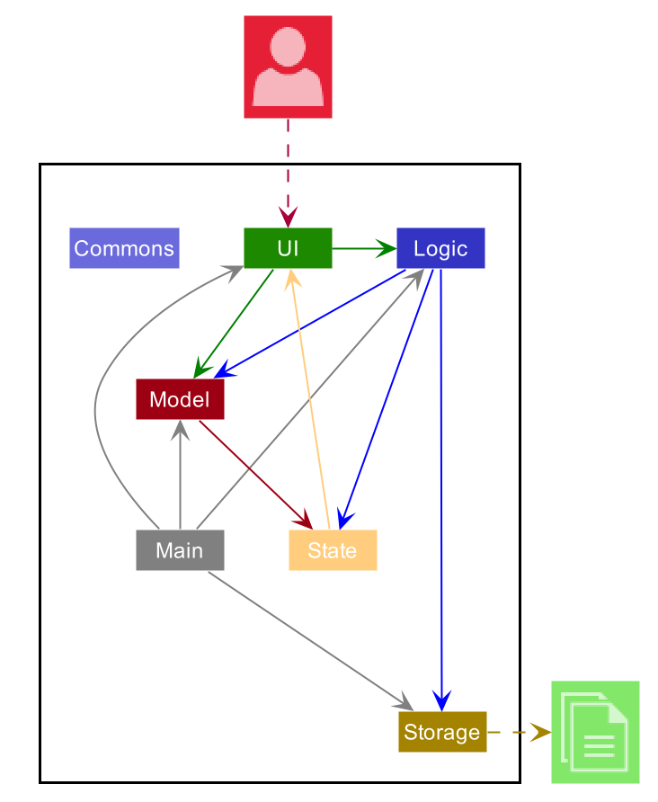

The ***Architecture Diagram*** given above explains the high-level design of the App. Given below is a quick overview of each component.

:bulb: **Tip:** The `.puml` files used to create diagrams in this document can be found in the [diagrams](https://github.com/AY2021S1-CS2103T-T10-3/tp/tree/master/docs/diagrams) folder. Refer to the [_PlantUML Tutorial_ at se-edu/guides](https://se-education.org/guides/tutorials/plantUml.html) to learn how to create and edit diagrams.

**`Main`** has two classes called [`Main`](https://github.com/AY2021S1-CS2103T-T10-3/tp/blob/master/src/main/java/chopchop/Main.java) and [`MainApp`](https://github.com/AY2021S1-CS2103T-T10-3/tp/blob/master/src/main/java/chopchop/MainApp.java). It is responsible for,
* At app launch: Initializes the components in the correct sequence, and connects them up with each other.
* At shut down: Shuts down the components and invokes cleanup methods where necessary.

[**`Commons`**](#common-classes) represents a collection of classes used by multiple other components.

The rest of the App consists of four components.

* [**`UI`**](#ui-component): The UI of the App.
* [**`Logic`**](#logic-component): The command executor.
* [**`Model`**](#model-component): Holds the data of the App in memory.
* [**`Storage`**](#storage-component): Reads data from, and writes data to, the hard disk.

Each of the four components,

* defines its *API* in an `interface` with the same name as the Component.
* exposes its functionality using a concrete `{Component Name}Manager` class (which implements the corresponding API `interface` mentioned in the previous point.

For example, the `Logic` component (see the class diagram given below) defines its API in the `Logic.java` interface and exposes its functionality using the `LogicManager.java` class which implements the `Logic` interface.

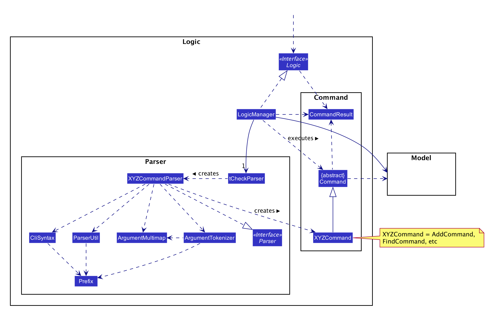

**How the architecture components interact with each other**

The *Sequence Diagram* below shows how the components interact with each other for the scenario where the user issues the command `delete recipe #1`.

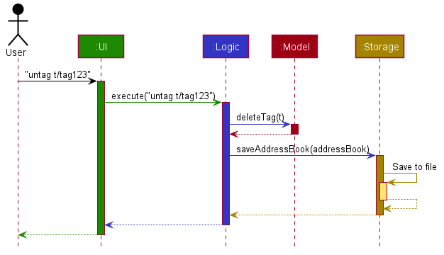

The sections below give more details of each component.

### UI component

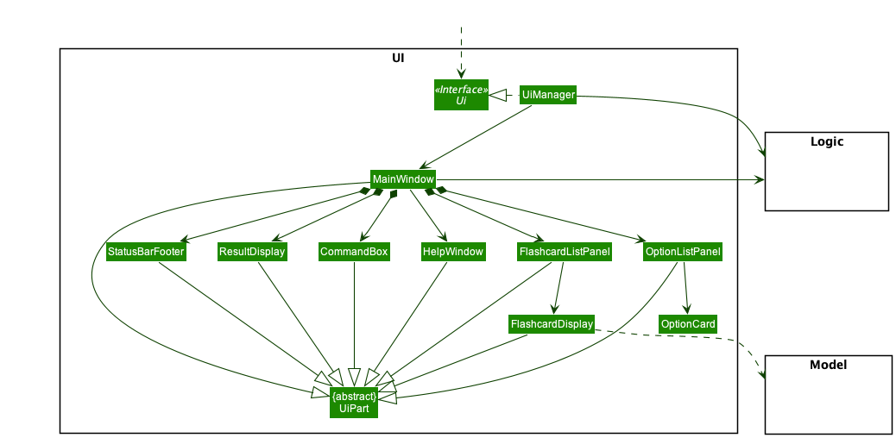

**API** :
[`Ui.java`](https://github.com/AY2021S1-CS2103T-T10-3/tp/blob/master/src/main/java/chopchop/ui/Ui.java)

The UI consists of a `MainWindow` that is made up of parts e.g.`HelpWindow`, `PinBox`, `CommandOutput`, `DisplayController`. All these, including the `MainWindow`, inherit from the abstract `UiPart` class.

The `UI` component uses JavaFx UI framework. The layout of these UI parts are defined in matching `.fxml` files that are in the `src/main/resources/view` folder. For example, the layout of the [`MainWindow`](https://github.com/AY2021S1-CS2103T-T10-3/tp/blob/master/src/main/java/chopchop/ui/MainWindow.java) is specified in [`MainWindow.fxml`](https://github.com/AY2021S1-CS2103T-T10-3/tp/blob/master/src/main/resources/view/MainWindow.fxml)

The `UI` component,

* Executes user commands using the `Logic` component.
* Listens for changes to `Model` data so that the UI can be updated with the modified data.

### Logic component
TODO: Update to actually reflect proper Logic structure

**API** :
[`Logic.java`](https://github.com/AY2021S1-CS2103T-T10-3/tp/blob/master/src/main/java/chopchop/logic/Logic.java)

1. `Logic` uses the `CommandParser` class to parse the user command.
1. This results in a `Command` object which is executed by the `LogicManager`.
1. The command execution can affect the `Model` (e.g. adding a person).
1. The result of the command execution is encapsulated as a `CommandResult` object which is passed back to the `Ui`.
1. In addition, the `CommandResult` object can also instruct the `Ui` to perform certain actions, such as displaying help to the user.
1. After command execution, the command is saved by the `HistoryManager` to keep track of command history and allow for undoing/redoing of commands.

Given below is the Sequence Diagram for interactions within the `Logic` component for the `execute("delete recipe #1")` API call.

### Model component

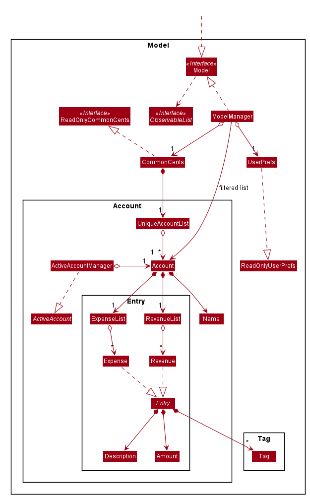

**API** : [`Model.java`](https://github.com/AY2021S1-CS2103T-T10-3/tp/blob/master/src/main/java/chopchop/model/Model.java)

The `Model`,

* stores a `UserPref` object that represents the user’s preferences.
* stores the recipe and ingredient book data.
* exposes an unmodifiable `ObservableList<Recipe>` and `ObservableList<Ingredient>` that can be 'observed' e.g. the UI can be bound to this list so that the UI automatically updates when the data in the list change.
* does not depend on any of the other three components.

### Storage component

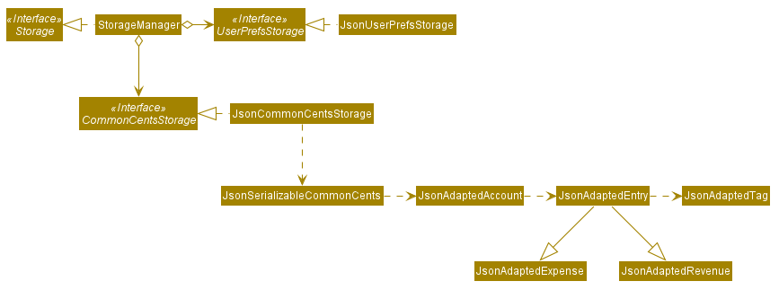

**API** : [`Storage.java`](https://github.com/AY2021S1-CS2103T-T10-3/tp/blob/master/src/main/java/chopchop/storage/Storage.java)

The `Storage` component,
* can save `UserPref` objects in json format and read it back.
* can save the recipe and ingredient book data in json format and read it back.

### Common classes

Classes used by multiple components are in the `chopchop.commons` package.

--------------------------------------------------------------------------------------------------------------------

## **Implementation**

This section describes some noteworthy details on how certain features are implemented.

### \[Proposed\] Undo/redo feature

#### Proposed Implementation

The proposed undo/redo mechanism is facilitated by `VersionedAddressBook`. It extends `AddressBook` with an undo/redo history, stored internally as an `addressBookStateList` and `currentStatePointer`. Additionally, it implements the following operations:

* `VersionedAddressBook#commit()` — Saves the current address book state in its history.
* `VersionedAddressBook#undo()` — Restores the previous address book state from its history.
* `VersionedAddressBook#redo()` — Restores a previously undone address book state from its history.

These operations are exposed in the `Model` interface as `Model#commitAddressBook()`, `Model#undoAddressBook()` and `Model#redoAddressBook()` respectively.

Given below is an example usage scenario and how the undo/redo mechanism behaves at each step.

Step 1. The user launches the application for the first time. The `VersionedAddressBook` will be initialized with the initial address book state, and the `currentStatePointer` pointing to that single address book state.

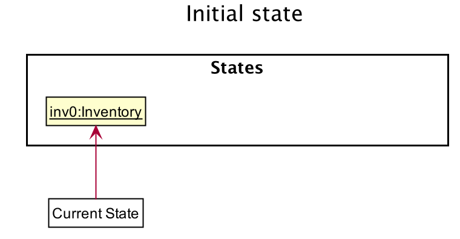

Step 2. The user executes `delete 5` command to delete the 5th person in the address book. The `delete` command calls `Model#commitAddressBook()`, causing the modified state of the address book after the `delete 5` command executes to be saved in the `addressBookStateList`, and the `currentStatePointer` is shifted to the newly inserted address book state.

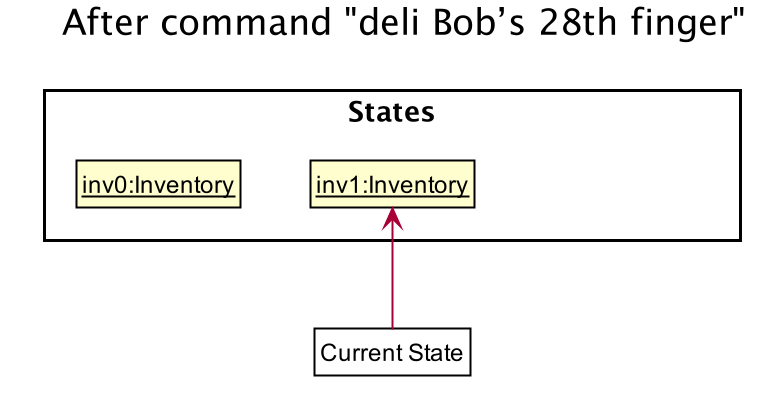

Step 3. The user executes `add n/David …​` to add a new person. The `add` command also calls `Model#commitAddressBook()`, causing another modified address book state to be saved into the `addressBookStateList`.

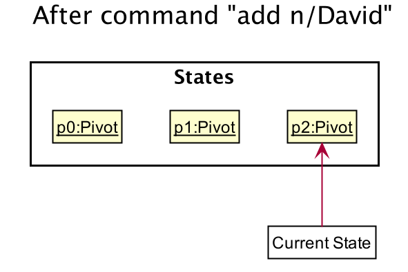

:information_source: **Note:** If a command fails its execution, it will not call `Model#commitAddressBook()`, so the address book state will not be saved into the `addressBookStateList`.

Step 4. The user now decides that adding the person was a mistake, and decides to undo that action by executing the `undo` command. The `undo` command will call `Model#undoAddressBook()`, which will shift the `currentStatePointer` once to the left, pointing it to the previous address book state, and restores the address book to that state.

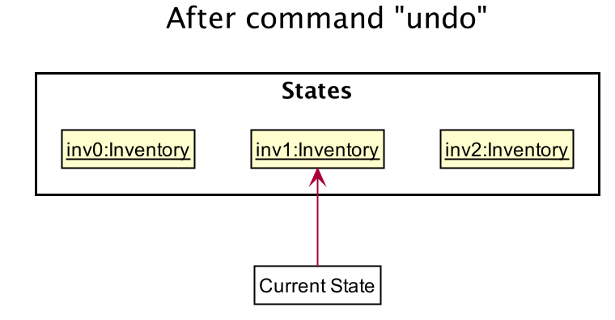

:information_source: **Note:** If the `currentStatePointer` is at index 0, pointing to the initial AddressBook state, then there are no previous AddressBook states to restore. The `undo` command uses `Model#canUndoAddressBook()` to check if this is the case. If so, it will return an error to the user rather
than attempting to perform the undo.

The following sequence diagram shows how the undo operation works:

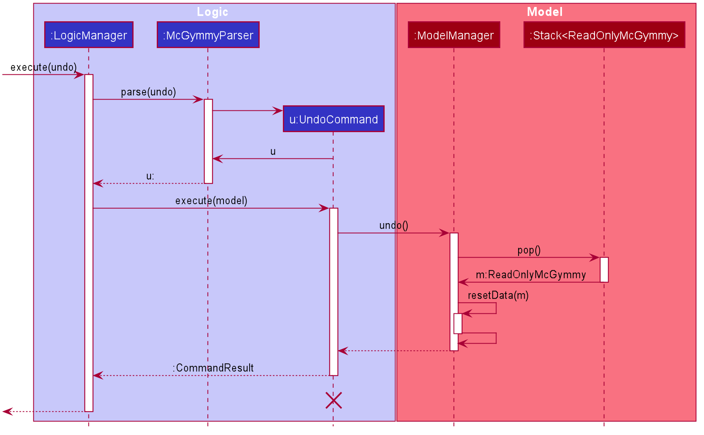

:information_source: **Note:** The lifeline for `UndoCommand` should end at the destroy marker (X) but due to a limitation of PlantUML, the lifeline reaches the end of diagram.

The `redo` command does the opposite — it calls `Model#redoAddressBook()`, which shifts the `currentStatePointer` once to the right, pointing to the previously undone state, and restores the address book to that state.

:information_source: **Note:** If the `currentStatePointer` is at index `addressBookStateList.size() - 1`, pointing to the latest address book state, then there are no undone AddressBook states to restore. The `redo` command uses `Model#canRedoAddressBook()` to check if this is the case. If so, it will return an error to the user rather than attempting to perform the redo.

Step 5. The user then decides to execute the command `list`. Commands that do not modify the address book, such as `list`, will usually not call `Model#commitAddressBook()`, `Model#undoAddressBook()` or `Model#redoAddressBook()`. Thus, the `addressBookStateList` remains unchanged.

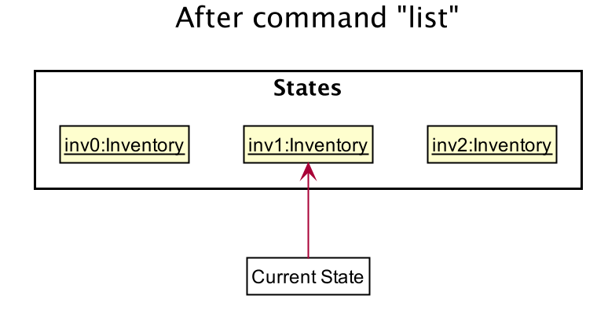

Step 6. The user executes `clear`, which calls `Model#commitAddressBook()`. Since the `currentStatePointer` is not pointing at the end of the `addressBookStateList`, all address book states after the `currentStatePointer` will be purged. Reason: It no longer makes sense to redo the `add n/David …​` command. This is the behavior that most modern desktop applications follow.

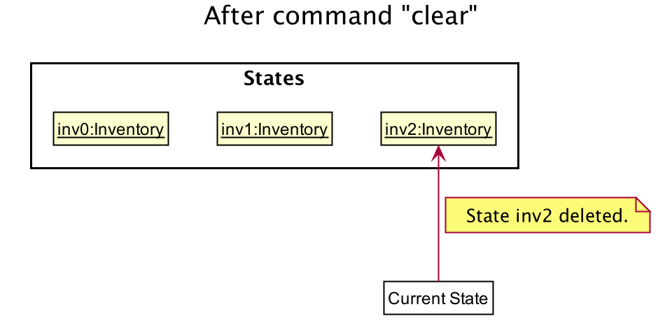

The following activity diagram summarizes what happens when a user executes a new command:

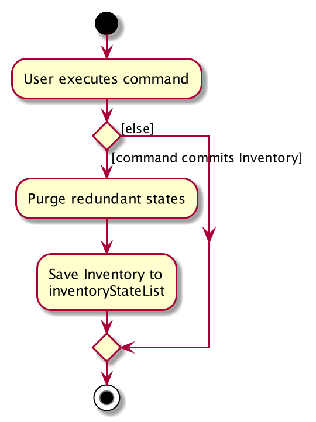

#### Design consideration:

##### Aspect: How undo & redo executes

* **Alternative 1 (current choice):** Saves the entire address book.
  * Pros: Easy to implement.
  * Cons: May have performance issues in terms of memory usage.

* **Alternative 2:** Individual command knows how to undo/redo by
  itself.
  * Pros: Will use less memory (e.g. for `delete`, just save the person being deleted).
  * Cons: We must ensure that the implementation of each individual command are correct.

_{more aspects and alternatives to be added}_

### \[Proposed\] Data archiving

_{Explain here how the data archiving feature will be implemented}_

--------------------------------------------------------------------------------------------------------------------

## **Documentation, logging, testing, configuration, dev-ops**

* [Documentation guide](Documentation.md)
* [Testing guide](Testing.md)
* [Logging guide](Logging.md)
* [Configuration guide](Configuration.md)
* [DevOps guide](DevOps.md)

--------------------------------------------------------------------------------------------------------------------

## **Appendix: Requirements**

### Product scope

**Target user profile**: People that cook daily, who need a way to manage recipes and their fridge contents.

**Value proposition**: Manages recipes and fridge inventory/expiry, and automatically suggests recipes to cook.

### User stories

Priorities: High (must have) - `* * *`, Medium (nice to have) - `* *`, Low (unlikely to have) - `*`

| Priority | As a ...                              | I want to ...                                                                     | So that I can ...                                      |
| -------- | ------------------------------------- | --------------------------------------------------------------------------------- | ------------------------------------------------------ |
| `* * *`  | person learning how to cook           | view my recipes                                                                   | not get the instructions wrong                         |
| `* * *`  | forgetful home cook                   | record recipes that I learnt from my friends and television shows                 | try to cook them in the future                         |                                                                        |
| `* * *`  | person that cannot decide             | select recipes to cook automatically based on the ingredients that i have         | eat a wider variety of meals                           |
| `* *`    | home cook who buys a lot of groceries | Enter the long list of products that I have bought while referring to the receipt | I can easily enter a large number of groceries at once |
| `* *`    | person on a diet                      | sort recipes based on calorie count                                               | choose to cook lower-calorie meals                     |
| `*`      | busy mother                           | enter the list of recipes I want to cook for the week                             | find out which groceries I need to buy                 |

### Use cases

(For all use cases below, the **System** is the `Food Recipe Management System (FRMS)` and the **Actor** is the `user`, unless specified otherwise)

**Use case: U1 - Add recipe**

**MSS:**

1. User chooses to add a recipe.
2. User enters the details according to the format.
3. FRMS displays a confirmation message with the new recipe.

    Use case ends. 

**Extensions:**  
* 2a. FRMS detects invalid input format.
    * 2a1. FRMS displays error messages.
    * 2a2. User enters new data. 
	     Steps a-b are repeated until the data entered are correct.  
	      User case resumes from step 3.
* 2b. FRMS detects a duplicate recipe.
    * 2a1. FRMS displays error messages.
    * 2a2. User enters new data. 
	     Steps a-b are repeated until the data entered are correct.  
	      User case resumes from step 3.	      

**Use case: U2 - Delete recipe**

**MSS:** 

1. User chooses to delete a recipe.
2. User enters the recipe name.
3. FRMS displays a confirmation message.

    Use case ends. 

**Extensions:**  
* 2a. FRMS detects invalid input format.
    * 2a1. FRMS displays error messages.
    * 2a2. User enters new data. 
	     Steps a-b are repeated until the data entered are correct.  
	      User case resumes from step 3.
* 2b. FRMS detects invalid input of recipe name.
    * 2a1. FRMS displays error messages.
    * 2a2. User enters new data. 
	     Steps a-b are repeated until the data entered are correct.  
	      User case resumes from step 3.

**Use case: U3 - View recipe**

**MSS:** 

1. User chooses to view all recipes.
2. User requests for the recipes.
3. FRMS display all the recipes.

    Use case ends. 

**Extensions:**  
* 2a. FRMS detects invalid input format.
    * 2a1. FRMS displays error messages.
    * 2a2. User enters data according to the correct format.
	     Steps a-b are repeated until the data entered are correct.  
	      User case resumes from step 3.

**Use case: U4 - Filter recipes**

**MSS:** 

1. User chooses to view a list of filtered recipes.
2. User enters the filter conditions.
3. FMRS displays a filtered list of recipes.

    Use case ends. 

**Extensions:**  
* 2a. FRMS detects invalid input format.
    * 2a1. FRMS displays error messages.
    * 2a2. User enters new data. 
	     Steps a-b are repeated until the data entered are correct.  
	      User case resumes from step 3.
* 2b. Filtered list does not contain any recipes.
    * 2a1. FRMS displays error messages.
    * 2a2. User enters new data. 
	     Steps a-b are repeated until the data entered are correct.  
	      User case resumes from step 3.

**Use case: U5 - List ingredients**

**MSS:** 

1. User chooses to view all ingredients.
2. User inputs the command to request for the ingredients.
3. FRMS shows the confirmation message and displays the complete list of ingredients.

    Use case ends. 
     
**Extensions:**  
* 2a. FRMS detects invalid input format.
    * 2a1. FRMS displays error messages.
    * 2a2. User enters data according to the correct format.  
	     Steps a-b are repeated until the data entered are correct.  
	      User case resumes from step 3.

**Use case: U6 - Add Ingredient**

**MSS:**

1. User chooses to add an ingredient.
2. User enters the details according to the format.
3. FRMS displays a confirmation message with the new ingredient.

**Extensions:**

* 2a. FRMS detects invalid input format.
    * 2a1. FRMS displays error messages.
    * 2a2. User enters new data.  
      Steps a-b are repeated until the data entered are correct.  
	      User case resumes from step 3.  
* 2b. FRMS detects a duplicate ingredient.
    * 2b1. FRMS displays error messages.
    * 2b2. User enters new data.  
      Steps a-b are repeated until the data entered are correct.  
	      User case resumes from step 3.  

**Use case: U7 - Delete Ingredient**

**MSS:**

1. User chooses to delete an ingredient.
2. User enters the details according to the format.
3. FRMS displays a confirmation message.

**Extensions:**
* 2a. FRMS detects invalid input format.
    * 2a1. FRMS displays error messages.
    * 2a2. User enters new data.  
      Steps a-b are repeated until the data entered are correct.  
	      User case resumes from step 3.  
* 2b. FRMS detects invalid input of ingredient name.
    * 2b. FRMS displays error messages.
    * 2b. User enters new data.  
      Steps a-b are repeated until the data entered are correct.  
	      User case resumes from step 3.  

**Use case: U8 - View expiring ingredients** 

**MSS:**
1. User chooses to view a list of expiring ingredients.
2. User enters the date range.
3. FMRS displays a filtered list of expiring ingredients.

**Extensions:**
* 2a. FRMS detects invalid input format.
    * 2a1. FRMS displays error messages.
    * 2a2. User enters new data.  
      Steps a-b are repeated until the data entered are correct.  
	      User case resumes from step 3.  
* 2b. Filtered list does not contain any ingredients in the date range.
    * 2a1. FRMS displays error messages.
    * 2a2. User enters new data.  
      Steps a-b are repeated until the data entered are correct.  
	      User case resumes from step 3.

**Use case: U9 - Filter ingredients**
 
**MSS:**
1. User chooses to view a list of filtered ingredients.
2. User enters the filter conditions.
3. FMRS displays a filtered list of ingredients.

**Extensions:**

* 2a. FRMS detects invalid input format.
    * 2a1. FRMS displays error messages.
    * 2a2. User enters new data.  
      Steps a-b are repeated until the data entered are correct.  
	      User case resumes from step 3.  
* 2b. Filtered list does not contain any ingredients.
    * 2a1. FRMS displays error messages.
    * 2a2. User enters new data.  
      Steps a-b are repeated until the data entered are correct.  
	      User case resumes from step 3.      

### Non-Functional Requirements

1. Should work on any mainstream OS as long as it has Java 11 or above installed.
2. Should be able to hold up to 1000 persons without a noticeable sluggishness in performance for typical usage.
3. A user with above average typing speed for regular English text (i.e. not code, not system admin commands) should be able to accomplish most of the tasks faster using commands than using the mouse.
4. Should be able to add multiple recipes at once
5. Should have autocompletion for commands
6. Should be able to fuzzy search for recipes/food
7. Should be able to manage recipes in a interactive manner (like Google Assistant)
8. Should have input sanitisation

### Glossary

* **Mainstream OS:** Latest version of Windows, MacOS or any Linux distro
* **Recipe:** List of ingredients and steps needed to cook a dish

--------------------------------------------------------------------------------------------------------------------

## **Appendix: Instructions for manual testing**

Given below are instructions to test the app manually.

:information_source: **Note:** These instructions only provide a starting point for testers to work on;
testers are expected to do more *exploratory* testing.

### Launch and shutdown

1. Initial launch

   1. Download the jar file and copy into an empty folder

   1. Double-click the jar file Expected: Shows the GUI with a set of sample contacts. The window size may not be optimum.

1. Saving window preferences

   1. Resize the window to an optimum size. Move the window to a different location. Close the window.

   1. Re-launch the app by double-clicking the jar file. 
       Expected: The most recent window size and location is retained.

1. _{ more test cases … }_

### Deleting a person

1. Deleting a person while all persons are being shown

   1. Prerequisites: List all persons using the `list` command. Multiple persons in the list.

   1. Test case: `delete 1` 
      Expected: First contact is deleted from the list. Details of the deleted contact shown in the status message. Timestamp in the status bar is updated.

   1. Test case: `delete 0` 
      Expected: No person is deleted. Error details shown in the status message. Status bar remains the same.

   1. Other incorrect delete commands to try: `delete`, `delete x`, `...` (where x is larger than the list size) 
      Expected: Similar to previous.

1. _{ more test cases … }_

### Saving data

1. Dealing with missing/corrupted data files

   1. _{explain how to simulate a missing/corrupted file, and the expected behavior}_

1. _{ more test cases … }_
