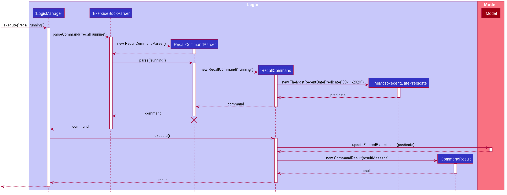

# Calo Developer Guide

## Table of Contents
1.[ About This Guide](#1-about-this-guide)  
2.[ Setting Up](#2-setting-up)  
3.[ Design](#3-design)  
* [3.1. Architecture](#31-architecture)  
* [3.2. Ui Component](#32-ui-component)
* [3.3. Logic Component](#33-logic-component)
* [3.4. Model Component](#34-model-component)
* [3.4. Storage Component](#35-storage-component)
* [3.4. Common Class](#36-common-classes)

4.[ Implementation](#4-implementation)  
5.[ Documentation, Logging and Testing](#5-documentation-logging-testing-configuration-dev-ops)  
6.[ Appendix A: Requirements](#6-appendix-a-requirements)  
7.[ Appendix B: User Stories](#7-appendix-b-user-stories)  
8.[ Appendix C: Use Cases](#8-appendix-c-use-cases)  
9.[ Appendix D: Non-Functional Requirements](#9-appendix-d-non-functional-requirements)  
10.[ Appendix E: Instructions For Manual Testing](#10-appendix-e-instructions-for-manual-testing)

--------------------------------------------------------------------------------------------------------------------

## 1. About This Guide

This document serves as a developer guide for Calo App with sufficient and comprehensive overview of the software
so that new developers, like you, will have a working knowledge of the application by the end of the guide.  

Note that this guide only provide reasonable depth. By no means this guide serves as a replacement for the actual code. 

--------------------------------------------------------------------------------------------------------------------
## 2. Setting Up

Refer to the guide [_Setting up and getting started_](SettingUp.md).

--------------------------------------------------------------------------------------------------------------------

## 3. Design

### 3.1. Architecture

The ***Architecture Diagram*** given above explains the high-level design of the App. Given below is a quick overview of each component.

:bulb: **Tip:** The `.puml` files used to create diagrams in this document can be found in the [diagrams](https://github.com/AY2021S1-CS2103T-W17-2/tp/tree/master/docs/diagrams/) folder. Refer to the [_PlantUML Tutorial_ at se-edu/guides](https://se-education.org/guides/tutorials/plantUml.html) to learn how to create and edit diagrams.

**`Main`** has two classes called [`Main`](https://github.com/AY2021S1-CS2103T-W17-2/tp/blob/master/src/main/java/seedu/address/Main.java) and [`MainApp`](https://github.com/AY2021S1-CS2103T-W17-2/tp/blob/master/src/main/java/seedu/address/ExerciseMainApp.java). It is responsible for,
* At app launch: Initializes the components in the correct sequence, and connects them up with each other.
* At shut down: Shuts down the components and invokes cleanup methods where necessary.

[**`Commons`**](#36-common-classes) represents a collection of classes used by multiple other components.

The rest of the App consists of four components.

* [**`UI`**](#32-ui-component): The UI of the App.
* [**`Logic`**](#33-logic-component): The command executor.
* [**`Model`**](#34-model-component): Holds the data of the App in memory.
* [**`Storage`**](#35-storage-component): Reads data from, and writes data to, the hard disk.

Each of the four components,

* defines its *API* in an `interface` with the same name as the Component.
* exposes its functionality using a concrete `{Component Name}Manager` class (which implements the corresponding API `interface` mentioned in the previous point.

For example, the `Logic` component (see the class diagram given below) defines its API in the `Logic.java` interface and exposes its functionality using the `LogicManager.java` class which implements the `Logic` interface.

**How the architecture components interact with each other**

The *Sequence Diagram* below shows how the components interact with each other for the scenario where the user issues the command `delete 1`.

The sections below give more details of each component.

### 3.2. UI component

**API** :
[`Ui.java`](https://github.com/AY2021S1-CS2103T-W17-2/tp/blob/master/src/main/java/seedu/address/ui/Ui.java)

The UI consists of a `MainWindow` that is made up of parts e.g.`CommandBox`, `ResultDisplay`, `ExerciseListPanel`, `StatusBarFooter` etc. All these, including the `MainWindow`, inherit from the abstract `UiPart` class.

The `UI` component uses JavaFx UI framework. The layout of these UI parts are defined in matching `.fxml` files that are in the `src/main/resources/view` folder. For example, the layout of the [`MainWindow`](https://github.com/AY2021S1-CS2103T-W17-2/tp/blob/master/src/main/java/seedu/address/ui/MainWindow.java) is specified in [`MainWindow.fxml`](https://github.com/AY2021S1-CS2103T-W17-2/tp/blob/master/src/main/resources/view/MainWindow.fxml)

The `UI` component,

* Executes user commands using the `Logic` component.
* Listens for changes to `Model` data so that the UI can be updated with the modified data.

### 3.3. Logic component

**API** :
[`Logic.java`](https://github.com/AY2021S1-CS2103T-W17-2/tp/blob/master/src/main/java/seedu/address/logic/Logic.java)

1. `Logic` uses the `ExerciseBookParser` class to parse the user command.
1. This results in a `Command` object which is executed by the `LogicManager`.
1. The command execution can affect the `Model` (e.g. adding an exercise).
1. The result of the command execution is encapsulated as a `CommandResult` object which is passed back to the `Ui`.
1. In addition, the `CommandResult` object can also instruct the `Ui` to perform certain actions, such as displaying help to the user.

Given below is the Sequence Diagram for interactions within the `Logic` component for the `execute("delete 1")` API call.

:information_source: **Note:** The lifeline for `DeleteCommandParser` should end at the destroy marker (X) but due to a limitation of PlantUML, the lifeline reaches the end of diagram.

### 3.4. Model component

**API** : [`Model.java`](https://github.com/AY2021S1-CS2103T-W17-2/tp/blob/master/src/main/java/seedu/address/model/ExerciseModel.java)

The `Model`,

* stores a `UserPref` object that represents the user’s preferences.
* stores the Exercise book data.
* exposes an unmodifiable `ObservableList<Exercise>` that can be 'observed' e.g. the UI can be bound to this list so that the UI automatically updates when the data in the list change.
* does not depend on any of the other three components.

:information_source: **Note:** An alternative (arguably, a more OOP) model is given below. It has a `Tag` list in the `ExerciseBook`, which `Exercise` references. This allows `ExerciseBook` to only require one `Tag` object per unique `Tag`, instead of each `Exercise` needing their own `Tag` object. 

### 3.5. Storage component

**API** : [`Storage.java`](https://github.com/AY2021S1-CS2103T-W17-2/tp/blob/master/src/main/java/seedu/address/storage/Storage.java)

The `Storage` component,
* can save `UserPref` objects in json format and read it back.
* can save the exercise book data in json format and read it back.

### 3.6. Common classes

Classes used by multiple components are in the `seedu.addressbook.commons` package.

--------------------------------------------------------------------------------------------------------------------

## 4. Implementation

This section describes some noteworthy details on how certain features are implemented.

### 4.1. Searching for specific `exercise`

(by Xinyi)

This section addresses how the `find` and `recall` commands work. 

The `find` command allows users to search through the Exercise Book based on what users enter for the `Field`s. Users should enter at least one `Field`. The search results can then be displayed in the GUI's Exercise Book.

`Field`s here indicate which `Exercise` attributes we are interested in. Exact search finds `Exercise` objects with values that exactly match the user-specified values of the fields (`Name`, `Description`, `Date` ,`Calories`).
Meanwhile, keyword search finds matches for the user-entered keywords in any part of the `Name` or any part of the `Description`.
If the user uses exact search and keyword search together, it will find `Exercise` objects that match both the exact search and keyword search.

Meanwhile, the `recall` command allows users to search for the most recent exercise with the specific name entered by the user.

The above commands rely on `FindCommand` and `RecallCommand` objects respectively. Objects of both classes use a `Predicate<Exercise>` object to filter through the `Exercise` list,
and the exercises that evaluate the predicates to be true will be listed in GUI Exercise List.

#### 4.1.1. Implementation

To search via the user-specified `Exercise` attributes, We use `FindCommandParser` to create the `PropertiesMatchPredicate` with all the user inputs. This predicate returns true only when the exercise matches all the given fields.
This predicate is then used to construct a new `FindCommand` object, which changes the GUI display when executed.

The sequence diagram below demonstrates how the `find` command works:

How the `find` command works:

Step 1: `LogicManager` executes the user input, using `ExerciseBookParser` to realise this is a `find` command, and create a new `FindCommandParser` object.

Step 2: The `FindCommandParser` object parses the user-entered arguments, and creates a `PropertiesMatchPredicate`.

Step 3: This `PropertiesMatchPredicate` object is  then used to construct a new `FindCommand` object, returned to `LogicManager`.

Step 4: `LogicManager` calls the `execute` method of the created `FindCommand`, which filters for `Exercise` objects that evaluate the predicate created previously to be true.
It then returns a new CommandResult object reflecting the status of the execution. These changes are eventually reflected in the GUI.

The `find` command therefore searches through the existing Exercise List and then displays the relevant search results in the GUI’s Exercise List.

To search for the most recent exercise with the user-specified `Name`, we use `RecallCommandParser` to parse the user input and create a new `RecallCommand` object with the parsed input.
The `RecallCommand` then goes through the existing Exercise List to find the most recent date, creates the `TheMostRecentDatePredicate`, and updates the GUI display when executed.

The sequence diagram below demonstrates how the `recall` command works:

How the `recall` command works:

Step 1: `LogicManager` executes the user input, using `ExerciseBookParser` to realise this is a `recall` command, and create a new `RecallCommandParser` object.

Step 2: The `RecallCommandParser` object parses the user-entered arguments, and creates a `RecallCommand` object which is returned to `LogicManager`.

Step 3: `LogicManager` calls the `execute` method of the created `RecallCommand`, which creates the `TheMostRecentDatePredicate` and filters for `Exercise` objects that evaluate the predicate created previously to be true.
It then returns a new CommandResult object reflecting the status of the execution. These changes are eventually reflected in the GUI.

The `recall` command therefore searches for the most recent exercise with the specified name in the existing Exercise List and then displays the relevant search results in the GUI.

#### 4.1.2. Design considerations

##### Aspect: Case-sensitivity for user inputs
* **Alternative 1 (current choice):** The inputs for `Name`, `Description`, and `Keyword` are case-insensitive.
  * Pros: More user-friendly.
  * Cons: Cannot get precise results if the user wants to search in a case-sensitive way.

* **Alternative 2:** The inputs for `Name`, `Description`, and `Keyword` are case-sensitive.
  * Pros: Users can get exact match for their inputs. e.g. Push Up will not match push UP.
  * Cons: It is likely that users cannot clearly remember the case of `Name`s and `Description`s of the exercises. The `find` command will be harder for the user to use.

##### Aspect: How to find and display the most recent exercise
* **Alternative 1 (current choice):** Goes through the Exercise Book to find the most recent date and filters for the `Exercise` with specified `Name` and `Date`
  * Pros: Easy to implement. Uses the same exercise list as other commands do.
  * Cons: Users cannot get other information except for the most recent `Exercise`.

* **Alternative 2:** Get all the `Exercise`s with the specified name and reorder them by most recent.
  * Pros: Users can take a look at other similar `Exercise`s besides the most recent one.
  * Cons: Needs to create another Exercise List. Other commands will not work on the newly created list.

--------------------------------------------------------------------------------------------------------------------

## 5. Documentation, logging, testing, configuration, dev-ops

* [Documentation guide](Documentation.md)
* [Testing guide](Testing.md)
* [Logging guide](Logging.md)
* [Configuration guide](Configuration.md)
* [DevOps guide](DevOps.md)

--------------------------------------------------------------------------------------------------------------------

## 6. Appendix A: Requirements

### Product scope

**Target user profile**:

* has a need to manage their workouts
* prefer desktop apps over other types
* can type fast
* prefers typing to mouse interactions
* is reasonably comfortable using CLI apps

**Value proposition**: manage workouts faster than a typical mouse/GUI driven desktop/mobile app

### 7. Appendix B: User stories

Priorities: High (must have) - `* * *`, Medium (nice to have) - `* *`, Low (unlikely to have) - `*`

| Priority | As a …​                                    | I want to …​                     | So that I can…​                                                        |
| -------- | ------------------------------------------ | ------------------------------ | ---------------------------------------------------------------------- |
| `* * *`  | user                                       | add an exercise                | keep track of calories burnt through the day                           |
| `* * *`  | user                                       | have a system that tolerate invalid/incomplete command      |                                                                        |
| `* * *`  | data conscious user                        | list down all the exercises for the day       | monitor the calories burned accurately                                   |
| `* * *`  | user                                       | delete an exercise in case I key in wrongly          |  |
| `* *`    | user                                       | update an exercise             |                 |
| `* *`    | user                                       | save my data in a file         | import the saved data into the new computer                                                 |

*{More to be added}*

### 8. Appendix C: Use cases

(For all use cases below, the **System** is the `Calo` and the **Actor** is the `user`, unless specified otherwise)

  #### **Use case: add an exercise**

  *MSS*

1.  User requests to add an exercise

2.  Calo adds the exercise and displays on the Graph.
  Use case ends.

#### **Use case: Find exercises with a keyword**

*MSS*

1.  User requests to find exercises with a keyword
2.  Calo shows a list of exercises which contain the keyword
    Use case ends.

*Extensions*

    The list is empty  
      1a1. Calo shows a message indicating that no such exercise exists. 
    Use case ends.

#### **Use case: Update an exercise**

*MSS*

1.  User requests to update a specific exercise in the list
2.  Calo updates the exercise
    Use case ends. 
*Extensions*

    1a. The index is invalid 
      1a1. Calo shows a message indicating that no such exercise exists. 
    Use case ends.

#### **Use case: Delete an exercise**

*MSS*

1.  User requests to delete a specific exercise in the list.
2.  Calo deletes the exercise

    Use case ends.

*Extensions*

    1a. The index is invalid 
      1a1. Calo shows a message indicating that no such exercise exists. 
    Use case ends.

  #### **Use case: Archive data**
  *MSS*
  1.  User requests to archive data to a different file location
  2.  Calo archives data to the specified location
    Use case ends.

*Extensions*

    1a. User does not have permission to create file at specified location  
      1a1. Calo shows a message indicating that file cannot be created at specified file. 
    Use case ends.

  #### **Use case: List exercises**

  *MSS* 
  1.  User requests to list exercises
  2.  Calo shows a list of exercises
      Use case ends.

### 9. Appendix D: Non-Functional Requirements
1.  Should work on any _mainstream OS_ as long as it has Java `11` or above installed.
2.  Should be able to hold up to 1000 exercise items without a noticeable sluggishness in performance for typical usage.
3.  A user with above average typing speed for regular English text (i.e. not code, not system admin commands) should be able to accomplish most of the tasks faster using commands than using the mouse.

### Glossary

* **Calories Graph**: the graph that displays the trends of the user's calories burnt in the past 6 days (including today)
* **Exercise**: an exercise record entered by the user, consisting of exercise name, description, and date (optionally calories)
* **Exercise Tag**: Additional Tag that you want to assign to the Exercise you just did.
* **Mainstream OS**: Windows, Linux, Unix, OS-X
* **Muscle Tag**: the muscles that the exercise works out.
* **Template**: a skeleton of the template without date, muscleTag and exerciseTag. It exists to ensure that the user key in exercises, that he does frequently, more quickly.
--------------------------------------------------------------------------------------------------------------------

## 10. Appendix E: Instructions for manual testing

Given below are instructions to test the app manually.

:information_source: **Note:** These instructions only provide a starting point for testers to work on;
testers are expected to do more *exploratory* testing.

### Launch and shutdown
1. Initial launch
   1. Download the jar file and copy into an empty folder
   1. Double-click the jar file Expected: Shows the GUI with a set of sample contacts. The window size may not be optimum.
1. Saving window preferences
   1. Resize the window to an optimum size. Move the window to a different location. Close the window.
   1. Re-launch the app by double-clicking the jar file. 
       Expected: The most recent window size and location is retained.
1. _{ more test cases …​ }_

### Deleting an exercise
1. Deleting an exercise while all exercises are being shown
   1. Prerequisites: List all exercises using the `list` command. Multiple exercises in the list.
   1. Test case: `delete 1` 
      Expected: First contact is deleted from the list. Details of the deleted contact shown in the status message. Timestamp in the status bar is updated.
   1. Test case: `delete 0` 
      Expected: No exercise is deleted. Error details shown in the status message. Status bar remains the same.
   1. Other incorrect delete commands to try: `delete`, `delete x`, `...` (where x is larger than the list size) 
      Expected: Similar to previous.
1. _{ more test cases …​ }_

### Saving data

1. Dealing with missing/corrupted data files
   1. _{explain how to simulate a missing/corrupted file, and the expected behavior}_
1. _{ more test cases …​ }_
