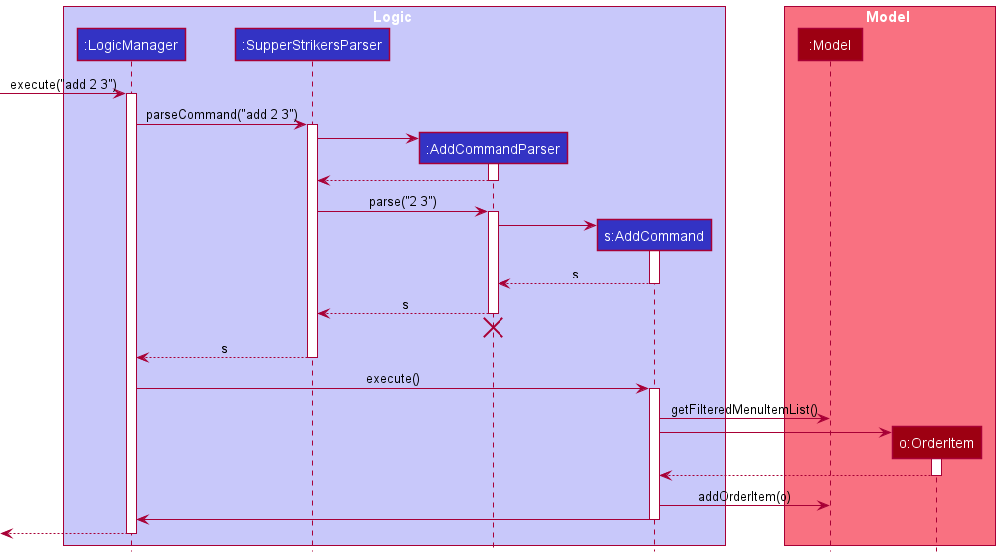
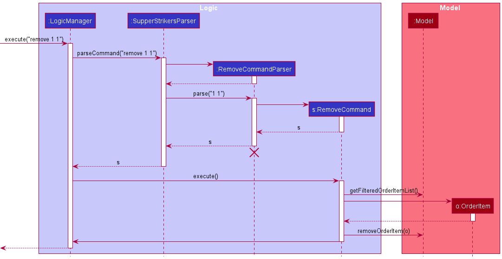
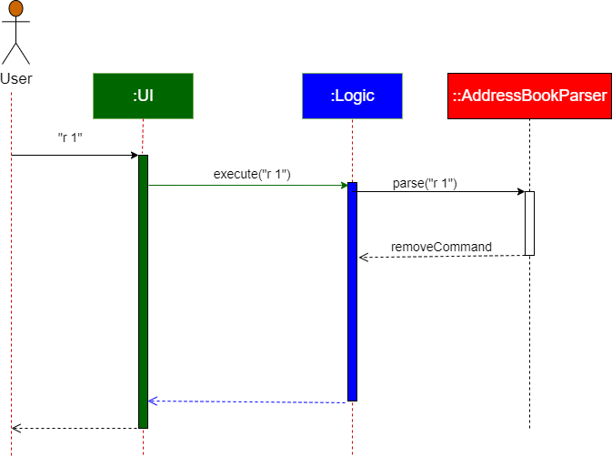
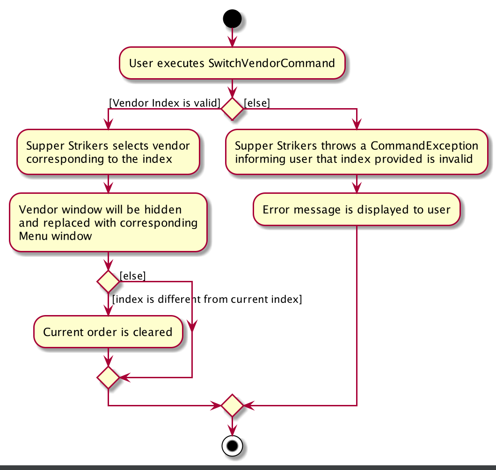
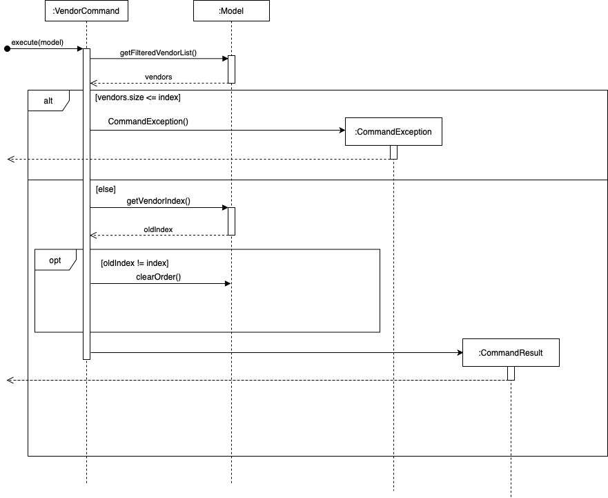

* Table of Contents
{:toc}

--------------------------------------------------------------------------------------------------------------------

## **Setting up, getting started**

Refer to the guide [_Setting up and getting started_](SettingUp.md).

--------------------------------------------------------------------------------------------------------------------

## **Design**

### Architecture

The ***Architecture Diagram*** given above explains the high-level design of the App. Given below is a quick overview of each component.

:bulb: **Tip:** The `.puml` files used to create diagrams in this document can be found in the [diagrams](https://github.com/AY2021S1-CS2103-T16-1/tp/tree/master/docs/diagrams) folder. Refer to the [_PlantUML Tutorial_ at se-edu/guides](https://se-education.org/guides/tutorials/plantUml.html) to learn how to create and edit diagrams.

**`Main`** has two classes called [`Main`](https://github.com/AY2021S1-CS2103-T16-1/tp/blob/master/src/main/java/seedu/address/Main.java) and [`MainApp`](https://github.com/AY2021S1-CS2103-T16-1/tp/blob/master/src/main/java/seedu/address/MainApp.java). It is responsible for,
* At app launch: Initializes the components in the correct sequence, and connects them up with each other.
* At shut down: Shuts down the components and invokes cleanup methods where necessary.

[**`Commons`**](#common-classes) represents a collection of classes used by multiple other components.

The rest of the App consists of four components.

* [**`UI`**](#ui-component): The UI of the App.
* [**`Logic`**](#logic-component): The command executor.
* [**`Model`**](#model-component): Holds the data of the App in memory.
* [**`Storage`**](#storage-component): Reads data from, and writes data to, the hard disk.

Each of the four components,

* defines its *API* in an `interface` with the same name as the Component.
* exposes its functionality using a concrete `{Component Name}Manager` class (which implements the corresponding API `interface` mentioned in the previous point.

For example, the `Logic` component (see the class diagram given below) defines its API in the `Logic.java` interface and exposes its functionality using the `LogicManager.java` class which implements the `Logic` interface.

**How the architecture components interact with each other**

The *Sequence Diagram* below shows how the components interact with each other for the scenario where the user issues the command `remove 1`.

The sections below give more details of each component.

### UI component

**API** :
[`Ui.java`](https://github.com/AY2021S1-CS2103-T16-1/tp/blob/master/src/main/java/seedu/address/ui/Ui.java)

The UI consists of a `MainWindow` that is made up of parts e.g.`CommandBox`, `ResultDisplay`, `PersonListPanel`, `StatusBarFooter` etc. All these, including the `MainWindow`, inherit from the abstract `UiPart` class.

The `UI` component uses JavaFx UI framework. The layout of these UI parts are defined in matching `.fxml` files that are in the `src/main/resources/view` folder. For example, the layout of the [`MainWindow`](https://github.com/AY2021S1-CS2103-T16-1/tp/blob/master/src/main/java/seedu/address/ui/MainWindow.java) is specified in [`MainWindow.fxml`](https://github.com/AY2021S1-CS2103-T16-1/tp/blob/master/src/main/resources/view/MainWindow.fxml)

The `UI` component,

* Executes user commands using the `Logic` component.
* Listens for changes to `Model` data so that the UI can be updated with the modified data.

### Logic component

**API** :
[`Logic.java`](https://github.com/se-edu/addressbook-level3/tree/master/src/main/java/seedu/address/logic/Logic.java)

1. `Logic` uses the `AddressBookParser` class to parse the user command.
1. This results in a `Command` object which is executed by the `LogicManager`.
1. The command execution can affect the `Model` (e.g. adding an order item).
1. The result of the command execution is encapsulated as a `CommandResult` object which is passed back to the `Ui`.
1. In addition, the `CommandResult` object can also instruct the `Ui` to perform certain actions, such as displaying help to the user.

Given below is the Sequence Diagram for interactions within the `Logic` component for the `execute("remove 1")` API call.

:information_source: **Note:** The lifeline for `RemoveCommandParser` should end at the destroy marker (X) but due to a limitation of PlantUML, the lifeline reaches the end of diagram.

### Model component

**API** : [`Model.java`](https://github.com/AY2021S1-CS2103-T16-1/tp/blob/master/src/main/java/seedu/address/model/Model.java)

The `Model`,

* stores a `UserPref` object that represents the user’s preferences.
* contains the `AddressBook` and `MenuManager`, `OrderManager` components.
    * `AddressBook` stores the data for vendors.
    * `MenuManager` stores the data for food items of the vendor's menu.
    * `OrderManager` stores the data for order items.

* Each of these components exposes an unmodifiable `ObservableList` that can be 'observed' e.g. the UI can be bound to this list so that the UI automatically updates when the data in the list change.
* does not depend on any of the other three components.

:information_source: **Note:** An alternative (arguably, a more OOP) model is given below. It has a `Tag` list in the `AddressBook`, which `Person` references. This allows `AddressBook` to only require one `Tag` object per unique `Tag`, instead of each `Person` needing their own `Tag` object. 

### Storage component

**API** : [`Storage.java`](https://github.com/AY2021S1-CS2103-T16-1/tp/blob/master/src/main/java/seedu/address/storage/Storage.java)

The `Storage` component,
* can save `UserPref` objects in json format and read it back.
* can save the address book data in json format and read it back.

### Common classes

Classes used by multiple components are in the `seedu.addressbook.commons` package.

--------------------------------------------------------------------------------------------------------------------

## **Implementation**

This section describes some noteworthy details on how certain features are implemented.

### Order Commands

Order commands represents the operations to which users interact with.

#### Add Command

- The Add Command allows the user to add an order item from the selected menu `Model#getFilteredFoodList()`.
- If the index provided is greater or less than the size of the menu, a `CommandException will be thrown`.
- If the quantity provided is less or equal to zero, a `CommandException will be thrown`.

The following diagram summarises the sequence when the AddCommand is executed.

Given below is an example usage scenario and how the AddCommand behaves at each step.

Step 1: The user launches the application for the first time, by default, no vendor is selected.

Step 2: The user selects a vendor with the VendorCommand `vendor i`, the corresponding menu will be loaded.

Step 3: The user enters the command `add 2 3` which adds item 2 from the menu with a quantity of 3.

Step 4: `Model#getFilteredFoodList()` is executed to retrieve the list of Food items or menu from the current vendor.

Step 5: AddCommand checks whether the index and quantity inputted is valid. Index and Quantity is valid.

Step 6: An OrderItem object is created from input quantity and the retrieved Food item.

Step 7: `Model#addOrderItem()` is executed to add the OrderItem into the `Model`.

#### Remove Command

- The RemoveCommand allows the user to remove an order from the selected menu `Model#getFilteredOrderItemList()`.
- If the index provided is greater or less than the size of the menu, a `CommandException will be thrown`.
- If the quantity provided is less or equal to zero, a `CommandException will be thrown`.

The following diagram summarises the sequence when the RemoveCommand is executed.

Given below is an example usage scenario and how the RemoveCommand behaves at each step.

Step 1: The user has selected a vendor with `vendor i`.

Step 2: The user has added items with `add i qty`.

Step 3: The user enters the command `remove 1 1` which removes 1 quantity of the item at the 1st index in the order.

Step 4: `Model#getFilteredOrderItemList()` is executed to retrieve the list of OrderItems from the current order.

Step 5: RemoveCommand checks whether the index and quantity inputted is valid. Index and Quantity is valid.

Step 6: A new OrderItem object is created from input quantity and the retrieved OrderItem.

Step 7: `Model#removeOrderItem()` is executed to remove the related OrderItem.

#### Clear Command

- The ClearCommand allows the user to clear all orders in the current order.
- If the current Order has no items, a `CommandException will be thrown`.

The following diagram summarises the sequence when the ClearCommand is executed.

Given below is an example usage scenario and how the ClearCommand behaves at each step.

Step 1: The user has selected a vendor with `vendor i`.

Step 2: The user has added items with `add i qty`.

Step 3: The user enters the command `clear`.

Step 4: ClearCommand checks whether the order has OrderItems with `Model#getOrderSize()`. The order has OrderItems.

Step 5: `Model#clearOrder()` is executed to clear all OrderItems from the order.

### Undo feature

Changes made to the Order can be undone by using the `undo` command.

The OrderManager starts out with a Stack of Order `orderHistory` and a main Order `order`, which
represents the past versions of the order, and the most current order respectively. Any changes (ie. `add`, `remove`,
`clear` etc.) should be done to `order`. After the changes are done, the method `OrderManager#saveChanges()` should be
called, which saves a copy (see `Order#makeCopy()`) of `order` to the `orderHistory`. If the user requests an undo,
the head of `orderHistory` will be popped, and `order` is now a copy of the head of the popped stack.

`OrderManager#saveChanges()` works based on the assumption that the head of `orderHistory` is always equal to `order`.
If not and a change is made to the order followed by calling `OrderManager#saveChanges()`, then the `order` right before 
the change is not saved. Therefore, the method `orderHistory#clear()` should not be called unless the developer 
understands the effect of doing so. This also means if a method changes the order and it should be able to be undone, 
`saveChanges()` must be called at the end of the method.

_{more aspects and alternatives to be added}_

### \[Proposed\] Data archiving

_{Explain here how the data archiving feature will be implemented}_

### Friendly Syntax

The friendly syntax allows users to type in just the prefix of a command to execute it.

The following diagram summarizes the sequence when the RemoveCommand is executed from the user input of `r 1`.

Given below is an example usage scenario and how the friendly syntax behaves at the parse stage.

Step 1: The user launches the application for the first time and enters the vendor command `vendor 1`.

Step 2: SupperStrikers loads the menu of the 1st vendor into the GUI.

Step 3: The user enters the add command `add 1 3` 

Step 4:  SupperStrikers adds 3 of the 1st item into the order.

Step 5: The user enters the command `r 1 1`.

Step 6: The `LogicManager#execute()` is executed to call the `AddressBookParser#parseCommand()` method.

Step 7: `AddressBookParser#parseCommand()` checks if the inputted command word is a prefix of one and only one of the valid commands by filtering the list of valid commands based on whether they start with the user inputted prefix. The `r` in this case maps to the `remove` keyword.

Step 8: The `RemoveCommand` is executed and one quantity of the first item in the order is removed.  

- If there is no command with the given prefix, an `Parse Exception` will be thrown.
- If the inputted prefix exists for more than 1 command, a `Parse Exception` will be thrown.
- If there is a command which is a prefix for another command, it can no longer be executed.

### Vendor Commands

* There are two VendorCommand classes in SupperStrikers.
* `SwitchVendorCommand` allows the user to select a vendor from the `AddressBook` to order from.
* `VendorCommand`, deselects the vendor to the default unintialized value.

* If the vendor does not exist, a `Command Exception` will be thrown
* If the vendor selected is different from the current vendor, the model will clear the current order.

* If the vendor selected is different from the current vendor, the model will clear the current order.
=======
#### Switch Vendor Command
The following activity diagram summarises the process when the SwitchVendorCommand is executed.

Given below is an example usage scenario and how the SwitchVendorCommand behaves at each step.

Step 1: The user launches the application for the first time, by default, no vendor is selected.

Step 2: The user enters the vendor command `vendor i`.

Step 3: `Model#getFilteredVendorList()` is executed to retrieve the list of vendors.

Step 4: SwitchVendorCommand checks whether ith index is valid.

Step 5: If the ith index is valid, `Model#setVendorIndex(i)` is executed to select the vendor. 

Step 6: Supper Strikers loads the menu of the ith vendor into the UI by calling `MainWindow#handleVendor()`.

Step 7: The UI component
showing the vendor list is hidden and the UI showing the menu is displayed to the user by calling
`MainWindow#displayMenu()`.

Step 8: `Model#resetOrder()` creates a new empty order for the ith vendor.

The following diagram summarises the sequence when the SwitchVendorCommmand is executed.

#### Vendor Command

Given below is an example usage scenario and how VendorCommand behaves at each step.

Step 1: The user has selected a vendor with index `i`.

Step 2: The user enters the vendor command `vendor`.

Step 3:  `Model#setVendorIndex(-1)` is executed to set the vendor to the default uninitialized value.

Step 4: The UI component showing the menu is hidden and the UI component showing
        the vendor list is displayed to the user by calling `MainWindow#displayMenu()`.
Step 5: `Model#resetOrder()` sets the order to a new empty order. 

--------------------------------------------------------------------------------------------------------------------

## **Documentation, logging, testing, configuration, dev-ops**

* [Documentation guide](Documentation.md)
* [Testing guide](Testing.md)
* [Logging guide](Logging.md)
* [Configuration guide](Configuration.md)
* [DevOps guide](DevOps.md)

--------------------------------------------------------------------------------------------------------------------

## **Appendix: Requirements**

### Product scope

**Target user profile**:

* has a need to order supper frequently
* stays on campus
* prefer desktop apps over other types
* can type fast
* prefers typing to mouse interactions
* is reasonably comfortable using CLI apps

**Value proposition**: manage ordering supper faster than a typical mouse/GUI driven app

### User stories

Priorities: High (must have) - `* * *`, Medium (nice to have) - `* *`, Low (unlikely to have) - `*`

| Priority | As a …​                                    | I want to …​                     | So that I can…​                                                        |
| -------- | ------------------------------------------ | ------------------------------ | ---------------------------------------------------------------------- |
| `* * *`  | new user                                   | see usage instructions         | refer to instructions when I forget how to use the App                 |
| `* * *`  | NUS resident                           | add a food item to my supper order |                                                                        |
| `* * *`  | NUS resident | remove a food item from my supper order |                                    |
| `* * *`  | NUS resident | see the menu | view all the items currently ordered by me |
| `* * *` | NUS resident | see the vendor list and select vendor | confirm which vendor to order from |
| `* * ` | NUS resident | see the total price of my current order | decide whether I want to order more |
| `*` | NUS resident | confirm order | finalize my supper selection |
| `* * *` | NUS resident | undo my commands | fix any mistakes made while ordering |
| `* * *` | NUS resident | submit my order |  |
| `* *` | NUS resident | clear the current order | start a new order |
| `* *` | NUS  resident | filter the menu | find the food item that I want to order easily |
| `* *` | NUS resident | save my current order as a preset | load up the preset for fast supper ordering |
*{More to be added}*

### Use cases

(For all use cases below, the **System** is the `SupperStrikers` and the **Actor** is the `user`, unless specified otherwise)

**Use case: Showing and selecting a particular vendor**

**MSS**

2. SupperStrikers displays the list of vendors.
3. User requests to choose a specified vendor.
4. SupperStrikers displays the menu of the selected vendor.
5. SupperStrikers creates a new empty order of the selected vendor.

**Extensions**

- 3a. The given index is invalid.

  - 3a1. SupperStrikers displays an error message.

    Use Case resumes at step 2.
  
- 3b. The user has already selected a different vendor.
  
  - 3b1. SupperStrikers clears the order of the current vendor.
  
  Use case resumes at step 4.

**Use case: Showing list of all vendors**

Precondition: <u>User has already selected a particular vendor</u> 

**MSS**

1. SupperStrikers displays a specific vendor.
2. User requests to view all vendors.
3. SupperStrikers displays the details of all vendors.
4. SupperStrikers resets the current order to a new empty order.

**Use case: Viewing total**

**MSS**

1. User requests to see the total price of the current order.
2. SupperStrikers displays the total price of the current order to the user.

**Use case: Clearing current order**

**MSS**

1. User requests to clear the current order.
2. SupperStrikers clears the current order.
3. SupperStrikers creates a new empty order of the selected order  .

**Use case: Submit order**

**MSS**

1. User requests to submit the current order.
2. SupperStrikers displays a copy of the order in a submittable format to the user.

**Use case: Add an item**

**MSS**

1. User requests to add a specified quantity of an item listed in the vendor menu.
2. SupperStrikers adds the item along with the quantity specified into the current order.
4. SupperStrikers displays the updated order with the newly added item.

**Extensions**

- 1a. The given index is invalid.

  - 1a1. SupperStrikers shows an error message.

    Use Case resumes at step 1.

- 1b. The given quantity is negative.

  - 1b1. SupperStrikers shows an error message.

    Use Case resumes at step 1.
  
- 1c. The quantity is not specified.

  - 1c1. SupperStrikers adds the quantity of the item by 1.

    Use case resumes at step 1.

**Use case: Remove an item**

**MSS**

1.  User requests to remove a quantity of a specific item in the current order.
2.  SupperStrikers decreases the quantity of the item by the quantity provided.

    Use case ends.

**Extensions**

* 1a. The list is empty.

  Use case ends.

* 1b. The given index is invalid.

    * 1b1. SupperStrikers shows an error message.

      Use case ends.
    
* 1c. The given quantity is invalid.
  
     * 1c1. SupperStrikers shows an error message.

      Use case ends.
     
* 1d. The given quantity is larger or equal to the quantity to the order item.

     * 1d1. SupperStrikers removes the order item at the specified index.

      Use case ends.

* 1e. The quantity is not specified.

     - 1e1. SupperStrikers removes the order item at the specified index.

      Use case ends.

*{More to be added}*

### Non-Functional Requirements

1.  Should work on any _mainstream OS_ as long as it has Java `11` or above installed.
2.  Should be able to hold up to 1000 items without a noticeable sluggishness in performance for typical usage.
3.  A user with above average typing speed for regular English text (i.e. not code, not system admin commands) should be able to accomplish most of the tasks faster using commands than using the mouse.

*{More to be added}*

### Glossary

* **Mainstream OS**: Windows, Linux, Unix, OS-X

--------------------------------------------------------------------------------------------------------------------

## **Appendix: Instructions for manual testing**

Given below are instructions to test the app manually.

:information_source: **Note:** These instructions only provide a starting point for testers to work on;
testers are expected to do more *exploratory* testing.

### Launch and shutdown

1. Initial launch

   1. Download the jar file and copy into an empty folder

   2. Double-click the jar file Expected: Shows the GUI with a set of sample contacts. The window size may not be optimum.

1. Saving window preferences

   1. Resize the window to an optimum size. Move the window to a different location. Close the window.

   2. Re-launch the app by double-clicking the jar file. 
       Expected: The most recent window size and location is retained.

2. _{ more test cases …​ }_

### Selecting a vendor

1. Selecting a vendor while all the vendors are being shown

   1. Prerequisites: List all vendors using the `vendor` command.

   2. Test case: `vendor 1` 
      Expected: First vendor is selected. The menu from the selected vendor is displayed.

   3. Test case: `vendor` 
      Expected: No vendor is selected. The list of vendors is displayed again.

   4. Test case: `vendor 0` 

      Expected: No vendor is selected. Error details shown in status message. Status bar remains the same.

   5. Other incorrect delete commands to try: `vendor x`, `...` (where x is larger than the list size) 
      Expected: Similar to previous.

2. _{ more test cases …​ }_

### Adding an item

1. Adding an item while an order is currently active

   1. Prerequisites: Create a supper order using the `view` command.

   2. Test case: `add 1 1` 
      Expected: 1 order of the first item from the menu is added into the order. Details of the added order shown in the status message.

   3. Test case: `add 1 0` 
      Expected: No item is added. Error details shown in the status message.

   4. Test case: `add 0 1` 

      Expected: No item is added. Error details shown in the status message.

   5. Other incorrect add commands to try: `add`, `add -1 -1`, `add x y`, `...` (where x is larger than the menu size) 
      Expected: Similar to previous.

2. _{ more test cases …​ }_

### Removing an item

1. Removing an item while an order is currently active

   1. Prerequisites: List all items using the `view` command. There is at least one item in the order.

   2. Test case: `remove 1` 
      Expected: All the quantity of the first item is removed from the order. Details of the removed order shown in the status message.

   3. Test case: `remove 1 1` 
      Expected: 1 order of the first item from the user's order is removed from the order. Details of the removed order shown in the status message.

   4. Test case: `remove 0` 
      Expected: No item is deleted. Error details shown in the status message.

   5. Test case: `remove 1 0` 
      Expected: No item is deleted. Error details shown in the status message.

   6. Other incorrect delete commands to try: `remove`, `remove -1 -1`,`remove x y`, `...` (where x is larger than the list size or y is larger than the user's order quantity amount) 
      Expected: Similar to previous.
2. _{ more test cases …​ }

### Saving data

1. Dealing with missing/corrupted data files

   1. _{explain how to simulate a missing/corrupted file, and the expected behavior}_

2. _{ more test cases …​ }_
